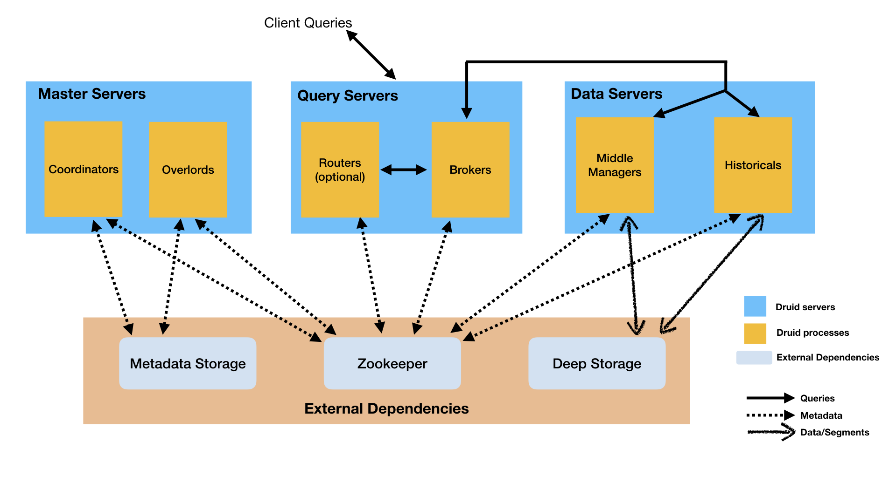
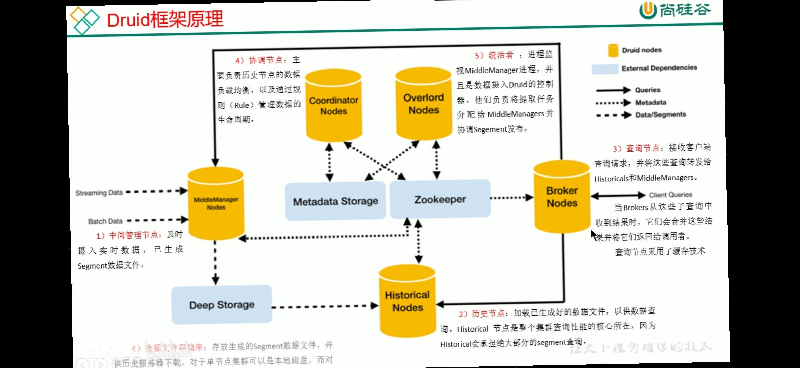

# druid

## OLAP
(Online analytical processing)是快速解决多维分析 (multi-dimensional analytical)的一种方法。 主要用于大数据量的统计分析，主要应用 预聚合 分析报表 BI相关的业务。

### 4个主要的特点
1. 上卷 ： 更高层的去查看统计的数据
2. 下钻： 查看数据的详情
3. 切片 ： 按照某个维度进行查看数据，比如产品维度
4. 切块： 按照某个时间切分，比如按照季度进行切分

https://blog.csdn.net/xwc35047/article/details/86369465

与 OLAP 相对应的是 OLTP,这个T 是 transaction 事务的意思，比如我们常见的mysql 数据库，主要应用于业务的增删改查，基本都是一些实时的数据。

Druid 就是其中一款 OLAP 数据库，同时还有一些其他的 OLAP： Kylin（麒麟）， Clickhouse, Doris，Druid , HIve 主要用于分析决策，历史数据 + 实时数据

## Druid
它是一个时序相关的OLAP系统，是apache的顶级项目之一。
使用分布式架构，底层数据按列存储，使用索 引对查询加速。

###  能做什么
- 预聚合 它可以按照维度列进行预聚合，但是这样查询不是特别灵活
- 不关心数据详情
- 用户提前定义好维度，帮助我们进行预计算，空间换时间
### 有什么特点
- 列式存储。列式存储的优势在于查询的时候可以只返回指定的列的数据，其次同一列数据往往具有很多共性，这带来另一个好处就是存储的时候压缩效果比较好,底层主要是BitMap进行压缩

- 可扩展的分布式架构。可以达到上百台节点的规模，可以随意的扩展
并行计算。查询可以并行计算,时间分片
- 数据摄入支持实时和批量。这里的实时的意思是输入摄入即可查，典型的 lambda 架构，将实时数据和历史数据结合。
- 云原生架构，高容错性。
- 支持索引，便于快速查询。

### 与hive比较
1. 查询速度 响应时间更短
2. 不关心数据明细，更关系聚合之后的数据
3. 查询的灵活性比 hive 差
4. 都是支持 PB级别的数据查询
5. 查询的时间性能比较好

## 通用的架构
Druid的主要角色进程如下

Coordinator 管理数据可用性，管理数据的分配，什么样的数据该存在什么样的地方
Overlord 控制分配数据ingestion的workload，负责数据摄入的负载分配
Broker 处理客户端的查询请求
Router 负责将请求路由到Broker, Coordinators和Overlords，可选。
Historical 负责存储可被查询的数据
MiddleManager 负责Ingest数据，
Druid的进程可以被任意部署，但是为了理解与部署组织方便。这些进程分为了三类

Master: Coordinator, Overload 负责数据可用性和摄取
Query: Broker and Router，负责处理外部请求
Data: Historical and MiddleManager，负责实际的Ingestion负载和数据存储

