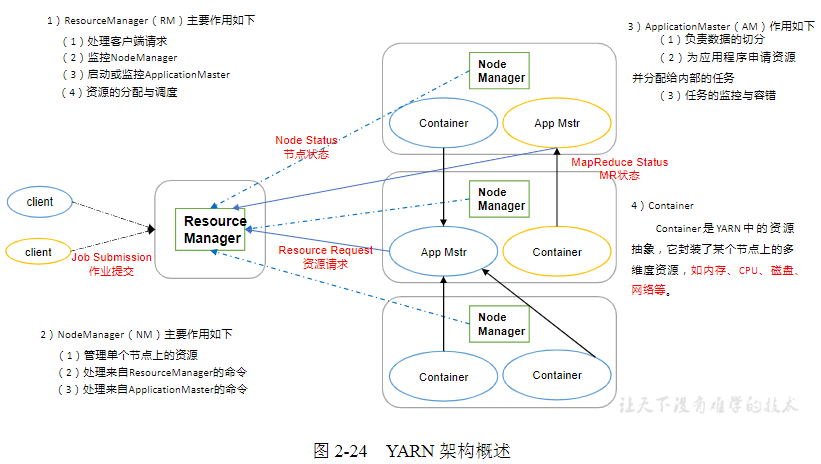
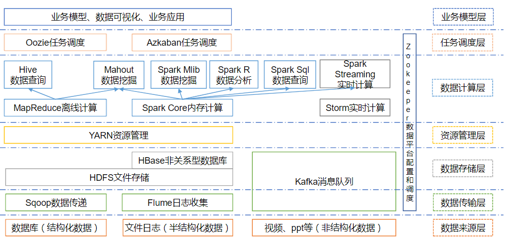

视频地址： https://www.bilibili.com/video/av32081351

官网地址： http://hadoop.apache.org/

B站地址 https://www.bilibili.com/video/av15390641

这个课程比较清晰： https://www.bilibili.com/video/av90340486?p=10 这个视频比较优秀。

## 简介

大数据主要解决，海量数据的`存储` 和 海量数据的`分析计算`问题，是一个分布式基础架构，后期学习的框架都是依赖 hadoop。它通常指的是一个 广泛的生态圈，例如 Hbase,Hive,Zk,...


数据存储单位： bit Byte kb mb gb tb pb eb 1024

当前，个人计算机硬盘的容量是 TB级别。

## 特点
- 大数据量
- 高速
- 多样，数据结构化 非结构化数据

## 论文

- GFS -> HDFS hadoop distribute file system
- Map-Reduce ->MR
- BigTable -> HBase

## 三大发行版本
- Apache 最基础版本，适合入门
- Cloudera 在互联网企业中使用
- Hortonworks 文档最好

## 优势
- 高可靠 底层维护多个副本
- 高扩展 可以方便的扩展数以千计的节点，动态
- 高效性 在 MapReduce 思想下，并行工作，加速任务处理速度
- 高容错性 自动将失败的任务重新分配

## 组成
- common(辅助工具)
- HDFS(数据存储) Hadoop Distribute FileSystem
- Yarn(资源调度)
- MapReduce(计算))

2.x版本，将资源调度，抽离为 YARN,分层街头，可维护性强！YARN 不仅可以为 hadoop 服务，还可以为其他的计算框架，例如 spark,flink服务，增强可用性。

## HDFS 架构概述

1. NameNode(nn必须) ： 存储 文件的元数据，如文件名，文件的目录结构，文件属性（生成时间，副本数，文件权限），以及每个文件的块列表和块所在的DataNode等。（相当于目录）,只有一个。

2. DataNode(dn必须): 在本地文件系统存储文件块数据，以及块数据的校验和,真正存储数据的节点，以块为单位，将一个文件切分称为多个块，分别存储在 DataNode，可以有多个。

3. Secondary NameNode(2nn):用来监控 HDFS状态的辅助后台程序，每隔一段时间获取 HDFS元数据的快照。


## YARN

    负责集群中所有机器（节点）计算资源的调度和统一管理！

    核心进程：  ResourceManager(RM)资源管理器 必须的,整个集群的管理，负责接收客户端的请求，定时监控 NM的启动和运行，向NM分配任务

        1 个

    NodeManager:必须，某个节点的管理，单个节点所有算例的管理，定期定时向 RM汇报，接受RM分配的任务。

        N 个
    ApplicationMaster (一个任务启动时才会出现)：一个job提交时候，启动 ApplicationMaster进程负责与 ResourceManager 以及 
    
        N 个
    NodeManager 通信，进行申请资源。
        N 个

    Countioner: 容器，一个task在运行时需要占用一定的算力，（CPU，内存等），为了防止当前 task的计算资源在使用时候被其他task抢占，NM会在当前 task使用的计算 封装成为一个容器。

        作用： 隔离计算资源，防止被多个 task抢占。

## MapReduce
    是一个编程模型。规定了编程中应该编写哪些组件，以及组件的组成和执行顺序等
    Map阶段： 将大数据拆分，分别交给多个节点，并行计算，提高计算效率。
        核心进程：MapTask
    Reduce阶段： 将map阶段运算的结果，进行汇总合并，产生总的结果。
        核心进程：ReduceTask

    一个MapReduce程序由多个 MapTask 和 多个 ReduceTask组成，这个 程序称为 job。





## 大数据生态体系



## Hadoop 目录组成

    bin: 常用命令
    sbin: 管理集群常用的命令（启动，关闭等）
    etc: 配置文件所在的目录

    libexec(不要动)：和本地底层环境相关的配置文件
    lib(不要动)： 动态库文件
    share: 提供jar包

## 安装
    1. 解压
```bash
./hadoop version
```
注意 HADOOP_HOME 环境变量的配置，防止今后安装 hadoop生态圈的框架出现问题。

Hadoop 是 Java 编写，Hadoop命令的执行 需要 JAVA_HOME的环境变量
    保证 JAVA_HOME 和 HADOOP_HOME 是全局环境便令

    在使用 Hadoop 时候，各个进程之间需要进行通信，Namenode 需要 DataNode 进行通信，通常使用主机名通过解析后得到各个进程的ip地址

    保证在 /etc/hosts 中配置当前集群中所有主机的主机名和  ip地址的映射。

备注：
vim /etc/sudoers // 这里面可以添加 普通用户的root权限

## 安装流程
 1. 准备工作
```bash
# 1.  上传 jar 包
hadoop-2.7.2.tar.gz
# 2. 解压tar.gz
tar -xvzf hadoop-2.7.2.tar.gz
# 3. 文件说明
[houzhenguo@aliyun bin]$ pwd
/home/houzhenguo/soft/bigdata/hadoop/hadoop-2.7.2/bin
[houzhenguo@aliyun bin]$ ll
total 320
-rwxr-xr-x 1 houzhenguo houzhenguo 109037 May 22  2017 container-executor
-rwxr-xr-x 1 houzhenguo houzhenguo   6488 May 22  2017 hadoop
-rwxr-xr-x 1 houzhenguo houzhenguo   8786 May 22  2017 hadoop.cmd
-rwxr-xr-x 1 houzhenguo houzhenguo  12223 May 22  2017 hdfs # 分布式文件系统
-rwxr-xr-x 1 houzhenguo houzhenguo   7478 May 22  2017 hdfs.cmd
-rwxr-xr-x 1 houzhenguo houzhenguo   5953 May 22  2017 mapred
-rwxr-xr-x 1 houzhenguo houzhenguo   6310 May 22  2017 mapred.cmd
-rwxr-xr-x 1 houzhenguo houzhenguo   1776 May 22  2017 rcc
-rwxr-xr-x 1 houzhenguo houzhenguo 126443 May 22  2017 test-container-executor
-rwxr-xr-x 1 houzhenguo houzhenguo  13352 May 22  2017 yarn
-rwxr-xr-x 1 houzhenguo houzhenguo  11386 May 22  2017 yarn.cmd
# sbin superuserbin

/home/houzhenguo/soft/bigdata/hadoop/hadoop-2.7.2/etc/hadoop # hadoop的配置文件

share # 是常用的jar包
# 4. 配置环境变量
```

确保 环境变量中有 JAVA_HOME

2. 查看 hadoop版本
```bash
# bin 下面运行
./hadoop version
```
3. 将hadoop bin.sbin 添加到 环境变量，便于今后 其他组件的使用。

```
unset -f pathmunge
export JAVA_HOME=/usr/java/jdk1.8.0_171
HADOOP_HOME=/home/houzhenguo/soft/bigdata/hadoop/hadoop-2.7.2
export CLASSPATH=.:$JAVA_HOME/jre/lib/rt.jar:$JAVA_HOME/lib/dt.jar:$JAVA_HOME/lib/tools.jar

export PATH=$PATH:$JAVA_HOME/bin:$HADOOP_HOME/bin:$HADOOP_HOME/sbin
export HADOOP_HOME

```
```bash
[root@aliyun houzhenguo]# vim /etc/profile
[root@aliyun houzhenguo]# source /etc/profile

[root@aliyun houzhenguo]# hadoop version
Hadoop 2.7.2 # 环境变量配置成功

```


## hadoop 目录组成
    前三个常用
    bin: 常用的命令
    sbin： 管理集群常用的命令
    etc： 配置文件所在的目录
    lib: 本地底层环境相关的文件，默认的，不需要修改
    share: jar包


### 使用

    HDFS: 分布式文件系统，有两种模式。
        1. 完全分布式文件系统
            完全分布式，和 伪分布式
            集群中有 N台集器
            将 HDFS 中的核心进程分布在 N 台机器上
            fs.defalutFS=hdfs://namenode所在的主机名 +端口号
            使用 HDFS前，启动 HDFS的核心进程。
                指定NameNode 的工作目录，默认在 tmp中
                格式化 NameNode
                    作用： 产生namenode 的工作目录
                          产生namenode的核心文件 fsimage

        2. 本地文件系统模式
            集群中只有本地这台机器

    如何判断当前的 当前的HDFS 是分布式文件系统还是本地文件系统：
        取决于参数：fs.defalutFS(见于core-defalut.xml中)
        默认为 file:/// 这是个协议，默认为本地文件系统。
    
    MapReduce： 负责大数据的计算
        1. 参考 MapReduce 编程模式，进行编程，将程序 打成jar包
        2. 运行 jar包
            取决于参数 mapreduce.framework.name=yarn/local -- 在map-defalut.xml，默认local
            a. 将jar提交到 yarn
                    使用 YarnRunner
            b. 将jar包在本地环境运行
                    使用 LocalJobRunner提交运行
        运行程序： hadoop -jar xxx.jar 主类名

    配置文件

        hadoop启动时候，会默认从 $HADOOP_HOME/etc/hadoop 加载配置文件，
            加载 core-defalut.xml,hdfs-defalult.xml,yarn-defalut.xml,mapred-default.xml

            这4个配置 文件中，已经对常用的参数 进行了默认的赋值。,随着jar包直接加载。

            继续从 $HADOOP_HOME/etc/hadoop加载

            core-site.xml,hdfs-site.xml,yarn-site.xml,mapred-site.xml 可以自定义 xxx.defalut.xml的参数值
            

    分布式的HDFS
        常见问题
            1. 注意端口号占用的问题
            2. 主机名的命名 不支持下划线，不要纯数字
            3. 启动 namenode 进程之前，需要格式化，只需要格式化一次，目的产生namenode 的工作目录
            4. 先启动 namenode ,再启动datanode

        