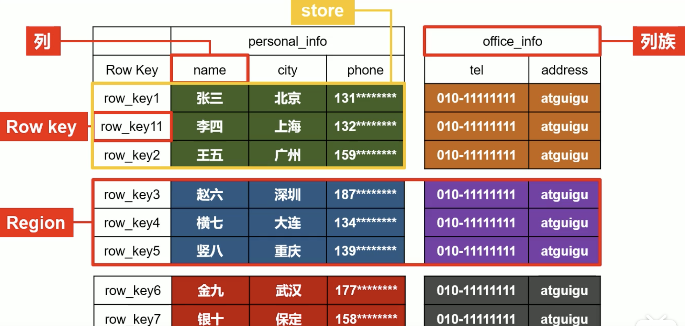

b站地址： https://www.bilibili.com/video/BV1Y4411B7jy?from=search&seid=16520671074503637917

HBase 官网： http://hbase.apache.org/

## HBase
1. 分布式 可扩展 十几亿数据的 NoSQL数据库
2. GFS HDFS MAPReduce BigTable  hadoop

BigTable HBase 负责存储 海量数据的存储

数据量小 用 HBase耗费资源

几十亿条数据秒级别查询

HDFS不支持 随机写功能

## 逻辑结构

