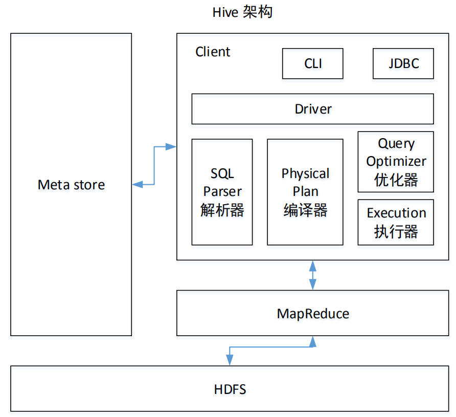
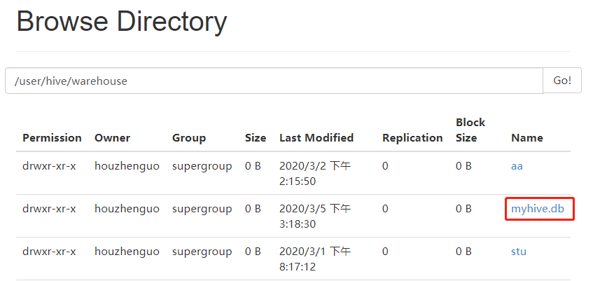

视频地址： https://www.bilibili.com/video/av65556024
清华大学镜像地址： https://mirrors.tuna.tsinghua.edu.cn/

## Hive

Facebook 开源，解决海量 结构化日志的数据统计。

Hive 基于 Hadoop的一个数据仓库工具。将结构化的数据文件映射为一张表，提供类 SQL的查询。

本质： 将 HQL 转成 MapReduce程序。


1. Hive 处理的数据存储在 HDFS
2. Hive 分析数据底层的实现是 MapReduce
3. 执行程序运行在 Yarn上

相当于 hadoop的客户端。

## Hive 优缺点
1. 操作接口采用 SQL 语法，提供快速开发能力，简单，容易上手
2. 避免去写 MapReduce ，减少开发人员学习成本
3. Hive 延迟比较高，常用于 数据分析，对实时性要求不高的场合
4. Hive的优势在于处理大数据，
5. Hive 支持用户自定义函数，可以根据自己的需求 来实现自己的函数

缺点：

1. 迭代式运算 无法表达
2. 数据挖掘方面不擅长
3. hive自动生成的MapReduce 作业，通常不够智能化
4. 调优比较困难

## 架构



## 与传统sql数据库

1. 由于 SQL 被广泛的应用在数据仓库中，因此，专门针对 Hive 的特性设计了类 SQL 的
查询语言 HQL。熟悉 SQL 开发的开发者可以很方便的使用 Hive 进行开发。

2. Hive 是建立在 Hadoop 之上的，所有 Hive 的数据都是存储在 HDFS 中的。而数据库则
可以将数据保存在块设备或者本地文件系统中。

3. 由于 Hive 是针对数据仓库应用设计的，而数据仓库的内容是读多写少的。因此，Hive
中不建议对数据的改写，所有的数据都是在加载的时候确定好的。而数据库中的数据通常是
需 要 经 常 进 行 修 改 的

4.  Hive 中大多数查询的执行是通过 Hadoop 提供的 MapReduce 来实现的。而数据库通常
有自己的执行引擎。

5. Hive 在查询数据的时候，由于没有索引，需要扫描整个表，因此延迟较高。另外一个导
致 Hive 执行延迟高的因素是 MapReduce 框架。由于 MapReduce 本身具有较高的延迟，因此
在利用 MapReduce 执行 Hive 查询时，也会有较高的延迟

## Hive 安装地址

1. 官网地址   http://hive.apache.org/
2. 文档地址 https://cwiki.apache.org/confluence/display/Hive/GettingStarted
3. 下载地址 http://archive.apache.org/dist/hive/
4. github地址 https://github.com/apache/hive
5. https://mirrors.tuna.tsinghua.edu.cn/apache/hive/hive-1.2.2/apache-hive-1.2.2-bin.tar.gz

## 安装流程
1.  解压包
2. 修改 config 下面的 hive-env.sh.template
```bash
export HADOOP_HOME=/home/houzhenguo/soft/bigdata/hadoop/hadoop-2.7.2
export HIVE_CONF_DIR=/home/houzhenguo/soft/bigdata/hive/apache-hive-1.2.2-bin/conf

```
3. 改名 mv hive-env.sh.template hive-env.sh
4. 启动 [houzhenguo@aliyun apache-hive-1.2.2-bin]$ ./bin/hive

## hive的命令练习
```
hive> show databases; 
OK
default
Time taken: 0.903 seconds, Fetched: 1 row(s)
hive> create table student(id int, name string);
OK
Time taken: 0.298 seconds
hive> show tables;
OK
student
Time taken: 0.024 seconds, Fetched: 1 row(s)
hive> select * from student;
OK
Time taken: 0.48 seconds
hive> insert into student values(1,"houzhenguo");
hive> select * from student;
OK
1	houzhenguo
Time taken: 0.08 seconds, Fetched: 1 row(s)

```
执行hadoop命令也可以 [houzhenguo@aliyun hadoop-2.7.2]$ hadoop fs -ls /user/hive/warehouse/student 查看到
## 文件系统加载hive
2. 导入 文本数据到 数据库
hive> load data local inpath '/home/houzhenguo/soft/bigdata/hive/data/stu.txt' into table student;

```txt
// 格式
1   zhangsan
2   lisi
```

    hive> select * from student; //分隔符的问题
    OK
    1	houzhenguo
    NULL	NULL
    NULL	NULL
    NULL	NULL
    NULL	NULL

    开放 Hadoop的http端口： 50070，外网可以访问

创建 以 tab 分割的表 
hive> create table stu(id int,name string) row format delimited fields terminated by "\t";

hive> load data local inpath '/home/houzhenguo/soft/bigdata/hive/data/stu.txt' into table stu;
Loading data to table default.stu
Table default.stu stats: [numFiles=1, totalSize=42]
OK
Time taken: 0.236 seconds
hive> select * from stu;
OK
1	zhangsan
2	lisi
3	wangwu2
3	wangwu
Time taken: 0.068 seconds, Fetched: 4 row(s)
hive> 


    直接通过hadoop put的方式
    [houzhenguo@aliyun data]$ hadoop fs -put stu1.txt /user/hive/warehouse/stu

    可以直接将 文本put / 下
    load data inpath '/stu2.txt' into table stu;

    本地上传相当于 copy ,hdfs 是 mv


---
## mysql 相关事项的安装
1. 安装mysql
2. 配置相关的jar包
    https://mirrors.tuna.tsinghua.edu.cn/mysql/downloads/Connector-J/mysql-connector-java-5.1.47.tar.gz

    解压 ，将 mysql-connector-java-5.1.47-bin.jar 放到 hive/lib

    [houzhenguo@aliyun mysql-connector-java-5.1.47]$ cp mysql-connector-java-5.1.47-bin.jar /home/houzhenguo/soft/bigdata/hive/apache-hive-1.2.2-bin/lib/
3. 修改 hive的配置信息
    vim hive-site.xml
    ```xml
<?xml version="1.0"?>
<?xml-stylesheet type="text/xsl" href="configuration.xsl"?>
<configuration>
<property>
<name>javax.jdo.option.ConnectionURL</name>
<value>jdbc:mysql://localhost:3306/metastore?createDatabaseIfNotExist=true</value>
<description>JDBC connect string for a JDBC metastore</description>
</property>
<property>
<name>javax.jdo.option.ConnectionDriverName</name>
<value>com.mysql.jdbc.Driver</value>
<description>Driver class name for a JDBC metastore</description>
</property>
<property>
<name>javax.jdo.option.ConnectionUserName</name>
<value>root</value>
<description>username to use against metastore database</description>
</property>
<property>
<name>javax.jdo.option.ConnectionPassword</name>
<value>root</value>
<description>password to use against metastore database</description>
</property>
</configuration>
    ```
4. 启动 hive

hive> create table aa(id int);

在mysql中可以看到`元数据信息`。

## hive 总结
1. metadata,存在 mysql当中
2. 相当于 hadoop的客户端
3. 相当于 mysql 与 HDFS 的双射关系


## Hive 交互常用命令

1. ./bin/hive -help
    ``` 
    ./bin/hive -e "select * from aa" // 在 命令行之后 写 sql
    ./bin/hive -f test.hql 后面跟 文件
    ```
2. dfs -ls /;
    ```
    hive> dfs -ls /;
    Found 4 items
    -rw-r--r--   3 houzhenguo supergroup         12 2020-03-01 17:07 /hello.txt
    drwxr-xr-x   - houzhenguo supergroup          0 2020-03-01 17:14 /out
    drwx-wx-wx   - houzhenguo supergroup          0 2020-03-01 19:40 /tmp
    drwxr-xr-x   - houzhenguo supergroup          0 2020-03-01 19:43 /user
    hive> 

    ```

    ## Hive 默认配置

    1. 默认数据仓库的最原始的位置 在 hdfs上， /user/hive/warehouse/
    2. 查询后信息显示配置

        在 hive-site.xml 文件中添加如下配置信息，就可以实现显示当前数据库，以及查询
        表的头信息配置。
        ```xml
            <property>
                <name>hive.cli.print.header</name>
                    <value>true</value></property>
                <property>
                    <name>hive.cli.print.current.db</name>
                    <value>true</value>
            </property>
        ```
        修改上述的配置信息之后，就可以 在 hive命令行看到 表和 列信息。不会影响执行效率，只是查看方便
    
    3. hive 运行日志信息
        mv hive-log4j.properties.template hive-log4j.properties
        /temp/houzhenguo/hive.log 默认
        修改成 我们自己的地址 
        ```xml
        hive.log.threshold=ALL
        hive.root.logger=INFO,DRFA
        hive.log.dir=/home/houzhenguo/soft/bigdata/hive/logs
        hive.log.file=hive.log

        ```
        重新启动hive 就可以在在配置路径下看到 log的相关日志了。
    4. 参数配置方式
        默认配置文件 hive-default.xml
        用户自定义配置文件： hive-site.xml
        用户自定义配置文件 会覆盖默认配置。
        还可以通过命令行进行修改
        ./bin/hive -hiveconf mapred.reduce.tasks=10  // 当前临时窗口会生效
        hive> set mapred.reduce.tasks=20 // 在命令行也可以修改，在 启动也可以，命令行修改覆盖前面的

---
## Hive 数据类型
### 基本数据类型


对于 Hive 的String 类型相当于 数据库的 varchar类型，该类型是一个可变的字符串，理论上最多存储 2GB.

### 集合数据类型

了解就行，用的不多


一般可以用 函数 将 负载的数据结构 扁平化处理。

hive 解析数据在一行 ? 

1. 建表


    ```
    create table test(
    name string,
    friends array<string>,
    children map<string, int>,
    address struct<street:string, city:string>
    )
    row format delimited fields terminated by ','
    collection items terminated by '_'
    map keys terminated by ':'
    lines terminated by '\n';
    ```
2. 处理数据

    创建 test.txt
    ```
    songsong,bingbing_lili,xiao song:18_xiaoxiao song:19,hui long guan_beijing
yangyang,caicai_susu,xiao yang:18_xiaoxiao yang:19,chao yang_beijing
    ```
3. load 数据

    hive (default)> load data local inpath '/home/houzhenguo/soft/bigdata/hive/data/test.txt' into table test;

4. 查询
    ```
        hive (default)> select * from test;
    OK
    test.name	test.friends	test.children	test.address
    songsong	["bingbing","lili"]	{"xiao song":18,"xiaoxiao song":19}	{"street":"hui long guan","city":"beijing"}
    yangyang	["caicai","susu"]	{"xiao yang":18,"xiaoxiao yang":19}	{"street":"chao yang","city":"beijing"}
    Time taken: 0.079 seconds, Fetched: 2 row(s)
    hive (default)> 

    ```
5. 查询一条数据
    ``` 
    // 数组
    hive (default)> select friends[1] from test;
    OK
    _c0
    lili
    susu
    Time taken: 0.113 seconds, Fetched: 2 row(s)
    hive (default)> 
    // map 的查询
    hive (default)> select children['xiao song'] from test;
    OK
    _c0
    18
    NULL
    Time taken: 0.056 seconds, Fetched: 2 row(s)
    hive (default)> 
    // 结构体的访问
    hive (default)> select address.city from test;
    OK
    city
    beijing
    beijing
    Time taken: 0.054 seconds, Fetched: 2 row(s)
    ```

    以上生产环境用的比较少

---

## 类型转换

    小级别的类型 可以转 高级别的
    int -> bigint
    string float string 可以转 double

---

---

# DDL 数据定义语言

关于库 和 表的增删改查,操作元数据

## 1. 创建数据库

    create database myhive; // 还可以指定 路径
    show databases;



    创建表

    hive (myhive)> create table bb(id int)；

## 查 

    show databases like 'hive*';// 查询hive相关

    desc database myhive;

## 2. 表的相关操作

