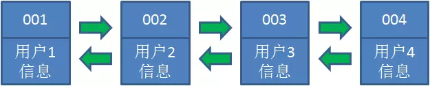
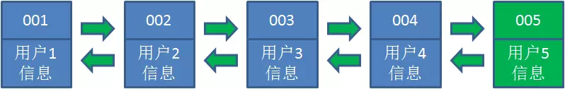
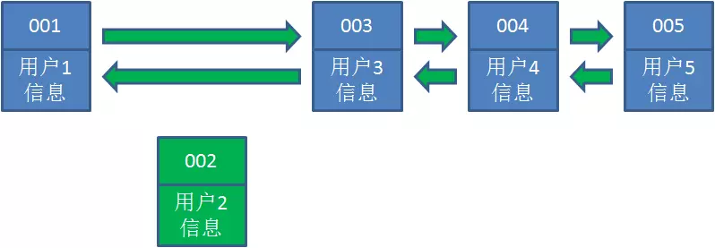
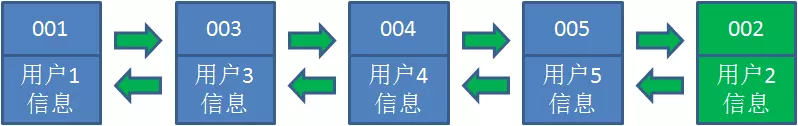
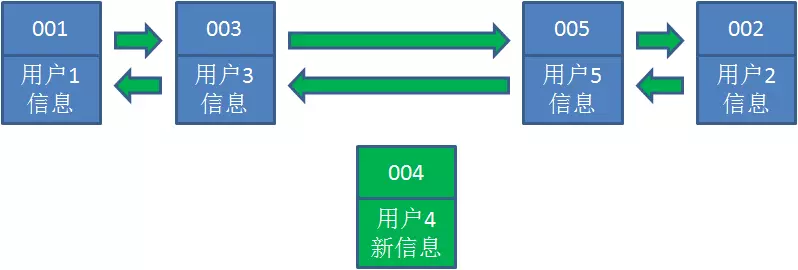
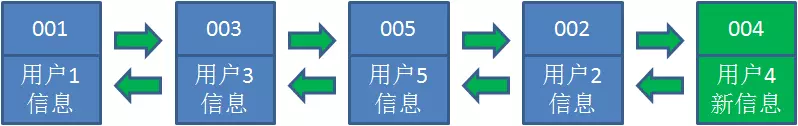
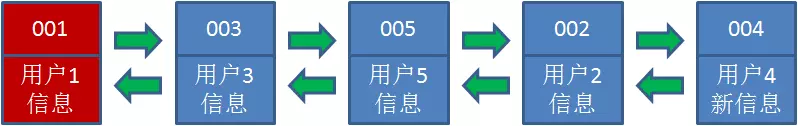
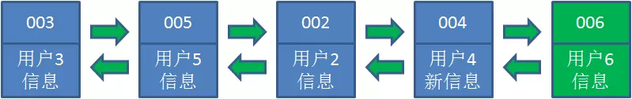

应用场景 算法原理 使用方式


[文章来源1](https://juejin.im/post/5c0392656fb9a049fb4366fa)

[文章来源2](https://github.com/crossoverJie/JCSprout)

## 图解LRU

让我们以用户信息的需求为例，来演示一下LRU算法的基本思路：

1. 假设我们使用哈希链表来缓存用户信息，目前缓存了4个用户，这4个用户是按照时间顺序依次从链表右端插入的。



2. 此时，业务方访问用户5，由于哈希链表中没有用户5的数据，我们从数据库中读取出来，插入到缓存当中。这时候，链表中最右端是最新访问到的用户5，最左端是最近最少访问的用户1。



3. 接下来，业务方访问用户2，哈希链表中存在用户2的数据，我们怎么做呢？我们把用户2从它的前驱节点和后继节点之间移除，重新插入到链表最右端。这时候，链表中最右端变成了最新访问到的用户2，最左端仍然是最近最少访问的用户1。





4. 接下来，业务方请求修改用户4的信息。同样道理，我们把用户4从原来的位置移动到链表最右侧，并把用户信息的值更新。这时候，链表中最右端是最新访问到的用户4，最左端仍然是最近最少访问的用户1。





5. 后来业务方换口味了，访问用户6，用户6在缓存里没有，需要插入到哈希链表。假设这时候缓存容量已经达到上限，必须先删除最近最少访问的数据，那么位于哈希链表最左端的用户1就会被删除掉，然后再把用户6插入到最右端。





以上，就是LRU算法的基本思路。


**Java 版本LRU实现API**

```java
class LRUCache<K, V> extends LinkedHashMap<K, V> {
    private final int CACHE_SIZE;

    /**
     * 传递进来最多能缓存多少数据
     *
     * @param cacheSize 缓存大小
     */
    public LRUCache(int cacheSize) {
        // true 表示让 linkedHashMap 按照访问顺序来进行排序，最近访问的放在头部，最老访问的放在尾部。
        super((int) Math.ceil(cacheSize / 0.75) + 1, 0.75f, true);
        CACHE_SIZE = cacheSize;
    }

    @Override
    protected boolean removeEldestEntry(Map.Entry<K, V> eldest) {
        // 当 map中的数据量大于指定的缓存个数的时候，就自动删除最老的数据。
        return size() > CACHE_SIZE;
    }
}
```


# LRU 实现  

## 实现一

其实如果对 Java 的集合比较熟悉的话，会发现上文的结构和 LinkedHashMap 非常类似。

对此不太熟悉的朋友可以先了解下 [LinkedHashMap 底层分析](http://crossoverjie.top/2018/02/06/LinkedHashMap/) 。

所以我们完全可以借助于它来实现：

```java
public class LRULinkedMap<K,V> {


    /**
     * 最大缓存大小
     */
    private int cacheSize;

    private LinkedHashMap<K,V> cacheMap ;


    public LRULinkedMap(int cacheSize) {
        this.cacheSize = cacheSize;

        cacheMap = new LinkedHashMap(16,0.75F,true){
            @Override
            protected boolean removeEldestEntry(Map.Entry eldest) {
                if (cacheSize + 1 == cacheMap.size()){
                    return true ;
                }else {
                    return false ;
                }
            }
        };
    }

    public void put(K key,V value){
        cacheMap.put(key,value) ;
    }

    public V get(K key){
        return cacheMap.get(key) ;
    }


    public Collection<Map.Entry<K, V>> getAll() {
        return new ArrayList<Map.Entry<K, V>>(cacheMap.entrySet());
    }
}
```

源码：
[https://github.com/crossoverJie/Java-Interview/blob/master/src/main/java/com/crossoverjie/actual/LRULinkedMap.java](https://github.com/crossoverJie/Java-Interview/blob/master/src/main/java/com/crossoverjie/actual/LRULinkedMap.java)

这次就比较简洁了，也就几行代码（具体的逻辑 LinkedHashMap 已经帮我们实现好了）

实际效果:

```java
    @Test
    public void put() throws Exception {
        LRULinkedMap<String,Integer> map = new LRULinkedMap(3) ;
        map.put("1",1);
        map.put("2",2);
        map.put("3",3);

        for (Map.Entry<String, Integer> e : map.getAll()){
            System.out.print(e.getKey() + " : " + e.getValue() + "\t");
        }

        System.out.println("");
        map.put("4",4);
        for (Map.Entry<String, Integer> e : map.getAll()){
            System.out.print(e.getKey() + " : " + e.getValue() + "\t");
        }
    }
    
//输出
1 : 1	2 : 2	3 : 3	
2 : 2	3 : 3	4 : 4	    
```

使用时：

```java
    @Test
    public void get() throws Exception {
        LRULinkedMap<String,Integer> map = new LRULinkedMap(4) ;
        map.put("1",1);
        map.put("2",2);
        map.put("3",3);
        map.put("4",4);

        for (Map.Entry<String, Integer> e : map.getAll()){
            System.out.print(e.getKey() + " : " + e.getValue() + "\t");
        }

        System.out.println("");
        map.get("1") ;
        for (Map.Entry<String, Integer> e : map.getAll()){
            System.out.print(e.getKey() + " : " + e.getValue() + "\t");
        }
    }

}

//输出
1 : 1	2 : 2	3 : 3	4 : 4	
2 : 2	3 : 3	4 : 4	1 : 1
```

LinkedHashMap 内部也有维护一个双向队列，在初始化时也会给定一个缓存大小的阈值。初始化时自定义是否需要删除最近不常使用的数据，如果是则会按照实现二中的方式管理数据。

其实主要代码就是重写了 LinkedHashMap 的 removeEldestEntry 方法:

```java
    protected boolean removeEldestEntry(Map.Entry<K,V> eldest) {
        return false;
    }
```

它默认是返回 false，也就是不会管有没有超过阈值。

所以我们自定义大于了阈值时返回 true，这样 LinkedHashMap 就会帮我们删除最近最少使用的数据。