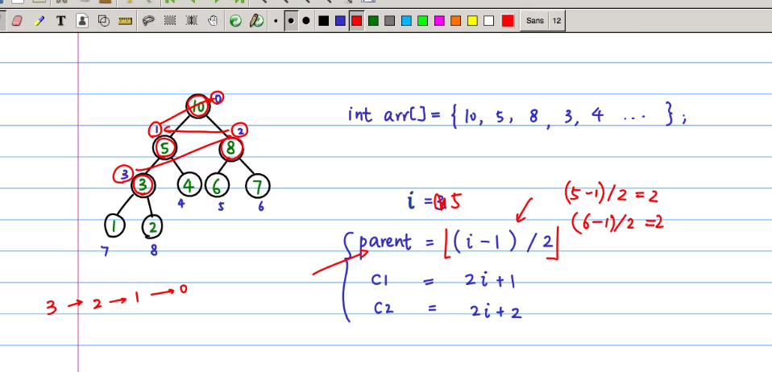

sort 练习

```java
// sort swap less
public abstract class Sort<T extends Comparable<T>{
    public abstract void sort(T[] nums);
    // 交换两个值的位置
    protected void swap(T[] nums, int i, int j)
    {
        int temp = nums[i];
        nums[i]  = nums[j];
        nums[j]  = temp;
    }
    // t1 < t2 return true
    protected boolean less(T t1, T t2)
    {
        return t1.compareTo(t2) < 0;
    }
}

```


1. 选择排序 选择最小的放在当前 子数组的第一个位置

```java
public class SelectSort<T extends Comparable<T>> extends Sort<T>
{
    @Override
    public void sort(T[] nums)
    {

        for(int i = 0; i< nums.length-1;i++)
        {
            int minIndex = i;
            for(int j = i+1;j<nums.length;j++)
            {
                if(less(nums[i], nums[j]))
                {
                    minIndex = j;
                }
            }
            swap(nums, i, minIndex);
        }
    }
}
```

2. 冒泡排序 将大的浮到左侧
```java
public void sort(T[] nums)
{
    for(int i = nums.length-1;i>0 && !flag;i--)
    {
        boolean flag = false;
        for(int j=0;j<i;j++)
        {
            if(nums[j]>nums[j+1])
            {
                swap();
                flag = true;
            }
        }
    }
}
```

3. Insert Sort 每次交换相邻的位置

```java
    for(int i = 1;i<nums.length;i++)
    {
        for(int j = i;j>0&& nums[j]<nums[j-1];j--)
        {
            swap();
        }
    }
```

4. 交换两个有序数组

原地归并的抽象方法

```java
public static void merge(T[] a, int lo, int mid, int hi)
{
    int i = lo;
    int j = mid+1;
    for(int k = lo;k<hi;k++)
    {
        aux[k] = a[k];
    }
    for(int k = lo;k<hi;k++)
    {
        if(i> mid) aux[k] =a[j++];
        if(j > hi) aux[k] = a[i++];
        if(aux[j]>aux[i]) aux[k] = a[i++];
        else              aux[k] = a[j++]; 
    }
}
```

5. 堆排序 



[视频链接地址](https://www.bilibili.com/video/av47196993?t=832)


```java
public class HeapSortTest {

    // parent = (i -1)/2
    public static void main(String[] args) {
        int[] nums = {2,5,3,1,10,4};
        heapSort(nums, nums.length);
        printfNums(nums);
    }

    /**
     *  对 i 个节点进行比较排序，让三个数中最大的调整到父节点，
     *  对于调整下来的原 父节点 进行递归的heapify
     *  (因为既然被调下来，一定是小数，需要继续往下调整)
     * @param nums 调整的数组
     * @param n 数组的长度
     * @param i 需要调整的节点 i
     */
    public static void heapify(int[] nums, int n, int i) {
        if (i >=n) {
            return; // 当节点 >= n 的时候递归结束（递归出口）
        }
        int c1 = 2 * i + 1; // i 从 0 开始，左孩子
        int c2 = 2 * i + 2;
        // c1 and c2
        int max = i;  // 寻找 自己 ，孩子中最大的值，调整为 父节点
        if (c1 < n && nums[c1] > nums[max]) {
            max = c1;
        }
        if(c2 < n && nums[c2] > nums[max]) {
            max = c2;
        }
        if(max != i) {
            swap(nums, i, max);
            heapify(nums, n, max); // 继续向下传递(被换下的小的，位置肯定不合适，需要继续调整)
        }
    }
    public static void swap(int[] nums, int from, int to) {
        int temp = nums[from];
        nums[from] = nums[to];
        nums[to] = temp;
    }
    public static void printfNums(int[] num) {
        for (int i=0; i< num.length;i++) {
            System.out.println(num[i]);
        }
    }
    // 构建堆，给定一组数字，构建符合条件的堆
    public static void buildHeap(int[] nums, int n) {
        int last_node = n - 1; // 最后一个节点
        int last_parent = (last_node -1)/2; // 最后一个父节点
        for (int i = last_parent; i >= 0; i--) { // 倒着来，具体可以参考图片
            heapify(nums, n, i);
        }
    }
    // 将堆的 root 节点（在 num[0]位置） 调整到最后一个，同时 n--（因为后面有序） 重新构建堆
    public static void heapSort(int[] nums, int n) {
        buildHeap(nums, n); // 对于无序的数组先进行构建堆
        printfNums(nums);
        System.out.println("-----");
        for (int i= n-1; i >= 0; i--) {
            swap(nums, 0, i);
            heapify(nums, i-1, 0); // 直接对 0 节点做heapify就行了
        }
    }
}

```