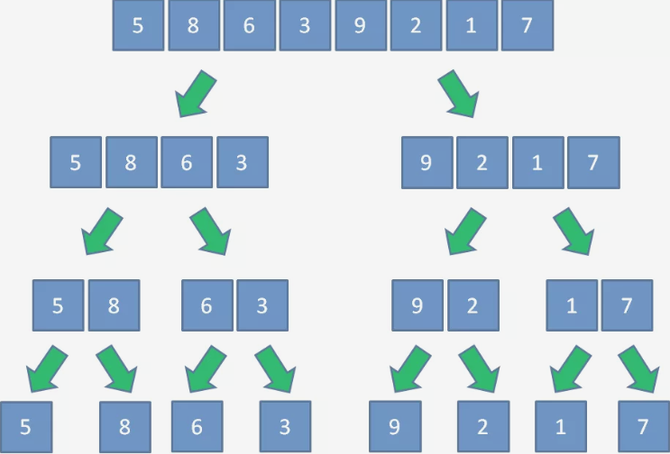
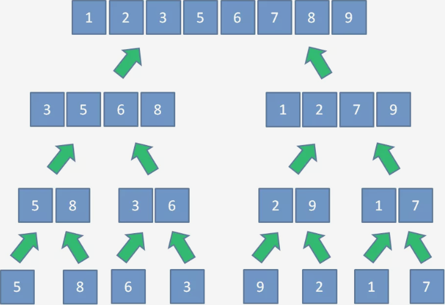
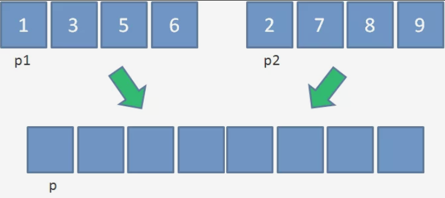
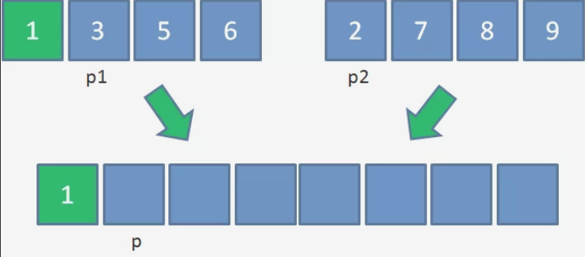
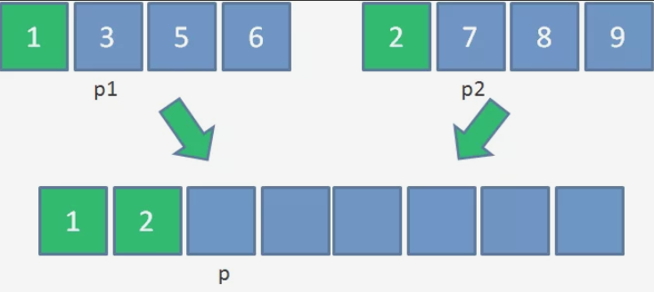
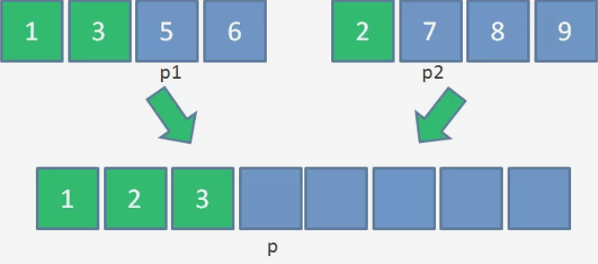
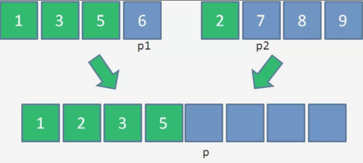
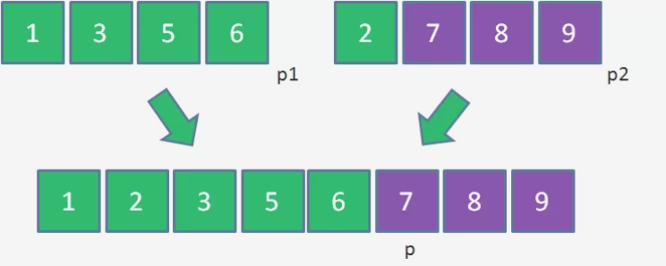
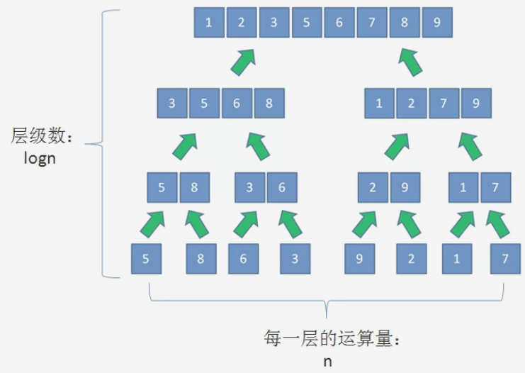

# 归并排序

[原文链接](https://mp.weixin.qq.com/s/885uGVhlffWAxjgIEW-TiA)

让我们以下面这个数组来举例说明：


1. 分组

假设集合一共有n个元素，算法将会对集合进行逐层的折半分组。

第一层分成两个大组，每组n/2个元素；

第二层分成4个小组，每组n/4个元素；

第三层分成8个更小的组，每组n/8个元素；

......

一直到每组只有一个元素为止。

这样一来，整个数组就分成了一个个小小的“擂台”。



2. 归并

既然分了组，接下来就要开始“比武”了。

归并排序和擂台赛有一个很大的不同，就是擂台赛只需要决定谁是老大，而并不关心谁做老二和老三；归并排序的要求复杂一些，需要确定每一个元素的排列位置。

因此，当每个小组内部比较出先后顺序以后，小组之间会展开进一步的比较和排序，合并成一个大组；大组之间继续比较和排序，再合并成更大的组......最终，所有元素合并成了一个有序的集合。



这个比较与合并的过程叫做归并，对应英文单词merge，这正是归并排序名字的由来。

## 如何把两个**有序**的小集合归并成一个有序的大集合呢？

### 归并操作需要三个步骤。我们以两个长度为4的集合为例：


第一步，创建一个额外大集合用于存储归并结果，长度是两个小集合之和。（p1，p2，p是三个辅助指针，用于记录当前操作的位置）



第二步，从左到右逐一比较两个小集合中的元素，把较小的元素优先放入大集合。

由于1<2，所以把元素1放入大集合，p1和p各右移一位：



由于2<3，所以把元素2放入大集合，p2和p各右移一位：



由于3<7，所以把元素3放入大集合，p1和p各右移一位：



由于5<7，所以把元素5放入大集合，p1和p各右移一位：



由于6<7，所以把元素6放入大集合，p1和p各右移一位：


此时左侧的小集合已经没有元素可用了。

第三步，从另一个还有剩余元素的集合中，把剩余元素按顺序复制到大集合尾部。



## 代码实现 （原文版）(纯手打)

```java
    // 递归 折半 合并
    public static void mergeSort(int[] array, int start, int end) {
        if (start < end) {
            // 折半成两个小集合，分别进行递归
            int mid = (start+end)/2;
            mergeSort(array, start,mid);
            mergeSort(array, mid+1, end);
            // 把两个有序小集合，归并成为一个大集合
            merge(array, start, mid, end);
        }
    }

    // 它是将 一个数组逻辑上分割为两个数组
    public static void merge(int[] array, int start, int mid, int end) {
        // 可以考虑三个元素 1,2,3end为2-0+1 end的传入的是length-1
        int[] tempArray = new int[end - start +1]; 
        int p1 = start; int p2 = mid+1; int p=0;
        // 1. 比较两部分，小的数字放入到temp中
        while (p1 <= mid && p2 <=end) {
            if (array[p1] < array[p2]) {
                tempArray[p++] = array[p1++];
            }else {
                tempArray[p++] = array[p2++];
            }
        }
        // 2. 当 p1 数组还有剩余的时候
        while (p1 <=mid) {
            tempArray[p++] = array[p1++];
        }
        // 3. 当 p2 数组还有剩余的时候
        while (p2 <= end) {
            tempArray[p++] = array[p2++];
        }

        // 4. 将大集合的元素复制回原数组

        for (int i=0; i< tempArray.length; i++) {
            array[i+start] = tempArray[i]; // 这里需要注意！！！！
        }

    }

    // test
    public static void main(String ... args) {
        int array = {5, 8, 6, 3, 9, 2, 1, 7};
        mergeSort(array, 0, array.length-1);
        System.out.println(Arrays.toString(array));
    }
```

## 归并排序的时间复杂度与空间复杂度

## 时间复杂度 nlogn
1. 归并排序把集合一层一层进行折半分组。如果集合的长度为n,那么折半分组的层数就是 logn, 每一层进行递归操作的运算量 是 n。



所以，归并排序的时间复杂度等于每一层的运算量乘以层级数。即 O(nlogn);


## 空间复杂度为n.

每次发归并所创建的额外集合都会随着方法的结束而被释放，因此这部分空间不能被累加计算。单词归并操作开辟的最大空间为n.所以归并排序的空间复杂度为 O(n) .

## 归并排序是一个稳定的排序。

