[文章链接](https://mp.weixin.qq.com/s/jRZMMONW3QP43dsDKIV9VQ)
# B+树的相关介绍

## 总结:  B+树相比B树的优势有三个

1. IO次数更少（没有卫星数据，磁盘页容纳更多的节点） 矮胖
2. 查询稳定（都是最终落实在叶子节点上）
3. 范围查询方便（直接在链表查询）

B+树是B树的一种变体。有着比B树更高的查询性能。

- [B树相关知识的介绍](什么是B树.md)

在介绍 B+树之前，我们先看一下B树的几个特征。

1. 根结点至少有两个子女。
2. 每个中间节点都包含k-1个元素和k个孩子，其中 m/2 <= k <= m
3. 每一个叶子节点都包含k-1个元素，其中 m/2 <= k <= m
4. 所有的叶子结点都位于同一层。
5. 每个节点中的元素从小到大排列，节点当中k-1个元素正好是k个孩子包含的元素的值域分划。

## 一个m阶的B+树具有如下几个特征：

1. 有k个子树的中间节点包含有k个元素（B树中是k-1个元素），每个元素不保存数据，只用来索引，所有数据都保存在叶子节点。
2. 所有的叶子结点中包含了全部元素的信息，及指向含这些元素记录的指针，且叶子结点本身依关键字的大小自小而大顺序链接。
3. 所有的中间节点元素都同时存在于子节点，在子节点元素中是最大（或最小）元素。

接下来我们以具体的例子来看一下B树结构：

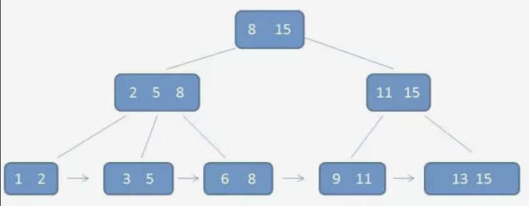

根据上图可以看出，不但节点之前含有重复的元素，而且叶子节点还用指针连在了一起。 特点：每一个父节点的元素都出现在子节点中，是子节点的最大（或最小）元素。

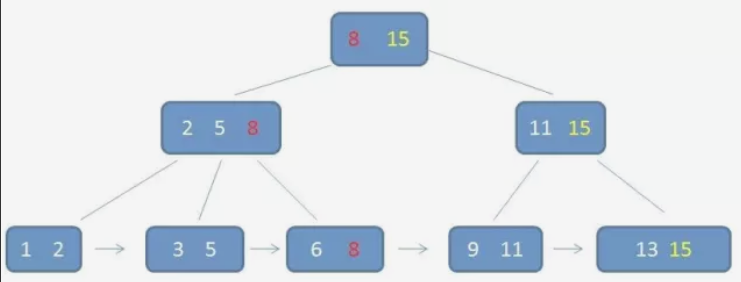

在上面这棵树中，根节点 8 是 子节点2,5,8的最大元素，也是叶子节点 6,8的最大元素。

根节点 15是子节点 11,15中的最大元素，也是叶子节点 13,15中的最大元素。

需要注意的是 根节点的最大元素（这里是15）也就等同于整个B+树的最大元素。以后无论插入删除多少个元素，始终保持最大的元素在根节点中。

至于叶子节点，由于父节点的元素都出现在子节点，因此所有叶子几点包含了全量元素信息。

并且每个叶子节点都带有指向下一个节点的指针，形成了一个有序的链表。

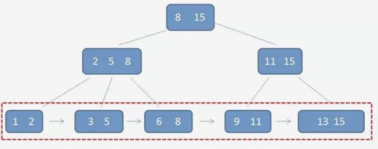

B+树还有一个特点，这个特点就是在索引之外，至关重要的特点。卫星数据的位置。

## 卫星数据

所谓卫星数据，指的是索引元素所指向的数据记录，比如数据库中的某一行。在B树中，无论中中间节点还是叶子节点都带有卫星数据。

## B树种的卫星数据

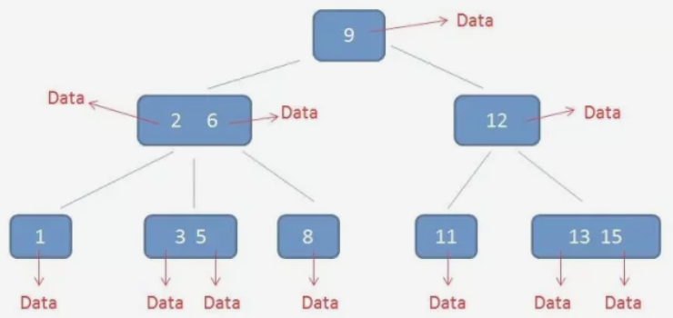

## B+树种的卫星数据

而在B+树种，只有叶子节点带有卫星数据，其余中间节点仅仅是索引，没有任何数据关联。

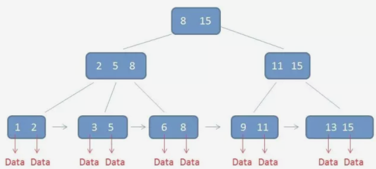

需要补充的是，在数据库的聚集索引（Clustered Index）中，叶子节点直接包含卫星数据。在非聚集索引（NonClustered Index）中，叶子节点带有指向卫星数据的指针。

## B+树设计成为这个样子有什么好处

B+树的好处主要体现在查询性能上。下面我们分别通过单行查询和范围查询来做分析。

在单元素查询到是时候，B+树会自顶向下逐层查找节点，最终找到匹配的椰子节点。比如我们要查找的元素为 3。

第一次磁盘IO

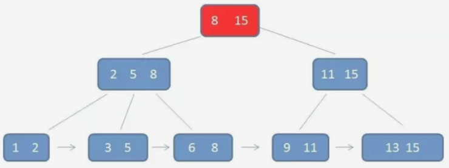

第二次磁盘IO：

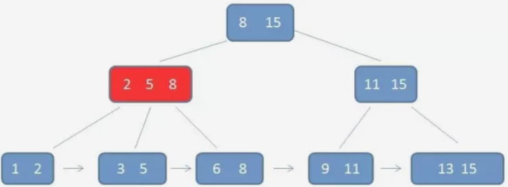

第三次磁盘IO：

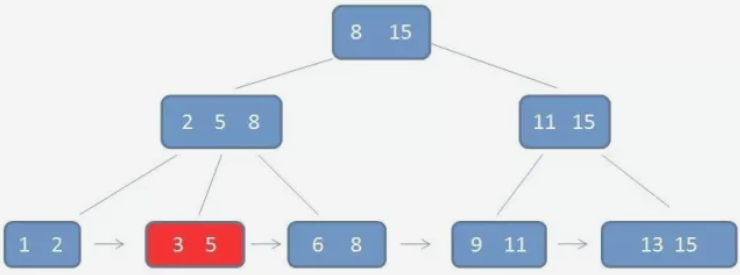

查询流程看起来与B树差不多。

## B+树的查询与B的不同点

有两点不同：

1. B+树中间的节点没有卫星数据，所以同样大小的磁盘页可以容纳更多的节点元素。这就意味着，在数据量相同的情况下，B+树的结构比B树更加的矮胖,因此查询时IO的次数也更少。

2. 其次B+树的查询必须最终查找到叶子节点，而B树只要找到匹配的元素即可，无论匹配元素处于中间节点还是叶子节点。因此 B树的查找性能不稳定（最好的情况之查找根节点，最坏的情况是查找叶子节点）而B+树每一次查找都是稳定的。 

## B+树范围查询

B树如何做范围查询呢。只能依靠繁琐的中序遍历。比如我们要查询范围为3-11的元素的：

## B树的范围查找过程

自顶向下，查找到范围的下限（3）：

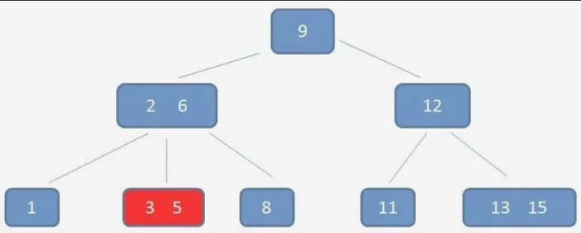

中序遍历到元素6：

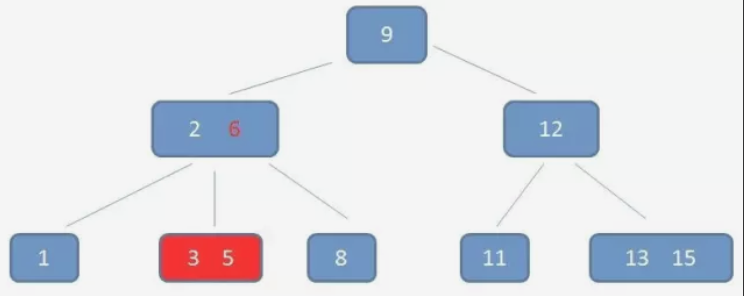

中序遍历到元素8：

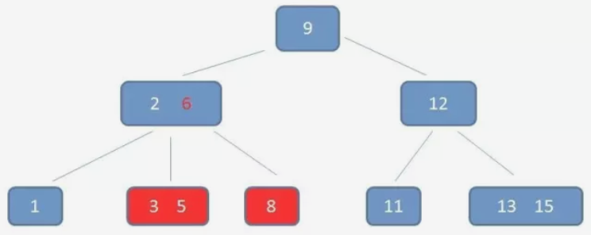

中序遍历到元素9：

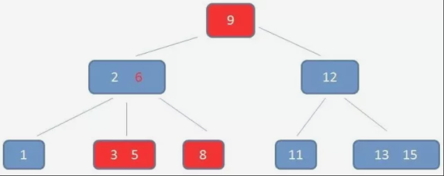

中序遍历到元素11，遍历结束：

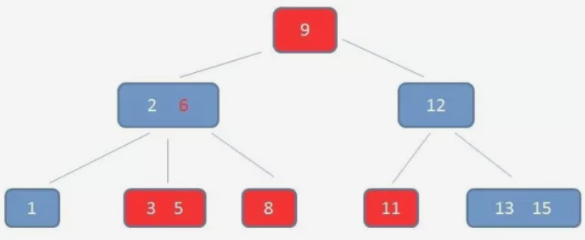

由上图可以看出 B树的查询很繁琐。

## B+树的范围查询

只需要在链表上遍历即可。

## B+树的范围查找过程

自顶向下，查找到范围的下限（3）：

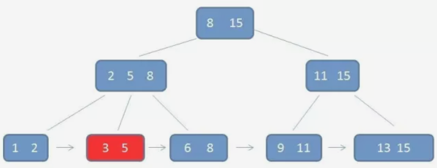

通过链表指针，遍历到元素6, 8：

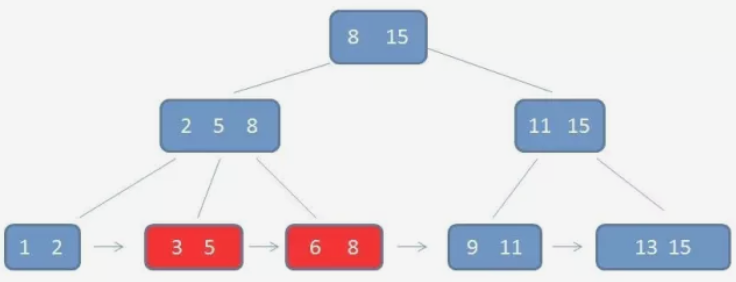

通过链表指针，遍历到元素9, 11，遍历结束：

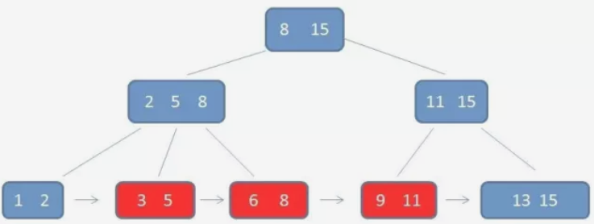

## 总结  B+树相比B树的优势有三个

1. IO次数更少（没有卫星数据，磁盘页容纳更多的节点） 矮胖
2. 查询稳定（都是最终落实在叶子节点上）
3. 范围查询方便（直接在链表查询）

