[文章来源](https://juejin.im/post/5c31f64c6fb9a049ac794ffc)

# 什么是B树

**Mysql 数据库中的索引是基于 Hash表或者 B+树。**

相关问题：

1. B+树的实现细节
2. B树 与B+树有什么区别
3. 联合索引在B+树种如何存储

## B树

数据库的索引为什么采用树的存储结构呢？树的查询效率高，而且可以保持有序。为什么索引没有采用二叉查找树来实现呢？二叉查找树的时间复杂度为 O(logn) 性能已经足够高了。难道B树比它还要快？

其实在逻辑算法的角度来讲，二叉查找树的查找速度和比较速度都是最小的，但是我们不得不考虑一个现实问题，磁盘IO.

数据库索引是存储在磁盘上的，当数据量比较大的时候，索引的大小的可能有几个G甚至更多。

当我们利用索引查询的时候，不能够将整个索引全部加载到内存，能做的只有逐一加载每一个磁盘页，这里的磁盘页对应着索引树的节点。

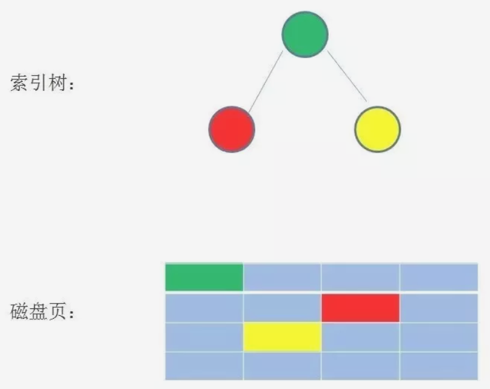

如果我们利用二叉查找树作为索引结构，情形是什么样子的呢？ 假设树的高度是4，查找的值是10，那么流程如下：

二叉查找树的结构：

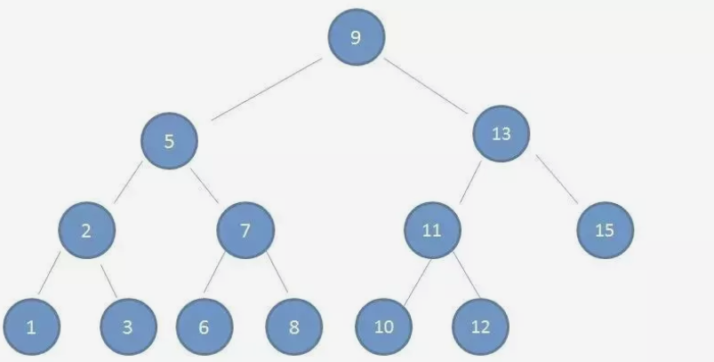

第1次磁盘IO：

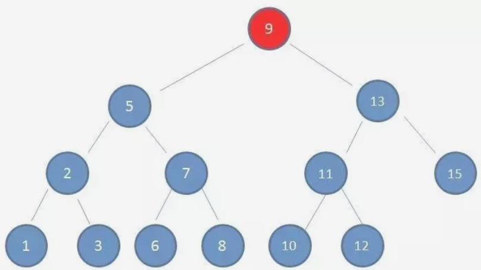

第2次磁盘IO：

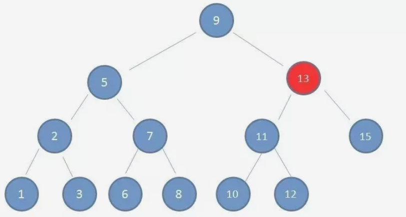

第3次磁盘IO：

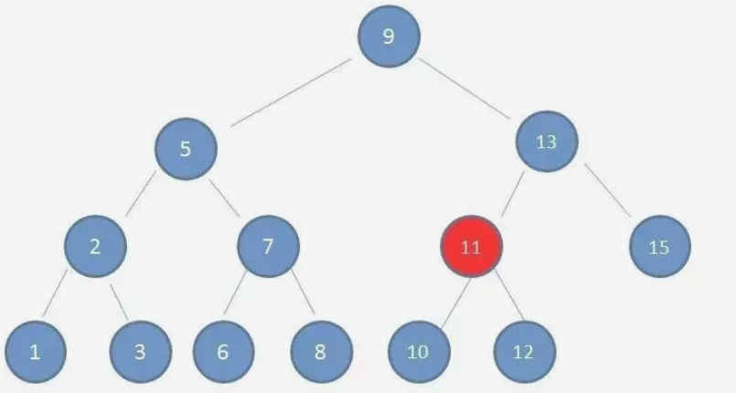

第4次磁盘IO：

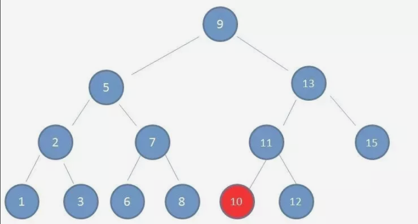

由上图可以看出，磁盘IO的次数与树的高度有关，在最坏的情况下，磁盘IO的次数与树的高度相等。

那么，为了减少磁盘IO的次数，我们就需要把原来瘦高的树结构变成 矮胖，这是B树的特征之一。

## 什么是B树 Balance Tree

B树是一种多路平衡查找树，它的每一个节点最多包含K个孩子，K被称为B树的阶，K的大小取决于磁盘页的大小。

下面来具体介绍一下B-树（Balance Tree），一个m阶的B树具有如下几个特征：

1. 根结点至少有两个子女。
2. 每个中间节点都包含k-1个元素和k个孩子，其中 m/2 <= k <= m
3. 每一个叶子节点都包含k-1个元素，其中 m/2 <= k <= m
4. 所有的叶子结点都位于同一层。
5. 每个节点中的元素从小到大排列，节点当中k-1个元素正好是k个孩子包含的元素的值域分划。

我们以3阶B树为例，来看看B树的具体结构。

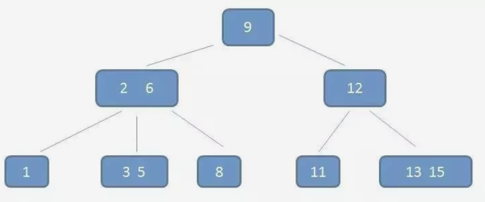

ps: （2,6）属于其中一个节点，但是有两个元素。

在这棵树中，咱们重点来看（2,6）节点，该节点有两个元素2和6，又有三个孩子 1，（3,5），8其中1小于元素2，（3,5）在元素2,6之间，8大于（3,5）正好符合刚刚所列的几条特征。

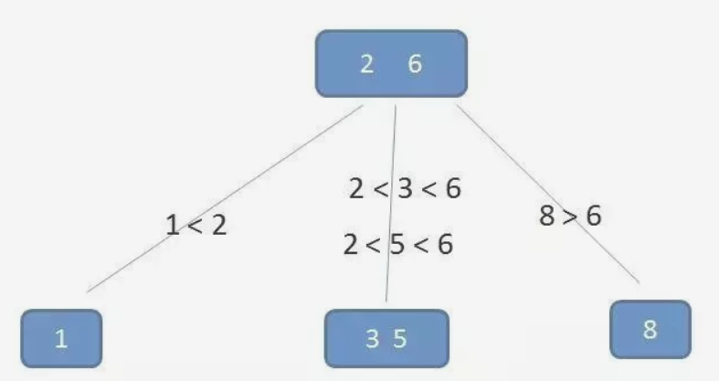

## B树的查询过程

接下来看一下，B树如何实现高效的查询？假设我们要查询的数值是 5

第1次磁盘IO：

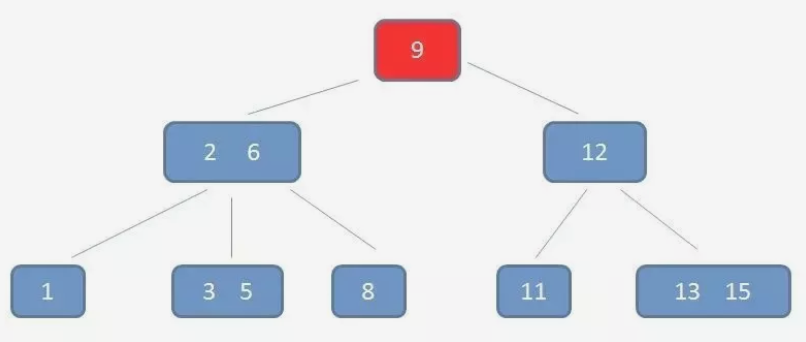

在内存中定位（和9比较）：

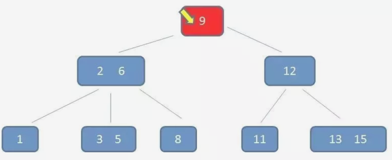

第2次磁盘IO：

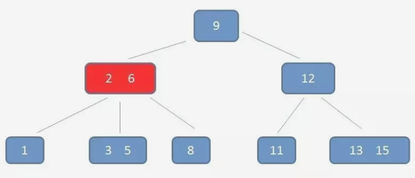

在内存中定位（和2，6比较）：

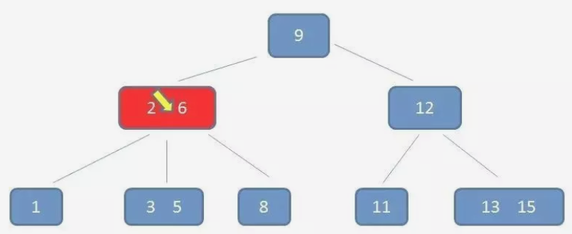

第3次磁盘IO：

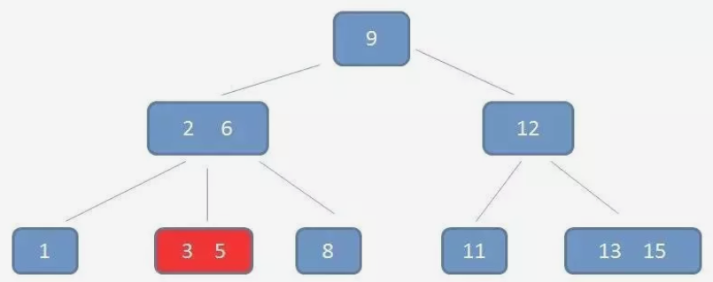

在内存中定位（和3，5比较）：

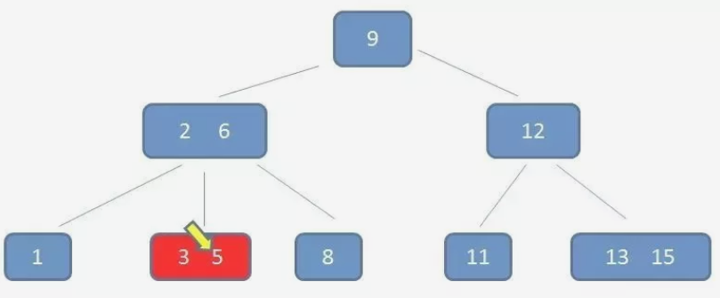

在整个流程中我们可以看出，B树的查询的比较次数其实不比二叉树少，尤其是当单一节点中的元素数量很多时候。可是相比磁盘的IO速度，内存中比较耗时可以忽略。所以只要树的高度足够低，IO的次数足够少，就可以提升查找的性能。相比之下，节点内部元素多一下没有关系，仅仅是多了几次内存交互，只要不超过磁盘页的大小即可。这是B树的优势之一。

## B树的插入删除过程

B树插入新节点的过程比较复杂，而且分成很多种情况。我们只举一个最典型的例子。假如我们插入的值是4。

自顶向下查找 4的节点位置，发现4应当插入到节点元素3,5之间。

节点3，5已经是两元素节点，无法再增加。父亲节点 2， 6 也是两元素节点，也无法再增加。根节点9是单元素节点，可以升级为两元素节点。于是拆分节点3，5与节点2，6，让根节点9升级为两元素节点4，9。节点6独立为根节点的第二个孩子。

插入的过程，会发现。仅仅插入了一个元素，就让整个B树很多的节点发生了连锁改变。这可以使树始终维持多路平衡。自平衡

## B树删除过程

假设我们要删除元素 11

自顶向下查找元素11的节点位置。

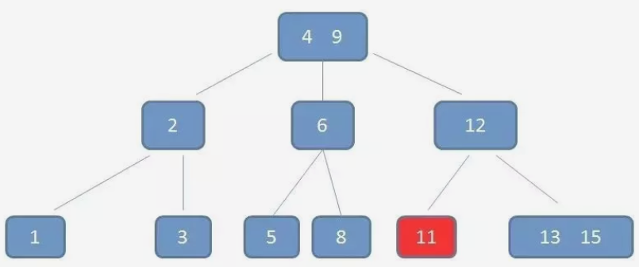

删除11后，节点12只有一个孩子，不符合B树规范。因此找出12,13,15三个节点的中位数13，取代节点12，而节点12自身下移成为第一个孩子。（这个过程称为左旋）

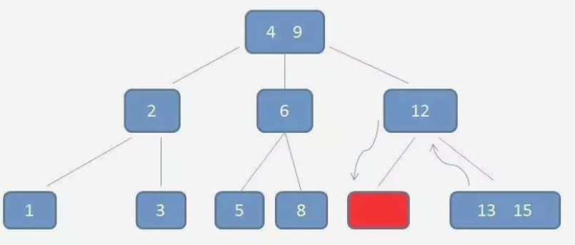

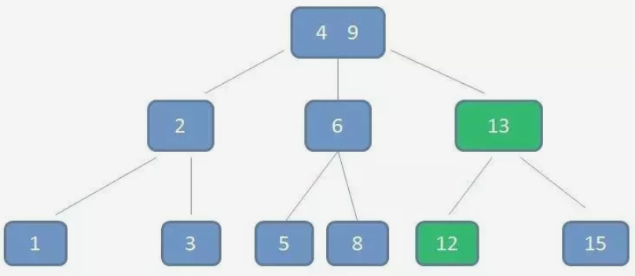

以上是B树的删除与插入表操作，不需要太理解。主要是理解B树这种结构。

## 实际应用

B树主要应用于文件系统以及部分数据库索引，比如著名的非关系型数据库MongoDB

而大多数的关系型数据库，比如Mysql则使用B+树作为索引。