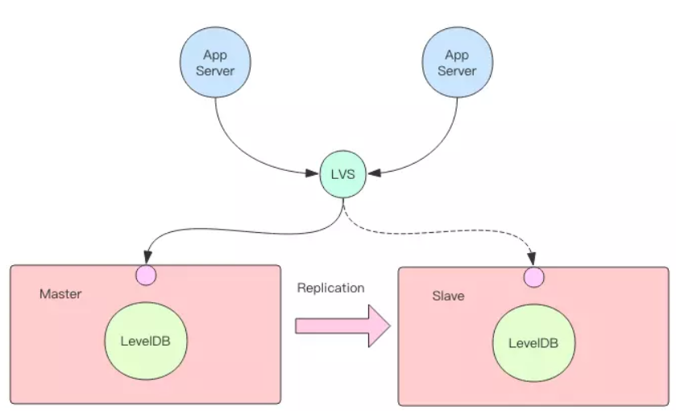

https://juejin.im/post/5c22e049e51d45206d12568e

https://juejin.im/post/5c36ad6051882525616db7fa

## 1. 既生 Redis 何生 LevelDB ？

Redis 是一款内存数据库，高性能因为它内存的访问特性。

但是它也有致命的弱点，内存的成本太高。长期不被访问的冷数据就被淘汰掉。

当我们 将 Redis 拿来做缓存用时候，背后肯定 还有一个持久层的数据库记录了
全量的冷热数据。Redis 和 持久层之间的数据一致性是 由应用程序决定的。

## LevelDB 将 Redis 缓存和持久层 合二为一

LevelDB 一次性帮你搞定缓存和持久层。LevelDB 内部已经内置了内存缓存，和
持久层的磁盘文件，用户不用操心内部是数据如何一致性的。

## LevelDB 是一个 NoSql存储引擎。

Redis 是一个完备的数据库，而LevelDb它只是一个引擎。

在使用 LevelDB时候，可以看作一个 Key/Value 内存数据库。它提供了基础的
Get/Set API,你可以把它看作一个无限大小的高级 HashMap,我们可以往里面插入
无限条 Key/Value数据，只要磁盘装得下。

## LevelDb如何在分布式领域 跨进程共享

在 LevelDB 内存数据库的基础上包装一层网络 API。当不同机器上不同的进程要来访问它时，都统一走网络 API 接口。这样就形成了一个简易的数据库。如果在网络层我们使用 Redis 协议来包装，那么使用 Redis 的客户端就可以读写这个数据库了。

如果要考虑数据库的高可用性，我们在上面这个单机数据库的基础上再加上主从复制功能就可以变身成为一个主从结构的分布式 NOSQL 数据库。在主从数据库前面加一层转发代理（负载均衡器如 LVS、F5 等），就可以实现主从的实时切换。

Only a single process (possibly multi-threaded) can access a particular database at a time.

对于进程而言，同一时刻，只能有一个进程可以访问。

## 特点
https://github.com/google/leveldb#limitations:

支持原子性的批量操作

key/value 数据库，以key为存储

## 缺点 限制 
1. 非关系型的数据库，没有关系型的数据模型。不支持 sql查询，没有索引。
2.在同一时间 只有一个线程可以访问
3. 需要自己封装

## LevelDB 原理

沉积作用： 如果磁盘底层的冷数据被修改了，它又会再次进入内存，一段时间后又会被持久化刷回到磁盘文件的浅层，然后再慢慢往下移动到底层，周而复始就好比地球水循环。

## 内存结构

LevelDB 的内存中维护了 2 个跳跃列表，一个是只读的 rtable，一个是可修改的 wtable。

跳跃列表的查找和更新操作时间复杂度都是 Log(n)。

跳跃列表是由多个层次的链表构成，其中最底层的链表存储了所有的 Key，它们是有序的。

如果跳跃列表只存 Key，那 Value 存哪里呢？答案是 Value 也存在跳跃列表的 Key 中。跳跃列表中存储的 Key 比较特殊，它是一个复合结构字符串，它同时包含了键值对的 Key 和 Value。

因为 wtable 要支持多线程读写，所以访问它是需要加锁控制。而 rtable 是只读的，它就不需要，但是它的存在时间很短，rtable 一旦生成，很快就会被异步线程序列化到磁盘上，然后就会被置空。但是异步线程序列化也需要耗费一定的时间，如果 wtable 增长过快，很快就被写满了，这时候 rtable 还没有完成序列化，而wtable 急需变身怎么办？这时写线程就会阻塞等待异步线程序列化完成，这是 LevelDB 的卡顿点之一，也是未来 RocksDB 的优化点。

记录了近期的写操作日志。如果 LevelDB 遇到突发停机事故，没有持久化的 wtable 和 rtable 数据就会丢失。这时就必须通过重放日志文件中的指令数据来恢复丢失的数据。注意到日志文件也是有两份的，它和内存的跳跃列表正好对应起来。当 wtable 要变身时，日志文件也会跟着变身。待 rtable 落盘成功之后，只读日志文件就可以被删除了。

## 多路归并

