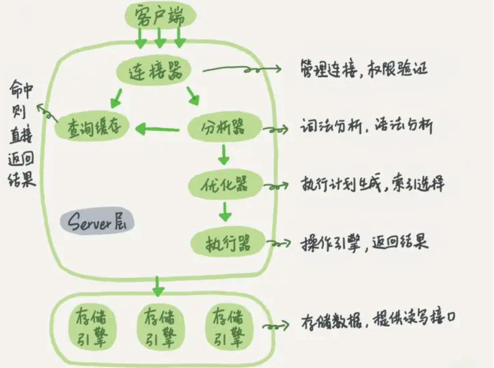

# mysql 服务器架构

## 连接层

最上层是一些客户端和连接服务。主要完成一些类似于`连接处理`、`授权认证`、及相关的安全方案。在该层上引入了`线程池`的概念，为通过认证安全接入的客户端提供线程。同样在该层上可以实现基于SSL的安全链接。服务器也会为安全接入的每个客户端验证它所具有的操作权限。

连接层 提供 线程池连接以及权限认证。

## 服务层

第二层服务层，主要完成大部分的核心服务功能， 包括`查询解析`、`分析`、`优化`、`缓存`、以及所有的内置函数，所有跨存储引擎的功能也都在这一层实现，包括触发器、存储过程、视图等。

## 引擎层

第三层存储引擎层，存储引擎真正的负责了MySQL中数据的存储和提取，服务器通过API与存储引擎进行通信。不同的存储引擎具有的功能不同，这样我们可以根据自己的实际需要进行选取

## 存储层

第四层为数据存储层，主要是将数据存储在运行于该设备的文件系统之上，并完成与存储引擎的交互.

# 存储引擎

存储引擎是MySQL的组件，用于处理`不同表类型`的SQL操作。`不同的存储引擎提供不同的存储机制、索引技巧、锁定水平等功能`，使用不同的存储引擎，还可以获得特定的功能。

使用哪一种引擎可以灵活选择，一个数据库中多个表可以使用不同引擎以满足各种性能和实际需求，使用合适的存储引擎，将会提高整个数据库的性能 。

MySQL服务器使用可插拔的存储引擎体系结构，可以从运行中的 MySQL 服务器加载或卸载存储引擎 。

## 索引物理结构

### MyISAM 物理文件结构为：

- .frm文件：与表相关的元数据信息都存放在frm文件，包括表结构的定义信息等
- .MYD (MYData) 文件：MyISAM 存储引擎专用，用于存储MyISAM 表的数据
- .MYI (MYIndex)文件：MyISAM 存储引擎专用，用于存储MyISAM 表的索引相关信息

### InnoDB 物理文件结构为：

- .frm 文件：与表相关的元数据信息都存放在frm文件，包括表结构的定义信息等
- `.ibd` 文件或 `.ibdata` 文件： 这两种文件都是存放 InnoDB 数据的文件，之所以有两种文件形式存放 InnoDB 的数据，是因为 InnoDB 的数据存储方式能够通过配置来决定是使用共享表空间存放存储数据，还是用独享表空间存放存储数据。

InnoDB 不保存表的具体行数，执行select count(*) from table 时需要全表扫描。而 MyISAM 用一个变量保存了整个表的行数，执行上述语句时只需要读出该变量即可，速度很快；

### 最大自增主键问题
一张表，里面有ID自增主键，当insert了17条记录之后，删除了第15,16,17条记录，再把Mysql重启，再insert一条记录，这条记录的ID是18还是15 ？

如果表的类型是MyISAM，那么是18。因为MyISAM表会把自增主键的最大ID 记录到数据文件中，重启MySQL自增主键的最大ID也不会丢失；
如果表的类型是InnoDB，那么是15。因为InnoDB 表只是把自增主键的最大ID记录到内存中，所以重启数据库或对表进行OPTION操作，都会导致最大ID丢失。

### count(*)

哪个存储引擎执行 select count(*) 更快，为什么?

MyISAM更快，因为MyISAM内部维护了一个计数器，可以直接调取。

- 在 MyISAM 存储引擎中，把表的总行数存储在磁盘上，当执行 select count(*) from t 时，直接返回总数据。

- 在 InnoDB 存储引擎中，跟 MyISAM 不一样，没有将总行数存储在磁盘上，当执行 select count(*) from t 时，会先把数据读出来，一行一行的累加，最后返回总数量。

### char varchar

CHAR 和 VARCHAR 的区别？

char是固定长度，varchar长度可变：
char(n) 和 varchar(n) 中括号中 n 代表字符的个数，并不代表字节个数，比如 CHAR(30) 就可以存储 30 个字符。
存储时，前者不管实际存储数据的长度，直接按 char 规定的长度分配存储空间；而后者会根据实际存储的数据分配最终的存储空间

相同点：

- char(n)，varchar(n)中的n都代表字符的个数
- 超过char，varchar最大长度n的限制后，字符串会被截断。

不同点：

`char`不论实际存储的字符数都会占用n个字符的空间，而varchar只会占用实际字符应该`占用的字节空间加1`（实际长度length，0<=length<255）或加2（length>255）。因为varchar保存数据时除了要保存字符串之外还会加一个字节来记录长度（如果列声明长度大于255则使用两个字节来保存长度）。

char是适合存储很短的、一般固定长度的字符串。例如，char非常适合存储密码的MD5值，因为这是一个定长的值。对于非常短的列，char比varchar在存储空间上也更有效率。

## 相关链接
https://juejin.im/post/5f0d4fadf265da22f3250eaa