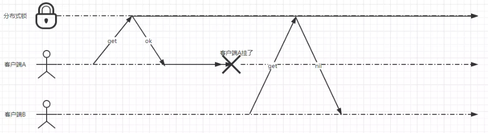

# Redis

基于Redis 的实现，使用的是Redis 的nx功能。

## 问题

以下是遇到的相关问题以及解决方案：

- 使用setnx设置一把锁，如果服务器A 挂掉了，那么这把锁永远都不会释放
- 过期时间如何保证大于业务执行时间?
- 如何保证锁不会被误删除?
- 释放锁的原子操作


假设有两个客户端A和B，A获取到分布式的锁。A执行了一会，突然A所在的服务器断电了（或者其他什么的），也就是客户端A挂了。这时出现一个问题，这个锁一直存在，且不会被释放，其他客户端永远获取不到锁。

解决方案：`设置过期时间`
<center>
    
    <br>
    <div style="color:orange; border-bottom: 1px solid #d9d9d9;
    display: inline-block;
    color: #999;
    padding: 2px;">图1</div>
</center>

```redis
SET lockKey value NX EX 30 //类似redis的这个命令
```

```java
// 这是常量类
public class LockConstants {
    public static final String OK = "OK";

    /** NX|XX, NX -- Only set the key if it does not already exist. XX -- Only set the key if it already exist. **/
    public static final String NOT_EXIST = "NX";
    public static final String EXIST = "XX";

    /** expx EX|PX, expire time units: EX = seconds; PX = milliseconds **/
    public static final String SECONDS = "EX";
    public static final String MILLISECONDS = "PX";

    private LockConstants() {}
}

```

```java
public RedisLock(Jedis jedis,String lockKey) {
        // （重要）设置value值为随机数 并且与 threadId 进行绑定 避免其他的线程删除
        this(jedis, lockKey, UUID.randomUUID().toString()+Thread.currentThread().getId());
    }

```


```java
public class LockCase5 extends RedisLock {

    public LockCase5(Jedis jedis, String lockKey) {
        super(jedis, lockKey);

    }

    @Override
    public void lock() {
        while (true) {
            // （重要）设置锁的过期时间
            String result = jedis.set(lockKey, lockValue, NOT_EXIST, SECONDS, 30);
            if (OK.equals(result)) {
                System.out.println("线程id:"+Thread.currentThread().getId() + "加锁成功!时间:"+LocalTime.now());

                //开启定时刷新过期时间
                isOpenExpirationRenewal = true;
                scheduleExpirationRenewal();
                break;
            }
            System.out.println("线程id:"+Thread.currentThread().getId() + "获取锁失败，休眠10秒!时间:"+LocalTime.now());
            //休眠10秒
            sleepBySencond(10);
        }
    }

    @Override
    public void unlock() {
        System.out.println("线程id:"+Thread.currentThread().getId() + "解锁!时间:"+LocalTime.now());

        // （重要）保证释放锁的原子操作
        String checkAndDelScript = "if redis.call('get', KEYS[1]) == ARGV[1] then " +
                                    "return redis.call('del', KEYS[1]) " +
                                    "else " +
                                    "return 0 " +
                                    "end";
        jedis.eval(checkAndDelScript, 1, lockKey, lockValue);
        isOpenExpirationRenewal = false;

    }
}

```
```java
 /**
     * 开启定时刷新
     */
    protected void scheduleExpirationRenewal(){
        Thread renewalThread = new Thread(new ExpirationRenewal());
        renewalThread.start();
    }

    /**
     * 刷新key的过期时间
     */
    private class ExpirationRenewal implements Runnable{
        @Override
        public void run() {
            while (isOpenExpirationRenewal){
                System.out.println("执行延迟失效时间中...");

                String checkAndExpireScript = "if redis.call('get', KEYS[1]) == ARGV[1] then " +
                        "return redis.call('expire',KEYS[1],ARGV[2]) " +
                        "else " +
                        "return 0 end";
                jedis.eval(checkAndExpireScript, 1, lockKey, lockValue, "30");

                //休眠10秒
                sleepBySencond(10);
            }
        }
    }
```
```lua
if redis.call("get",KEYS[1]) == ARGV[1] then
    return redis.call("del",KEYS[1])
else
    return 0
end
```
以上还是会存在问题：比如最后这个 开启线程检查过期时间的问题，如果 A挂掉了，本来想通过过期时间来进行释放锁，但是现在一直往后追加时间，导致无法释放锁。这是个很严重的问题。

# 集群Redis的分布式锁

## 加锁

RedLock算法加锁步骤如下

1. 获取当前Unix时间，以毫秒为单位。
2. 依次尝试从N个实例，使用相同的key和随机值获取锁。在步骤2，当向Redis设置锁时,客户端应该设置一个网络连接和响应超时时间，这个超时时间应该小于锁的失效时间。例如你的锁自动失效时间为10秒，则超时时间应该在5-50毫秒之间。这样可以避免服务器端Redis已经挂掉的情况下，客户端还在死死地等待响应结果。如果服务器端没有在规定时间内响应，客户端应该尽快尝试另外一个Redis实例。
3. 客户端使用当前时间减去开始获取锁时间（步骤1记录的时间）就得到获取锁使用的时间。当且仅当从大多数（这里是3个节点）的Redis节点都取到锁，并且使用的时间小于锁失效时间时，锁才算获取成功。
4. 如果取到了锁，key的真正有效时间等于有效时间减去获取锁所使用的时间（步骤3计算的结果）。
5. 如果因为某些原因，获取锁失败（没有在至少N/2+1个Redis实例取到锁或者取锁时间已经超过了有效时间），客户端应该在所有的Redis实例上进行解锁（即便某些Redis实例根本就没有加锁成功）。


## 参考
1. [Distributed locks with Redis](https://redis.io/topics/distlock)
2. [redis系列：分布式锁](https://juejin.im/post/5b737b9b518825613d3894f4)

