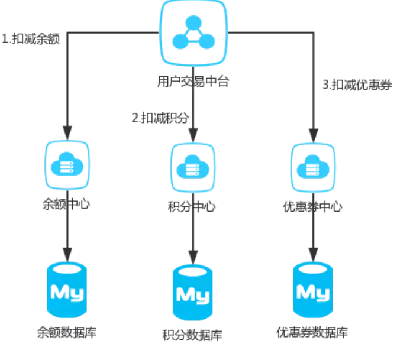
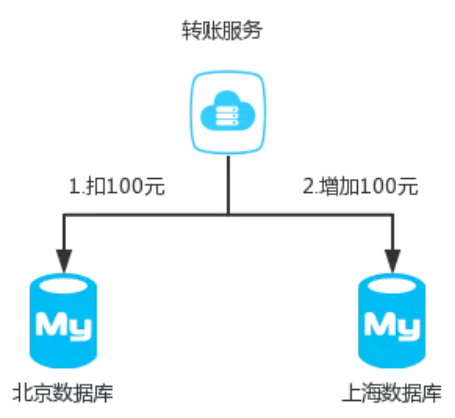
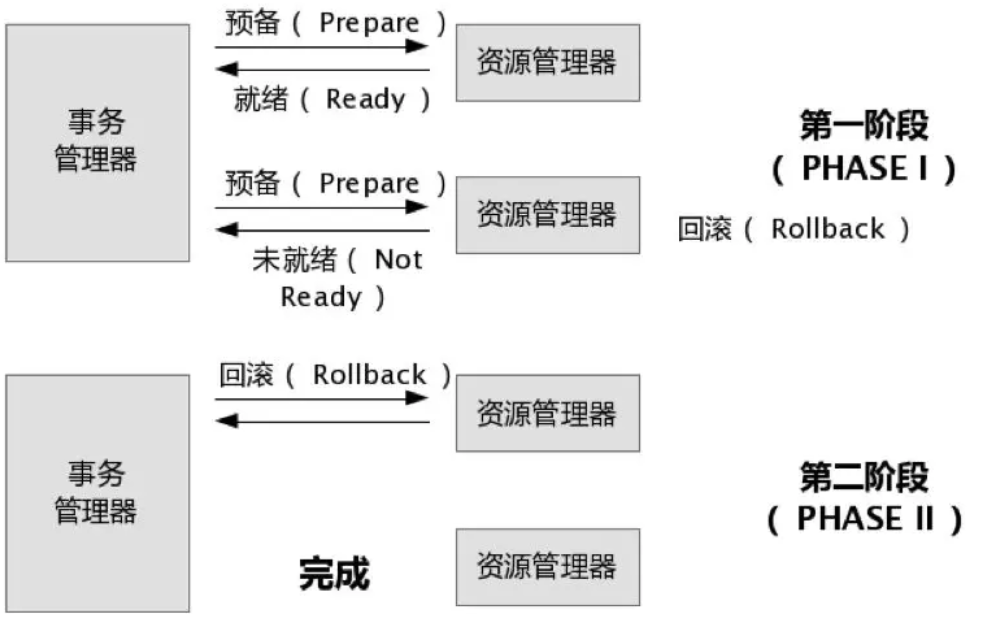
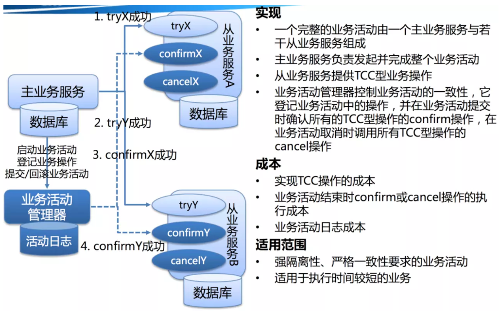
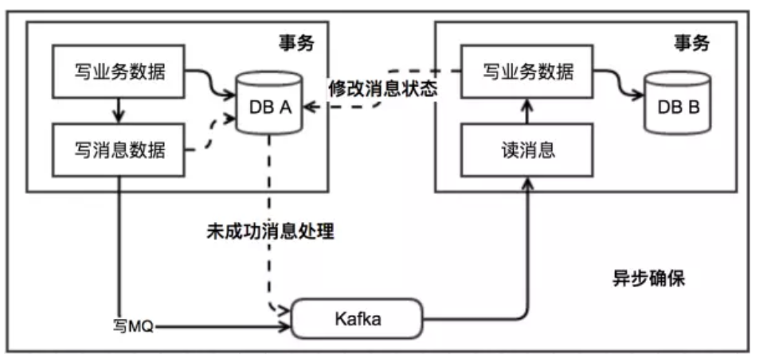

# 分布式事务

## 什么是分布式事务
---
分布式事务就是指事务的参与者、支持事务的服务器、资源服务器以及事务管理器分别位于不同的分布式系统的不同节点之上。简单的说，就是一次大的操作由不同的小操作组成，这些小的操作分布在不同的服务器上，且属于不同的应用，分布式事务需要保证这些小操作要么全部成功，要么全部失败。本质上来说，`分布式事务就是为了保证不同数据库的数据一致性`。

## 分布式事务产生的原因

从上面本地事务来看，我们可以看为两块，一个是service产生多个节点，另一个是resource产生多个节点。

### service多个节点

随着互联网快速发展，微服务，SOA等服务架构模式正在被大规模的使用，举个简单的例子，一个公司之内，用户的资产可能分为好多个部分，比如余额，积分，优惠券等等。在公司内部有可能积分功能由一个微服务团队维护，优惠券又是另外的团队维护。

这样的话就无法保证积分扣减了之后，优惠券能否扣减成功。

### resource多个节点

同样的，互联网发展得太快了，我们的Mysql一般来说装千万级的数据就得进行分库分表，对于一个支付宝的转账业务来说，你给的朋友转钱，有可能你的数据库是在北京，而你的朋友的钱是存在上海，所以我们依然无法保证他们能同时成功。

# 分布式事务的基础

我们之前说过数据库的ACID四大特性，已经无法满足我们分布式事务，这个时候又有一些新的大佬提出一些新的理论:

## CAP

`CAP定理`，又被叫作布鲁尔定理。对于设计分布式系统来说(不仅仅是分布式事务)的架构师来说，CAP就是你的入门理论。

- C (一致性 consistency):对某个指定的客户端来说，读操作能返回最新的写操作。对于数据分布在不同节点上的数据上来说，如果在某个节点更新了数据，那么在其他节点如果都能读取到这个最新的数据，那么就称为强一致，如果有某个节点没有读取到，那就是分布式不一致。
- A (可用性 availability)：非故障的节点在合理的时间内返回合理的响应(不是错误和超时的响应)。可用性的两个关键一个是合理的时间，一个是合理的响应。合理的时间指的是请求不能无限被阻塞，应该在合理的时间给出返回。合理的响应指的是系统应该明确返回结果并且结果是正确的，这里的正确指的是比如应该返回50，而不是返回40。
- P (分区容错性 Tolerance of network Partition):当出现网络分区后，系统能够继续工作。打个比方，这里个集群有多台机器，有台机器网络出现了问题，但是这个集群仍然可以正常工作。

熟悉CAP的人都知道，三者不能共有，如果感兴趣可以搜索CAP的证明，在分布式系统中，网络无法100%可靠，分区其实是一个必然现象，如果我们选择了CA而放弃了P，那么当发生分区现象时，为了保证一致性，这个时候必须拒绝请求，但是A又不允许，所以分布式系统理论上不可能选择CA架构，只能选择CP或者AP架构。必须选择 `P`

对于CP来说，放弃可用性，追求一致性和分区容错性，我们的zookeeper其实就是`追求的强一致`。

对于AP来说，放弃一致性(这里说的一致性是强一致性)，追求分区容错性和可用性，这是很多分布式系统设计时的选择，后面的BASE也是根据AP来扩展。(日常使用)

顺便一提，CAP理论中是忽略网络延迟，也就是当事务提交时，从节点A复制到节点B，但是在现实中这个是明显不可能的，所以总会有一定的时间是不一致。同时CAP中选择两个，比如你选择了CP，并不是叫你放弃A。因为P出现的概率实在是太小了，大部分的时间你仍然需要保证CA。就算分区出现了你也要为后来的A做准备，比如通过一些日志的手段，是其他机器回复至可用

## BASE

BASE 是 Basically Available(基本可用)、Soft state(软状态)和 Eventually consistent (最终一致性)三个短语的缩写。是对CAP中AP的一个扩展.

1. 基本可用:分布式系统在出现故障时，允许损失部分可用功能，保证核心功能可用。
2. 软状态:允许系统中存在中间状态，这个状态不影响系统可用性，这里指的是CAP中的不一致。
3. 最终一致:最终一致是指经过一段时间后，所有节点数据都将会达到一致。

BASE解决了CAP中理论没有网络延迟，在BASE中用软状态和最终一致，保证了延迟后的一致性。BASE和 ACID 是相反的，它完全不同于ACID的强一致性模型，而是通过牺牲强一致性来获得可用性，并允许数据在一段时间内是不一致的，但最终达到一致状态.

# 分布式事务解决方案

## 2PC

说到2PC就不得不聊数据库分布式事务中的 XA Transactions。

在XA协议中分为两阶段:

第一阶段：事务管理器要求每个涉及到事务的数据库预提交(precommit)此操作，并反映是否可以提交.

第二阶段：事务协调器要求每个数据库提交数据，或者回滚数据。

优点： 尽量保证了数据的强一致，实现成本较低，在各大主流数据库都有自己实现，对于MySQL是从5.5开始支持。

缺点:

- 单点问题:事务管理器在整个流程中扮演的角色很关键，如果其宕机，比如在第一阶段已经完成，在第二阶段正准备提交的时候事务管理器宕机，资源管理器就会一直阻塞，导致数据库无法使用。
- 同步阻塞:在准备就绪之后，资源管理器中的资源一直处于阻塞，直到提交完成，释放资源。
- 数据不一致:两阶段提交协议虽然为分布式数据强一致性所设计，但仍然存在数据不一致性的可能，比如在第二阶段中，假设协调者发出了事务commit的通知，但是因为网络问题该通知仅被一部分参与者所收到并执行了commit操作，其余的参与者则因为没有收到通知一直处于阻塞状态，这时候就产生了数据的不一致性。

总的来说，XA协议比较简单，成本较低，但是其单点问题，以及不能支持高并发(由于同步阻塞)依然是其最大的弱点。

## TCC

关于TCC（Try-Confirm-Cancel）的概念，最早是由Pat Helland于2007年发表的一篇名为《Life beyond Distributed Transactions:an Apostate’s Opinion》的论文提出。

TCC事务机制相比于上面介绍的XA，解决了其几个缺点:

1. 解决了协调者单点，由主业务方发起并完成这个业务活动。业务活动管理器也变成多点，引入集群。
2.同步阻塞:引入超时，超时后进行补偿，并且不会锁定整个资源，将资源转换为业务逻辑形式，粒度变小。
3. 数据一致性，有了补偿机制之后，由业务活动管理器控制一致性

对于TCC的解释:

- Try阶段：尝试执行,完成所有业务检查（一致性）,预留必须业务资源（准隔离性）

- Confirm阶段：确认执行真正执行业务，不作任何业务检查，只使用Try阶段预留的业务资源，Confirm操作满足幂等性。要求具备幂等设计，Confirm失败后需要进行重试。

- Cancel阶段：取消执行，释放Try阶段预留的业务资源
Cancel操作满足幂等性Cancel阶段的异常和Confirm阶段异常处理方案基本上一致。

举个简单的例子如果你用100元买了一瓶水，
Try阶段:你需要向你的钱包检查是否够100元并锁住这100元，水也是一样的。
如果有一个失败，则进行cancel(释放这100元和这一瓶水)，如果cancel失败不论什么失败都进行重试cancel，所以需要保持幂等。
如果都成功，则进行confirm,确认这100元扣，和这一瓶水被卖，如果confirm失败无论什么失败则重试(会依靠活动日志进行重试)

对于TCC来说适合一些:

- 强隔离性，严格一致性要求的活动业务。
- 执行时间较短的业务

## 本地消息表

本地消息表这个方案最初是ebay提出的 ebay的完整方案https://queue.acm.org/detail.cfm?id=1394128。

此方案的核心是将需要分布式处理的任务通过消息日志的方式来异步执行。消息日志可以存储到本地文本、数据库或消息队列，再通过业务规则自动或人工发起重试。人工重试更多的是应用于支付场景，通过对账系统对事后问题的处理。

https://juejin.im/post/5b5a0bf9f265da0f6523913b#heading-4

待完善。