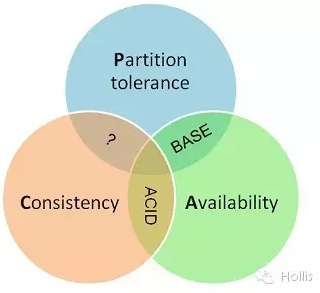
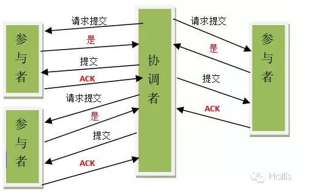
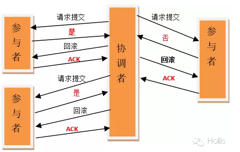
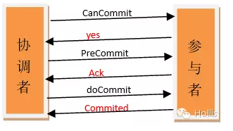
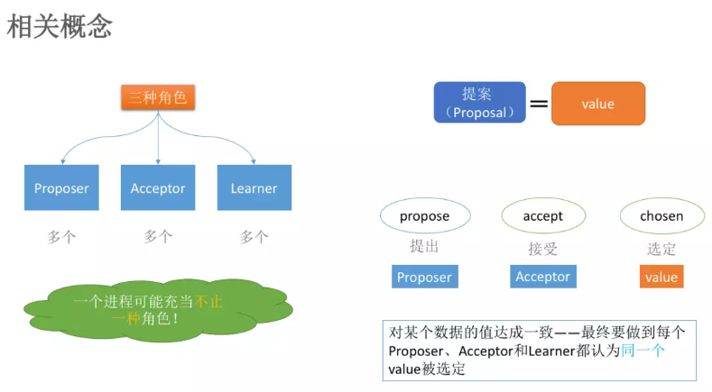

# CAP
[原文地址](https://mp.weixin.qq.com/s/V8ZXWIHcPt_U3T0jQm8oZg)
## 背景
> 2000年7月，加州大学伯克利分校的Eric Brewer教授在ACM PODC会议上提出CAP猜想。2年后，麻省理工学院的Seth Gilbert和Nancy Lynch从理论上证明了CAP。之后，CAP理论正式成为分布式计算领域的`公认定理`。

一个分布式系统最多只能同时满足一致性（Consistency  [kənˈsɪstənsi]）、可用性（Availability）和分区容错性（Partition tolerance）这三项中的两项。

## CAP的定义

### Consistency 一致性
一致性指`“all nodes see the same data at the same time”`，即更新操作成功并返回客户端完成后，所有节点在同一时间的数据完全一致。分布式的一致性

对于一致性，可以分为从客户端和服务端两个不同的视角。从客户端来看，一致性主要指的是多并发访问时更新过的数据如何获取的问题。从服务端来看，则是`更新如何复制分布到整个系统，以保证数据最终一致`。一致性是因为有并发读写才有的问题，因此在理解一致性的问题时，一定要注意结合考虑并发读写的场景。

从客户端角度，多进程并发访问时，更新过的数据在不同进程如何获取的不同策略，决定了不同的一致性。对于关系型数据库，要求更新过的数据能被后续的访问都能看到，这是强一致性。如果能容忍后续的部分或者全部访问不到，则是弱一致性。如果经过一段时间后要求能访问到更新后的数据，则是最终一致性。

### Availability 可用性

可用性指“Reads and writes always succeed”，即`服务一直可用，而且是正常响应时间`。

对于一个可用性的分布式系统，每一个非故障的节点必须对每一个请求作出响应。也就是，该系统使用的任何算法必须最终终止。当同时要求分区容忍性时，这是一个很强的定义：即使是严重的网络错误，每个请求必须终止。

好的可用性主要是指系统能够很好的为用户服务，不出现用户操作失败或者访问超时等用户体验不好的情况。可用性通常情况下可用性和分布式数据冗余，负载均衡等有着很大的关联。

### Partition Tolerance分区容错性

分区容错性指“the system continues to operate despite(即使) arbitrary message loss or failure of part of the system”，即分布式系统在遇到某节点或网络分区故障的时候，仍然能够对外提供满足一致性和可用性的服务。

分区容错性和扩展性紧密相关。在分布式应用中，可能因为一些分布式的原因导致系统无法正常运转。好的分区容错性要求能够使应用虽然是一个分布式系统，而看上去却好像是在一个可以运转正常的整体。比如现在的分布式系统中有某一个或者几个机器宕掉了，其他剩下的机器还能够正常运转满足系统需求，或者是机器之间有网络异常，将分布式系统分隔未独立的几个部分，各个部分还能维持分布式系统的运作，这样就具有好的分区容错性。

## CAP的证明
这部分可以参考原文，我没有处理。

### CAP 权衡

通过CAP理论，我们知道无法同时满足一致性、可用性和分区容错性这三个特性，那要舍弃哪个呢？

CA without P：如果不要求P（不允许分区），则C（强一致性）和A（可用性）是可以保证的。但其实分区不是你想不想的问题，而是始终会存在，因此CA的系统更多的是允许分区后各子系统依然保持CA。

CP without A：如果不要求A（可用），相当于每个请求都需要在Server之间强一致，而P（分区）会导致同步时间无限延长，如此CP也是可以保证的。很多传统的数据库分布式事务都属于这种模式。

AP wihtout C：要高可用并允许分区，则需放弃一致性。一旦分区发生，节点之间可能会失去联系，为了高可用，每个节点只能用本地数据提供服务，而这样会导致全局数据的不一致性。现在众多的NoSQL都属于此类。
对于多数大型互联网应用的场景，主机众多、部署分散，而且现在的集群规模越来越大，所以节点故障、网络故障是常态，而且要保证服务可用性达到N个9，即保证P和A，舍弃C（退而求其次保证最终一致性）。虽然某些地方会影响客户体验，但没达到造成用户流程的严重程度。

对于涉及到钱财这样不能有一丝让步的场景，C必须保证。网络发生故障宁可停止服务，这是保证CA，舍弃P。貌似这几年国内银行业发生了不下10起事故，但影响面不大，报到也不多，广大群众知道的少。还有一种是保证CP，舍弃A。例如网络故障事只读不写。

孰优孰略，没有定论，只能根据场景定夺，适合的才是最好的。

# BASE理论
[Base理论地址](https://mp.weixin.qq.com/s/pnOCPYZv_YIn1uZGZhFz3g)

> eBay的架构师Dan Pritchett源于对大规模分布式系统的实践总结，在ACM上发表文章提出BASE理论，BASE理论是对CAP理论的延伸，核心思想是即使无法做到强一致性（Strong Consistency，CAP的一致性就是强一致性），但应用可以采用适合的方式达到`最终一致性`（Eventual Consitency）。

BASE是指基本可用（Basically Available）、软状态（ Soft State）、最终一致性（ Eventual Consistency）。

## 基本可用（Basically Available）

基本可用是指分布式系统在出现故障的时候，允许损失部分可用性，即保证核心可用。

电商大促时，为了应对访问量激增，部分用户可能会被引导到降级页面，服务层也可能只提供降级服务。这就是损失部分可用性的体现。

## 软状态（ Soft State）

软状态是指允许系统存在中间状态，而该中间状态不会影响系统整体可用性。分布式存储中一般一份数据至少会有三个副本，`允许不同节点间副本同步的延时就是软状态的体现`。mysql replication的异步复制也是一种体现。

## 最终一致性（ Eventual Consistency）

最终一致性是指系统中的所有数据副本经过一定时间后，最终能够达到一致的状态。弱一致性和强一致性相反，最终一致性是弱一致性的一种特殊情况。

## ACID和BASE的区别与联系
ACID是传统数据库常用的设计理念，追求强一致性模型。BASE支持的是大型分布式系统，提出通过牺牲强一致性获得高可用性。

ACID和BASE代表了两种截然相反的设计哲学

在分布式系统设计的场景中，系统组件对一致性要求是不同的，因此ACID和BASE又会结合使用。

# 分布式一致性的探究

[原文连接](https://mp.weixin.qq.com/s/dCJ2RFFoDlVzTNBl9pv4lg)
> 在分布式系统引入复制机制后，不同的数据节点之间由于网络延时等原因很容易产生数据不一致的情况。复制机制的目的是为了保证数据的一致性。但是数据复制面临的主要难题也是`如何保证多个副本之间的数据一致性`。

一个系统如果想`保证数据一致性很有可能影响其性能`。因为并发的写请求需要在前一个写请求结束之后才能进行。

- 弱一致性

    系统并不保证续进程或者线程的访问都会返回最新的更新过的值。系统在数据写入成功之后，不承诺立即可以读到最新写入的值，也不会具体的承诺多久之后可以读到。但会尽可能保证在某个时间级别（比如秒级别）之后，可以让数据达到一致性状态。
- 最终一致性

    弱一致性的特定形式。系统保证在没有后续更新的前提下，系统最终返回上一次更新操作的值。在没有故障发生的前提下，不一致窗口的时间主要受通信延迟，系统负载和复制副本的个数影响。DNS是一个典型的最终一致性系统。

为了解决分布式的一致性问题，在长期的研究探索过程中，涌现出了一大批经典的一致性协议和算法，其中比较著名的有二阶段提交协议，三阶段提交协议和Paxos算法

# 分布式事务

[原文链接](https://mp.weixin.qq.com/s/-92_4hQRXjj7x02Sc2IYqg)

> 分布式事务是指会涉及到操作多个数据库的事务。其实就是将对同一库事务的概念扩大到了对多个库的事务。目的是为了保证分布式系统中的数据一致性。分布式事务处理的关键是必须有一种方法可以知道事务在任何地方所做的所有动作，提交或回滚事务的决定必须产生统一的结果（全部提交或全部回滚）

在分布式系统中，各个节点之间在物理上相互独立，通过网络进行沟通和协调。由于存在事务机制，可以保证每个独立节点上的数据操作可以满足ACID。但是，相互独立的节点之间无法准确的知道其他节点中的事务执行情况。所以从理论上讲，两台机器理论上无法达到一致的状态。如果想让分布式部署的多台机器中的数据保持一致性，那么就要保证在所有节点的数据写操作，要不全部都执行，要么全部的都不执行。但是，一台机器在执行本地事务的时候无法知道其他机器中的本地事务的执行结果。所以他也就不知道本次事务到底应该commit还是 roolback。所以，常规的解决办法就是引入一个“协调者”的组件来统一调度所有分布式节点的执行。

## XA规范

X/Open 组织（即现在的 Open Group ）定义了分布式事务处理模型。 X/Open DTP 模型（ 1994 ）包括应用程序（ AP ）、事务管理器（ TM ）、资源管理器（ RM ）、通信资源管理器（ CRM ）四部分。一般，常见的事务管理器（ TM ）是交易中间件，常见的资源管理器（ RM ）是数据库，常见的通信资源管理器（ CRM ）是消息中间件。    通常把一个数据库内部的事务处理，如对多个表的操作，作为本地事务看待。数据库的事务处理对象是本地事务，而分布式事务处理的对象是全局事务。   所谓全局事务，是指分布式事务处理环境中，多个数据库可能需要共同完成一个工作，这个工作即是一个全局事务，例如，一个事务中可能更新几个不同的数据库。对数据库的操作发生在系统的各处但必须全部被提交或回滚。此时一个数据库对自己内部所做操作的提交不仅依赖本身操作是否成功，还要依赖与全局事务相关的其它数据库的操作是否成功，如果任一数据库的任一操作失败，则参与此事务的所有数据库所做的所有操作都必须回滚。     一般情况下，某一数据库无法知道其它数据库在做什么，因此，在一个 DTP 环境中，交易中间件是必需的，由它通知和协调相关数据库的提交或回滚。而一个数据库只将其自己所做的操作（可恢复）影射到全局事务中。   

> XA 就是 X/Open DTP 定义的交易中间件与数据库之间的接口规范（即接口函数），交易中间件用它来通知数据库事务的开始、结束以及提交、回滚等。 XA 接口函数由数据库厂商提供。 

**二阶提交协议**和**三阶提交协议**就是根据这一思想衍生出来的。可以说二阶段提交其实就是实现XA分布式事务的关键(确切地说：两阶段提交主要保证了分布式事务的原子性：即所有结点要么全做要么全不做)

# 2PC

> 二阶段提交(Two-phaseCommit)是指，在计算机网络以及数据库领域内，为了使基于分布式系统架构下的所有节点在进行事务提交时保持一致性而设计的一种算法(Algorithm)。通常，二阶段提交也被称为是一种协议(Protocol))。在分布式系统中，每个节点虽然可以知晓自己的操作时成功或者失败，却无法知道其他节点的操作的成功或失败。当一个事务跨越多个节点时，为了保持事务的ACID特性，需要引入一个作为协调者的组件来统一掌控所有节点(称作参与者)的操作结果并最终指示这些节点是否要把操作结果进行真正的提交(比如将更新后的数据写入磁盘等等)。因此，二阶段提交的算法思路可以概括为：**参与者将操作成败通知协调者，再由协调者根据所有参与者的反馈情报决定各参与者是否要提交操作还是中止操作**。

所谓的两个阶段是指：第一阶段：**准备阶段(投票阶段)**和第二阶段：**提交阶段（执行阶段）**。

## 准备阶段

事务协调者(事务管理器)给每个参与者(资源管理器)发送Prepare消息，每个参与者要么直接返回失败(如权限验证失败)，要么在本地执行事务，写本地的redo和undo日志，但不提交，到达一种“万事俱备，只欠东风”的状态。

可以进一步将准备阶段分为以下三个步骤：

1）协调者节点向所有参与者节点询问是否可以执行提交操作(vote)，并开始等待各参与者节点的响应。

2）参与者节点执行询问发起为止的所有事务操作，并将Undo信息和Redo信息写入日志。（注意：若成功这里其实每个参与者已经执行了事务操作）

3）各参与者节点响应协调者节点发起的询问。如果参与者节点的事务操作实际执行成功，则它返回一个"同意"消息；如果参与者节点的事务操作实际执行失败，则它返回一个"中止"消息。

## 提交阶段

如果协调者收到了参与者的失败消息或者超时，直接给每个参与者发送回滚(Rollback)消息；否则，发送提交(Commit)消息；参与者根据协调者的指令执行提交或者回滚操作，释放所有事务处理过程中使用的锁资源。(注意:必须在最后阶段释放锁资源)

接下来分两种情况分别讨论提交阶段的过程。

当协调者节点从所有参与者节点获得的相应消息都为"同意"时:

1）协调者节点向所有参与者节点发出"正式提交(commit)"的请求。

2）参与者节点正式完成操作，并释放在整个事务期间内占用的资源。

3）参与者节点向协调者节点发送"完成"消息。

4）协调者节点受到所有参与者节点反馈的"完成"消息后，完成事务。

如果任一参与者节点在第一阶段返回的响应消息为"中止"，或者 协调者节点在第一阶段的询问超时之前无法获取所有参与者节点的响应消息时：

1）协调者节点向所有参与者节点发出"回滚操作(rollback)"的请求。

2）参与者节点利用之前写入的Undo信息执行回滚，并释放在整个事务期间内占用的资源。

3）参与者节点向协调者节点发送"回滚完成"消息。

4）协调者节点受到所有参与者节点反馈的"回滚完成"消息后，取消事务

二阶段提交看起来确实能够提供原子性的操作，但是不幸的事，二阶段提交还是有几个缺点的：

### 二阶段缺点

1、同步阻塞问题。执行过程中，所有参与节点都是事务阻塞型的。当参与者占有公共资源时，其他第三方节点访问公共资源不得不处于阻塞状态。

2、单点故障。由于协调者的重要性，一旦协调者发生故障。参与者会一直阻塞下去。尤其在第二阶段，协调者发生故障，那么所有的参与者还都处于锁定事务资源的状态中，而无法继续完成事务操作。（如果是协调者挂掉，可以重新选举一个协调者，但是无法解决因为协调者宕机导致的参与者处于阻塞状态的问题）

3、数据不一致。在二阶段提交的阶段二中，当协调者向参与者发送commit请求之后，发生了局部网络异常或者在发送commit请求过程中协调者发生了故障，这回导致只有一部分参与者接受到了commit请求。而在这部分参与者接到commit请求之后就会执行commit操作。但是其他部分未接到commit请求的机器则无法执行事务提交。于是整个分布式系统便出现了数据部一致性的现象。

4、二阶段无法解决的问题：协调者再发出commit消息之后宕机，而唯一接收到这条消息的参与者同时也宕机了。那么即使协调者通过选举协议产生了新的协调者，这条事务的状态也是不确定的，没人知道事务是否被已经提交。

由于二阶段提交存在着诸如同步阻塞、单点问题、脑裂等缺陷，所以，研究者们在二阶段提交的基础上做了改进，提出了三阶段提交。

# 3PC

> 三阶段提交（Three-phase commit），也叫三阶段提交协议（Three-phase commit protocol），是二阶段提交（2PC）的改进版本。

与两阶段提交不同的是，三阶段提交有两个改动点.

1、引入超时机制。同时在协调者和参与者中都引入超时机制。

2、在第一阶段和第二阶段中插入一个准备阶段。保证了在最后提交阶段之前各参与节点的状态是一致的。

也就是说，除了引入超时机制之外，3PC把2PC的准备阶段再次一分为二，这样三阶段提交就有CanCommit、PreCommit、DoCommit三个阶段。

## CanCommit阶段

3PC的CanCommit阶段其实和2PC的准备阶段很像。协调者向参与者发送commit请求，参与者如果可以提交就返回Yes响应，否则返回No响应。

1.事务询问 协调者向参与者发送CanCommit请求。询问是否可以执行事务提交操作。然后开始等待参与者的响应。

2.响应反馈 参与者接到CanCommit请求之后，正常情况下，如果其自身认为可以顺利执行事务，则返回Yes响应，并进入预备状态。否则反馈No

## PreCommit阶段

协调者根据参与者的反应情况来决定是否可以记性事务的PreCommit操作。根据响应情况，有以下两种可能。

假如协调者从所有的参与者获得的反馈都是Yes响应，那么就会执行事务的预执行。

1.发送预提交请求 协调者向参与者发送PreCommit请求，并进入Prepared阶段。

2.事务预提交 参与者接收到PreCommit请求后，会执行事务操作，并将undo和redo信息记录到事务日志中。

3.响应反馈 如果参与者成功的执行了事务操作，则返回ACK响应，同时开始等待最终指令。

假如有任何一个参与者向协调者发送了No响应，或者等待超时之后，协调者都没有接到参与者的响应，那么就执行事务的中断。

1.发送中断请求 协调者向所有参与者发送abort请求。

2.中断事务 参与者收到来自协调者的abort请求之后（或超时之后，仍未收到协调者的请求），执行事务的中断。

## doCommit阶段

该阶段进行真正的事务提交，也可以分为以下两种情况。

### 执行提交

1.发送提交请求 协调接收到参与者发送的ACK响应，那么他将从预提交状态进入到提交状态。并向所有参与者发送doCommit请求。

2.事务提交 参与者接收到doCommit请求之后，执行正式的事务提交。并在完成事务提交之后释放所有事务资源。

3.响应反馈 事务提交完之后，向协调者发送Ack响应。

4.完成事务 协调者接收到所有参与者的ack响应之后，完成事务。

### 中断事务

协调者没有接收到参与者发送的ACK响应（可能是接受者发送的不是ACK响应，也可能响应超时），那么就会执行中断事务。

1.发送中断请求 协调者向所有参与者发送abort请求

2.事务回滚 参与者接收到abort请求之后，利用其在阶段二记录的undo信息来执行事务的回滚操作，并在完成回滚之后释放所有的事务资源。

3.反馈结果 参与者完成事务回滚之后，向协调者发送ACK消息

4.中断事务 协调者接收到参与者反馈的ACK消息之后，执行事务的中断。

在doCommit阶段，如果参与者无法及时接收到来自协调者的doCommit或者rebort请求时，会在等待超时之后，会继续进行事务的提交。（其实这个应该是基于概率来决定的，当进入第三阶段时，说明参与者在第二阶段已经收到了PreCommit请求，那么协调者产生PreCommit请求的前提条件是他在第二阶段开始之前，收到所有参与者的CanCommit响应都是Yes。（一旦参与者收到了PreCommit，意味他知道大家其实都同意修改了）所以，一句话概括就是，当进入第三阶段时，由于网络超时等原因，虽然参与者没有收到commit或者abort响应，但是他有理由相信：成功提交的几率很大。 ）

## 3PC存在的问题

在doCommit阶段，如果参与者无法及时接收到来自协调者的doCommit或者rebort请求时，会在等待超时之后，会继续进行事务的提交。

所以，由于网络原因，协调者发送的abort响应没有及时被参与者接收到，那么参与者在等待超时之后执行了commit操作。这样就和其他接到abort命令并执行回滚的参与者之间存在数据不一致的情况。

## 2PC与3PC的区别

相对于2PC，3PC主要解决的单点故障问题，并减少阻塞，因为一旦参与者无法及时收到来自协调者的信息之后，他会默认执行commit。而不会一直持有事务资源并处于阻塞状态。但是这种机制也会导致数据一致性问题，因为，由于网络原因，协调者发送的abort响应没有及时被参与者接收到，那么参与者在等待超时之后执行了commit操作。这样就和其他接到abort命令并执行回滚的参与者之间存在数据不一致的情况。

世上只有一种一致性算法，那就是Paxos
## 总结
总结： 3PC 把 事务的提交分为三个阶段，第一个阶段： canCommit 第二个阶段 ： preCommit 前两个阶段任何失败都会回滚 第三个阶段： doCommit -> 有超时机制，超时自动提交，因为到达这个阶段的事务 大概率是成功的。

---

# Paxos

[原文地址](https://juejin.im/post/5b2664bd51882574874d8a76)

[视频地址](https://www.bilibili.com/video/av21667358)

世界上只有一种一致性算法，就是 `Paxos`。出自一位 `Google` 大神之口。Paxos 也是出名的 晦涩难懂，推理过程极其复杂。

`Paxos` 有点类似之前说的 `2PC`，`3PC`，但是解决了这两种算法各种硬伤。该算法在很多大厂都得到了工程实践，比如阿里的 `OceanBase` 的 分布式数据库，底层就是使用的 Paxos 算法。再比如 Google 的 chubby 分布式锁 也是用的这个算法。可见该算法在分布式系统中的地位，甚至于，Paxos 就是 分布式一致性 的代名词。

> Paxos 算法是 基于消息传递 且具有 高效容错特性 的一致性算法，目前公认的解决 分布式一致性问题 最有效的算法之一.

## Paxos算法产生背景

### 拜占庭将军问题

拜占庭是古代东罗马帝国的首都，由于地域宽广，守卫边境的多个将军（系统中的多个节点）需要通过信使来传递消息，达成某些一致的决定。但由于信使中可能存在叛徒（系统中节点出错），这些叛徒将努力向不同的将军发送不同的消息，试图会干扰一致性的达成。

### Paxos算法由来

故事背景是古希腊 Paxos 岛上的多个法官在一个大厅内对一个议案进行表决，如何达成统一的结果。他们之间通过服务人员来传递纸条，但法官可能离开或进入大厅，服务人员可能偷懒去睡觉。

## 产生背景

在常见的 `分布式系统` 中，总会发生 `节点宕机` 或 `网络异常` (包括消息的 重复、丢失、延迟、乱序、网络分区) 等情况。

`Paxos` 算法主要就是解决如何在一个 `发生故障` 的分布式系统中，快速正确的在集群内 `对某个值达成一致`，并且保证 `整个系统的一致性`。

##  算法详解

##  角色 & 提案

### 提案 (Proposal)

> 注意：提案的范围>value.后面会讲到，[提案=编号+Value].也可表示为[M,V]. 以下描述中暂定: 提案=P，Value=V.

### 角色

1. Proposer : Proposer 可以 提出提案 (`Proposal`)。
2. Accecptor : `Acceptor` 可以 接受提案。一旦接受提案，提案 里面的 value 值就被选定了。
3. Learner : Acceptor 告诉 Learner 哪个提案被选定了，那么 Learner 就学习这个被选择的 value。

> 在具体的实现中，一个进程即可能是Proposer,也可能是Acceptor，也可能是Learner。

# 待完善 写不下去了。