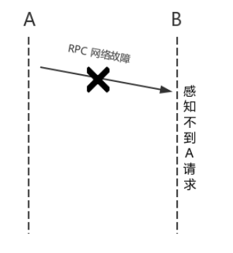
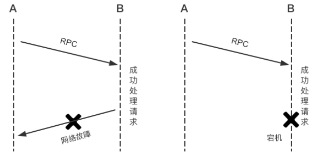

总结： 1. 读取数据状态 2. 超时重试

在传统的单机系统中，我们调用一个函数，这个函数要么返回成功，要么返回失败，其结果是确定的。可以概括为传统的单机系统调用只存在两态（2-state system）：成功和失败。

然而在分布式系统中，由于系统是分布在不同的机器上，系统之间的请求就相对于单机模式来说复杂度较高了。具体的，节点 A 上的系统通过 RPC (Remote Procedure Call) 方式与节点 B 上的系统进行通信，在这个请求结果存在三态(3-state system)：也就是成功、失败和超时，不要小瞧超时这个状态，因为它几乎是所有分布式系统复杂性的根源。

如果节点 A 上的系统收到节点 B 系统返回的消息，并且消息能够表明执行成功，则该 RPC 的结果即为成功状态；
如果节点 A 上的系统收到节点 B 系统返回的消息，并且消息能够表明执行失败，则该 RPC 的结果即为失败状态。
上面两种情况我们都可以非常容易的处理。但是，如果节点 A 上的系统在给 节点 B 上的系统发送完 RPC 调用，并且在一定的时间内没有收到节点 B 上的系统返回消息，本次调用就超时了。此时的 RPC 的结果即为超时状态。
对于超时的请求，我们无法得知该请求是否被节点 B 上的系统成功执行了。这是因为

节点 A 上的系统与节点 B 上的系统进行通信的过程中可能出现了消息丢失，这时候节点 B 上的系统根本就不知道有其他系统与其进行通信。

节点 B 上的系统接到调用请求的消息，并且进行完相关的计算，这时候将结果通知节点 A 上的系统过程中出现消息丢失（如下图的左边部分）或者在将要发送通知消息的时候节点 B 突然宕机（如下图的右边部分），这些都将导致消息发送失败。

分布式系统一般需要区别对待 RPC 的成功、失败和超时三种状态。解决超时可以如下处理

当出现超时时，可以通过发起读取数据的操作以验证 RPC 是否成功。
另一种简单的做法是，设计分布式协议时将执行步骤设计为可重试的，也就是说计算或写操作具有幂等性。例如覆盖写就是一种常见的幂等性操作，因为重复的覆盖写最终的结果都相等。如果使用可重试的设计，当出现失败和超时时，一律重试操作直到成功。这样，即使超时的操作实际上已经成功了，重试操作也不会对正确性造成影响，从而简化了设计。

原文地址 ： https://www.iteblog.com/archives/2340.html

滴滴面试 的设计题目有问到