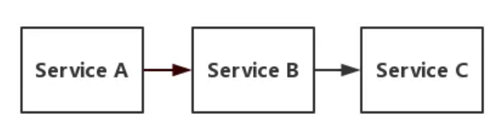
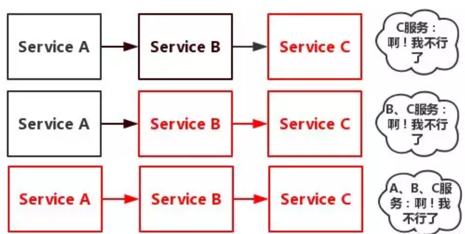

https://mp.weixin.qq.com/s/Ax-zp_WZKrLb04MOuYVfcg

# 服务雪崩

OK，我们从服务雪崩开始讲起！假设存在如下调用链:



而此时，`Service A`的流量波动很大，流量经常会突然性增加！那么在这种情况下，就算`Service A`能扛得住请求，`Service B`和`Service C`未必能扛得住这突发的请求。
此时，如果`Service C`因为抗不住请求，变得不可用。那么`Service B`的请求也会阻塞，慢慢耗尽`Service B`的线程资源，`Service B`就会变得不可用。紧接着，`Service A`也会不可用，这一过程如下图所示:



如上图所示，一个服务失败，导致整条链路的服务都失败的情形，我们称之为`服务雪崩`。

那么，`服务熔断`和`服务降级`就可以视为解决服务雪崩的手段之一。

# 服务熔断

那么，什么是服务熔断呢？
服务熔断：当下游的服务因为某种原因突然变得不可用或响应过慢，上游服务为了`保证自己`整体服务的可用性，`不再继续调用`目标服务，直接返回，快速释放资源。如果目标服务情况好转则`恢复调用`。
需要说明的是熔断其实是一个框架级的处理，那么这套熔断机制的设计，基本上业内用的是断路器模式，如Martin Fowler提供的状态转换图如下所示:

业内目前流行的熔断器很多，例如阿里出的`Sentinel`,以及最多人使用的`Hystrix`
在Hystrix中，对应配置如下

```
//滑动窗口的大小，默认为20
circuitBreaker.requestVolumeThreshold 
//过多长时间，熔断器再次检测是否开启，默认为5000，即5s钟
circuitBreaker.sleepWindowInMilliseconds 
//错误率，默认50%
circuitBreaker.errorThresholdPercentage
```

每当20个请求中，有50%失败时，熔断器就会打开，此时再调用此服务，将会直接返回失败，不再调远程服务。直到5s钟之后，重新检测该触发条件，判断是否把熔断器关闭，或者继续打开。

这些属于框架层级的实现，我们只要实现对应接口就好！

# 服务降级

那么，什么是服务降级呢？
这里有两种场景:

- 当下游的服务因为某种原因`响应过慢`，下游服务主动停掉一些不太重要的业务，释放出服务器资源，增加响应速度！

- 当下游的服务因为某种原因`不可用`，上游主动调用本地的一些降级逻辑，避免卡顿，迅速返回给用户！

其实应该要这么理解:

服务降级有很多种降级方式！如开关降级、限流降级、熔断降级!

服务熔断属于降级方式的一种！

以最简单的代码来说明！上游代码如下:

```java
try{
    //调用下游的helloWorld服务
    xxRpc.helloWorld();
}catch(Exception e){
    //因为熔断，所以调不通
    doSomething();
}
```

哪些业务需要埋点？

(1)简化执行流程
自己梳理出核心业务流程和非核心业务流程。然后在非核心业务流程上加上开关，一旦发现系统扛不住，关掉开关，结束这些次要流程。

(2)关闭次要功能
一个微服务下肯定有很多功能，那自己区分出主要功能和次要功能。然后次要功能加上开关，需要降级的时候，把次要功能关了吧！

(3)降低一致性
假设，你在业务上发现执行流程没法简化了，愁啊！也没啥次要功能可以关了，桑心啊！那只能降低一致性了，即将核心业务流程的同步改异步，将强一致性改最终一致性！

