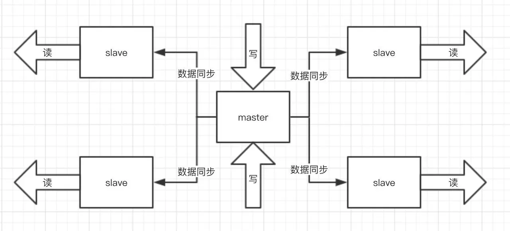
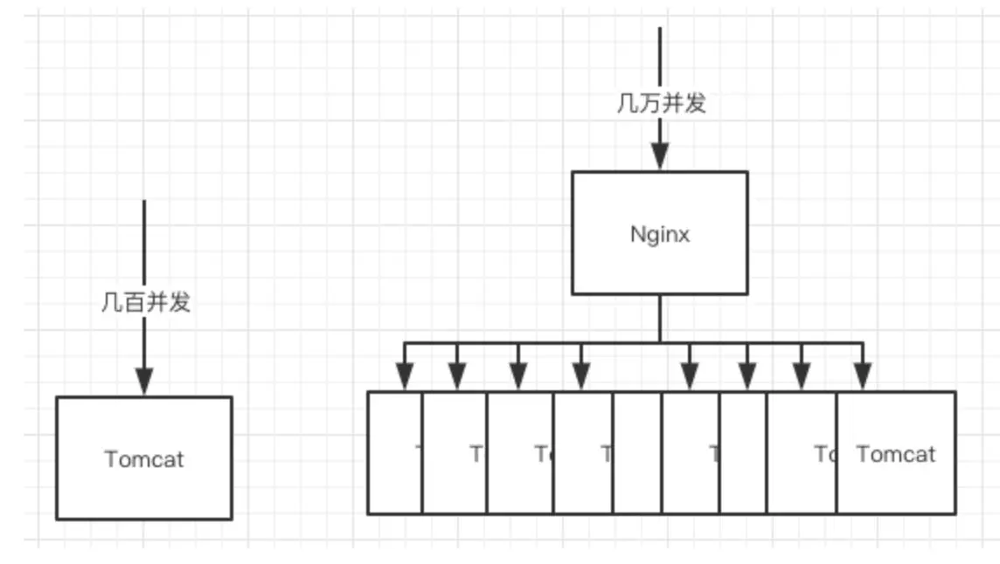
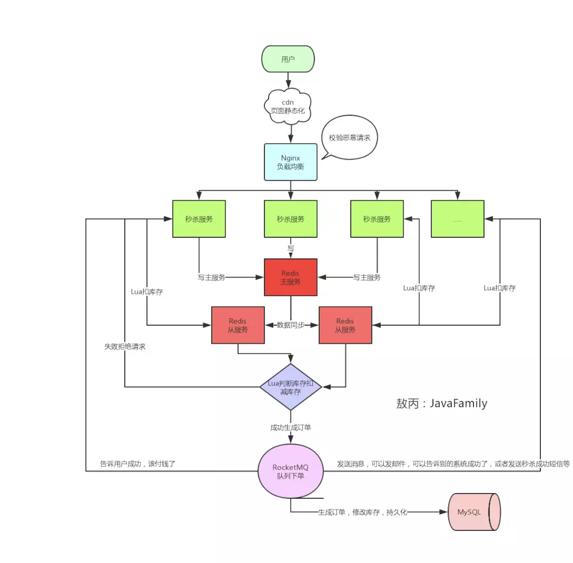

<!-- TOC -->

- [秒杀](#秒杀)
    - [场景](#场景)
    - [问题](#问题)
    - [解决方案](#解决方案)
        - [1. 服务单一职责](#1-服务单一职责)
        - [2. 动态的url](#2-动态的url)
        - [3. Redis集群](#3-redis集群)
        - [4. Nginx 负载均衡](#4-nginx-负载均衡)
        - [5. 资源静态化](#5-资源静态化)
        - [6. 按钮控制](#6-按钮控制)
        - [7. 服务器限流](#7-服务器限流)
        - [8. 库存预热](#8-库存预热)
                - [Lua](#lua)
    - [总结](#总结)
    - [参考](#参考)

<!-- /TOC -->

# 秒杀

## 场景

100 件商品 10万人准备进行秒杀

## 问题

1. 高并发： 时间极短，用户量瞬间增大。 单机 redis QPS ->  5万 -10万
2. 超卖
3. 恶意请求 链接暴露

## 解决方案

### 1. 服务单一职责
就是将秒杀的服务抽取出来，这个我感觉并不好。当然，这样秒杀服务器挂了，对其他业务影响比较小。

### 2. 动态的url

主要是防止恶意用户通过固定url进行提前秒杀商品,办法是在下单页面URL加入由服务器端生成的随机数作为参数，在秒杀开始的时候才能得到。

### 3. Redis集群

部署 redis 集群， master 写（少）， slave 读（多）。主从同步，读写分离，开启持久化，哨兵机制。

### 4. Nginx 负载均衡

Tomcat 支持几百的并发，我们就是用 负载均衡，多部署几台。

`恶意请求`拦截也需要用到它，一般单个用户请求次数太夸张，不像人为的请求在网关那一层就得拦截掉了，不然请求多了他抢不抢得到是一回事，服务器压力上去了，可能占用网络带宽或者把服务器打崩、缓存击穿等等。

### 5. 资源静态化
前后端资源分离，静态页面单独的服务器，配置cdn服务器。

### 6. 按钮控制
按钮置灰，避免 普通用户频繁请求。前端的配合，定时去请求你的后端服务器，获取最新的北京时间，到时间点再给按钮可用状态。除此之外，不能让他频繁点击（当然可以不给服务器发送）

### 7. 服务器限流

秒杀的时候肯定是涉及到后续的订单生成和支付等操作，但是都只是成功的幸运儿才会走到那一步，那一旦100个产品卖光了，return了一个false，前端直接秒杀结束，然后你后端也关闭后续无效请求的介入了。

限流组件： 阿里的Sentinel、Hystrix

### 8. 库存预热

秒杀提前把商品的库存加载到Redis中去，让整个流程都在Redis里面去做，然后等秒杀结束了，再异步的去修改库存就好了。
但是用了Redis就有一个问题了，我们上面说了我们采用`主从`，就是我们会去读取库存然后再判断然后有库存才去减库存，正常情况没问题，但是高并发的情况问题就很大了。

就比如现在库存只剩下1个了，我们高并发嘛，4个服务器一起查询了发现都是还有1个，那大家都觉得是自己抢到了，就都去扣库存，那结果就变成了-3，是的只有一个是真的抢到了，别的都是超卖的

##### Lua

> `Lua` 脚本功能是 Reids在 2.6 版本的最大亮点， 通过内嵌对 Lua 环境的支持， Redis 解决了长久以来不能高效地处理 CAS （check-and-set）命令的缺点， 并且可以通过组合使用多个命令， 轻松实现以前很难实现或者不能高效实现的模式。

Lua脚本是类似`Redis事务`，有一定的原子性，不会被其他命令插队，可以完成一些`Redis事务性的操作`。这点是关键。
知道原理了，我们就写一个脚本把判断库存扣减库存的操作都写在一个脚本丢给Redis去做，那到0了后面的都Return False了是吧，一个失败了你修改一个开关，直接挡住所有的请求，然后再做后面的事情嘛。
 ### 9. 限流&降级&熔断&隔离

这个为啥要做呢，不怕一万就怕万一，万一你真的顶不住了，`限流`，顶不住就挡一部分出去但是不能说不行，`降级`，降级了还是被打挂了，`熔断`，至少不要影响别的系统，`隔离`，你本身就独立的，但是你会调用其他的系统嘛，你快不行了你别拖累兄弟们啊。

## 总结

## 参考
[原文链接](https://juejin.im/post/5dd09f5af265da0be72aacbd)