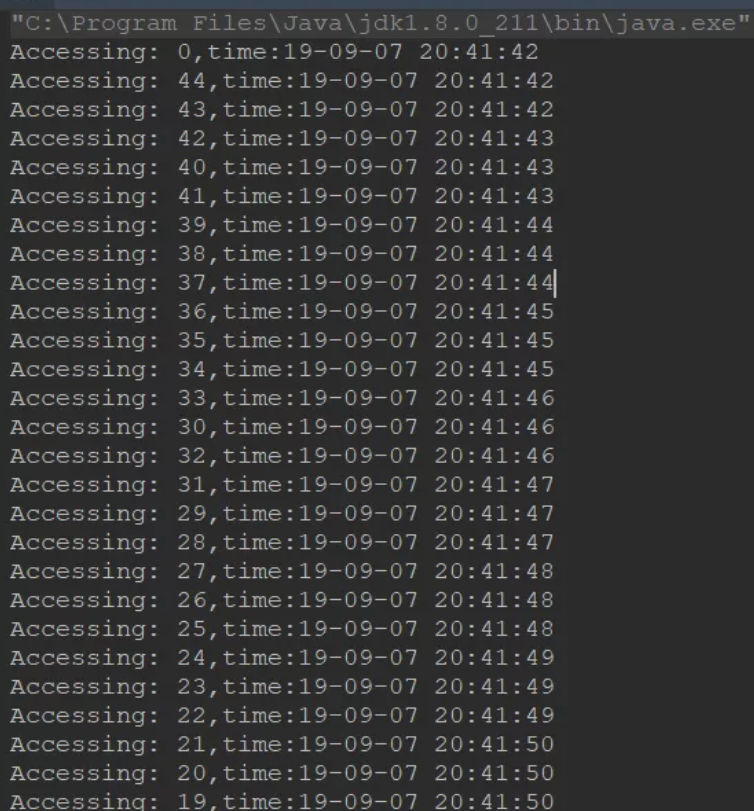

[参考](https://mp.weixin.qq.com/s?__biz=MzI4Njg5MDA5NA==&mid=2247485652&idx=1&sn=dbcc843869bd94228cb71980cd84cc8c&chksm=ebd749d5dca0c0c30c0b11c0535005a9def3c66aa3f5c56d816256122b53f367de5f5ba6a6c3&token=1948873548&lang=zh_CN#rd)

# 限流

限流算法：计数器、滑动窗口、漏桶、令牌桶。
限流方案：Guava的RateLimiter、Alibaba  Sentinel


常见的限流算法有两种。一种是 令牌桶算法，定时的往桶里扔令牌，只有能拿到令牌的才能继续往下进行，这种算法的特点是：可以支持突然的流量（只要令牌桶有令牌即可），还有一种方式是漏桶算法，
这种算法的特点就是所有的流量都是平滑的进入。

# 单机模式限流

## RateLimiter

RateLimiter是Guava的一个限流组件，我这边的系统就有用到这个限流组件，使用起来十分方便。

Semphore 是限制线程的数量。


使用Guava的RateLimiter进行限流控制，主要有两种核心模式，SmoothBursty 和 SmoothWarmingUp。SmoothBursty 每秒钟发放N个令牌，也允许预先借用一定数量的令牌。SmoothWarmingUp，在系统刚刚启动的时候，只会按最低阈值发放令牌，然后逐渐增加到设定的最高阈值。


pom依赖
```xml
<dependency>
    <groupId>com.google.guava</groupId>
    <artifactId>guava</artifactId>
    <version>20.0</version>
</dependency>
```

RateLimiter它是基于`令牌桶算法`的，API非常简单，看以下的Demo:

```java
public static void main(String[] args) {
        //线程池
        ExecutorService exec = Executors.newCachedThreadPool();
        //速率是每秒只有3个许可
        final RateLimiter rateLimiter = RateLimiter.create(3.0);

        for (int i = 0; i < 100; i++) {
            final int no = i;
            Runnable runnable = new Runnable() {
                @Override
                public void run() {
                    try {
                        //获取许可
                        rateLimiter.acquire();
                        System.out.println("Accessing: " + no + ",time:"
                                + new SimpleDateFormat("yy-MM-dd HH:mm:ss").format(new Date()));

                    } catch (Exception e) {
                        e.printStackTrace();
                    }

                }
            };
            //执行线程
            exec.execute(runnable);
        }
        //退出线程池
        exec.shutdown();
    }
```
我们可以从结果看出，每秒只能执行三个：



# 分布式限流 

需要继续完善