# 相关链接
https://www.bilibili.com/video/BV1og4y1q7M4?t=400&p=1  b站地址

## 阿里云镜像加速
https://docs.docker.com/engine/install/centos/  docker for centos
国内换成阿里云的镜像，然后继续install
```shell
 sudo yum install -y yum-utils
 sudo yum-config-manager \
    --add-repo \
    https://mirrors.aliyun.com/docker-ce/linux/centos/docker-ce.repo

sudo systemctl start docker

docker version

# 查看hello-world镜像
docker images # 查看当前镜像

REPOSITORY    TAG       IMAGE ID       CREATED        SIZE
hello-world   latest    d1165f221234   4 months ago   13.3kB
```
阿里云镜像加速

https://cr.console.aliyun.com/cn-hangzhou/instances/mirrors

阿里云 -> 镜像加速器  -> 每个人的不同

```shell
sudo mkdir -p /etc/docker
sudo tee /etc/docker/daemon.json <<-'EOF'
{
  "registry-mirrors": ["https://0jxi0lne.mirror.aliyuncs.com"]
}
EOF
sudo systemctl daemon-reload
sudo systemctl restart docker
```

docker run的流程图
运行命令 -> 判断本机是否有镜像 -> 使用这个镜像
        -> 去dockerhub（阿里镜像） 下载
                -> 找不到这个镜像 -> 返回错误
                -> 下载镜像到本地 
                        -> 运行镜像

# docker
## 底层原理
1. Docker是一个 cs结构系统，Docker的守护进程运行的主机上，通过 Socket从客户端访问
2. Docker server 从 client 接收到指令，就会执行这个指令。

## Docker 相比 VM
1. docker 有着比 vm更少的抽象层
2. docker 用的宿主机的内核，vm需要 guestos（费劲）
新建一个容器的时候，docker不需要 像是vm家在一个操作系统内核，避免引导，docker利用 宿主机的操作系统，速度比较快。
3. 打包带上环境 -> images -> 下载镜像 -> 直接运行即可
4. docker 集装箱 互相隔离 端口冲突 项目是交叉的，隔离是docker的核心思想。
5. 可以把 Linux服务器压榨到极致
6. 2013 docker 开源，2014年4月 docker1.0发布 轻量级 

## DevOps 开发运维
1. 应用更快速的交付和部署，docker 打包镜像发布测试，一键运行
2. 更便捷的升级和扩所容，部署应用就和搭建积木一样。-> 可以整体升级
3. 更简单的系统运维，开发和测试环境是高度一致的。
4. 更高效的资源计算利用
5. docker 是内核级别的虚拟化，可以在一个物理机运行很多容器实例。

## docker 基本组成
1. 


client + server + registry

client -> images -> 容器

images:
docker 相当于一个模板，通过模板创建一个 容器服务，tomcat 镜像 -> run -> tomcat01容器（题容服务器）
通过这个镜像可以创建多个镜像
container:
通过容器技术，可以独立运行一个或者一组应用，通过镜像来创建
启动，停止，删除基本命令
可以理解问一个简易的linux系统
repository:
存放镜像的地方，
仓库分为公有仓库和私有仓库
配置镜像加速

## 常用命令

官方文档： https://docs.docker.com/reference/
仓库地址： https://hub.docker.com/ 


## docker 是怎样工作的
1. docker 是一个cs结构系统，docker的守护进程运行在主机上，
2. 通过守护进程 运行容器
3. 容器内的8080 (eg)   
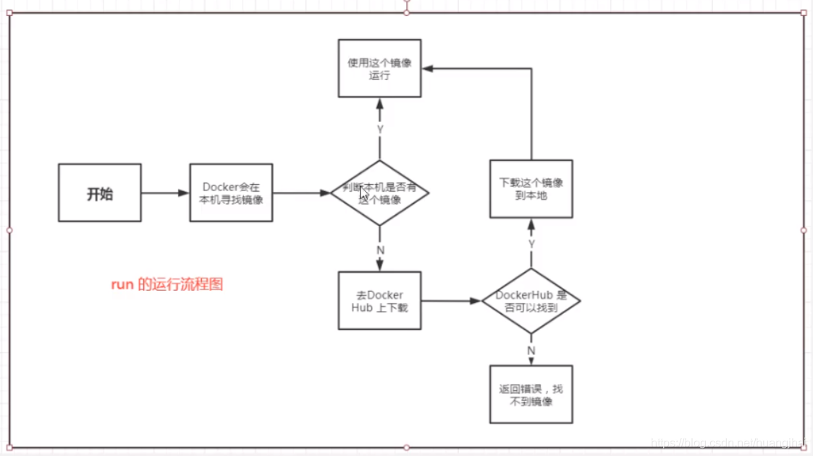

### 帮助命令
docker version  显示版本信息
docker info     更加详细的信息 系统信息 镜像和容器的数量
docker  --help 
帮助文档地址：https://docs.docker.com/reference/

### 镜像命令
1. docker images 查看本地本机上看
https://docs.docker.com/engine/reference/commandline/images/

2. docker search 搜索镜像 -> 

```shell
[root@aliyun soft]# docker search mysql
NAME                              DESCRIPTION                                     STARS     OFFICIAL   AUTOMATED
mysql                             MySQL is a widely used, open-source relation…   11168     [OK]
mariadb                           MariaDB Server is a high performing open sou…   4238      [OK]
```
https://docs.docker.com/engine/reference/commandline/search/

### docker pull

docker pull mysql[:tag] 下载镜像
docker pull mysql:5.7 下载指定版本

分层下载，只会下载差异部分

联合文件系统 -> 共用文件

Docker 删除镜像  docker rmi -f 镜像ID或者镜像名称

i = images 通过imageid 删除

删除容器 docker rm 

docker rmi -f d1165f221234 d1165f221235 空格分割

删除所有镜像
docker rmi -f $(docker images -aq)


### 容器命令

1. 下载一个 centos 进行学习
docker pull centos
查看是否下载完毕 docker images centos
2. 新建容器并启动
docker run [可选参数] imageId 参数说明

-- name=“Name”   tomcat01 02 用来区分容器
-d 后台方式运行 -> nohup
-it  使用交互方式进行，进入容器查看内容
-p  指定容器端口 -p 8080:8080
    -p 主机端口:容器端口（常用）
    -p 容器端口
    容器端口
-P 随机指定端口 

启动并进入容器
[root@aliyun ~]# docker run -it centos /bin/bash

exit 退出容器 -> 会停止

control + P + Q 容器不停止 退出 
配合 docker ps 使用 
```bash
# zhenguo.hou @ C026M in ~ [17:53:16] C:127
$ docker run -it centos /bin/bash
[root@8d4f22eb5ad4 /]# %

# zhenguo.hou @ C02D6M in ~ [17:53:49]
$ docker ps
CONTAINER ID   IMAGE     COMMAND       CREATED          STATUS          PORTS     NAMES
8d4f22eb5ad4   centos    "/bin/bash"   32 seconds ago   Up 32 seconds             fervent_wilbur
```

列出所有的运行的容器
docker ps -a   -a 是历史运行过的参数，
docker ps 当前在运行的
docker ps -n=2 显示最近创建的2个容器
docker ps -a -n2
docker ps -q 只显示编号

启动和停止容器的操作
1. docker start 容器ID    docker start d15822c4c59c
2. docker restart 容器ID
3. docker stop 容器ID     docker stop d15822c4c59c
4. docker kill  容器ID 

常用命令
1.  后台启动 docker run -d centos

```bash
# zhenguo.hou @ C02FRH64MD6M in ~ [18:00:03] C:127
$ docker run -d centos
360f4348bc83197bd5c012c0e5f10aa1a16a72b1b4bd64ebd2d360c955f12f58

# zhenguo.hou @ C02FRH64MD6M in ~ [18:00:12]
$ docker ps
CONTAINER ID   IMAGE     COMMAND   CREATED   STATUS    PORTS     NAMES 
```

docker ps 发现 centos 停止了，docker 容器使用后台运行，就必须要有
一个前台进程，容器发现没有应用，就会自动停止。 


查看日志
1. 
docker run -it centos ./bin/bash -c "while true;do echo houzhenguo;sleep 1;done"
2. docker logs -t -f --tail 10 817e328df432

top 

docker top 817e328df432

查看镜像元数据
docker inspect --help
docker inspect 817e328df432

## 进入容器
进入当前正在运行的容器
我们容器通常使用后台运行，需要进入容器，修改一些配置 
docker exec -it 容器ID 
 docker exec -t 817e328df432 /bin/bash
进入容器后开启一个新的终端，可以在里面操作

docker attach 容器ID

进入融资正在执行的终端，不会启动新的进程

docker attach 817e328df432

从容器copy 文件到主机
1. docker cp 容器ID:容器内路径 目的主机路径
docker cp e6765f4b6869:/home/test.java ./
容器可以没有在运行，需要进入dockern内部
未来可以使用卷技术，可以实现和主机的打通


docker exec -ti d5d039df430b redis-cli

docker run -d --name redis01 -p 6379:6379 redis

## 练习
docker 安装ng
docker search nginx
docker run -d --name nginx01 -p:3344:80 nginx
curl localhost:3344
 外部端口：容器内部端口  映射端口暴露

 进入 docker exec -it 3bfe7527b094 /bin/bash

 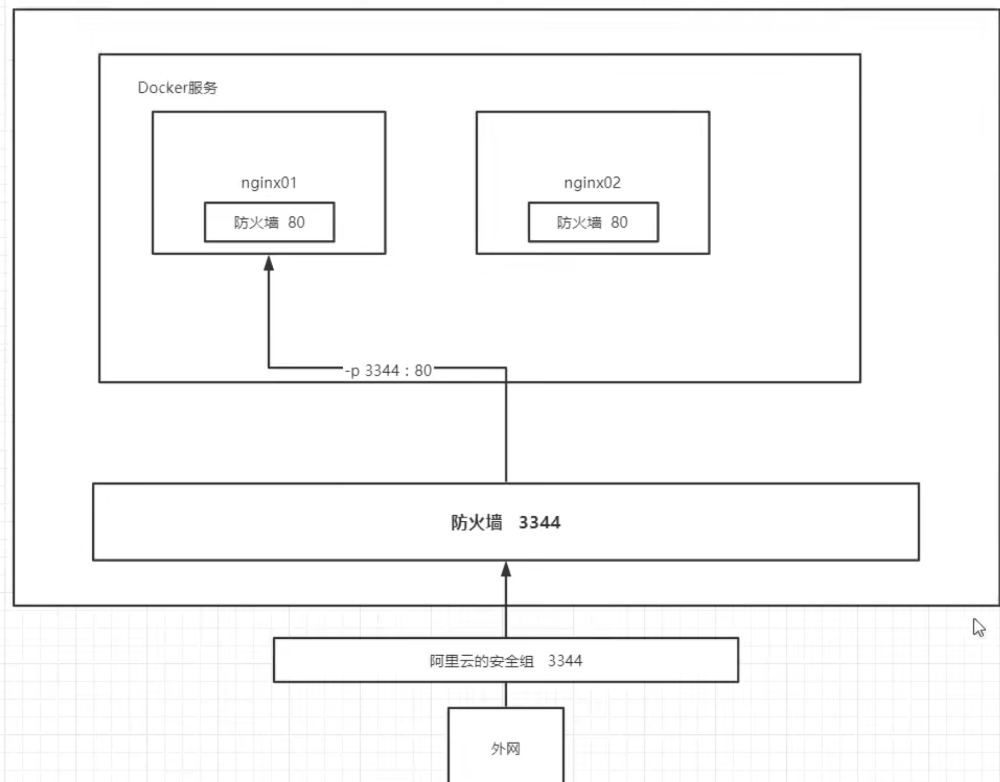


tomcat 

docker run -d --name tomcat01 -p:8089:8080 tomcat

docker run -d --name tomcat06 -p 8091:8080 -v /Users/zhenguo.hou/test/tingfeng:/usr/local/tomcat/webapps/ tomcat

docker run -d --name tomcat01 -p 8080:8080 -v /home/houzhenguo/book/tingfeng:/usr/local/tomcat/webapps/ tomcat

apt-get update
apt-get install vim

测试访问没有问题

进入容器 docker exec -it tomcat01 /bin/bash

发现阉割版 tomcat,保证最小可运行环境

cp -r webapps.dist/* ./webapps 就可以访问了

## 部署es + kibana
1. es 暴露端口多
2. es十分耗内存
3. es 的数据一般需要放置到安全目录，挂载

步骤 
1. docker pull elasticsearch:7.6.2
2. docker run -d  --name elasticsearch -p 9200:9200 -p 9300:9300 -e "discovery.type=single-node" elasticsearch:7.6.2
3. es十分耗费内存，

docker stats 查看 docker 状态

docker status 容器ID


curl localhost:9200


## portainer

1. docker 图形化界面管理工具，提供一个后台面板 提供给我们操作

docker run -d -p 8088:9000 --restart=always -v /var/run/docker.sock:/var/run/docker.sock --privileged=true portainer/portainer

http://localhost:8088/#/init/admin


### 镜像是什么
镜像是一种轻量级，可执行的独立软件包，用来打包软件运行环境和基于运行环境开发的软件，包含运行某个软件所有的内容
包括 代码 运行时，库，环境变量和配置文件。

如何得到镜像
1. from origin rep
2. copy
3. 制作镜像 dockerFile

## docker 镜像加载原理
1. unionFS 联合文件系统
下载的时候看到的一层一层的就是 unionFS.分层，轻量级且高性能的文件系统，支持对文件系统的修改作为一次提交来一层层的叠加，
同时可以将不同目录挂载到同一饿虚拟文件系统下。
UFS是docker 镜像的基础。
bootfs 系统启动引导加载，主要包含 bootloader 和kernel.bootloader 主要是引导加载kernel.linux 刚启动时候，会加载 bootfs
文件系统，在docker镜像最底层就是 bootfs。当boot 加载完成之后就在整个内核的内存中了，此时内存多使用权已由bootfs 交给内核，此时系统
也会卸载bootfs
rootfs，在bootfs 之上，包含的就是典型的Linux系统中的 /dev/ /proc/ /bin /etc 等标准目录和文件，rootfs 就是各种不同的操作系统发行版。
比如 ubuntu,centos

对于一个精简OS,rootfs很小，只包含最基本的命令，工具和程序库就可以了，底层还是使用的是主机的内核，自己只需要 提供rootfs就可以了。

## 理解
1. 所有的docker 镜像都起始于一个基础镜像层，当进行修改或增加新的内容时，就会在当前的镜像层之上，创建新的镜像层。
eg. 加入基于 ubuntu linux 创建一个新的镜像，这是新镜像的第一层，如果在该镜像中添加py包，就会添加第二层，如果继续添加一个安全补丁，
就会创建第三个镜像层。

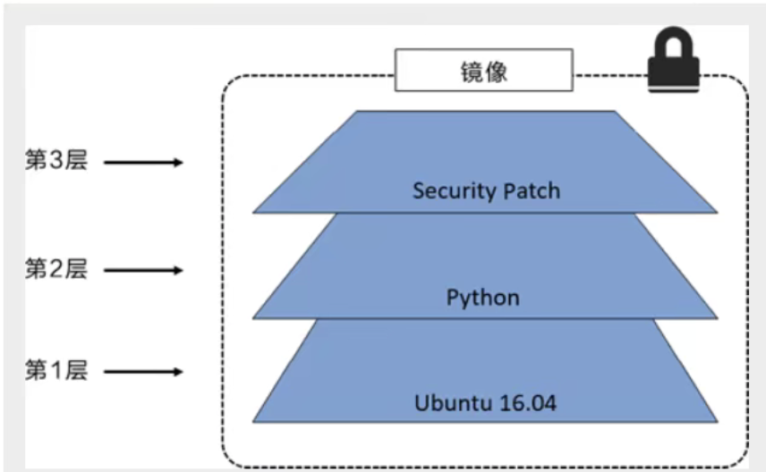
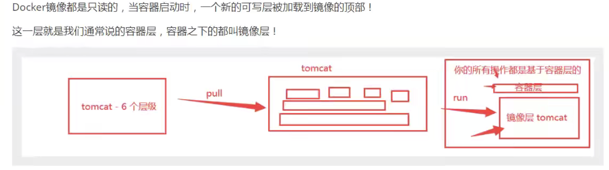


## commit 镜像
docker commit 提交容器成为一个新的副本。
docker commit -m="提交的描述信息" -a="作者" 容器id 镜像名字 

### 实战
docker run -it -p 8089:8080 tomcat    # 启动一个默认的tomcat
docker exec -it ccc6e0582540 /bin/bash # 进入容器
cp -r webapps.dist/* ./webapps # copy到webapps才能访问
docker commit -a="zhenguo" -m="add webapps" ccc6e0582540 tomcat02:1.0  # 提交

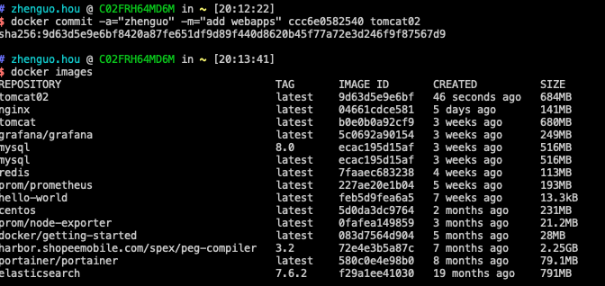
之后就可以直接使用修改过的镜像。

tomcat + 我们的一些操作 =》打包成一个新的镜像
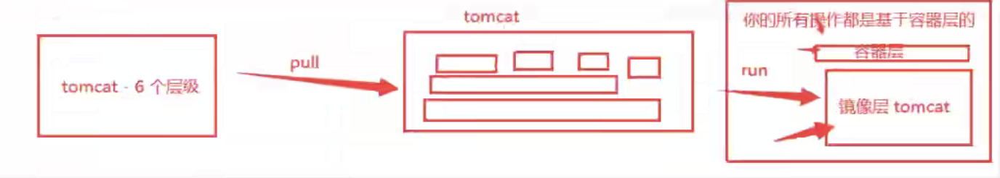


# 容器数据卷
1. 如果数据在 容器中，那我们一删除数据就丢失了。
2. 需要mysql数据可以存储在本地或者其他地方。
容器之间可以有一个数据共享的技术。
在Docker 容器中产生的数据同步到本地的。
将容器内的目录挂在到Linux上面。

总结：容器的持久化和同步操作，容器间也是可以数据共享的。

## 使用数据卷
1. 直接使用命令挂载 -v
docker run -it -v 主机目录,容器目录  -p 主机端口:容器内端口

docker run -it -v /Users/zhenguo.hou/test:/home centos /bin/bash

docker inspect d8ea8425d937 查看容器的详细信息
```json
      "Mounts": [
            {
                "Type": "bind",
                "Source": "/Users/zhenguo.hou/test", # 主机
                "Destination": "/home", # docker 容器内
                "Mode": "",
                "RW": true,
                "Propagation": "rprivate"
            }
        ]
```
容器内部和外部进行了同步。

$ docker start d8ea8425d937
d8ea8425d937

# zhengM in /home [15:59:06]
$ docker attach d8ea8425d937

容器关闭，在 主机上做 更新操作，只要容器还在，（虽然说容器关闭）
但还是可以进行数据的同步。
## 实战mysql
1. 数据挂载

docker run -d -p 3310:3306 -v /Users/zhenguo.hou/test/mysql/conf:/etc/mysql/conf.d -v /Users/zhenguo.hou/test/mysql/data:/var/lib/mysql -e MYSQL_ROOT_PASSWORD=root --name mysql01 mysql
-d 后台运行
-p 端口映射
-v 数据卷挂载 可以多个
-e 环境配置
-name 容器名字

启动成功之后，在本地使用客户端连接测试。

使用client 创建一个db,发现在 /mysql/data  下也进行了创建

## 匿名挂载
-v 容器内路径(不指定主机)
docker run -d -P --name nginx02 -v /etc/nginx nginx
docker volume list
查看所有的 volume 情况
-P是随机映射端口
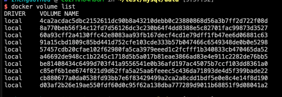
上面的name 就是匿名的情况。我们在-v只写了容器内的路径，没有写容器外的路径。


## 具名挂在
指定一个名字
docker run -d -P --name nginx02 -v juming-nginx:/etc/nginx nginx
juming 只是个名字，没有目录(注意 )
通过 -v 卷名:容器内路径

查看一下卷的位置 
docker volume inspect  juming-nginx

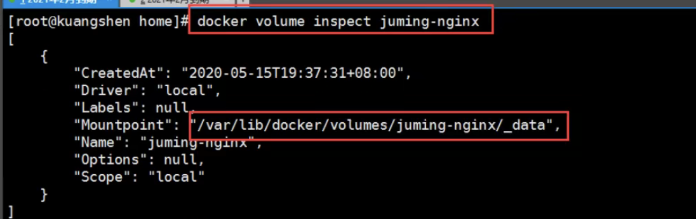
所有的docker 容器内的卷，没有指定目录的情况下，都是在 /var/lib/docker/volumes/
我们通过具名挂在可以方便的找到我们的一个卷，大多数情况下使用 具名挂在，不建议使用匿名挂载
## 如何确定匿名挂载还是具名还是指定
-v 容器内路径 匿名挂在
-v 卷名:容器内路径 具名挂载
-v /宿主机路径:容器内路径   指定路径挂载

## 拓展
通过 -v 容器内路径， ro,rw 改变读写权限
ro readonly 只能通过宿主机操作，容器内部不能操作。
rw 可读可写 
一旦设定这个，容器对于挂载出来的内容就有限定了。

# dockerFile
1. dockerfile就是用来构建docker镜像的构建文件。
通过一个脚本可以生成镜像，镜像是一层一层，脚本就是一个一个的命令，每个命令都是一层。
## 自己创建docker file
自己编一个dockerFile
指令都是大写的，这里的每个命令就是镜像的一层。
```

FROM centos

VOLUME ["/volume01","/volume02"]

CMD echo "-------end-----"
CMD /bin/bash
```
docker build -f dockerFile1 -t zhenguo/centos .
注意最后的点
```
[root@aliyun dockertest]# docker build -f dockerFile01 -t zhenguo/centos .
Sending build context to Docker daemon  2.048kB
Step 1/4 : FROM centos
 ---> 300e315adb2f
Step 2/4 : VOLUME ["volume01","volume02"]

 ---> Running in 8ccde9148ae5
Removing intermediate container 8ccde9148ae5
 ---> 5225d42124a5
Step 3/4 : CMD echo "------end-----"
 ---> Running in 13b1177bad0e
Removing intermediate container 13b1177bad0e
 ---> a318052ed77f
Step 4/4 : CMD echo /bin/bash
 ---> Running in 11ba6109fa21
Removing intermediate container 11ba6109fa21
 ---> 7e641547fa09
Successfully built 7e641547fa09
Successfully tagged zhenguo/centos:latest
```


使用docker images 可以看到刚才的 zhenguo/centos

启动一下自己的容器

docker run -it a18729da0b42 /bin/bash

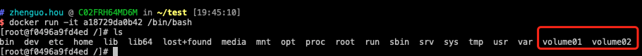
在生成镜像的时候自动挂载了。这个数据卷一定和外面有同步的目录。
相当于匿名挂载。

在容器外的目录
```
"Mounts": [
            {
                "Type": "volume",
                "Name": "aa83eb792d493c1b165d25d41ffa38af5b2ab699b917cef03a7a4894898f4c00",
                "Source": "/var/lib/docker/volumes/aa83eb792d493c1b165d25d41ffa38af5b2ab699b917cef03a7a4894898f4c00/_data",
                "Destination": "/volume01",
                "Driver": "local",
                "Mode": "",
                "RW": true,
                "Propagation": ""
            },
            {
                "Type": "volume",
                "Name": "01312ceb7fa8bb9a134c01a15aa61d862dd8c382b0132e1031bbeee24fdc5445",
                "Source": "/var/lib/docker/volumes/01312ceb7fa8bb9a134c01a15aa61d862dd8c382b0132e1031bbeee24fdc5445/_data",
                "Destination": "/volume02",
                "Driver": "local",
                "Mode": "",
                "RW": true,
                "Propagation": ""
            }
        ]
```
注意以下是 阿里云 centos
```
[root@aliyun ~]# cd /var/lib/docker/volumes/156289ecdd62f06687909cd10afa1cd0099b049fb0c70069c56cbaec4dc54ccb/
[root@aliyun 156289ecdd62f06687909cd10afa1cd0099b049fb0c70069c56cbaec4dc54ccb]# ls
_data
[root@aliyun 156289ecdd62f06687909cd10afa1cd0099b049fb0c70069c56cbaec4dc54ccb]# cd _data/
[root@aliyun _data]# ls
[root@aliyun _data]#
```

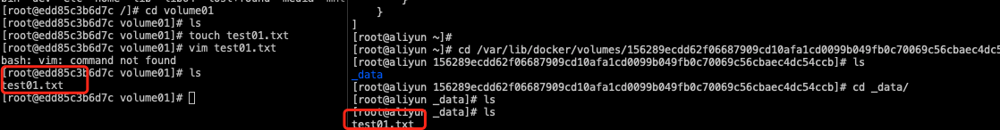

## 数据卷容器
1. 两个mysql 同步数据

通过 --volumes-from 可以实现容器间的数据共享。
可以做数据备份。软连接。

容器之间可以做配置信息的传递，

# DockerFile
1. 编写dockerFile 文件
2. docker build 构建一个镜像
3. docker run 运行镜像
4. docker push 发布镜像

https://github.com/CentOS/sig-cloud-instance-images/blob/da050e2fc6c28d8d72d8bf78c49537247b5ddf76/docker/Dockerfile

```
FROM scratch
ADD centos-6-docker.tar.xz /

LABEL org.label-schema.schema-version="1.0" \
    org.label-schema.name="CentOS Base Image" \
    org.label-schema.vendor="CentOS" \
    org.label-schema.license="GPLv2" \
    org.label-schema.build-date="20180804"


CMD ["/bin/bash"]
```
很多官方的镜像都是基础包，很多功能都没有，我们需要搭建自己的镜像。

## dockerFile 构建过程
基础知识：
1. 每个保留关键字(指令)都必须是大写字母
2. 指令从上到下
3. # 表示注释
4. 每个指令都会创建一个镜像层

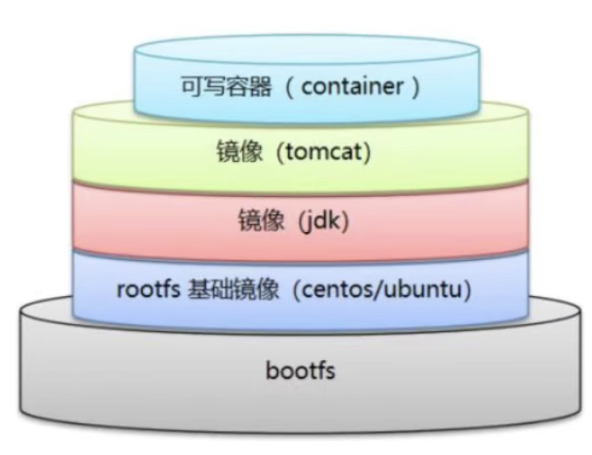

dockerfile 是面向开发的，我们之后要发布项目，做镜像，就需要编写dockerFile 文件，这个文件十分简单。
Docker镜像逐渐成为企业交付的标准。

DockerFile: 构建文件，定义了一切步骤，源代码
DockerImages:通过 dockerFile 构建生成的一个镜像，这个是最终要发布和运行的产品
比如原来是个jar，war. 
Docker容器:容器是镜像运行起来提供服务器。

### 命令
1. FROM 指定基础镜像 centos,等
2. MAINTAINER 维护者信息 姓名 和邮箱
3. RUN 镜像构建的时刻需要运行的命令
4. ADD 步骤，tomcat镜像，这个tomcat压缩包，添加内容
5. WORKDIR 镜像的工作目录
6. VOLUME 设置挂载卷
7. EXPOSE 对外暴露端口
8. CMD 指定这个容器启动的时候要运行的命令，CMD echo,只有最后一个会生效
9. ENTRYPOINT 启动时候运行的命令，可以追加命令
10. ONBUILD 当构建一个被继承的DockerFile的时候，就会运行ONBUILD ，触发指令。
11. COPY 类似add.将我们的文件copy到镜像中。
12. ENV 构建的时候设置环境变量


put /Users/zhenguo.hou/test/tingfeng/doc.tar.gz

构建自己的dockerFile
```
FROM centos
MAINTAINER zhenguo.hou@qq.com

ENV MYPATH /usr/local
WORKDIR $MYPATH

RUN yum -y install vim
RUN yum -y install net-tools

EXPOSE 80

CMD echo $MYPATH
CMD echo "-------end-----"
CMD /bin/bash
```
通过文件构建镜像。

docker build -f mydockerfile-centos -t mycentos:0.1 .
注意最后的点。

测试运行

docker run -it mycentos:0.1 

## 测试CMD 和 ENTRYPOINT的却别
测试cmd
docker file
```
FROM centos
CMD ["ls","-a"]
```

```
FROM centos
ENTRYPOINT ["ls","-a"]
```
构建镜像文件
docker build -f cmdDockerFile -t cmdtest .
run 运行  
docker run cmdtest

## 实战 tomcat
1. 准备镜像文件 tomcat 压缩包 jdk压缩包
2. 编写docker file 文件


# Docker 网络
理解Docker0

1. 先移除之前的,晴空
docker rm -f $(docker ps -aq)
docker rmi -f $(docker images -a -q)

2. ip addr
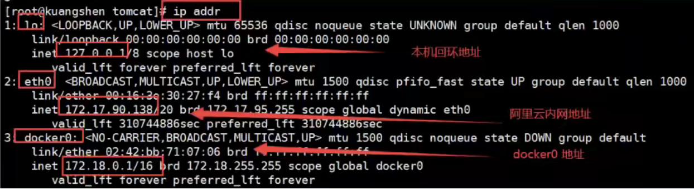
三个网络

docker 是如何处理容器网络访问的？

3. 实验一下 tomcat 
docker run -d -P --name tomcat01 tomcat
查看容器内部的网络地址： ip addr

docker exec -it tomcat01 ip addr

执行如果报错，可以进入容器
docker exec -it tomcat01 /bin/bash
apt update && apt install -y iproute2

查看ip 
```
[root@aliyun ~]# docker exec -it tomcat01 ip addr
1: lo: <LOOPBACK,UP,LOWER_UP> mtu 65536 qdisc noqueue state UNKNOWN group default qlen 1000
    link/loopback 00:00:00:00:00:00 brd 00:00:00:00:00:00
    inet 127.0.0.1/8 scope host lo
       valid_lft forever preferred_lft forever
14: eth0@if15: <BROADCAST,MULTICAST,UP,LOWER_UP> mtu 1500 qdisc noqueue state UP group default
    link/ether 02:42:ac:12:00:02 brd ff:ff:ff:ff:ff:ff link-netnsid 0
    inet 172.18.0.2/16 brd 172.18.255.255 scope global eth0
       valid_lft forever preferred_lft forever
```
我们可以看到 docker 容器的ip 地址是 172.18.0.2
我们可以使用Linux主机进行ping ,看是否能够ping通
```
[root@aliyun ~]# ping 172.18.0.2
PING 172.18.0.2 (172.18.0.2) 56(84) bytes of data.
64 bytes from 172.18.0.2: icmp_seq=1 ttl=64 time=0.064 ms
64 bytes from 172.18.0.2: icmp_seq=2 ttl=64 time=0.058 ms
```
发现是可以ping 通的
我们每启动一个 docker 容器，docker就会给docker容器分配一个ip
我们只要安装了docker,就会有个网卡docker0，使用桥接模式,使用的技术是
veth-pair 技术。
再次测试 ip addr
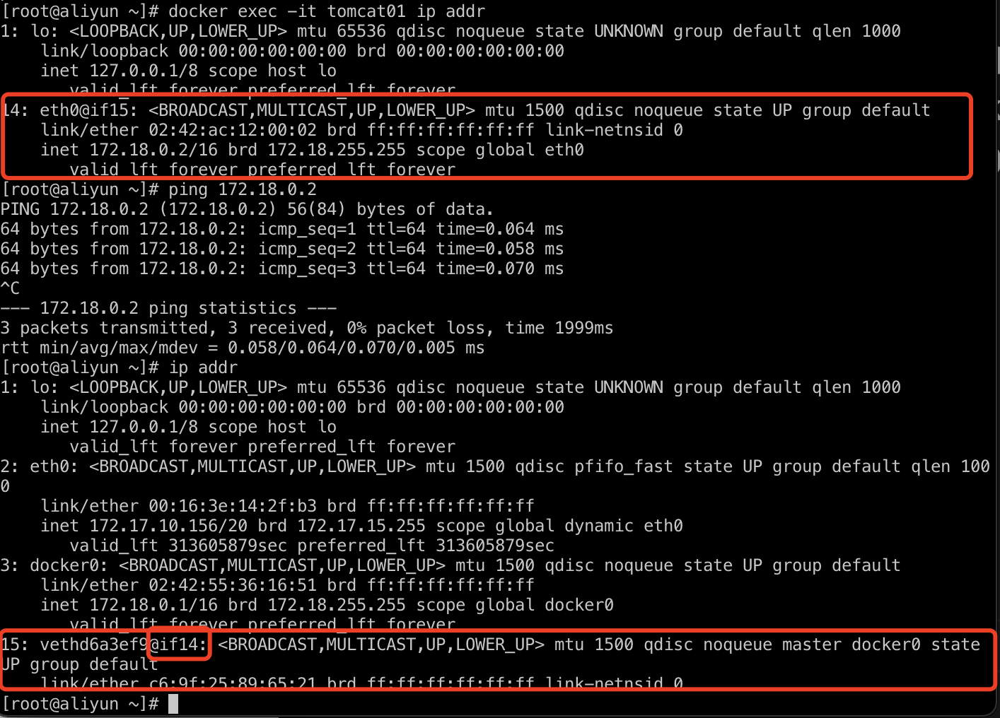
再启动一个tomcat

docker run -d -P --name tomcat02 tomcat

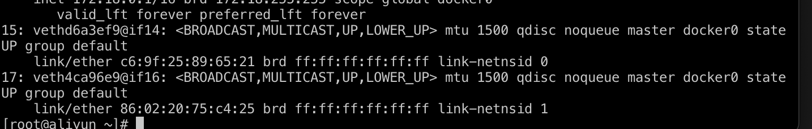
发现又多了一对网卡
14 -> 15 在容器里面
15: vethd6a3ef9@if14 
15->14 在容器外面
我们进入容器看一下。
docker exec -it tomcat02 ip addr

出现的网卡是一对一对的。

使用的是veth-pair技术，就是一对虚拟设备接口
正因为有了这个技术，我们使用这个技术充当桥梁
连接各种网络虚拟设备。

我们接下来测试 tomcat01 和tomcat02是否可以ping通

docker exec -it tomcat02 ping 172.18.0.2

容器和容器之间是可以互相ping通的。

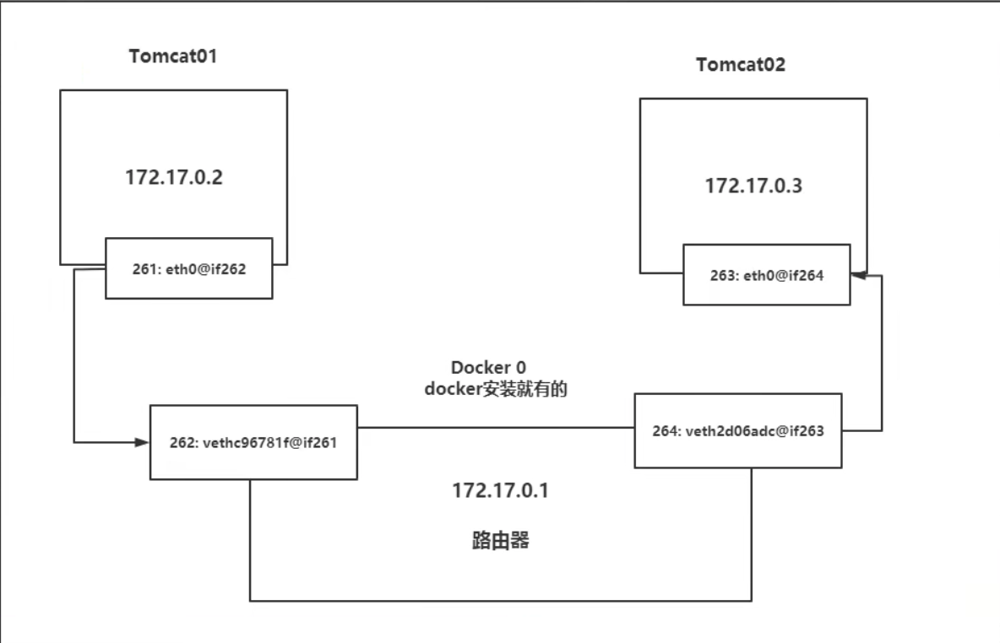

结论： tomcat01 和tomcat02是共用的一个路由器，docker0
所有容器不指定网络的情况下，都是docker0路由的，docker会给我们的
容器分配一个默认的可用ip
0-255 
255.255.0.1/16 
00000000.00000000.  00000000.00000000
255.255.0.0 
一共有 255 * 255 -0.0 -255 大概 65535

小结：
docker使用的Linux的桥接。宿主机是docker容器的网桥，docker0

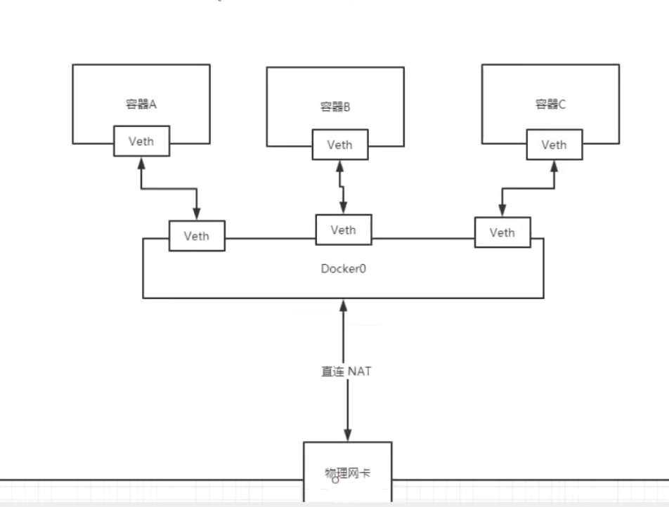

docker 中所有的网络接口都是虚拟的，虚拟的转发效率高。
只要容器删除，对应的网桥一对儿就没了。

思考：每次启动容器，ip对可能就会发生变化，对于互相通信的容器来说，
如何保证项目不重启，可以直接通信？