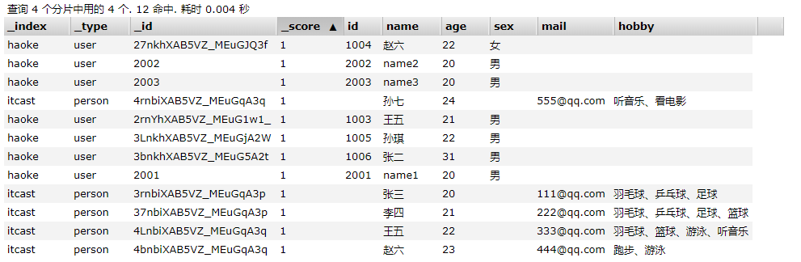

参考链接： https://juejin.im/post/5e264b026fb9a03003008435#comment

黑马： https://www.bilibili.com/video/av66600360

完整视频： http://yun.itheima.com/course/571.html?2002sxkqq

中文官网 https://www.elastic.co/cn/elasticsearch

Elasticsearch is a real-time, distributed storage, search, and analytics engine

ES 是一个近实时的，分布式的存储，搜索，分析引擎。是一个基于 Lucene的搜索服务器。

## 背景

相对数据库 ，ES的强大之处就是可以 `模糊查询`。

```sql
// 传统写法
select * from user where name like '%李四%' 
```
这样就可以 把 李四 相关的内容全部内容查询出来了，但是 这种查询的方式 是不走 `索引`的，只要你的数据库的量很大，
不走索引意味着你的查询时 秒级别的。

即便 你从数据库 根据 `模糊匹配` 查出相应的记录了，通常会返回`大量的数据`给你。还有一个问题就是用户的输入
可能没有那么准确。

## 特点

ES 是专门做 搜索的。

- ES 对模糊搜索非常快
- ES 搜索到的数据 可以 根据`评分`过滤掉大部分，只要返回评分高的给用户就可以了。
- 不是特别准确的关键字 也能搜索出相关的结果（能匹配有相关性的记录）

## 数据结构
1. 我们得知道 ES为什么可以实现快速的 `模糊匹配/相关性查询` 实际上是你写入数据到 ES的时候会进行`分词`。
2. 根据`完成的条件` 查找一条记录叫做 `正向索引`
3. 根据`某个词`(不完整的条件)再查找对应的记录，叫做 倒排索引。

那么 ES 是怎么切分 这些词的呢。ES内置了一些分词器

- Standard Analyzer 。按词切分，将词小写
- Simple Analyzer 按非字母过滤（符号被过滤掉） 将词小写
- WhitespaceAnalyzer 按照空格切分，不转小写

---

# ES笔记

ELK: Elasticsearch(存储检索) + logstash（数据分析） + kibana(可视化展现)

RESTful web接口 Java开发，企业级的搜索引擎。
---
## 环境搭建
1. ES tar的下载，部署 ，启动。
2. es-head的安装

```
# 解压 es不能使用 root账户运行
tar -xvzf elasticsearch-6.5.4.tar.gz  解压 

#修改配置文件
vim conf/elasticsearch.yml
network.host: 0.0.0.0 #设置ip地址，任意网络均可访问

#说明：在Elasticsearch中如果，network.host不是localhost或者127.0.0.1的话，就会认为是生产环境，
会对环境的要求比较高，我们的测试环境不一定能够满足，一般情况下需要修改2处配置，如下：
#1：修改jvm启动参数
vim conf/jvm.options
-Xms128m #根据自己机器情况修改
-Xmx128m
#2：一个进程在VMAs(虚拟内存区域)创建内存映射最大数量(这个是使用root权限)
vim /etc/sysctl.conf
vm.max_map_count=655360
sysctl -p #配置生效

#启动ES服务
su houzhenguo ## 切换回普通用户
cd bin
./elasticsearch 或 ./elasticsearch -d #后台启动

```

在浏览器中输入 iP:9200 看到如下反馈就证明安装成功了。

```json
{
  "name" : "Jd7owhv",
  "cluster_name" : "elasticsearch",
  "cluster_uuid" : "5EoC7HC_SAWXDaTp55ZCYg",
  "version" : {
    "number" : "6.5.4",
    "build_flavor" : "default",
    "build_type" : "tar",
    "build_hash" : "d2ef93d",
    "build_date" : "2018-12-17T21:17:40.758843Z",
    "build_snapshot" : false,
    "lucene_version" : "7.5.0",
    "minimum_wire_compatibility_version" : "5.6.0",
    "minimum_index_compatibility_version" : "5.0.0"
  },
  "tagline" : "You Know, for Search"
}
```

## 环境安装常见问题

```
#启动出错，环境：Centos6
[1]: max file descriptors [4096] for elasticsearch process is too low, increase to at
least [65536]
#解决：切换到root用户，编辑limits.conf 添加类似如下内容
vi /etc/security/limits.conf

添加如下内容:
* soft nofile 65536
* hard nofile 131072
* soft nproc 2048
* hard nproc 4096

[2]: max number of threads [1024] for user [elsearch] is too low, increase to at least
[4096]
#解决：切换到root用户，进入limits.d目录下修改配置文件。
vi /etc/security/limits.d/90-nproc.conf
#修改如下内容：
* soft nproc 1024
#修改为
* soft nproc 4096
[3]: system call filters failed to install; check the logs and fix your configuration
or disable system call filters at your own risk
#解决：Centos6不支持SecComp，而ES5.2.0默认bootstrap.system_call_filter为true
vim config/elasticsearch.yml
添加：
bootstrap.system_call_filter: false
```

## elasticsearch-head 

ES-head 是为 ES提供的界面管理工具，仅仅提供后台服务。

Google 浏览器插件的安装方式地址：https://chrome.google.com/webstore/detail/elasticsearch-head/ffmkiejjmecolpfloofpjologoblkegm

当然 与此同时可以采用 docker，或者 nodejs安装。

由于前后端分离开发，所以会存在跨域问题，需要在服务端做CORS的配置，如下：
vim elasticsearch.yml 新加
```yml
http.cors.enabled: true
http.cors.allow-origin: "*
```

当出现这个界面的时候，意味着成功了。


---


## 基本概念
1. ES 可以有不同的结构
2. 映射： 所有文档写进索引之前 会先进行分析，如何将输入的文本分割为词条，哪些词条又会被过滤，这种行为叫做映射，一般由用户自己定义规则。

## RESTful API (重要)

### 1. 创建非结构化的索引

在Lucene中，创建索引是需要定义字段名称以及字段的类型的，在Elasticsearch中提供了非结构化的索引，就是不
需要创建索引结构，即可写入数据到索引中，实际上在Elasticsearch底层会进行结构化操作，此操作对用户是透明
的。
创建空索引：

```json
PUT /haoke

{
"settings": {
"index": {
"number_of_shards": "2", #分片数
"number_of_replicas": "0" #副本数
}
}
} #
删除索引
DELETE /haoke
{
"acknowledged": true
}

```


### 2. 插入数据

> URL规则： POST  /{索引}/{类型}/{id}

```json
POST /haoke/user/10001
# 数据
{
"id":1001,
"name":"张三",
"age":20,
"sex":"男"
}
# Response
{
    "_index": "haoke",
    "_type": "user",
    "_id": "1001",
    "_version": 1,
    "result": "created",
    "_shards": {
        "total": 1,
        "successful": 1,
        "failed": 0
    },
    "_seq_no": 0,
    "_primary_term": 1
}
```
说明：非结构化的索引，不需要事先创建，直接插入数据默认创建索引。


不指定id插入数据：

```json
POST /haoke/user/

{
"id":1003,
"name":"王五",
"age":21,
"sex":"男"
}
```


自动生成id。

### 3. 更新数据

```json
PUT /haoke/user/1001
{
"id":1001,
"name":"张三",
"age":21,
"sex":"女"
}

# Response
{
    "_index": "haoke",
    "_type": "user",
    "_id": "1001",
    "_version": 3,  -- 返回值的版本更新了
    "result": "updated",
    "_shards": {
        "total": 1,
        "successful": 1,
        "failed": 0
    },
    "_seq_no": 3,
    "_primary_term": 1
}
```
更新结果：


上面的示例是覆盖更新。可以实现局部更新。局部更新的原理如下

  1. 从旧文档中检索JSON
  2. 修改它
  3. 删除旧文档
  4. 索引新文档

```json
#注意：这里多了_update标识
POST /haoke/user/1001/_update
{
"doc":{
"age":23
}
}
# Response 与上方的没有差异，只是版本号增加
```

### 4. 删除数据
```json
DELETE 

/haoke/user/1001

# Response
{
    "_index": "haoke",
    "_type": "user",
    "_id": "1001",
    "_version": 5,  // 版本号变化
    "result": "deleted",  // 删除
    "_shards": {
        "total": 1,
        "successful": 1,
        "failed": 0
    },
    "_seq_no": 5,
    "_primary_term": 1
}
```

需要注意的是，result表示已经删除，version也更加了。
如果删除一条不存在的数据，会响应404：
```json
{
    "_index": "haoke",
    "_type": "user",
    "_id": "10101",
    "_version": 1,
    "result": "not_found", // 删除不存在的数据响应 404
    "_shards": {
        "total": 1,
        "successful": 1,
        "failed": 0
    },
    "_seq_no": 0,
    "_primary_term": 1
}
```
> 删除一个文档也不会立即从磁盘上移除，它只是被标记成已删除。Elasticsearch将会在你之后添加更多索引的
时候才会在后台进行删除内容的清理。

### 5. 搜索数据
> 根据id搜索数据

```json
GET /haoke/user/3bnkhXAB5VZ_MEuG5A2t

// Response
{
    "_index": "haoke",
    "_type": "user",
    "_id": "3bnkhXAB5VZ_MEuG5A2t",
    "_version": 1,
    "found": true,
    "_source": {
        "id": 1006,
        "name": "张二",
        "age": 31,
        "sex": "男"
    }
}
```
> 搜索全部数据

```json
/haoke/user/_search
// 默认返回 10条数据
{
    "took": 4,
    "timed_out": false,
    "_shards": {
        "total": 2,
        "successful": 2,
        "skipped": 0,
        "failed": 0
    },
    "hits": {
        "total": 4,
        "max_score": 1.0,
        "hits": [
            {
                "_index": "haoke",
                "_type": "user",
                "_id": "27nkhXAB5VZ_MEuGJQ3f",
                "_score": 1.0,
                "_source": {
                    "id": 1004,
                    "name": "赵六",
                    "age": 22,
                    "sex": "女"
                }
            },
            {
                "_index": "haoke",
                "_type": "user",
                "_id": "2rnYhXAB5VZ_MEuG1w1_",
                "_score": 1.0,
                "_source": {
                    "id": 1003,
                    "name": "王五",
                    "age": 21,
                    "sex": "男"
                }
            },
            {
                "_index": "haoke",
                "_type": "user",
                "_id": "3LnkhXAB5VZ_MEuGjA2W",
                "_score": 1.0,
                "_source": {
                    "id": 1005,
                    "name": "孙琪",
                    "age": 22,
                    "sex": "男"
                }
            },
            {
                "_index": "haoke",
                "_type": "user",
                "_id": "3bnkhXAB5VZ_MEuG5A2t",
                "_score": 1.0,
                "_source": {
                    "id": 1006,
                    "name": "张二",
                    "age": 31,
                    "sex": "男"
                }
            }
        ]
    }
}
```
> 关键字搜索数据
```json
// 查询年龄等于 22的用户
GET /haoke/user/_search?q=age:22
// Response
{
    "took": 2,
    "timed_out": false,
    "_shards": {
        "total": 2,
        "successful": 2,
        "skipped": 0,
        "failed": 0
    },
    "hits": {
        "total": 2,
        "max_score": 1.0,
        "hits": [
            {
                "_index": "haoke",
                "_type": "user",
                "_id": "27nkhXAB5VZ_MEuGJQ3f",
                "_score": 1.0,
                "_source": {
                    "id": 1004,
                    "name": "赵六",
                    "age": 22,
                    "sex": "女"
                }
            },
            {
                "_index": "haoke",
                "_type": "user",
                "_id": "3LnkhXAB5VZ_MEuGjA2W",
                "_score": 1.0,
                "_source": {
                    "id": 1005,
                    "name": "孙琪",
                    "age": 22,
                    "sex": "男"
                }
            }
        ]
    }
}
```

### 6. DSL搜索
Elasticsearch提供丰富且灵活的查询语言叫做`DSL`查询(Query DSL),它允许你构建更加复杂、强大的查询。
DSL(Domain Specific Language特定领域语言)以JSON请求体的形式出现。

```json
POST /haoke/user/_search // 注意是 POST请求
// 请求体
{
	"query" : {
		"match":{
			"age" : 22 // match 只是查询的一种
		}
	}
}
```
> 查询年龄 大于 21 的男性数据


```json
POST /haoke/user/_search

// 消息体
{
	"query": {
		"bool": {
			"filter": {
				"range": {
					"age": {
						"gt": 21
					}
				}
			},
			"must": {
				"match": {
					"sex": "男"
				}
			}
		}
	}
}

// Response

{
    "took": 17,
    "timed_out": false,
    "_shards": {
        "total": 2,
        "successful": 2,
        "skipped": 0,
        "failed": 0
    },
    "hits": {
        "total": 2,
        "max_score": 0.13353139,
        "hits": [
            {
                "_index": "haoke",
                "_type": "user",
                "_id": "3LnkhXAB5VZ_MEuGjA2W",
                "_score": 0.13353139,
                "_source": {
                    "id": 1005,
                    "name": "孙琪",
                    "age": 22,
                    "sex": "男"
                }
            },
            {
                "_index": "haoke",
                "_type": "user",
                "_id": "3bnkhXAB5VZ_MEuG5A2t",
                "_score": 0.13353139,
                "_source": {
                    "id": 1006,
                    "name": "张二",
                    "age": 31,
                    "sex": "男"
                }
            }
        ]
    }
}

```

> 全文搜索

```json
POST /haoke/user/_search

// 请求数据
{
	"query": {
		"match": {
			"name": "张二 王五"
		}
	}
}
// Response
{
    "took": 5,
    "timed_out": false,
    "_shards": {
        "total": 2,
        "successful": 2,
        "skipped": 0,
        "failed": 0
    },
    "hits": {
        "total": 2,
        "max_score": 1.9616584,
        "hits": [
            {
                "_index": "haoke",
                "_type": "user",
                "_id": "2rnYhXAB5VZ_MEuG1w1_",
                "_score": 1.9616584,
                "_source": {
                    "id": 1003,
                    "name": "王五",
                    "age": 21,
                    "sex": "男"
                }
            },
            {
                "_index": "haoke",
                "_type": "user",
                "_id": "3bnkhXAB5VZ_MEuG5A2t",
                "_score": 1.9616584,
                "_source": {
                    "id": 1006,
                    "name": "张二",
                    "age": 31,
                    "sex": "男"
                }
            }
        ]
    }
}
```

### 7. 高亮显示

```json
POST /haoke/user/_search

// 请求体
{
	"query": {
		"match": {
			"name": "张二 王五"
		}
	},
	"highlight": {
		"fields": {
			"name": {}
		}
	}
}
// Response
{
    "took": 37,
    "timed_out": false,
    "_shards": {
        "total": 2,
        "successful": 2,
        "skipped": 0,
        "failed": 0
    },
    "hits": {
        "total": 2,
        "max_score": 1.9616584,
        "hits": [
            {
                "_index": "haoke",
                "_type": "user",
                "_id": "2rnYhXAB5VZ_MEuG1w1_",
                "_score": 1.9616584,
                "_source": {
                    "id": 1003,
                    "name": "王五",
                    "age": 21,
                    "sex": "男"
                },
                "highlight": {
                    "name": [
                        "<em>王</em><em>五</em>"  // 这里有高亮显示
                    ]
                }
            },
            {
                "_index": "haoke",
                "_type": "user",
                "_id": "3bnkhXAB5VZ_MEuG5A2t",
                "_score": 1.9616584,
                "_source": {
                    "id": 1006,
                    "name": "张二",
                    "age": 31,
                    "sex": "男"
                },
                "highlight": {
                    "name": [
                        "<em>张</em><em>二</em>"
                    ]
                }
            }
        ]
    }
}
```

### 8. 聚合
在Elasticsearch中，支持聚合操作，类似SQL中的group by操作。

```json
POST /haoke/user/_search

// 请求体
{
	"aggs": {
		"all_interests": {
			"terms": {
				"field": "age"
			}
		}
	}
}
// Response
{
    "took": 20,
    "timed_out": false,
    "_shards": {
        "total": 2,
        "successful": 2,
        "skipped": 0,
        "failed": 0
    },
    "hits": {
        "total": 4,
        "max_score": 1.0,
        "hits": [
            {
                "_index": "haoke",
                "_type": "user",
                "_id": "27nkhXAB5VZ_MEuGJQ3f",
                "_score": 1.0,
                "_source": {
                    "id": 1004,
                    "name": "赵六",
                    "age": 22,
                    "sex": "女"
                }
            },
            {
                "_index": "haoke",
                "_type": "user",
                "_id": "2rnYhXAB5VZ_MEuG1w1_",
                "_score": 1.0,
                "_source": {
                    "id": 1003,
                    "name": "王五",
                    "age": 21,
                    "sex": "男"
                }
            },
            {
                "_index": "haoke",
                "_type": "user",
                "_id": "3LnkhXAB5VZ_MEuGjA2W",
                "_score": 1.0,
                "_source": {
                    "id": 1005,
                    "name": "孙琪",
                    "age": 22,
                    "sex": "男"
                }
            },
            {
                "_index": "haoke",
                "_type": "user",
                "_id": "3bnkhXAB5VZ_MEuG5A2t",
                "_score": 1.0,
                "_source": {
                    "id": 1006,
                    "name": "张二",
                    "age": 31,
                    "sex": "男"
                }
            }
        ]
    },
    "aggregations": {
        "all_interests": {
            "doc_count_error_upper_bound": 0,
            "sum_other_doc_count": 0,
            "buckets": [
                {
                    "key": 22,
                    "doc_count": 2 // 这里会统计到 22岁的有两个
                },
                {
                    "key": 21,
                    "doc_count": 1
                },
                {
                    "key": 31,
                    "doc_count": 1
                }
            ]
        }
    }
}


```

## 核心讲解

在 ES 中，文档以 JSON 格式进行存储，可以是复杂的结构。

```json
{
	"_index": "haoke",
	"_type": "user",
	"_id": "27nkhXAB5VZ_MEuGJQ3f",
	"_version": 1,
	"_score": 1,
	"_source": {
		"id": 1004,
		"name": "赵六",
		"age": 22,
		"sex": "女"
	}
}
```

一个文档不只是 有 数据，它还包括了元数据(metadata) --关于文档的信息，三个必须的元数据节点是：

节点 | 说明  
-|-|
_index | 文档存储的地方| 
_type | 文档代表的对象的类 | 
_id | 文档的唯一标识 |

1. 索引（index） 类似于关系型数据库里的“数据库”——它是我们存储和索引关联数据的地方。
2. type 在应用中，我们使用对象表示一些“事物”，例如一个用户、一篇博客、一个评论，或者一封邮件。每个对象都属于一

个类(class)，这个类定义了属性或与对象关联的数据。 `user` 类的对象可能包含姓名、性别、年龄和Email地址。

在关系型数据库中，我们经常将相同类的对象存储在一个表里，因为它们有着相同的结构。同理，在Elasticsearch
中，我们使用相同类型(type)的文档表示相同的“事物”，因为他们的数据结构也是相同的

每个类型(type)都有自己的映射(mapping)或者结构定义，就像传统数据库表中的列一样。所有类型下的文档被存储
在同一个索引下，但是类型的映射(mapping)会告诉Elasticsearch不同的文档如何被索引。
_type 的名字可以是大写或小写，不能包含下划线或逗号。我们将使用 blog 做为类型名。

3. _id id仅仅是一个字符串，它与 _index 和 _type 组合时，就可以在Elasticsearch中唯一标识一个文档。当创建一个文
档，你可以自定义 _id ，也可以让Elasticsearch帮你自动生成（32位长度）。

---

##  查询相应

### 1. pretty

在url后面添加 pretty参数，可以使得返回的json更易查看
```
/haoke/user/_search?pretty
```

### 2. 指定响应的字段
在响应的数据中，如果是我们需要全部的字段，可以指定某些需要的字段进行返回。

```json
GET /haoke/user/_search?_source=id,name
// Response
{
	"_index": "haoke",
	"_type": "user",
	"_id": "2rnYhXAB5VZ_MEuG1w1_",
	"_score": 1.0,
	"_source": {
		"name": "王五",
		"id": 1003
	}
}
```
如果不需要返回元数据，仅仅返回原始数据，可以这样
```json
GET  /haoke/user/27nkhXAB5VZ_MEuGJQ3f/_source

// Response
{
    "id": 1004,
    "name": "赵六",
    "age": 22,
    "sex": "女"
}
```

还可以继续这样过滤：
```json
GET /haoke/user/27nkhXAB5VZ_MEuGJQ3f/_source?_source=name,age
// Response
{
    "name": "赵六",
    "age": 22
}
```

### 3. 判断文档是否存在

```json
HEAD 请求 /haoke/user/4444 // 这种优势就是不需要携带大量的数据，可以根据查询到情况去做相应的处理

// 正常返回 200 OK ，找不到就是 404 Not Found
```


## 批量操作

### 1. _mget

批量操作可以减少 网络请求，例如 批量查询，批量插入数据。

```json
POST /haoke/user/_mget
// 参数
{
	"ids": ["27nkhXAB5VZ_MEuGJQ3f", "2rnYhXAB5VZ_MEuG1w1_"]
}
// Response
{
    "docs": [
        {
            "_index": "haoke",
            "_type": "user",
            "_id": "27nkhXAB5VZ_MEuGJQ3f",
            "_version": 1,
            "found": true, // 如果数据不存在，这里会返回 false,需要根据这个标志位判断数据是否存在
            "_source": {
                "id": 1004,
                "name": "赵六",
                "age": 22,
                "sex": "女"
            }
        },
        {
            "_index": "haoke",
            "_type": "user",
            "_id": "2rnYhXAB5VZ_MEuG1w1_",
            "_version": 1,
            "found": true,
            "_source": {
                "id": 1003,
                "name": "王五",
                "age": 21,
                "sex": "男"
            }
        }
    ]
}
```

### 2. _bulk

在 ES中，支持批量的插入，修改，删除操作，都是通过  `_bulk` 的 api 完成的。

`注意最后要回车换行`

请求格式如下

```
{ action: { metadata }}\n
{ request body }\n
{ action: { metadata }}\n
{ request body }\n
...
```
> 批量插入数据：
```json
POST /haoke/user/_bulk
// 请求体
{"create":{"_index":"haoke","_type":"user","_id":2001}}
{"id":2001,"name":"name1","age": 20,"sex": "男"}
{"create":{"_index":"haoke","_type":"user","_id":2002}}
{"id":2002,"name":"name2","age": 20,"sex": "男"}
{"create":{"_index":"haoke","_type":"user","_id":2003}}
{"id":2003,"name":"name3","age": 20,"sex": "男"}
// 可以在 ES中查看
```


> 批量删除
```json
{"delete":{"_index":"haoke","_type":"user","_id":2001}}
{"delete":{"_index":"haoke","_type":"user","_id":2002}}
{"delete":{"_index":"haoke","_type":"user","_id":2003}}
```

## 分页

和 SQL使用 LIMIT关键字 返回只有一页的结果一样，ES接受 `from` 和 `size`参数：

```
size: 结果书，默认 10
from: 跳过开始的结果数，默认 0
```
如果你想每页显示5个结果，页码从1到3，那请求如下：

```
GET /_search?size=5
GET /_search?size=5&from=5
GET /_search?size=5&from=10
```

> 应该当心分页太深或者一次请求太多的结果。结果在返回前会被排序。但是记住一个搜索请求常常涉及多个分
片。每个分片生成自己排好序的结果，它们接着需要集中起来排序以确保整体排序正确。

```json
GET /haoke/user/_search?size=1&from=2
// Response
    "hits": {
        "total": 7,
        "max_score": 1.0,
        "hits": [
            {
                "_index": "haoke",
                "_type": "user",
                "_id": "2003",
                "_score": 1.0,
                "_source": {
                    "id": 2003,
                    "name": "name3",
                    "age": 20,
                    "sex": "男"
                }
            }
        ]
    }
```

> 在集群系统中深度分页
为了理解为什么深度分页是有问题的，让我们假设在一个有5个主分片的索引中搜索。当我们请求结果的第一
页（结果1到10）时，每个分片产生自己最顶端10个结果然后返回它们给请求节点(requesting node)，它再
排序这所有的50个结果以选出顶端的10个结果。
现在假设我们请求第1000页——结果10001到10010。工作方式都相同，不同的是每个分片都必须产生顶端的
10010个结果。然后请求节点排序这50050个结果并丢弃50040个！你可以看到在分布式系统中，排序结果的花费随着分页的深入而成倍增长。这也是为什么网络搜索引擎中任何
语句不能返回多于1000个结果的原因。

## 映射

前面我们创建的索引以及插入数据，都是由Elasticsearch进行自动判断类型，有些时候我们是需要进行明确字段类型
的，否则，自动判断的类型和实际需求是不相符的。

JSON type | Field type |
-| - |
Boolean: true or false | "boolean"| 
Whole number: 123 | "long"| 
Floating point: 123.45 | "double"| 
String, valid date: "2022-03-15" | "date"| 
String: "foo bar" | "string"| 

Elasticsearch中支持的类型如下：

类型  |表示的数据类型 |
-|-|
String  |string , text , keyword |
Whole number | byte , short , integer , long |
Floating | point float , double |
Boolean | boolean |
Date | date |

- string类型在ElasticSearch 旧版本中使用较多，从ElasticSearch 5.x开始不再支持string，由text和
keyword类型替代。
- text 类型，当一个字段是要被全文搜索的，比如Email内容、产品描述，应该使用text类型。设置text类型
以后，字段内容会被分析，在生成倒排索引以前，字符串会被分析器分成一个一个词项。text类型的字段
不用于排序，很少用于聚合。（分词）
- keyword类型适用于索引结构化的字段，比如email地址、主机名、状态码和标签。如果字段需要进行过
滤(比如查找已发布博客中status属性为published的文章)、排序、聚合。keyword类型的字段只能通过精
确值搜索到。 （不会分词）

创建 明确类型的索引：

```json
PUT :9200/itcast
// 请求体
{
	"settings": {
		"index": {
			"number_of_shards": "2",
			"number_of_replicas": "0"
		}
	},
	"mappings": {
		"person": {
			"properties": {
				"name": {
					"type": "text"
				},
				"age": {
					"type": "integer"
				},
				"mail": {
					"type": "keyword"
				},
				"hobby": {
					"type": "text"
				}
			}
		}
	}
}
// Response
{
    "acknowledged": true,
    "shards_acknowledged": true,
    "index": "itcast"
}
```
可以去ES-header 查看。

### 查看映射
```json
GET /itcast/_mapping
// Response
{
    "itcast": {
        "mappings": {
            "person": {
                "properties": {
                    "age": {
                        "type": "integer"
                    },
                    "hobby": {
                        "type": "text"
                    },
                    "mail": {
                        "type": "keyword"
                    },
                    "name": {
                        "type": "text"
                    }
                }
            }
        }
    }
}
```
> 批量插入数据
```json
POST /itcast/_bulk
// 请求体 注意换行
{"index":{"_index":"itcast","_type":"person"}}
{"name":"张三","age": 20,"mail": "111@qq.com","hobby":"羽毛球、乒乓球、足球"}
{"index":{"_index":"itcast","_type":"person"}}
{"name":"李四","age": 21,"mail": "222@qq.com","hobby":"羽毛球、乒乓球、足球、篮球"}
{"index":{"_index":"itcast","_type":"person"}}
{"name":"王五","age": 22,"mail": "333@qq.com","hobby":"羽毛球、篮球、游泳、听音乐"}
{"index":{"_index":"itcast","_type":"person"}}
{"name":"赵六","age": 23,"mail": "444@qq.com","hobby":"跑步、游泳"}
{"index":{"_index":"itcast","_type":"person"}}
{"name":"孙七","age": 24,"mail": "555@qq.com","hobby":"听音乐、看电影"}

```



> 测试搜索

```json
POST /itcast/person/_search
// 请求体
{
	"query": {
		"match": {
			"hobby": "音乐"
		}
	}
}
// Response
{
    "took": 2,
    "timed_out": false,
    "_shards": {
        "total": 2,
        "successful": 2,
        "skipped": 0,
        "failed": 0
    },
    "hits": {
        "total": 2,
        "max_score": 2.1845279,
        "hits": [
            {
                "_index": "itcast",
                "_type": "person",
                "_id": "4LnbiXAB5VZ_MEuGqA3q",
                "_score": 2.1845279,
                "_source": {
                    "name": "王五",
                    "age": 22,
                    "mail": "333@qq.com",
                    "hobby": "羽毛球、篮球、游泳、听音乐"
                }
            },
            {
                "_index": "itcast",
                "_type": "person",
                "_id": "4rnbiXAB5VZ_MEuGqA3q",
                "_score": 0.5753642,
                "_source": {
                    "name": "孙七",
                    "age": 24,
                    "mail": "555@qq.com",
                    "hobby": "听音乐、看电影"
                }
            }
        ]
    }
}
```

## 结构化查询

### 1. term 查询

`term` 主要用于精确匹配哪些值，比如数字，日期，布尔值或 not_analyzed 的字符串(未经分析的文本数据类型)：
```
{ "term": { "age": 26 }}
{ "term": { "date": "2014-09-01" }}
{ "term": { "public": true }}
{ "term": { "tag": "full_text" }}
```
eg
```json
POST /itcast/person/_search
// 请求体
{
	"query": {
		"term": {
			"age": 20
		}
	}
}
// Response
{
    "took": 2,
    "timed_out": false,
    "_shards": {
        "total": 2,
        "successful": 2,
        "skipped": 0,
        "failed": 0
    },
    "hits": {
        "total": 1,
        "max_score": 1.0,
        "hits": [
            {
                "_index": "itcast",
                "_type": "person",
                "_id": "3rnbiXAB5VZ_MEuGqA3p",
                "_score": 1.0,
                "_source": {
                    "name": "张三",
                    "age": 20,
                    "mail": "111@qq.com",
                    "hobby": "羽毛球、乒乓球、足球"
                }
            }
        ]
    }
}
```

### 2. terms 查询

`terms` 跟 `term` 有点类似，但 `terms` 允许指定多个匹配条件。 如果某个字段指定了多个值，那么文档需要一起去
做匹配：

```json
POST /itcast/person/_search
// 请求体
{
	"query": {
		"terms": {
			"age": [20, 21]
		}
	}
}
// Response 可想而知，不列出
```

### range 查询

`range` 过滤允许我们按照指定范围查找一批数据：

```json
POST /itcast/person/_search
// 请求体
{
	"query": {
		"range": {
			"age": {
				"gte": 20,
				"lte": 22
			}
		}
	}
}

范围操作符包含：
gt :: 大于
gte :: 大于等于
lt :: 小于
lte :: 小于等于
```
### exists 查询

```json
POST /itcast/person/_search
// 请求体
{
	"query": {
		"exists": {
			"field": "card"
		}
	}
}
```

### match 查询 （重要）

`match` 查询是一个标准查询，不管你需要全文本查询还是精确查询基本上都要用到它。
如果你使用 match 查询一个`全文本字段`，它会在真正查询之前用`分析器`先分析 match 一下查询字符：
如果用 match 下指定了一个`确切值`，在遇到数字，日期，布尔值或者 not_analyzed 的字符串时，它将为你搜索你
给定的值：

```json
{ "match": { "age": 26 }}
{ "match": { "date": "2014-09-01" }}
{ "match": { "public": true }}
{ "match": { "tag": "full_text" }}
```
### bool查询

`bool` 查询可以用来合并多个条件查询结果的布尔逻辑，它包含一下操作符：
`must` :: 多个查询条件的完全匹配,相当于 and 。
`must_not` :: 多个查询条件的相反匹配，相当于 not 。
`should` :: 至少有一个查询条件匹配, 相当于 or 。
这些参数可以分别继承一个查询条件或者一个查询条件的数组：

```json
{
	"bool": {
		"must": {
			"term": {
				"folder": "inbox"
			}
		},
		"must_not": {
			"term": {
				"tag": "spam"
			}
		},
		"should": [{
				"term": {
					"starred": true
				}
			},
			{
				"term": {
					"unread": true
				}
			}
		]
	}
}
```

### 过滤查询

ES 也支持过滤查询，如term、range、match等。

查询年龄为20岁的用户。

```json
 POST /itcast/person/_search
 // 请求体
{
	"query": {
		"bool": {
			"filter": {
				"term": {
					"age": 20
				}
			}
		}
	}
}
```
> 查询和过滤的对比

- 一条过滤语句会询问每个文档的字段值是否包含着特定值。
- 查询语句会询问每个文档的字段值与特定值的匹配程度如何。
一条查询语句会计算每个文档与查询语句的相关性，会给出一个相关性评分 _score，并且 按照相关性对匹
配到的文档进行排序。 这种评分方式非常适用于一个没有完全配置结果的全文本搜索。
- 一个简单的文档列表，快速匹配运算并存入内存是十分方便的， 每个文档仅需要1个字节。这些缓存的过滤结果
集与后续请求的结合使用是非常高效的。
- 查询语句不仅要查找相匹配的文档，还需要计算每个文档的相关性，所以一般来说查询语句要比 过滤语句更耗
时，并且查询结果也不可缓存。

> 建议：
做精确匹配搜索时，最好用过滤语句，因为过滤语句可以缓存数据。
---
# 分词

## 中文分词

### 什么是分词

分词就是指将一个文本 转化成一些列单词的过程，也叫文本分析，在 ES 中称之为 Analysis .
eg: 我是中国人 -> 我/ 是/中国人/中国

## 分词的API

> 指定分词器进行分词
```json
POST :9200/_analyze
// 请求体
{
	"analyzer": "standard",
	"text": "hello world"
}
// Response 分词之后的结果
{
    "tokens": [
        {
            "token": "hello", // 可以看到 hello 与 world 分别拆分称为两个单词，高亮显示
            "start_offset": 0,
            "end_offset": 5,
            "type": "<ALPHANUM>",
            "position": 0      // 还可以看到 分词的位置。
        },
        {
            "token": "world",
            "start_offset": 6,
            "end_offset": 11,
            "type": "<ALPHANUM>",
            "position": 1
        }
    ]
}
```

> 指定索引的分词
```json
POST /itcast/_analyze
// 请求体
{
	"analyzer": "standard",
	"field": "hobby",
	"text": "听音乐"
}
// Response 分词结果
{
    "tokens": [
        {
            "token": "听",
            "start_offset": 0,
            "end_offset": 1,
            "type": "<IDEOGRAPHIC>",
            "position": 0
        },
        {
            "token": "音",
            "start_offset": 1,
            "end_offset": 2,
            "type": "<IDEOGRAPHIC>",
            "position": 1
        },
        {
            "token": "乐",
            "start_offset": 2,
            "end_offset": 3,
            "type": "<IDEOGRAPHIC>",
            "position": 2
        }
    ]
}
// 通过结果可以看出，听音乐被分成一个字一个字的，因为它是英文分词方式
```

## 中文分词

中文分词的难点在于，在汉语中没有明显的词汇分界点，在英语中，空格可以作为分隔符，中文分词分割不正确就有可能造成歧义。

常见的中文分词器，`IK`,`jieba`,`THULAC` 推荐使用IK分词器，（分词可以用来 言论云图）

> IK Analyzer是一个开源的，基于java语言开发的轻量级的中文分词工具包。从2006年12月推出1.0版开始，
IKAnalyzer已经推出了3个大版本。最初，它是以开源项目Luence为应用主体的，结合词典分词和文法分析算
法的中文分词组件。新版本的IK Analyzer 3.0则发展为面向Java的公用分词组件，独立于Lucene项目，同时提
供了对Lucene的默认优化实现。
采用了特有的“正向迭代最细粒度切分算法“，具有80万字/秒的高速处理能力 采用了多子处理器分析模式，支
持：英文字母（IP地址、Email、URL）、数字（日期，常用中文数量词，罗马数字，科学计数法），中文词汇
（姓名、地名处理）等分词处理。 优化的词典存储，更小的内存占用。

IK 分词器的 ES 插件地址： 

https://github.com/medcl/elasticsearch-analysis-ik

由于 IK 对于每个 es 有版本限制，所以下载相关版本的ik

我的下载版本： elasticsearch-analysis-ik-6.5.4.zip

## IK 插件安装方式

```bash
# 将 elasticsearch-analysis-ik-6.5.4.zip 解压 到 es/plugins/ik 目录下即可
[houzhenguo@aliyun plugins]$ mkdir ik
cp elasticsearch-analysis-ik-6.5.4.zip ./elasticsearch-6.5.4/plugins/ik/
#解压
unzip elasticsearch-analysis-ik-6.5.4.zip
# 重启
[houzhenguo@aliyun elasticsearch-6.5.4]$ ./bin/elasticsearch
```


> 测试
```json
POST /_analyze
// 请求体
{
	"analyzer": "ik_max_word", // 指定分词器
	"text": "我是中国人"
}
// Response 分词结果 已经对中文进行了分词
{
    "tokens": [
        {
            "token": "我",
            "start_offset": 0,
            "end_offset": 1,
            "type": "CN_CHAR",
            "position": 0
        },
        {
            "token": "是",
            "start_offset": 1,
            "end_offset": 2,
            "type": "CN_CHAR",
            "position": 1
        },
        {
            "token": "中国人",
            "start_offset": 2,
            "end_offset": 5,
            "type": "CN_WORD",
            "position": 2
        },
        {
            "token": "中国",
            "start_offset": 2,
            "end_offset": 4,
            "type": "CN_WORD",
            "position": 3
        },
        {
            "token": "国人",
            "start_offset": 3,
            "end_offset": 5,
            "type": "CN_WORD",
            "position": 4
        }
    ]
}
```

## 全文搜索
 
 全文搜索最重要的方面是：

 - 相关性（Relevance） 它是评价查询与其结果间的相关程度，并根据这种相关程度对结果排名的一种能力，这
种计算方式可以是 TF/IDF 方法、地理位置邻近、模糊相似，或其他的某些算法。
- 分词（Analysis） 它是将文本块转换为有区别的、规范化的 token 的一个过程，目的是为了创建倒排索引以及
查询倒排索引。

以下操作 需要删除掉 itcast 索引重新创建. 可以在 es-header 中进行操作删除索引。

### 1. 构造索引
```json
PUT 9200/itcast
// 请求体
{
	"settings": {
		"index": {
			"number_of_shards": "1",
			"number_of_replicas": "0"
		}
	},
	"mappings": {
		"person": {
			"properties": {
				"name": {
					"type": "text"
				},
				"age": {
					"type": "integer"
				},
				"mail": {
					"type": "keyword" // keyword 类型的不需要进行分词
				},
				"hobby": {
					"type": "text",
					"analyzer": "ik_max_word" // 这里开始使用ik分词器
				}
			}
		}
	}
}

```
> 批量插入数据
```json
POST /itcast/_bulk

// 请求体 注意换行

{"index":{"_index":"itcast","_type":"person"}}
{"name":"张三","age": 20,"mail": "111@qq.com","hobby":"羽毛球、乒乓球、足球"}
{"index":{"_index":"itcast","_type":"person"}}
{"name":"李四","age": 21,"mail": "222@qq.com","hobby":"羽毛球、乒乓球、足球、篮球"}
{"index":{"_index":"itcast","_type":"person"}}
{"name":"王五","age": 22,"mail": "333@qq.com","hobby":"羽毛球、篮球、游泳、听音乐"}
{"index":{"_index":"itcast","_type":"person"}}
{"name":"赵六","age": 23,"mail": "444@qq.com","hobby":"跑步、游泳、篮球"}
{"index":{"_index":"itcast","_type":"person"}}
{"name":"孙七","age": 24,"mail": "555@qq.com","hobby":"听音乐、看电影、羽毛球"}

```


### 2. 单词搜索
```json
POST /itcast/person/_search
// 请求体
{
	"query": {
		"match": {
			"hobby": "音乐"
		}
	},
	"highlight": {
		"fields": {
			"hobby": {}
		}
	}
}
// Response
{
    "took": 414,
    "timed_out": false,
    "_shards": {
        "total": 1,
        "successful": 1,
        "skipped": 0,
        "failed": 0
    },
    "hits": {
        "total": 2,
        "max_score": 0.81652206,
        "hits": [
            {
                "_index": "itcast",
                "_type": "person",
                "_id": "GI13inABt3AZOsRHoz6N",
                "_score": 0.81652206,
                "_source": {
                    "name": "王五",
                    "age": 22,
                    "mail": "333@qq.com",
                    "hobby": "羽毛球、篮球、游泳、听音乐"
                },
                "highlight": {
                    "hobby": [
                        "羽毛球、篮球、游泳、听<em>音乐</em>" // 可以看到音乐被高亮显示了
                    ]
                }
            },
            {
                "_index": "itcast",
                "_type": "person",
                "_id": "Go13inABt3AZOsRHoz6N",
                "_score": 0.81652206,
                "_source": {
                    "name": "孙七",
                    "age": 24,
                    "mail": "555@qq.com",
                    "hobby": "听音乐、看电影、羽毛球"
                },
                "highlight": {
                    "hobby": [
                        "听<em>音乐</em>、看电影、羽毛球"
                    ]
                }
            }
        ]
    }
}
```

过程说明：

1. 检查字段的类型
    爱好 hobby 字段是一个 text类型（指定了IK分词器)，者意味着查询字符串本身也应该被分词。
2. 分析查询字符串
    将查询的字符串 音乐传入 IK 分词器中，输出的结果是单个项 “音乐”（不可再分）。因为只有一个单词项，所以 match查询执行的是单个底层 term查询
3.  查找匹配文档
    用 term 查询在倒排索引中查找音乐，然后获取包含该项的文档，本例的结果是文档 3，5
4. 为每个文档评分
    用 term 查询计算每个文档相关度评分 `_score` ，这事种 将 词频 （term frequency，即词 “音乐” 在相关文档的
hobby 字段中出现的频率）和 反向文档频率（inverse document frequency，即词 “音乐” 在所有文档的
hobby 字段中出现的频率），以及字段的长度（即字段越短相关度越高）相结合的计算方式。

### 3. 多词搜索

```json
POST /itcast/person/_search
// 请求体
{
	"query": {
		"match": {
			"hobby": "音乐 打篮球"
		}
	},
	"highlight": {
		"fields": {
			"hobby": {}
		}
	}
}
// Response 
{
    "took": 6,
    "timed_out": false,
    "_shards": {
        "total": 1,
        "successful": 1,
        "skipped": 0,
        "failed": 0
    },
    "hits": {
        "total": 4,
        "max_score": 1.3192271,
        "hits": [
            {
                "_index": "itcast",
                "_type": "person",
                "_id": "GI13inABt3AZOsRHoz6N",
                "_score": 1.3192271,
                "_source": {
                    "name": "王五",
                    "age": 22,
                    "mail": "333@qq.com",
                    "hobby": "羽毛球、篮球、游泳、听音乐"
                },
                "highlight": {
                    "hobby": [
                        "羽毛球、<em>篮球</em>、游泳、听<em>音乐</em>"
                    ]
                }
            },
            {
                "_index": "itcast",
                "_type": "person",
                "_id": "Go13inABt3AZOsRHoz6N",
                "_score": 0.81652206,
                "_source": {
                    "name": "孙七",
                    "age": 24,
                    "mail": "555@qq.com",
                    "hobby": "听音乐、看电影、羽毛球"
                },
                "highlight": {
                    "hobby": [
                        "听<em>音乐</em>、看电影、羽毛球"
                    ]
                }
            },
            {
                "_index": "itcast",
                "_type": "person",
                "_id": "GY13inABt3AZOsRHoz6N",
                "_score": 0.6987338,
                "_source": {
                    "name": "赵六",
                    "age": 23,
                    "mail": "444@qq.com",
                    "hobby": "跑步、游泳、篮球"
                },
                "highlight": {
                    "hobby": [
                        "跑步、游泳、<em>篮球</em>"
                    ]
                }
            },
            {
                "_index": "itcast",
                "_type": "person",
                "_id": "F413inABt3AZOsRHoz6N",
                "_score": 0.50270504,
                "_source": {
                    "name": "李四",
                    "age": 21,
                    "mail": "222@qq.com",
                    "hobby": "羽毛球、乒乓球、足球、篮球"
                },
                "highlight": {
                    "hobby": [
                        "羽毛球、乒乓球、足球、<em>篮球</em>" // 篮球高亮
                    ]
                }
            }
        ]
    }
}
```

可以看到，包含了“音乐”、“篮球”的数据都已经被搜索到了。
可是，搜索的结果并不符合我们的预期，因为我们想搜索的是既包含“音乐”又包含“篮球”的用户，显然结果返回
的“或”的关系。
```json
POST /itcast/person/_search
// 请求体
{
	"query": {
		"match": {
			"hobby": {
				"query": "音乐 篮球",
				"operator": "and"
			}
		}
	},
	"highlight": {
		"fields": {
			"hobby": {}
		}
	}
}
// Response
    "hits": {
        "total": 1,
        "max_score": 1.3192271,
        "hits": [
            {
                "_index": "itcast",
                "_type": "person",
                "_id": "GI13inABt3AZOsRHoz6N",
                "_score": 1.3192271,
                "_source": {
                    "name": "王五",
                    "age": 22,
                    "mail": "333@qq.com",
                    "hobby": "羽毛球、篮球、游泳、听音乐"
                },
                "highlight": {
                    "hobby": [
                        "羽毛球、<em>篮球</em>、游泳、听<em>音乐</em>"
                    ]
                }
            }
        ]
    }
```

前面我们测试了“OR” 和 “AND”搜索，这是两个极端，其实在实际场景中，并不会选取这2个极端，更有可能是选取这
种，或者说，只需要符合一定的相似度就可以查询到数据，在Elasticsearch中也支持这样的查询，通过
minimum_should_match来指定匹配度，如：70%；

> 相似度应该多少合适，需要在实际的需求中进行反复测试，才可得到合理的值。

```json
POST /itcast/person/_search
// 请求体
{
	"query": {
		"match": {
			"hobby": {
				"query": "游泳 羽毛球",
				"minimum_should_match": "80%" // 相似度 越高，返回的数量越少
			}
		}
	},
	"highlight": {
		"fields": {
			"hobby": {}
		}
	}
}
```

### 组合搜索

在搜索的时候，可以使用过滤器中讲过的 bool 组合查询
```json
POST /itcast/person/_search
// 请求体
{
	"query": {
		"bool": {
			"must": {
				"match": {
					"hobby": "篮球" // 必须有篮球
				}
			},
			"must_not": {
				"match": {
					"hobby": "音乐" // 必须没有音乐
				}
			},
			"should": [{
				"match": {
					"hobby": "游泳" // 可以有 游泳
				}
			}]
		}
	},
	"highlight": {
		"fields": {
			"hobby": {}
		}
	}
}

// Response
        "hits": [
            {
                "_index": "itcast",
                "_type": "person",
                "_id": "GY13inABt3AZOsRHoz6N",
                "_score": 1.8336569,
                "_source": {
                    "name": "赵六",
                    "age": 23,
                    "mail": "444@qq.com",
                    "hobby": "跑步、游泳、篮球"
                },
                "highlight": {
                    "hobby": [
                        "跑步、<em>游泳</em>、<em>篮球</em>" // 符合条件
                    ]
                }
            },
            {
                "_index": "itcast",
                "_type": "person",
                "_id": "F413inABt3AZOsRHoz6N",
                "_score": 0.50270504,
                "_source": {
                    "name": "李四",
                    "age": 21,
                    "mail": "222@qq.com",
                    "hobby": "羽毛球、乒乓球、足球、篮球"
                },
                "highlight": {
                    "hobby": [
                        "羽毛球、乒乓球、足球、<em>篮球</em>"
                    ]
                }
            }
        ]
```

> 评分的计算规则
bool 查询会为每个文档计算相关度评分 _score ， 再将所有匹配的 must 和 should 语句的分数 _score 求和，
最后除以 must 和 should 语句的总数。
must_not 语句不会影响评分； 它的作用只是将不相关的文档排除。]

默认情况下，should中的内容不是必须匹配的，如果查询语句中没有must，那么就会至少匹配其中一个。当然了，
也可以通过`minimum_should_match`参数进行控制，该值可以是数字也可以的百分比。
示例：
```json
// 至少匹配两个
{
	"query": {
		"bool": {
			"should": [{
					"match": {
						"hobby": "游泳"
					}
				},
				{
					"match": {
						"hobby": "篮球"
					}
				},
				{
					"match": {
						"hobby": "音乐"
					}
				}
			],
			"minimum_should_match": 2 // should 中的三个词，至少满足2 个
		}
	},
	"highlight": {
		"fields": {
			"hobby": {}
		}
	}
}
```

### 权重
有些时候，我们可能需要对某些词增加权重来影响该条数据的得分。如下：

> 搜索关键字为“游泳篮球”，如果结果中包含了“音乐”权重为10，包含了“跑步”权重为2。
```json
{
	"query": {
		"bool": {
			"must": {
				"match": {
					"hobby": {
						"query": "游泳篮球",
						"operator": "and"
					}
				}
			},
			"should": [{
					"match": {
						"hobby": {
							"query": "音乐",
							"boost": 10
						}
					}
				},
				{
					"match": {
						"hobby": {
							"query": "跑步",
							"boost": 2
						}
					}
				}
			]
		}
	},
	"highlight": {
		"fields": {
			"hobby": {}
		}
	}
}
```

---
# 集群

## 集群节点

ELasticsearch的集群是由多个节点组成的，通过cluster.name设置集群名称，并且用于区分其它的集群，每个节点
通过node.name指定节点的名称。
在Elasticsearch中，节点的类型主要有4种：

- master节点
    - 配置文件中node.master属性为true(默认为true)，就`有资格`被选为master节点。
    - master节点用于控制整个集群的操作。比如`创建或删除索引`，管理其它非master节点等。
- data节点
    - 配置文件中node.data属性为true(默认为true)，就有资格被设置成`data节点`。
    - data节点主要用于执行数据相关的操作。比如文档的CRUD。
- 客户端节点
    - 配置文件中node.master属性和node.data属性均为false。
    - 该节点不能作为master节点，也不能作为data节点。
    - 可以作为客户端节点，用于响应用户的请求，把请求转发到其他节点 (相当于路由)
- 部落节点
    - 当一个节点配置tribe.*的时候，它是一个特殊的客户端，它可以连接多个集群，在所有连接的集群上执行
搜索和其他操作。

## 集群的搭建

本次集群的搭建只限自己的服务器，搭建的是伪集群。

1. 删除到 es/logs 下面的数据。 rm -rf *
2.  删除 es/data 下面的数据
```bash
rm -rf ./es/logs * # 主要是用来清空以前的数据
rm -rf ./es/data/* 
mkdir cluster
cd cluster
mkdri cluster1
mkdri cluster2
mkdri cluster3
cp elasticsearch-6.5.4/* ./cluster/cluster2/ -R # 分别copy
# 修改配置文件
# 搭建的是伪集群
cluster1 配置情况,通过修改端口号分别配置 3个节点
cluster.name: es-cluster-hou
node.name: node01
node.master: true
node.data: true
http.port: 9200
discovery.zen.minimum_master_nodes: 2
#discovery.zen.ping.unicast.hosts: ["192.168.40.133","192.168.40.134","192.168.40.135"]

# 分别启动三个节点
```


创建索引


其中粗线框为 主分片，细的是副本分片。

> 查看集群的 状态

这里我开放了 9200 - 9205 端口防火墙
```json
GET 9201/_cluster/health // 这里应该不限制端口号，因为我的端口号 00 01，02 三个节点都是开放的。
// Response
{
    "cluster_name": "es-cluster-hou",
    "status": "green",
    "timed_out": false,
    "number_of_nodes": 3,
    "number_of_data_nodes": 3,
    "active_primary_shards": 5,
    "active_shards": 10,
    "relocating_shards": 0,
    "initializing_shards": 0,
    "unassigned_shards": 0,
    "delayed_unassigned_shards": 0,
    "number_of_pending_tasks": 0,
    "number_of_in_flight_fetch": 0,
    "task_max_waiting_in_queue_millis": 0,
    "active_shards_percent_as_number": 100.0
}
```

集群中三种颜色

颜色| 含义 |
-|-|
green |所有主要分片和复制分片都可用|
yellow |所有主要分片可用，但不是所有复制分片都可用|
red |不是所有的主要分片都可用|

