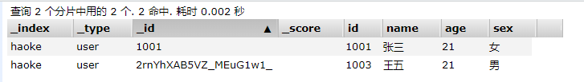

参考链接： https://juejin.im/post/5e264b026fb9a03003008435#comment

黑马： https://www.bilibili.com/video/av66600360

完整视频： http://yun.itheima.com/course/571.html?2002sxkqq

中文官网 https://www.elastic.co/cn/elasticsearch

Elasticsearch is a real-time, distributed storage, search, and analytics engine

ES 是一个近实时的，分布式的存储，搜索，分析引擎。是一个基于 Lucene的搜索服务器。

## 背景

相对数据库 ，ES的强大之处就是可以 `模糊查询`。

```sql
// 传统写法
select * from user where name like '%李四%' 
```
这样就可以 把 李四 相关的内容全部内容查询出来了，但是 这种查询的方式 是不走 `索引`的，只要你的数据库的量很大，
不走索引意味着你的查询时 秒级别的。

即便 你从数据库 根据 `模糊匹配` 查出相应的记录了，通常会返回`大量的数据`给你。还有一个问题就是用户的输入
可能没有那么准确。

## 特点

ES 是专门做 搜索的。

- ES 对模糊搜索非常快
- ES 搜索到的数据 可以 根据`评分`过滤掉大部分，只要返回评分高的给用户就可以了。
- 不是特别准确的关键字 也能搜索出相关的结果（能匹配有相关性的记录）

## 数据结构
1. 我们得知道 ES为什么可以实现快速的 `模糊匹配/相关性查询` 实际上是你写入数据到 ES的时候会进行`分词`。
2. 根据`完成的条件` 查找一条记录叫做 `正向索引`
3. 根据`某个词`(不完整的条件)再查找对应的记录，叫做 倒排索引。

那么 ES 是怎么切分 这些词的呢。ES内置了一些分词器

- Standard Analyzer 。按词切分，将词小写
- Simple Analyzer 按非字母过滤（符号被过滤掉） 将词小写
- WhitespaceAnalyzer 按照空格切分，不转小写

---

# ES笔记

ELK: Elasticsearch(存储检索) + logstash（数据分析） + kibana(可视化展现)

RESTful web接口 Java开发，企业级的搜索引擎。
---
## 环境搭建
1. ES tar的下载，部署 ，启动。
2. es-head的安装

```
# 解压 es不能使用 root账户运行
tar -xvzf elasticsearch-6.5.4.tar.gz  解压 

#修改配置文件
vim conf/elasticsearch.yml
network.host: 0.0.0.0 #设置ip地址，任意网络均可访问

#说明：在Elasticsearch中如果，network.host不是localhost或者127.0.0.1的话，就会认为是生产环境，
会对环境的要求比较高，我们的测试环境不一定能够满足，一般情况下需要修改2处配置，如下：
#1：修改jvm启动参数
vim conf/jvm.options
-Xms128m #根据自己机器情况修改
-Xmx128m
#2：一个进程在VMAs(虚拟内存区域)创建内存映射最大数量(这个是使用root权限)
vim /etc/sysctl.conf
vm.max_map_count=655360
sysctl -p #配置生效

#启动ES服务
su houzhenguo ## 切换回普通用户
cd bin
./elasticsearch 或 ./elasticsearch -d #后台启动

```

在浏览器中输入 iP:9200 看到如下反馈就证明安装成功了。

```json
{
  "name" : "Jd7owhv",
  "cluster_name" : "elasticsearch",
  "cluster_uuid" : "5EoC7HC_SAWXDaTp55ZCYg",
  "version" : {
    "number" : "6.5.4",
    "build_flavor" : "default",
    "build_type" : "tar",
    "build_hash" : "d2ef93d",
    "build_date" : "2018-12-17T21:17:40.758843Z",
    "build_snapshot" : false,
    "lucene_version" : "7.5.0",
    "minimum_wire_compatibility_version" : "5.6.0",
    "minimum_index_compatibility_version" : "5.0.0"
  },
  "tagline" : "You Know, for Search"
}
```

## 环境安装常见问题

```
#启动出错，环境：Centos6
[1]: max file descriptors [4096] for elasticsearch process is too low, increase to at
least [65536]
#解决：切换到root用户，编辑limits.conf 添加类似如下内容
vi /etc/security/limits.conf

添加如下内容:
* soft nofile 65536
* hard nofile 131072
* soft nproc 2048
* hard nproc 4096

[2]: max number of threads [1024] for user [elsearch] is too low, increase to at least
[4096]
#解决：切换到root用户，进入limits.d目录下修改配置文件。
vi /etc/security/limits.d/90-nproc.conf
#修改如下内容：
* soft nproc 1024
#修改为
* soft nproc 4096
[3]: system call filters failed to install; check the logs and fix your configuration
or disable system call filters at your own risk
#解决：Centos6不支持SecComp，而ES5.2.0默认bootstrap.system_call_filter为true
vim config/elasticsearch.yml
添加：
bootstrap.system_call_filter: false
```

## elasticsearch-head 

ES-head 是为 ES提供的界面管理工具，仅仅提供后台服务。

Google 浏览器插件的安装方式地址：https://chrome.google.com/webstore/detail/elasticsearch-head/ffmkiejjmecolpfloofpjologoblkegm

当然 与此同时可以采用 docker，或者 nodejs安装。

由于前后端分离开发，所以会存在跨域问题，需要在服务端做CORS的配置，如下：
vim elasticsearch.yml 新加
```yml
http.cors.enabled: true
http.cors.allow-origin: "*
```

当出现这个界面的时候，意味着成功了。


---


## 基本概念
1. ES 可以有不同的结构
2. 映射： 所有文档写进索引之前 会先进行分析，如何将输入的文本分割为词条，哪些词条又会被过滤，这种行为叫做映射，一般由用户自己定义规则。

## RESTful API (重要)

### 1. 创建非结构化的索引

在Lucene中，创建索引是需要定义字段名称以及字段的类型的，在Elasticsearch中提供了非结构化的索引，就是不
需要创建索引结构，即可写入数据到索引中，实际上在Elasticsearch底层会进行结构化操作，此操作对用户是透明
的。
创建空索引：

```json
PUT /haoke

{
"settings": {
"index": {
"number_of_shards": "2", #分片数
"number_of_replicas": "0" #副本数
}
}
} #
删除索引
DELETE /haoke
{
"acknowledged": true
}

```


### 2. 插入数据

> URL规则： POST  /{索引}/{类型}/{id}

```json
POST /haoke/user/10001
# 数据
{
"id":1001,
"name":"张三",
"age":20,
"sex":"男"
}
# Response
{
    "_index": "haoke",
    "_type": "user",
    "_id": "1001",
    "_version": 1,
    "result": "created",
    "_shards": {
        "total": 1,
        "successful": 1,
        "failed": 0
    },
    "_seq_no": 0,
    "_primary_term": 1
}
```
说明：非结构化的索引，不需要事先创建，直接插入数据默认创建索引。


不指定id插入数据：

```json
POST /haoke/user/

{
"id":1003,
"name":"王五",
"age":21,
"sex":"男"
}
```


自动生成id。

### 3. 更新数据

```json
PUT /haoke/user/1001
{
"id":1001,
"name":"张三",
"age":21,
"sex":"女"
}

# Response
{
    "_index": "haoke",
    "_type": "user",
    "_id": "1001",
    "_version": 3,  -- 返回值的版本更新了
    "result": "updated",
    "_shards": {
        "total": 1,
        "successful": 1,
        "failed": 0
    },
    "_seq_no": 3,
    "_primary_term": 1
}
```
更新结果：


上面的示例是覆盖更新。可以实现局部更新。局部更新的原理如下

  1. 从旧文档中检索JSON
  2. 修改它
  3. 删除旧文档
  4. 索引新文档

```json
#注意：这里多了_update标识
POST /haoke/user/1001/_update
{
"doc":{
"age":23
}
}
# Response 与上方的没有差异，只是版本号增加
```

### 4. 删除数据
```json
DELETE 

/haoke/user/1001

# Response
{
    "_index": "haoke",
    "_type": "user",
    "_id": "1001",
    "_version": 5,  // 版本号变化
    "result": "deleted",  // 删除
    "_shards": {
        "total": 1,
        "successful": 1,
        "failed": 0
    },
    "_seq_no": 5,
    "_primary_term": 1
}
```

需要注意的是，result表示已经删除，version也更加了。
如果删除一条不存在的数据，会响应404：
```json
{
    "_index": "haoke",
    "_type": "user",
    "_id": "10101",
    "_version": 1,
    "result": "not_found", // 删除不存在的数据响应 404
    "_shards": {
        "total": 1,
        "successful": 1,
        "failed": 0
    },
    "_seq_no": 0,
    "_primary_term": 1
}
```
> 删除一个文档也不会立即从磁盘上移除，它只是被标记成已删除。Elasticsearch将会在你之后添加更多索引的
时候才会在后台进行删除内容的清理。

### 5. 搜索数据
> 根据id搜索数据

```json
GET /haoke/user/3bnkhXAB5VZ_MEuG5A2t

// Response
{
    "_index": "haoke",
    "_type": "user",
    "_id": "3bnkhXAB5VZ_MEuG5A2t",
    "_version": 1,
    "found": true,
    "_source": {
        "id": 1006,
        "name": "张二",
        "age": 31,
        "sex": "男"
    }
}
```
> 搜索全部数据

```json
/haoke/user/_search
// 默认返回 10条数据
{
    "took": 4,
    "timed_out": false,
    "_shards": {
        "total": 2,
        "successful": 2,
        "skipped": 0,
        "failed": 0
    },
    "hits": {
        "total": 4,
        "max_score": 1.0,
        "hits": [
            {
                "_index": "haoke",
                "_type": "user",
                "_id": "27nkhXAB5VZ_MEuGJQ3f",
                "_score": 1.0,
                "_source": {
                    "id": 1004,
                    "name": "赵六",
                    "age": 22,
                    "sex": "女"
                }
            },
            {
                "_index": "haoke",
                "_type": "user",
                "_id": "2rnYhXAB5VZ_MEuG1w1_",
                "_score": 1.0,
                "_source": {
                    "id": 1003,
                    "name": "王五",
                    "age": 21,
                    "sex": "男"
                }
            },
            {
                "_index": "haoke",
                "_type": "user",
                "_id": "3LnkhXAB5VZ_MEuGjA2W",
                "_score": 1.0,
                "_source": {
                    "id": 1005,
                    "name": "孙琪",
                    "age": 22,
                    "sex": "男"
                }
            },
            {
                "_index": "haoke",
                "_type": "user",
                "_id": "3bnkhXAB5VZ_MEuG5A2t",
                "_score": 1.0,
                "_source": {
                    "id": 1006,
                    "name": "张二",
                    "age": 31,
                    "sex": "男"
                }
            }
        ]
    }
}
```
> 关键字搜索数据
```json
// 查询年龄等于 22的用户
GET /haoke/user/_search?q=age:22
// Response
{
    "took": 2,
    "timed_out": false,
    "_shards": {
        "total": 2,
        "successful": 2,
        "skipped": 0,
        "failed": 0
    },
    "hits": {
        "total": 2,
        "max_score": 1.0,
        "hits": [
            {
                "_index": "haoke",
                "_type": "user",
                "_id": "27nkhXAB5VZ_MEuGJQ3f",
                "_score": 1.0,
                "_source": {
                    "id": 1004,
                    "name": "赵六",
                    "age": 22,
                    "sex": "女"
                }
            },
            {
                "_index": "haoke",
                "_type": "user",
                "_id": "3LnkhXAB5VZ_MEuGjA2W",
                "_score": 1.0,
                "_source": {
                    "id": 1005,
                    "name": "孙琪",
                    "age": 22,
                    "sex": "男"
                }
            }
        ]
    }
}
```

### 6. DSL搜索
Elasticsearch提供丰富且灵活的查询语言叫做`DSL`查询(Query DSL),它允许你构建更加复杂、强大的查询。
DSL(Domain Specific Language特定领域语言)以JSON请求体的形式出现。

```json
POST /haoke/user/_search // 注意是 POST请求
// 请求体
{
	"query" : {
		"match":{
			"age" : 22 // match 只是查询的一种
		}
	}
}
```
> 查询年龄 大于 21 的男性数据


```json
POST /haoke/user/_search

// 消息体
{
	"query": {
		"bool": {
			"filter": {
				"range": {
					"age": {
						"gt": 21
					}
				}
			},
			"must": {
				"match": {
					"sex": "男"
				}
			}
		}
	}
}

// Response

{
    "took": 17,
    "timed_out": false,
    "_shards": {
        "total": 2,
        "successful": 2,
        "skipped": 0,
        "failed": 0
    },
    "hits": {
        "total": 2,
        "max_score": 0.13353139,
        "hits": [
            {
                "_index": "haoke",
                "_type": "user",
                "_id": "3LnkhXAB5VZ_MEuGjA2W",
                "_score": 0.13353139,
                "_source": {
                    "id": 1005,
                    "name": "孙琪",
                    "age": 22,
                    "sex": "男"
                }
            },
            {
                "_index": "haoke",
                "_type": "user",
                "_id": "3bnkhXAB5VZ_MEuG5A2t",
                "_score": 0.13353139,
                "_source": {
                    "id": 1006,
                    "name": "张二",
                    "age": 31,
                    "sex": "男"
                }
            }
        ]
    }
}

```

> 全文搜索

```json
POST /haoke/user/_search

// 请求数据
{
	"query": {
		"match": {
			"name": "张二 王五"
		}
	}
}
// Response
{
    "took": 5,
    "timed_out": false,
    "_shards": {
        "total": 2,
        "successful": 2,
        "skipped": 0,
        "failed": 0
    },
    "hits": {
        "total": 2,
        "max_score": 1.9616584,
        "hits": [
            {
                "_index": "haoke",
                "_type": "user",
                "_id": "2rnYhXAB5VZ_MEuG1w1_",
                "_score": 1.9616584,
                "_source": {
                    "id": 1003,
                    "name": "王五",
                    "age": 21,
                    "sex": "男"
                }
            },
            {
                "_index": "haoke",
                "_type": "user",
                "_id": "3bnkhXAB5VZ_MEuG5A2t",
                "_score": 1.9616584,
                "_source": {
                    "id": 1006,
                    "name": "张二",
                    "age": 31,
                    "sex": "男"
                }
            }
        ]
    }
}
```

### 7. 高亮显示

```json
POST /haoke/user/_search

// 请求体
{
	"query": {
		"match": {
			"name": "张二 王五"
		}
	},
	"highlight": {
		"fields": {
			"name": {}
		}
	}
}
// Response
{
    "took": 37,
    "timed_out": false,
    "_shards": {
        "total": 2,
        "successful": 2,
        "skipped": 0,
        "failed": 0
    },
    "hits": {
        "total": 2,
        "max_score": 1.9616584,
        "hits": [
            {
                "_index": "haoke",
                "_type": "user",
                "_id": "2rnYhXAB5VZ_MEuG1w1_",
                "_score": 1.9616584,
                "_source": {
                    "id": 1003,
                    "name": "王五",
                    "age": 21,
                    "sex": "男"
                },
                "highlight": {
                    "name": [
                        "<em>王</em><em>五</em>"  // 这里有高亮显示
                    ]
                }
            },
            {
                "_index": "haoke",
                "_type": "user",
                "_id": "3bnkhXAB5VZ_MEuG5A2t",
                "_score": 1.9616584,
                "_source": {
                    "id": 1006,
                    "name": "张二",
                    "age": 31,
                    "sex": "男"
                },
                "highlight": {
                    "name": [
                        "<em>张</em><em>二</em>"
                    ]
                }
            }
        ]
    }
}
```

### 8. 聚合
在Elasticsearch中，支持聚合操作，类似SQL中的group by操作。

```json
POST /haoke/user/_search

// 请求体
{
	"aggs": {
		"all_interests": {
			"terms": {
				"field": "age"
			}
		}
	}
}
// Response
{
    "took": 20,
    "timed_out": false,
    "_shards": {
        "total": 2,
        "successful": 2,
        "skipped": 0,
        "failed": 0
    },
    "hits": {
        "total": 4,
        "max_score": 1.0,
        "hits": [
            {
                "_index": "haoke",
                "_type": "user",
                "_id": "27nkhXAB5VZ_MEuGJQ3f",
                "_score": 1.0,
                "_source": {
                    "id": 1004,
                    "name": "赵六",
                    "age": 22,
                    "sex": "女"
                }
            },
            {
                "_index": "haoke",
                "_type": "user",
                "_id": "2rnYhXAB5VZ_MEuG1w1_",
                "_score": 1.0,
                "_source": {
                    "id": 1003,
                    "name": "王五",
                    "age": 21,
                    "sex": "男"
                }
            },
            {
                "_index": "haoke",
                "_type": "user",
                "_id": "3LnkhXAB5VZ_MEuGjA2W",
                "_score": 1.0,
                "_source": {
                    "id": 1005,
                    "name": "孙琪",
                    "age": 22,
                    "sex": "男"
                }
            },
            {
                "_index": "haoke",
                "_type": "user",
                "_id": "3bnkhXAB5VZ_MEuG5A2t",
                "_score": 1.0,
                "_source": {
                    "id": 1006,
                    "name": "张二",
                    "age": 31,
                    "sex": "男"
                }
            }
        ]
    },
    "aggregations": {
        "all_interests": {
            "doc_count_error_upper_bound": 0,
            "sum_other_doc_count": 0,
            "buckets": [
                {
                    "key": 22,
                    "doc_count": 2 // 这里会统计到 22岁的有两个
                },
                {
                    "key": 21,
                    "doc_count": 1
                },
                {
                    "key": 31,
                    "doc_count": 1
                }
            ]
        }
    }
}


```