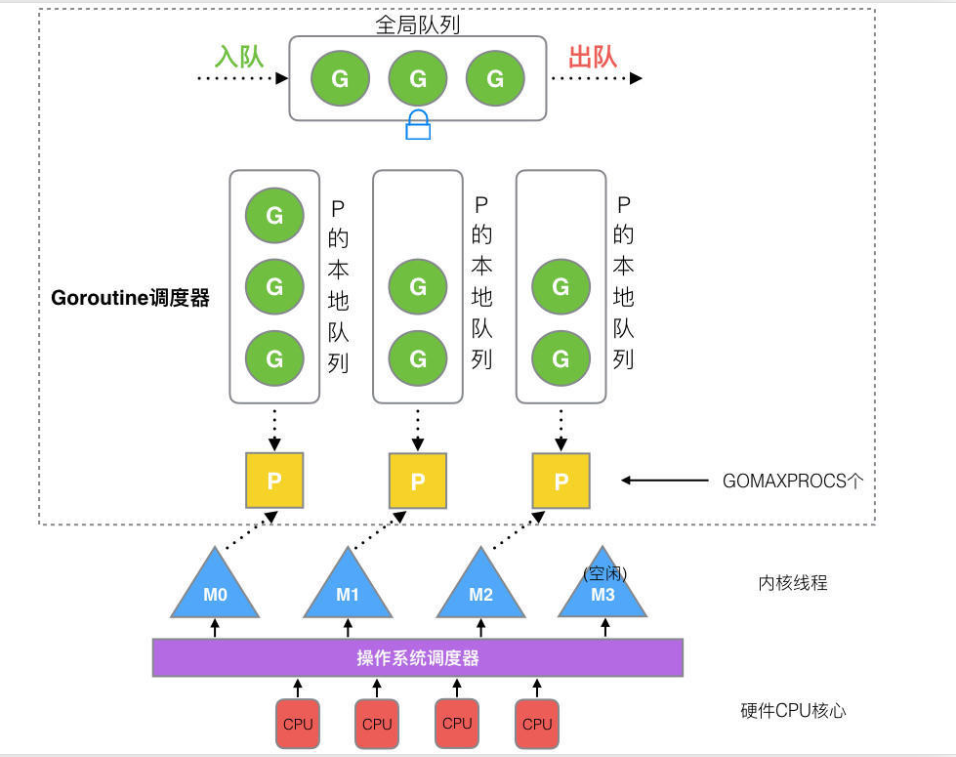

https://learnku.com/articles/41728

## 调度器的由来
1. 多进程/多线程已经提高了系统的并发能力，但是当前互联网高并发场景下，为每个任务创建一个线程是不现实的。会消耗大量的内存。
2. routine -> 映射到thread （CPU只能看到 thread看不到 routine）
3. N个 r绑定内核 的thread，这么做的优点是协程在用户态线程就完成切换，不会陷入内核态。 这种切换非常轻量快速.
4. 缺点：一旦某协程阻塞，造成线程阻塞，本进程的求他协程就无法执行了，根本没有并发能力。

## Goroutine的特点
1. goroutine和channel 非常轻量，一个goroutine只占用几kb.所以可以在有限的空间内支持大量的goroutine。调度更加灵活.

1. 全局队列（Global Queue）：存放等待运行的 G。
2. P 的本地队列：同全局队列类似，存放的也是等待运行的 G，存的数量有限，不超过 256 个。新建 G’时，G’优先加入到 P 的本地队列，如果队列满了，则会把本地队列中一半的 G 移动到全局队列。
3. P 列表：所有的 P 都在程序启动时创建，并保存在数组中，最多有 GOMAXPROCS(可配置) 个。
4. M：线程想运行任务就得获取 P，从 P 的本地队列获取 G，P 队列为空时，M 也会尝试从全局队列拿一批 G 放到 P 的本地队列，或从其他 P 的本地队列偷一半放到自己 P 的本地队列。M 运行 G，G 执行之后，M 会从 P 获取下一个 G，不断重复下去。

https://learnku.com/articles/41728

太多了，我都看不下去。