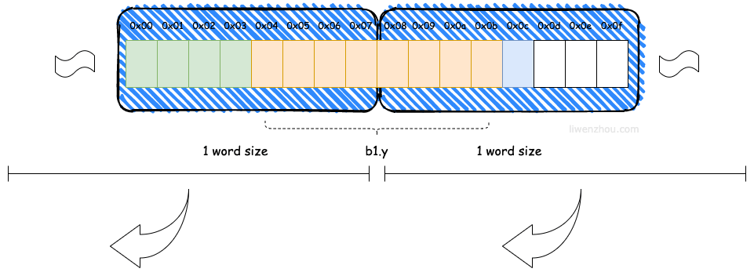

## 内存布局
https://www.liwenzhou.com/posts/Go/struct_memory_layout/
主要讲解 golang 字段的内存布局以及 内存对齐填充
Go 在编译的时候会按照一定的规则自动进行内存对齐。之所以这么设计是为了减少 CPU 访问内存的次数，加大 CPU 访问内存的吞吐量。如果不进行内存对齐的话，很可能就会增加CPU访问内存的次数。例如下图中CPU想要获取b1.y字段的值可能就需要两次总线周期。


```golang
type Foo struct {
	A int8 // 1
	B int8 // 1
	C int8 // 1
}

var f Foo
fmt.Println(unsafe.Sizeof(f))  // 3 这个占用3，没有到达8个

// next
type Bar struct {
	x int32 // 4
	y *Foo  // 8
	z bool  // 1
}

var b1 Bar
fmt.Println(unsafe.Sizeof(b1)) // 24 这个占用24是因为x占用8，z占用8

// next 
type Bar struct {
	x int32 // 4
    z bool  // 1
	y *Foo  // 8
	
}

var b1 Bar
fmt.Println(unsafe.Sizeof(b1)) // 16 前面两个加起来8
```
