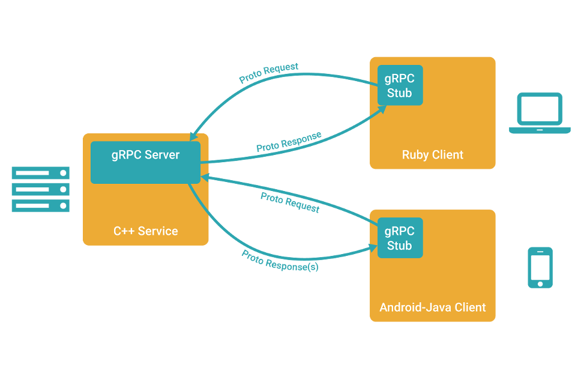

# gRPC 学习

参考学习链接 ：  http://doc.oschina.net/grpc?t=58008

## 简介
 客户端像是调用本地方法一样直接调用另外一台不同机器上服务端应用的方法。可以使我们更容易的创建分布式的应用和服务。 全称： Google Remote Procedure Call 远程过程调用。

grpc 可以很容易的使用 Java 创建一个 gRPC的服务器，使用其他语言创建 客户端进行交互。

## 通信协议

使用 protocol buffer ，protocol buffer 就是一种序列化的机制。具体可以参考 protocol 官网 或者 相关的github。 proto3 最好是使用这个 版本，避免版本 兼容问题。

protocol buffer 官网 https://developers.google.com/protocol-buffers/docs/overview

