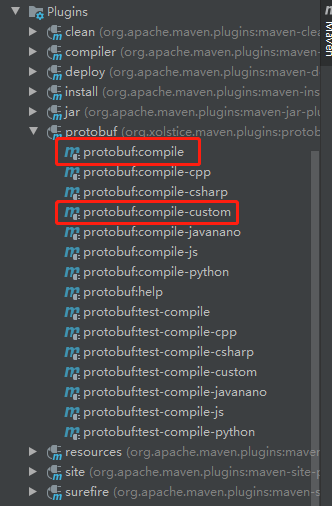

## 参考链接

https://www.cnblogs.com/kumu/p/10105744.html 解决一些proto生成的问题


## quick start


1. pom.xml 内容

```xml
<?xml version="1.0" encoding="UTF-8"?>
<project xmlns="http://maven.apache.org/POM/4.0.0"
         xmlns:xsi="http://www.w3.org/2001/XMLSchema-instance"
         xsi:schemaLocation="http://maven.apache.org/POM/4.0.0 http://maven.apache.org/xsd/maven-4.0.0.xsd">
    <modelVersion>4.0.0</modelVersion>

    <groupId>org.example</groupId>
    <artifactId>grpc-demo-1</artifactId>
    <version>1.0-SNAPSHOT</version>
    <dependencies>
        <dependency>
            <groupId>io.grpc</groupId>
            <artifactId>grpc-netty-shaded</artifactId>
            <version>1.27.2</version>
        </dependency>
        <dependency>
            <groupId>io.grpc</groupId>
            <artifactId>grpc-protobuf</artifactId>
            <version>1.27.2</version>
        </dependency>
        <dependency>
            <groupId>io.grpc</groupId>
            <artifactId>grpc-stub</artifactId>
            <version>1.27.2</version>
        </dependency>
    </dependencies>

    <build>
        <extensions>
            <extension>
                <groupId>kr.motd.maven</groupId>
                <artifactId>os-maven-plugin</artifactId>
                <version>1.6.2</version>
            </extension>
        </extensions>
        <plugins>
            <plugin>
                <groupId>org.xolstice.maven.plugins</groupId>
                <artifactId>protobuf-maven-plugin</artifactId>
                <version>0.6.1</version>
                <configuration>
                    <protocArtifact>com.google.protobuf:protoc:3.11.0:exe:${os.detected.classifier}</protocArtifact>
                    <pluginId>grpc-java</pluginId>
                    <pluginArtifact>io.grpc:protoc-gen-grpc-java:1.27.2:exe:${os.detected.classifier}</pluginArtifact>
                </configuration>
                <executions>
                    <execution>
                        <goals>
                            <goal>compile</goal>
                            <goal>compile-custom</goal>
                        </goals>
                    </execution>
                </executions>
            </plugin>
            <!-- java编译插件 不导入可能有 5版本的异常-->
            <plugin>
                <groupId>org.apache.maven.plugins</groupId>
                <artifactId>maven-compiler-plugin</artifactId>
                <version>3.2</version>
                <configuration>
                    <source>1.8</source>
                    <target>1.8</target>
                    <encoding>UTF-8</encoding>
                </configuration>
            </plugin>
        </plugins>
    </build>
</project>
```

grpc 中 protobuf 的代码生成不需要 单独的安装 proto ，maven自带插件可以处理

2. 编写 proto文件

文件路径 src/main/proto/phonebook.proto
```proto
syntax = "proto3";

option go_package = "user";
option java_package = "com.houzhenguo.protobuf";
enum PhoneType {
    HOME = 0;
    WORK = 1;
    OTHER = 2;
}

message ProtobufUser {
  int32 id = 1;
  string name = 2;
  message Phone{
  PhoneType phoneType = 1;
  string phoneNumber = 2;
  }
  repeated Phone phones = 3;
}

message AddPhoneToUserRequest{
  int32 uid = 1;
  PhoneType phoneType = 2;
  string phoneNumber = 3;
}

message AddPhoneToUserResponse{
  bool result = 1;
}

service PhoneService {
  rpc addPhoneToUser(AddPhoneToUserRequest) returns (AddPhoneToUserResponse);
}
```
3. 通过 maven 插件 生成 相应的 实体类以及 service



然后在IDE的maven面板上分别点击下面两个任务。点击protobuf:compile生成的文件是与protobuf序列化相关的，也就相当于是数据交换时的java bean。点击protobuf:compile-custom生成的1个文件是与grpc相关的，主要用于与服务端通信的。

4. 自动生成的代码在target/generated-sources/protobuf里，可以移动到自己项目的相关目录下面。

项目树的结构如下:


5. 三个手写的类

Client

```java
package com.houzhenguo.protobuf.client;

import com.houzhenguo.protobuf.PhoneServiceGrpc;
import com.houzhenguo.protobuf.Phonebook;
import io.grpc.ManagedChannel;
import io.grpc.ManagedChannelBuilder;
import io.grpc.StatusRuntimeException;

import java.util.concurrent.TimeUnit;
import java.util.logging.Level;
import java.util.logging.Logger;

public class MyClient {
    private static final Logger logger = Logger.getLogger(MyClient.class.getName());

    private final ManagedChannel channel;

    private final PhoneServiceGrpc.PhoneServiceBlockingStub blockingStub;

    /** Construct client connecting to gRPC server at {@code host:port}. */
    public MyClient(String host, int port) {
        ManagedChannelBuilder<?> channelBuilder = ManagedChannelBuilder.forAddress(host, port).usePlaintext();
        channel = channelBuilder.build();
        blockingStub = PhoneServiceGrpc.newBlockingStub(channel);
    }

    public void shutdown() throws InterruptedException {
        channel.shutdown().awaitTermination(5, TimeUnit.SECONDS);
    }

    /** add phone to user. */
    public void addPhoneToUser(int uid, Phonebook.PhoneType phoneType, String phoneNubmer) {
        logger.info("Will try to add phone to user " + uid);
        Phonebook.AddPhoneToUserRequest request = Phonebook.AddPhoneToUserRequest.newBuilder().setUid(uid).setPhoneType(phoneType)
                .setPhoneNumber(phoneNubmer).build();
        Phonebook.AddPhoneToUserResponse response;
        try {
            response = blockingStub.addPhoneToUser(request);
        } catch (StatusRuntimeException e) {
            logger.log(Level.WARNING, "RPC failed: {0}", e.getStatus());
            return;
        }
        logger.info("Result: " + response.getResult());
    }

    public static void main(String[] args) throws Exception {
        MyClient client = new MyClient("localhost", 12343);
        try {
            client.addPhoneToUser(1, Phonebook.PhoneType.WORK, "13888888881");
        } finally {
            client.shutdown();
        }
    }
}

```

server

```java
package com.houzhenguo.server;

import com.houzhenguo.service.PhonebookServiceImpl;
import io.grpc.Server;
import io.grpc.ServerBuilder;

import java.io.IOException;
import java.util.logging.Logger;

public class MyServer {
    private static final Logger logger = Logger.getLogger(MyServer.class.getName());

    private Server server;

    private void start() throws IOException {
        /* The port on which the server should run */
        int port = 12343;
        server = ServerBuilder
                .forPort(port)
                .addService(new PhonebookServiceImpl())
                .build()
                .start();
        logger.info("Server started, listening on " + port);
        Runtime.getRuntime().addShutdownHook(new Thread() {
            @Override
            public void run() {
                System.err.println("*** shutting down gRPC server since JVM is shutting down");
                MyServer.this.stop();
                System.err.println("*** server shut down");
            }
        });
    }

    private void stop() {
        if (server != null) {
            server.shutdown();
        }
    }

    /**
     * Await termination on the main thread since the grpc library uses daemon
     * threads.
     */
    private void blockUntilShutdown() throws InterruptedException {
        if (server != null) {
            server.awaitTermination();
        }
    }

    /**
     * Main launches the server from the command line.
     */
    public static void main(String[] args) throws IOException, InterruptedException {
        final MyServer server = new MyServer();
        server.start();
        server.blockUntilShutdown();
    }
}

```

方法实现类

```java
package com.houzhenguo.service;

import com.houzhenguo.protobuf.PhoneServiceGrpc;
import com.houzhenguo.protobuf.Phonebook;
import io.grpc.stub.StreamObserver;

public class PhonebookServiceImpl extends PhoneServiceGrpc.PhoneServiceImplBase {
    @Override
    public void addPhoneToUser(Phonebook.AddPhoneToUserRequest request, StreamObserver<Phonebook.AddPhoneToUserResponse> responseObserver) {
        Phonebook.AddPhoneToUserResponse response = null;
        if(request.getPhoneNumber().length() == 11 ){
            System.out.printf("uid = %s , phone type is %s, nubmer is %s\n", request.getUid(), request.getPhoneType(), request.getPhoneNumber());
            response = Phonebook.AddPhoneToUserResponse.newBuilder().setResult(true).build();
        }else{
            System.out.printf("The phone nubmer %s is wrong!\n",request.getPhoneNumber());
            response = Phonebook.AddPhoneToUserResponse.newBuilder().setResult(false).build();
        }
        responseObserver.onNext(response);
        responseObserver.onCompleted();
    }
}

```
