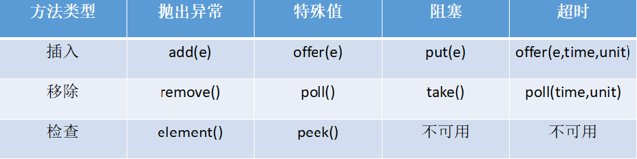
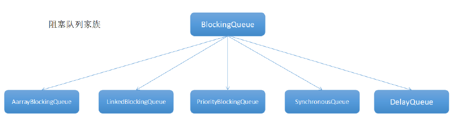

## Java阻塞队列原理 BlockingQueue

阻塞队列，关键字是阻塞，先理解阻塞的含义，在阻塞队列中，线程阻塞有这样的两种情况：

1. 当队列中没有数据的情况下，消费者端的所有线程都会被自动阻塞（挂起），直到有数据放入队列。

2. 当队列中填满数据的情况下，生产者端的所有线程都会被自动阻塞（挂起），直到队列中有
空的位置，线程被自动唤醒。

## 阻塞队列的主要方法




- 抛出异常：抛出一个异常；
- 特殊值：返回一个特殊值（null 或false,视情况而定）
- 阻塞：在成功操作之前，一直阻塞线程
- 超时：放弃前只在最大的时间内阻塞

## 插入操作

1. public abstract boolean add(E paramE)：将指定元素插入此队列中（如果立即可行
且不会违反容量限制），成功时返回 true，如果当前没有可用的空间，则抛
出 IllegalStateException。如果该元素是NULL，则会抛出NullPointerException 异常。

2. public abstract boolean offer(E paramE)：将指定元素插入此队列中（如果立即可行
且不会违反容量限制），成功时返回 true，如果当前没有可用的空间，则返回 false。

3. public abstract void put(E paramE) throws InterruptedException： 将指定元素插
入此队列中，将等待可用的空间（如果有必要） 阻塞

```java
public void put(E paramE) throws InterruptedException {
    checkNotNull(paramE);
    ReentrantLock localReentrantLock = this.lock;
    localReentrantLock.lockInterruptibly();
    try {
        while (this.count == this.items.length)
            this.notFull.await();//如果队列满了，则线程阻塞等待
        enqueue(paramE);
        localReentrantLock.unlock();
} finally {
localReentrantLock.unlock();
}
}
```
4. offer(E o, long timeout, TimeUnit unit)：可以设定等待的时间，如果在指定的时间
内，还不能往队列中加入BlockingQueue，则返回失败。

## 获取数据操作

1. poll(time):取走BlockingQueue 里排在首位的对象,若不能立即取出,则可以等time 参数
规定的时间,取不到时返回null;
2. poll(long timeout, TimeUnit unit)：从BlockingQueue 取出一个队首的对象，如果在
指定时间内，队列一旦有数据可取，则立即返回队列中的数据。否则直到时间超时还没有数
据可取，返回失败。
3. take():取走BlockingQueue 里排在首位的对象,若BlockingQueue 为空,阻断进入等待状
态直到BlockingQueue 有新的数据被加入。
4. drainTo():一次性从BlockingQueue 获取所有可用的数据对象（还可以指定获取数据的个
数），通过该方法，可以提升获取数据效率；不需要多次分批加锁或释放锁。

## Java中的阻塞队列

1. ArrayBlockingQueue ：由数组结构组成的有界阻塞队列。
2. LinkedBlockingQueue ：由链表结构组成的<font color = 'red'>有界</font>阻塞队列。（可认为是无界MaxSize）newFixedThreadPool 与 newSingleThreadPool采用
3. PriorityBlockingQueue ：支持优先级排序的无界阻塞队列。
4. DelayQueue：使用优先级队列实现的无界阻塞队列。
5. SynchronousQueue：不存储元素的阻塞队列。(newCachedThreadPool使用的是她)
6. LinkedTransferQueue：由链表结构组成的无界阻塞队列。
7. LinkedBlockingDeque：由链表结构组成的双向阻塞队列




## ArrayBlockingQueue（公平、非公平）

用数组实现的有界阻塞队列。此队列按照先进先出（FIFO）的原则对元素进行排序。默认情况下
不保证访问者公平的访问队列，所谓公平访问队列是指阻塞的所有生产者线程或消费者线程，当
队列可用时，可以按照阻塞的先后顺序访问队列，即先阻塞的生产者线程，可以先往队列里插入
元素，先阻塞的消费者线程，可以先从队列里获取元素。通常情况下为了保证公平性会降低吞吐
量。我们可以使用以下代码创建一个公平的阻塞队列：
```java
ArrayBlockingQueue fairQueue = new ArrayBlockingQueue(1000,true);
```

## LinkedBlockingQueue（两个独立锁提高并发）

基于链表的阻塞队列，同ArrayListBlockingQueue 类似，此队列按照先进先出（FIFO）的原则对
元素进行排序。而LinkedBlockingQueue 之所以能够高效的处理并发数据，还因为其对于生产者
端和消费者端分别采用了独立的锁来控制数据同步，这也意味着在高并发的情况下生产者和消费
者可以并行地操作队列中的数据，以此来提高整个队列的并发性能。
LinkedBlockingQueue 会默认一个类似无限大小的容量（Integer.MAX_VALUE）。


## PriorityBlockingQueue（compareTo 排序实现优先）


是一个支持优先级的无界队列。默认情况下元素采取自然顺序升序排列。可以自定义实现
compareTo()方法来指定元素进行排序规则，或者初始化PriorityBlockingQueue 时，指定构造
参数Comparator 来对元素进行排序。需要注意的是不能保证同优先级元素的顺序。

## DelayQueue（缓存失效、定时任务 ）

是一个支持延时获取元素的无界阻塞队列。队列使用PriorityQueue 来实现。队列中的元素必须实
现Delayed 接口，在创建元素时可以指定多久才能从队列中获取当前元素。只有在延迟期满时才
能从队列中提取元素。我们可以将DelayQueue 运用在以下应用场景：

1. 缓存系统的设计：可以用DelayQueue 保存缓存元素的有效期，使用一个线程循环查询
DelayQueue，一旦能从DelayQueue 中获取元素时，表示缓存有效期到了。

2. 定时任务调度： 使用DelayQueue 保存当天将会执行的任务和执行时间， 一旦从
DelayQueue 中获取到任务就开始执行，从比如TimerQueue 就是使用DelayQueue 实现的。

## SynchronousQueue（不存储数据、可用于传递数据）

是一个不存储元素的阻塞队列。每一个put 操作必须等待一个take 操作，否则不能继续添加元素。
SynchronousQueue 可以看成是一个传球手，负责把生产者线程处理的数据直接传递给消费者线
程。队列本身并不存储任何元素，非常适合于传递性场景,比如在一个线程中使用的数据，传递给
另外一个线程使用， SynchronousQueue 的吞吐量高于LinkedBlockingQueue 和
ArrayBlockingQueue。
4.1.14.8.


## LinkedTransferQueue

是一个由链表结构组成的无界阻塞TransferQueue 队列。相对于其他阻塞队列，
LinkedTransferQueue 多了tryTransfer 和transfer 方法。
1. transfer 方法：如果当前有消费者正在等待接收元素（消费者使用take()方法或带时间限制的
poll()方法时），transfer 方法可以把生产者传入的元素立刻transfer（传输）给消费者。如
果没有消费者在等待接收元素，transfer 方法会将元素存放在队列的tail 节点，并等到该元素
被消费者消费了才返回。
2. tryTransfer 方法。则是用来试探下生产者传入的元素是否能直接传给消费者。如果没有消费
者等待接收元素，则返回false。和transfer 方法的区别是tryTransfer 方法无论消费者是否
接收，方法立即返回。而transfer 方法是必须等到消费者消费了才返回。
对于带有时间限制的tryTransfer(E e, long timeout, TimeUnit unit)方法，则是试图把生产者传
入的元素直接传给消费者，但是如果没有消费者消费该元素则等待指定的时间再返回，如果超时
还没消费元素，则返回false，如果在超时时间内消费了元素，则返回true。

## LinkedBlockingDeque

是一个由链表结构组成的双向阻塞队列。所谓双向队列指的你可以从队列的两端插入和移出元素。
双端队列因为多了一个操作队列的入口，在多线程同时入队时，也就减少了一半的竞争。相比其
他的阻塞队列， LinkedBlockingDeque 多了addFirst ， addLast ， offerFirst ， offerLast ，
peekFirst，peekLast 等方法，以First 单词结尾的方法，表示插入，获取（peek）或移除双端队
列的第一个元素。以Last 单词结尾的方法，表示插入，获取或移除双端队列的最后一个元素。另
外插入方法add 等同于addLast，移除方法remove 等效于removeFirst。但是take 方法却等同
于takeFirst，不知道是不是Jdk 的bug，使用时还是用带有First 和Last 后缀的方法更清楚。
在初始化LinkedBlockingDeque 时可以设置容量防止其过渡膨胀。另外双向阻塞队列可以运用在
“工作窃取”模式中。


参考： Java 并发编程实战 P143


## 