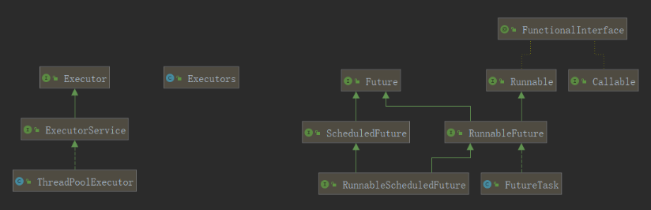

# Future和FutureTask的区别

https://blog.csdn.net/m0_37148920/article/details/98885859

## 先看下Future、FutureTask相关类的关系



Future只是一个接口，FutureTask是实现了RunnableFuture

## Future接口可以实现的功能

Future呈现的是异步计算的结果。Future中的方法提供了检查计算是否已经完成，并且等待计算的结果，还能够重新获取计算记得结果。当计算已经完成的时候只能使用get()方法获取结果，如果有需要的话，可以一直阻塞等待结果，直到结果已经准备好了。通过cancel()方法可以取消执行。还提供了了其他方法来确定任务是否正常完成或者被取消。一旦一个计算已经完成的话，那么计算是不能够被取消的。如果是为了实现可以去掉任务但是不需要返回结果的话，那么就可以使用future，将返回结果设置成null就可以了。


1）判断任务是否完成；
2）能够中断任务；
3）能够获取任务执行结果。（最为常用的）

```java
 ExecutorService service = Executors.newSingleThreadExecutor();
        Future<String> future = service.submit(new Callable<String>() {
            @Override
            public String call() throws Exception {
                return "say helloWorld!!!";
            }
 });
 System.out.println(future.get());// 通过get返回结果
```

使用get()，程序将停止往下执行，一直等待结果，直到有返回值，下面的程序才能得到继续的执行。如果不希望因为get一直等待下去的话，可以使用get(long timeout, TimeUnit unit)方法，通过这个方法可以设置等待时间，如果在定时时间内没有得到返回结果的话，将会抛出超时的异常，这种用法用来做远程调用设置超时的场景中。

## FutureTask实现了Future

FutureTask可以这样使用

```java
ExecutorService service = Executors.newSingleThreadExecutor();
FutureTask<String> futureTask = new FutureTask<>(new Callable<String>() {
     @Override
     public String call() throws Exception {
         return "futureTask say HelloWorld!!!";
     }
});
service.execute(futureTask);
System.out.println(futureTask.get());

```
ExecutorService的execute是没有返回值的，使用这种用法需要注意的是FutureTask的get方法会一直等待结果的返回，如果get的调用顺序在execute之前的话，那么程序将会停止在get这里。