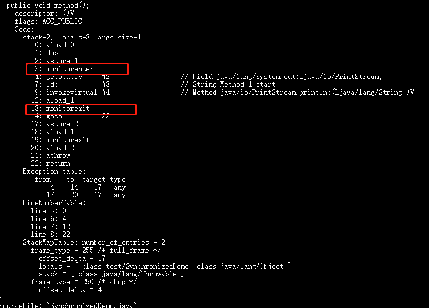
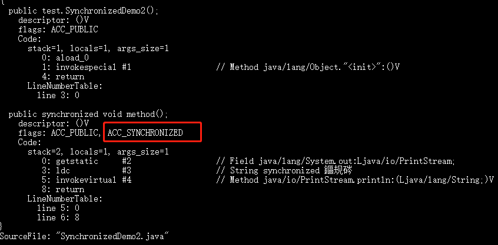

# Synchronized 关键字


### sychronized 使用方式总结 
1. 修饰实例方法，作用于实例，进入同步代码前获取对象实例的锁，通过标志位的方式进入退出

2. 修饰静态方法，作用于类，进入同步代码之前获取类对象的实例。就是给当前类加锁，会作用于类的所有对象实例，因为静态成员不属于任何一个实例对象，是类成员。线程A调用一个实例对象的非静态 sychronized 方法，而线程B需要调用这实例对象所属的静态 sychronized方法，是允许的，不会发生互斥现象.因为访问静态类，锁为类对象；另外需要注意的是：尽量不要使用 synchronized(String a) 因为JVM中，字符串常量池具有缓冲功能！

### 单例模式的双重检查
```java
public static Singleton
{
    private volatile static Singleton instance;
    private Singleton(){}
    public static Singleton getInstance()
    {
        if(instance == null)
        {
            synchronized(Singleton.class)
            {
                instance = new Stingleton();
            }
        }
        return instance;
    }
}
```

其中 instance 采用 valatile 关键字修饰很有必要， 防止 指令重排序。

```java
instance = new Singleton();
```
其中这段代码分三步执行:

1. 为instance 分配内存空间

2. 初始化 instance
 
3. 将 instance 指向分配到内存地址

但是由于 JVM的指令重排的特性，执行的顺序有可能变成 1->3->2. 指令重排序在单线程环境下不会出现问题，但是在多线程环境下会导致 另外一个线程获取一个没有初始化的实例，例如，线程 T1执行了 1,3,此时 T2调用。就会出现问题。使用 volatile会禁止JVM指令重排序，保证在多线程的环境下也能正常执行.

### sychronized 关键字 底层原理属于 JVM层面

1. sychronized 修饰同步语句块的情况

```java
public class SynchronizedDemo{
    public void method()
    {
        sychronized(this)
        {
            System.out.println("我是代码块");
        }
    }
}
```


> sychronized 同步语句块使用的是 monitorenter 和 montorexit 指令，其中 monitorenter指令 指向 同步代码块的开始位置，monitorexit 指令则指向 同步代码块的结束位置。当执行 monitorenter 指令的时候，线程试图获取锁也就是获取 monitor（monitor对象存在于每个Java 对象的对象头中，synchronized 锁便是通过这种方式获取的，也是为什么 Java中任意对象都可以作为锁的原因）的特有权。当计数器 为 0则可以成功获取，获取后将锁计数器 设为 1也就是 +1 。相应的在执行 montorexit指令后，将锁计数器设置为 0 。表明锁的释放。如果获取对象锁失败，那当前线程就要阻塞等待，直到锁被另外一个线程释放为止。

2. sychronized修饰方法的情况
```java

public class SynchronizedDemo2{
    public synchronized void method()
    {
        System.out.println("修饰实例方法");
    }
}

```


synchronized 修饰的方法并没有 monitorenter 指令和 monitorexit 指令，取得代之的确实是 ACC_SYNCHRONIZED 标识，该标识指明了该方法是一个同步方法，JVM 通过该 ACC_SYNCHRONIZED 访问标志来辨别一个方法是否声明为同步方法，从而执行相应的同步调用。

### JDK1.6之后底层的优化

JDK1.6 对锁的实现 引入了大量的优化，如偏向锁，轻量级锁，自旋锁，适应性自旋锁，锁消除，锁粗化等技术来减少 锁操作的开销。

锁主要存在四种状态，依次是：无锁状态，偏向锁状态，轻量级锁状态，重量级锁状态。锁不能降级，这种策略是为了提高获得锁和释放锁的效率。

1. 偏向锁

 **引入偏向锁的目的和引入轻量级锁的目的很像，都是为了在没有多线程竞争的前提下，减少传统重量级锁使用操作系统互斥量产生的性能消耗，但是不同的是：轻量级锁在无竞争的情况下使用CAS操作去代替使用互斥量。而偏向锁 在无竞争的情况下会把整个同步都消除掉**

 偏向锁的偏是偏向于第一个获得它的线程，如果在接下来的执行中，该锁没有被其他线程获取，那么持有偏向锁的线程不需要同步。但是对于锁竞争比较激烈的场合，偏向锁就失效了，因为这样场合极有可能每次申请锁的线程都是不同的，因此这种场合不应该使用偏向锁，否则得不偿失。偏向锁失败之后，并不会立马转为重量级锁，而是先升级为轻量级锁。

 2. 轻量级锁
  
  偏向锁失败，升级为轻量级锁。（JDK1.6之后加入的）**轻量级锁不是为了代替重量级锁，它的本意是在没有多线程竞争的前提下，减少传统重量级锁使用操作系统互斥量产生的性能消耗，因为使用轻量级锁的时候，不需要申请互斥量，而是采用CAS操作**


  轻量级锁能够提升程序同步性能的依据是:对于绝大部分锁，在整个同步周期内是不存在竞争的。这是一个经验数据，如果没有竞争，轻量级锁使用CAS操作避免了锁互斥的开销。但是如果存在锁的竞争，除了互斥量的开销之外，还有 CAS的开销，因此在有锁竞争的情况下，轻量级锁比重量级锁更慢！如果锁竞争激励，则会升级为重量级锁。

  3. 自旋锁 和 自适应锁

  轻量级锁失败之后，JVM为了避免线程真实的在操作系统层面挂起，还会进行一系列自旋锁的优化手段。 互斥同步对性能最大的影响就是阻塞的实现，因为 挂起线程/回复线程的操作都需要 转入内核态完成（用户态转为内核态会耗费时间）

  **一般线程持有锁的事件都不是太长，所以为了这一点时间去挂起线程，恢复线程得不偿失**所以JVM开发团队这么考虑：我们能不能让后面来的请求线程等待一会儿，而不是挂起呢？看看线程是否很快就会被释放，**为了让一个线程等待，我们只需要让线程执行一个忙循环(自旋)**

  百度百科对自旋锁的解释：

> 何谓自旋锁？它是为实现保护共享资源而提出一种锁机制。其实，自旋锁与互斥锁比较类似，它们都是为了解决对某项资源的互斥使用。无论是互斥锁，还是自旋锁，在任何时刻，最多只能有一个保持者，也就说，在任何时刻最多只能有一个执行单元获得锁。但是两者在调度机制上略有不同。对于互斥锁，如果资源已经被占用，资源申请者只能进入睡眠状态。但是自旋锁不会引起调用者睡眠，如果自旋锁已经被别的执行单元保持，调用者就一直循环在那里看是否该自旋锁的保持者已经释放了锁，"自旋"一词就是因此而得名。

自旋锁在 JDK1.6 之前其实就已经引入了，不过是默认关闭的，需要通过`--XX:+UseSpinning`参数来开启。JDK1.6及1.6之后，就改为默认开启的了。需要注意的是：自旋等待不能完全替代阻塞，因为它还是要占用处理器时间。如果锁被占用的时间短，那么效果当然就很好了！反之，相反！自旋等待的时间必须要有限度。如果自旋超过了限定次数任然没有获得锁，就应该挂起线程。**自旋次数的默认值是10次，用户可以修改`--XX:PreBlockSpin`来更改**。

另外,**在 JDK1.6 中引入了自适应的自旋锁。自适应的自旋锁带来的改进就是：自旋的时间不在固定了，而是和前一次同一个锁上的自旋时间以及锁的拥有者的状态来决定，虚拟机变得越来越“聪明”了**。

4. 锁消除

它指的是 虚拟机即时编译在运行时，如果检测到某些数据不可能存在竞争，那么执行锁消除，锁消除就可以节省毫无意义的请求锁的时间。

5. 锁粗化

原则上，我们在编写代码的时候，总是推荐奖同步代码块的作用范围限制的尽量小，一直在共享数据的实际作用域才进行同步，这样是为了使得需要同步的操作尽量变小，如果存在锁竞争，那等待线程也能尽快拿到锁。大部分情况下，上面的原则都是没有问题的，但是如果一系列的连续操作都对同一个对象反复加锁和解锁，那么会带来很多不必要的性能消耗。

### Sychronized 与 ReentrantLock 的对比

1. **两者都是可重入锁**

可重入锁的概念就是：自己可以再次获取自己的内部锁。比如一个线程获取了某个对象的锁，此时这个对象锁还没有释放，当其再次想要获取这个对象锁的时候还是可以再次获取的。同一个线程每次获取锁，锁的计数器都自增1 。所以要等到锁的计数器下降为  0时候才能释放锁。

2. **sychronized依赖 JVM ,而ReetrantLock依赖于API**

synchronized 依赖于 JVM 实现的。JDK1.6为sychronized关键字进行了许多优化，这些优化都是在JVM层面实现的。ReetrantLock 是JDK层面实现的（也就是 API层面，需要 lock() 和 unlock() 方法配合 try/finally 语句块完成）

3. **ReentrantLock 比 Sychronized提供了一些更加高级的功能**

相比synchronized，ReenTrantLock增加了一些高级功能。主要来说主要有三点：**①等待可中断；②可实现公平锁；③可实现选择性通知（锁可以绑定多个条件）**

- **ReenTrantLock提供了一种能够中断等待锁的线程的机制**，通过lock.lockInterruptibly()来实现这个机制。也就是说正在等待的线程可以选择放弃等待，改为处理其他事情。
- **ReenTrantLock可以指定是公平锁还是非公平锁。而synchronized只能是非公平锁。所谓的公平锁就是先等待的线程先获得锁。** ReenTrantLock默认情况是非公平的，可以通过 ReenTrantLock类的`ReentrantLock(boolean fair)`构造方法来制定是否是公平的。
- synchronized关键字与wait()和notify/notifyAll()方法相结合可以实现等待/通知机制，ReentrantLock类当然也可以实现，但是需要借助于Condition接口与newCondition() 方法。Condition是JDK1.5之后才有的，它具有很好的灵活性，比如可以实现多路通知功能也就是在一个Lock对象中可以创建多个Condition实例（即对象监视器），**线程对象可以注册在指定的Condition中，从而可以有选择性的进行线程通知，在调度线程上更加灵活。 在使用notify/notifyAll()方法进行通知时，被通知的线程是由 JVM 选择的，用ReentrantLock类结合Condition实例可以实现“选择性通知”** ，这个功能非常重要，而且是Condition接口默认提供的。而synchronized关键字就相当于整个Lock对象中只有一个Condition实例，所有的线程都注册在它一个身上。如果执行notifyAll()方法的话就会通知所有处于等待状态的线程这样会造成很大的效率问题，而Condition实例的signalAll()方法 只会唤醒注册在该Condition实例中的所有等待线程。

如果你想使用上述功能，那么选择ReenTrantLock是一个不错的选择。

**④ 性能已不是选择标准**

在JDK1.6之前，synchronized 的性能是比 ReenTrantLock 差很多。具体表示为：synchronized 关键字吞吐量随线程数的增加，下降得非常严重。而ReenTrantLock 基本保持一个比较稳定的水平。我觉得这也侧面反映了， synchronized 关键字还有非常大的优化余地。后续的技术发展也证明了这一点，我们上面也讲了在 JDK1.6 之后 JVM 团队对 synchronized 关键字做了很多优化。**JDK1.6 之后，synchronized 和 ReenTrantLock 的性能基本是持平了。所以网上那些说因为性能才选择 ReenTrantLock 的文章都是错的！JDK1.6之后，性能已经不是选择synchronized和ReenTrantLock的影响因素了！而且虚拟机在未来的性能改进中会更偏向于原生的synchronized，所以还是提倡在synchronized能满足你的需求的情况下，优先考虑使用synchronized关键字来进行同步！优化后的synchronized和ReenTrantLock一样，在很多地方都是用到了CAS操作**。

copyright houzhenguo 20190826