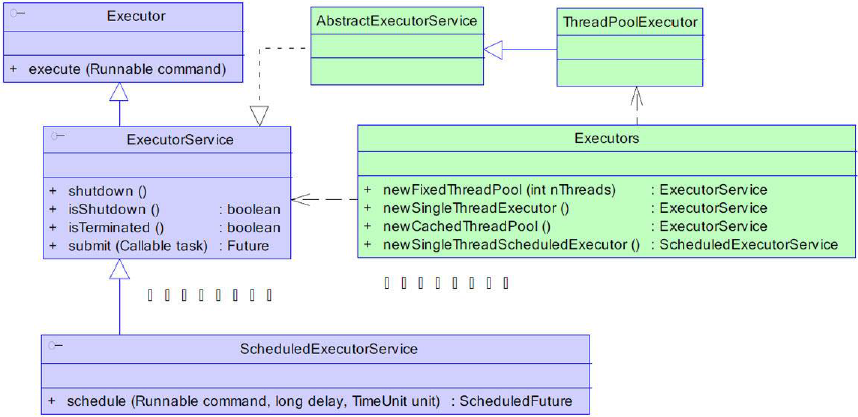

# 线程池的相关知识

## 线程池的组成

一般的线程池主要分为以下4 个组成部分：

1. 线程池管理器：用于创建并管理线程池
2. 工作线程：线程池中的线程
3. 任务接口：每个任务必须实现的接口，用于工作线程调度其运行
4. 任务队列：用于存放待处理的任务，提供一种缓冲机制

Java中的线程池是通过 Executor 框架实现的，该框架中用到了 Executor， Executors, ExecutorService, ThreadPoolExecutor, Callable, Future, FutureTask等



ThreadPoolExecutor 的构造方法如下：

```java
public ThreadPoolExecutor(int corePoolSize,int maximumPoolSize, long keepAliveTime,
    TimeUnit unit, BlockingQueue<Runnable> workQueue) {

    this(corePoolSize, maximumPoolSize, keepAliveTime, unit, workQueue
    ,Executors.defaultThreadFactory(), defaultHandler);
}
```

1. corePoolSize：指定了线程池中的线程数量。
2. maximumPoolSize：指定了线程池中的最大线程数量。
3. keepAliveTime：当前线程池数量超过corePoolSize 时，多余的空闲线程的存活时间，即多
次时间内会被销毁。
4. unit：keepAliveTime 的单位。
5. workQueue：任务队列，被提交但尚未被执行的任务。
6. threadFactory：线程工厂，用于创建线程，一般用默认的即可。
7. handler：拒绝策略，当任务太多来不及处理，如何拒绝任务。

备注：  对于计算密集型的任务，在拥有N个CPU处理器的系统上，当线程池的大小为 N+1个CPU个数时候，通常能实现最优的利用率。

可以通过以下方式获取CPU的数目:
```java
int N_CPUS = Runtime.getRuntime().availableProcessors();
```

## 拒绝策略

线程池中的线程已经用完了，无法继续为新任务服务，同时，等待队列也已经排满了，再也
塞不下新任务了。这时候我们就需要拒绝策略机制合理的处理这个问题。
JDK 内置的拒绝策略如下：
1. AbortPolicy ： 直接抛出异常，阻止系统正常运行。newFixedThreadPool默认使用。
2. CallerRunsPolicy ： 只要线程池未关闭，该策略直接在调用者线程中，运行当前被丢弃的
任务。显然这样做不会真的丢弃任务，但是，任务提交线程的性能极有可能会急剧下降。
3. DiscardOldestPolicy ： 丢弃最老的一个请求，也就是即将被执行的一个任务，并尝试再
次提交当前任务。
4. DiscardPolicy ： 该策略默默地丢弃无法处理的任务，不予任何处理。如果允许任务丢
失，这是最好的一种方案。
以上内置拒绝策略均实现了RejectedExecutionHandler 接口，若以上策略仍无法满足实际
需要，完全可以自己扩展RejectedExecutionHandler 接口。

```java
//AbortPolicy
//默认的拒绝策略，直接抛出RejectedExecutionException异常供调用者做后续处理
public void rejectedExecution(Runnable r, ThreadPoolExecutor e) {
    throw new RejectedExecutionException("Task " + r.toString() +
                                            " rejected from " +
                                            e.toString());
}

//DiscardPolicy
//不做任何处理，将任务直接抛弃掉
public void rejectedExecution(Runnable r, ThreadPoolExecutor e) {
}

//DiscardOldestPolicy
//抛弃队列中的下一个任务，然后尝试做提交。这个使用我觉得应该是在知道当前要提交的任务比较重要，必须要被执行的场景
public void rejectedExecution(Runnable r, ThreadPoolExecutor e) {
    if (!e.isShutdown()) {
        e.getQueue().poll();
        e.execute(r);
    }
}

//CallerRunsPolicy
//直接使用调用者线程执行，相当于同步执行，会阻塞调用者线程，不太友好感觉。
public void rejectedExecution(Runnable r, ThreadPoolExecutor e) {
    if (!e.isShutdown()) {
        r.run();
    }
}
```

## Java线程池的工作过程 （重要）

1. 线程池刚创建时，里面没有一个线程。任务队列是作为参数传进来的。不过，就算队列里面
有任务，线程池也不会马上执行它们。

2. 当调用 execute() 方法添加一个任务时，线程池会做如下判断：
- a) 如果正在运行的线程数量小于 corePoolSize，那么马上创建线程运行这个任务；
- b) 如果正在运行的线程数量大于或等于 corePoolSize，那么将这个任务放入队列；
- c) 如果这时候队列满了，而且正在运行的线程数量小于 maximumPoolSize，那么还是要
创建非核心线程立刻运行这个任务；
- d) 如果队列满了，而且正在运行的线程数量大于或等于 maximumPoolSize，那么线程池
会抛出异常RejectExecutionException。

3. 当一个线程完成任务时，它会从队列中取下一个任务来执行。

4. 当一个线程无事可做，超过一定的时间（keepAliveTime）时，线程池会判断，如果当前运
行的线程数大于 corePoolSize，那么这个线程就被停掉。所以线程池的所有任务完成后，它
最终会收缩到 corePoolSize 的大小。

## Executors创建返回ThreadPoolExecutor对象

`Executors`创建返回ThreadPoolExecutor对象的方法共有三种：

- Executors#newCachedThreadPool => 创建可缓存的线程池
- Executors#newSingleThreadExecutor => 创建单线程的线程池
- Executors#newFixedThreadPool => 创建固定长度的线程池

## Executors#newCachedThreadPool方法

```java
public static ExecutorService newCachedThreadPool() {
    return new ThreadPoolExecutor(0, Integer.MAX_VALUE,
                                  60L, TimeUnit.SECONDS,
                                  new SynchronousQueue<Runnable>());
}

```
`CachedThreadPool`是一个根据需要创建新线程的线程池

- corePoolSize => 0，核心线程池的数量为0
- maximumPoolSize => Integer.MAX_VALUE，可以认为最大线程数是无限的
- keepAliveTime => 60L
- unit => 秒
- workQueue => SynchronousQueue

当一个任务提交时，`corePoolSize`为0不创建核心线程，`SynchronousQueue`是一个不存储元素的队列，可以理解为队里永远是满的，因此最终会创建非核心线程来执行任务。对于非核心线程空闲60s时将被回收。因为Integer.MAX_VALUE非常大，可以认为是可以无限创建线程的，在资源有限的情况下容易引起OOM异常

## Executors#newSingleThreadExecutor方法

```java
public static ExecutorService newSingleThreadExecutor() {
    return new FinalizableDelegatedExecutorService
        (new ThreadPoolExecutor(1, 1,
                                0L, TimeUnit.MILLISECONDS,
                                new LinkedBlockingQueue<Runnable>()));
}

```
`SingleThreadExecutor`是单线程线程池，只有一个核心线程

- corePoolSize => 1，核心线程池的数量为1 (重要)
- maximumPoolSize => 1，只可以创建一个非核心线程(重要)
- keepAliveTime => 0L
- unit => 毫秒
- workQueue => LinkedBlockingQueue

当一个任务提交时，首先会创建一个核心线程来执行任务，如果超过核心线程的数量，将会放入队列中，因为`LinkedBlockingQueue`是长度为Integer.MAX_VALUE的队列，可以认为是无界队列，因此往队列中可以插入无限多的任务，在资源有限的时候容易引起OOM异常，同时因为无界队列，`maximumPoolSize`和`keepAliveTime`参数将无效，压根就不会创建非核心线程

## Executors#newFixedThreadPool方法

```java
public static ExecutorService newFixedThreadPool(int nThreads) {
    return new ThreadPoolExecutor(nThreads, nThreads,
                                  0L, TimeUnit.MILLISECONDS,
                                  new LinkedBlockingQueue<Runnable>());
}

```
`FixedThreadPool`是固定核心线程的线程池，固定核心线程数由用户传入

## 如何定义线程池参数

- CPU密集型 => 线程池的大小推荐为`CPU`数量 + 1，`CPU`数量可以根据`Runtime.availableProcessors`方法获取

- IO密集型 => `CPU数量` * `CPU利用率` * (1 + 线程等待时间/线程CPU时间)

- 混合型 => 将任务分为`CPU密集型`和`IO密集型`，然后分别使用不同的线程池去处理，从而使每个线程池可以根据各自的工作负载来调整

- 阻塞队列 => 推荐使用有界队列，有界队列有助于避免资源耗尽的情况发生

- 拒绝策略 => 默认采用的是`AbortPolicy`拒绝策略，直接在程序中抛出

`RejectedExecutionException`异常【因为是运行时异常，不强制catch】，这种处理方式不够优雅。处理拒绝策略有以下几种比较推荐：

---


## 如何设置一个合适的线程池大小？

如何设置一个合适的线程池大小，这个问题我觉得是`没有一个固定公式`的。或者可以说，只有一些简单的设置规则，但放到具体业务中，又各有不同，只能根据现场环境测试过后再来分析。

设置合适的线程池大小分为两部分，一部分是最大线程池大小，一部分是最小线程池大小。在ThreadPoolExecutor中体现在最大线程数(maximumPoolSize)和核心线程数(corePoolSize)。

最大线程池大小的设置首先跟当前机器`cpu核心数密切相关`，一般情况来说要想最大化利用cpu，设置为cpu核心数就可以了，比如4核cpu服务器可以设置为4。但实际情况又大有不同，因为往往我们执行的任务都会涉及到IO，比如任务中执行了一个从数据库查询数据的操作，那么这段时间cpu实际上是没有最大化利用的，这样我们就可以适当扩大maximumPoolSize的大小。在有些情况下任务会是cpu密集型的，如果这样设置更多的线程不仅不会提高效率，反而因为线程的创建销毁以及切换开销而大大降低了效率，所以说最大线程池的大小需要根据业务情况具体测试后才能设置一个合适的大小。

最小线程池大小相比较最大线程池大小设置起来相对容易一些，因为最小线程一般来说是可以根据业务情况来预估进行设置，比如大多数情况下会有2个任务在运行，很小概率会有超过2个任务运行，那么直接设置最小线程池大小为2就可以。但有一点需要知道的是每间隔多长时间会有超过2个任务，如果每2分钟会有一次超过2个任务的情况，那么我们可以将线程`过期时间设置的稍微久`一点，比如4分钟，这样就算频繁的超过2个任务，也可以利用缓存的线程池。

总的来说设置最大和最小线程池都是一个没有固定公式的问题，都需要考虑实际业务情况和机器配置，根据实际业务情况多做测试才能做到最优化设置。在一切没有决定之前，可以使用软件架构的KISS原则，设置最大以及最小线程数都为cpu核心数即可，后续在做优化。

## 当使用有界队列时，如何设置一个合适的队列大小？

要设置合适的队列大小，先要明白队列什么时候会被使用。在ThreadPoolExecutor的实现中，使用队列的情况有点特殊。它会先使用核心线程池大小的线程，之后会将任务加入队列中，再之后队列满了之后才会扩大到最大线程池大小的线程。也就是说队列的使用并不是等待线程不够用了才使用，而是等待核心线程不够用了就使用。我不是太能理解这样设计的意图，按《Java性能权威权威指南》一书中的说法是这样提供了两个节流阀，第一个是队列，第二个是最大线程池。但这样做并不能给使用者最优的体验，既然要使用最大线程池，那为什么不在第一次就使用呢？

知道了ThreadPoolExecutor使用线程池的时机，那么再来预估合适的队列大小就很方便了。如果单个任务执行时间在100ms，最小线程数是2，使用者能忍受的最大延时在2s，那么我们可以这样简单推算出队列大小：2/2s/100ms=10，这样满队列时最大延时就在2s之内。当然还有其他一些影响因素，比如部分任务超过或者小于100ms，最大线程池的利用等等，可以在这基础上做简单调整。

## Executor 的中断操作
调用 Executor 的 shutdown() 方法会等待线程都执行完毕之后再关闭，但是如果调用的是 shutdownNow() 方法，
则相当于调用每个线程的 interrupt() 方法。但是只有哪些受interrupt 影响的线程才会中断，不保证其他线程中断，并且remove掉队列中的东西。

如果只想中断 Executor 中的一个线程，可以通过使用 submit() 方法来提交一个线程，它会返回一个 Future<?> 对
象，通过调用该对象的 cancel(true) 方法就可以中断线程。

```java
Future<?> future = executorService.submit(() -> {
// ..
});
future.cancel(true);
```

## 参考
[阿里巴巴禁止使用Excutors创建线程池](https://juejin.im/post/5dc41c165188257bad4d9e69)

[有关线程池的十个问题](https://www.cnblogs.com/konck/p/9473681.html)

