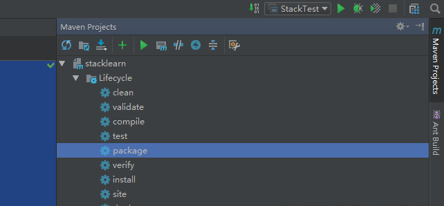

工作量:

0. maven发包
1. 完成死循环的查找
2. 完成CPU使用情况的查找
3. 完成内存使用情况的查找
4. 内存泄露

> 线程堆栈的基本信息如下：

1. 线程的名字，ID，线程的数量等。

2. 线程的运行状态，锁的状态（ 锁被哪个线程持有， 哪个线程在等待锁等）。

3. 调用堆栈（ 即函数的调用层次关系）。 调用堆栈包含完整的类名， 所执行方法， 源代码的行数。


> 可以分析的问题

线程死锁、 锁争用、 死循环、 识别耗时操作等等。 在多线程场合下的稳定性问题分析和性能问题分析， 线程堆栈分析是最有效的方法和手段， 可以说是杀手锏，在多数情况下甚至无需对系统了解就可以进行相应的分析。

## 准备
> 今天在idea中使用 lambda表达式的时候，提示 语言版本不够，刚开始认为是jdk版本，发现jdk版本没有问题，问了度娘，需要更改一个设置，File -> ProjectStructure-> 自己的project -> Language Level设置为与JDK版本一致的;Settings -> Build,execution,Deployment->Compiler -> JavaCompiler自己的module也需要设置为同语言版本的。

## 代码示例

```java
/**
 * Created by zhenguo.hou on 2019/9/5.
 */
public class StackTest {
	public static void main(String[] args) {
		ExecutorService executorService = Executors.newFixedThreadPool(5);
		Object object1 = new Object();
		Object object2 = new Object();
		Runnable runnable =()-> {
			synchronized (object1)
			{
				try
				{
					Thread.sleep(1000L);
				}catch (Exception e)
				{
					e.printStackTrace();
				}
				synchronized (object2)
				{
					System.out.println("aaa");
				}

			}
		};
		Runnable runnable2 =()-> {
			synchronized (object2)
			{
				try
				{
					Thread.sleep(1000L);
				}catch (Exception e)
				{
					e.printStackTrace();
				}
				synchronized (object1)
				{
					System.out.println("bbb");
				}

			}
		};
		executorService.execute(runnable);
		executorService.execute(runnable2);
	}
}
```
以上代码是一个死锁的demo。通过idea打印出来的stack部分信息如下：
```
===================================================
"pool-1-thread-2":
	at StackTest.lambda$main$1(StackTest.java:41)
	- waiting to lock <0x00000000d5bb4a58> (a java.lang.Object)
	- locked <0x00000000d5bb4a68> (a java.lang.Object)
	at StackTest$$Lambda$2/1831932724.run(Unknown Source)
	at java.util.concurrent.ThreadPoolExecutor.runWorker(ThreadPoolExecutor.java:1142)
	at java.util.concurrent.ThreadPoolExecutor$Worker.run(ThreadPoolExecutor.java:617)
	at java.lang.Thread.run(Thread.java:748)
"pool-1-thread-1":
	at StackTest.lambda$main$0(StackTest.java:24)
	- waiting to lock <0x00000000d5bb4a68> (a java.lang.Object)
	- locked <0x00000000d5bb4a58> (a java.lang.Object)
	at StackTest$$Lambda$1/1096979270.run(Unknown Source)
	at java.util.concurrent.ThreadPoolExecutor.runWorker(ThreadPoolExecutor.java:1142)
	at java.util.concurrent.ThreadPoolExecutor$Worker.run(ThreadPoolExecutor.java:617)
	at java.lang.Thread.run(Thread.java:748)

Found 1 deadlock.

```
通过堆栈信息可以发现，thread1 与 thread2分别在等待对方持有的锁。造成了死锁。

## 打包 发布

本次测试使用的是 IDEA + Maven环境,直接使用Maven进行打包
1. 需要配置maven 的pom.xml文件 在文件中新加

```xml
<!-- compile package -->
    <build>
        <plugins>
            <plugin>
                <groupId>org.apache.maven.plugins</groupId>
                <artifactId>maven-compiler-plugin</artifactId>
                <configuration>
                    <source>1.8</source>
                    <target>1.8</target>
                </configuration>
            </plugin>
            <plugin>
                <groupId>org.apache.maven.plugins</groupId>
                <artifactId>maven-jar-plugin</artifactId>
                <configuration>
                    <archive>
                        <manifest>
                            <addClasspath>true</addClasspath>
                            <useUniqueVersions>false</useUniqueVersions>
                            <classpathPrefix>lib/</classpathPrefix>
                            <mainClass>StackTest</mainClass>
                        </manifest>
                    </archive>
                </configuration>
            </plugin>
        </plugins>
    </build>

```
2. package



完成打包之后，jar包会出现在 项目下的  target目录下面.

可以在cmd 或者 gitbash中启动 java -jar xxx.jar  / nohup 开头

## cmd 下的堆栈信息：

```dos
C:\Users\Administrator>jps -l
12752 stacklearn-1.0-SNAPSHOT.jar
17828 org.jetbrains.idea.maven.server.RemoteMavenServer
19140 sun.tools.jps.Jps
17196

jstack 12752 > aa.txt // 注意这时候输出到了当前文件夹，
或者 jstack 12752
```
通过cmd会看到同样的问题。

## Linux下的查找

1. 将jar包上传 
2. 写 start.sh脚本
```bash
#!/bin/bash
java -jar stacklearn-1.0-SNAPSHOT.jar

```

3. 启动脚本
4. 查看当前的java 线程

```bash
ps -ef | grep java
root       4584   4583  0 19:41 pts/1    00:00:00 java -jar stacklearn-1.0-SNAPSHOT.jar
root       4781   4709  0 19:42 pts/2    00:00:00 grep --color=auto java

```
找到项目相关的进程，

5. 通过命令

```bash
[root@localhost foo]# jstack 4584
2019-09-04 19:42:58

```

##  堆栈信息解析

```
"pool-1-thread-1" #8 prio=5 os_prio=0 tid=0x00007ff5e0130000 nid=0x11f2 waiting for monitor entry [0x00007ff5e5a07000]
   java.lang.Thread.State: BLOCKED (on object monitor)
	at StackTest.lambda$main$0(StackTest.java:25)
	- waiting to lock <0x00000000f0a6a730> (a java.lang.Object)
	- locked <0x00000000f0a6a720> (a java.lang.Object)
	at StackTest$$Lambda$1/1406718218.run(Unknown Source)
	at java.util.concurrent.ThreadPoolExecutor.runWorker(ThreadPoolExecutor.java:1149)
	at java.util.concurrent.ThreadPoolExecutor$Worker.run(ThreadPoolExecutor.java:624)
	at java.lang.Thread.run(Thread.java:748)

```

1. "pool-1-thread-1" 线程的名字
2. prio=5 线程优先级
3. tid=0x00007ff5e0130000 线程id，这个不重要
4. nid=0x11f2 线程度一应的本地线程的id号，这个重要 （printf "%x\n" id）
5. [0x00007ff5e5a07000] 线程占用内存的地址
6. 线程的状态 running  or blocked


 Java代码中创建一个thread， 虚拟机在运行期就会创建一个对应的本地线程， 而这个本地线程才是真正的线程实体。也就是说一个 Java 线程的创建根本上就对应了一个本地线程（native thread）的创建，两者是一一对应的。

可以使用如下方式产生java的本地线程信息：

1. 使用ps -ef | grep java 获得Java进程ID。

2. 使用jstack <java pid>获得Java虚拟机的本地线程的堆栈

 只不过java线程中的nid中用==十六进制==来表示， 而本地线程中的id用十进制表示。
@copyright houzhenguo