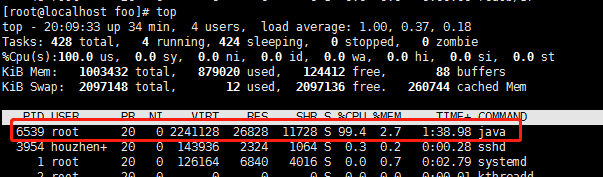
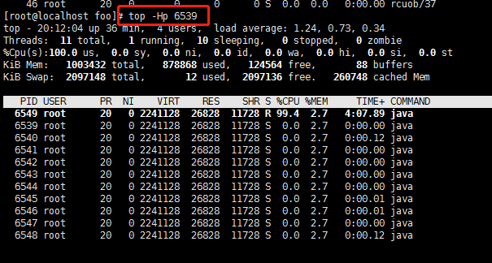
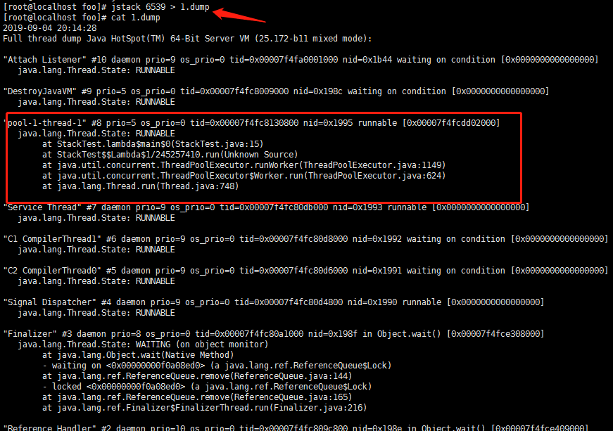
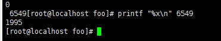

## 准备 

Java定位CPU过高的线程与 堆栈的查找过程基本是保持一致的。代码部分做了部分修改。

```java
public class StackTest {
	public static void main(String[] args) {
		ExecutorService executorService = Executors.newFixedThreadPool(5);
		System.out.println("begin");
		Runnable runnable =()-> {
			int i =1;
			while (true)
			{
				i =1;
			}
		};
		executorService.execute(runnable);
	}
}
```

## Linux 步骤

1. 在linux终端输入top命令查看消耗cpu比较高的进程（ 按 q 退出）
如下图，找到PID=6539的进程，消耗了99.4%的CPU资源，排在第一位



2. 输入 top -Hp 6539 列出当前进程下的所有线程。找到消耗cpu比较高的线程，获取到该线程编号是，6549



3. 使用jstack 6539 > 1.tdump对当前Java进程做dump，获取Java线程堆栈信息，摘取部分信息如下



将上面的 线程号 6549 转换成16进制（printf "%x\n" 6549）。是1995 与java打出的堆栈中的一致，确认就是该线程占用了很多的CPU资源。



将上面的 线程号 31111 转换成16进制（printf "%x\n" 31111）。是7987 与java打出的堆栈中的一致，确认就是该线程占用了很多的CPU资源。

接下来就是分析堆栈的问题.

@copyright houzhenguo