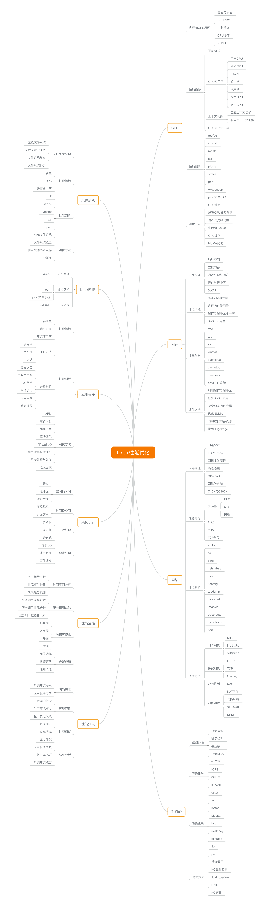
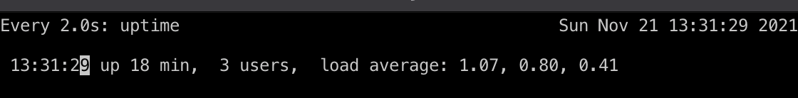
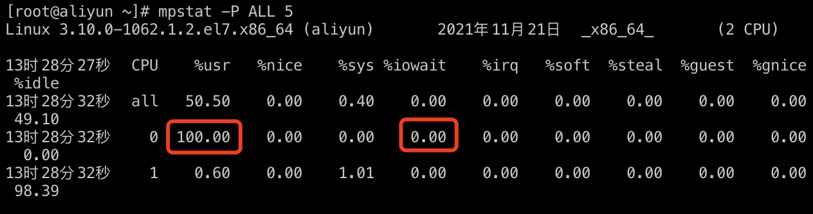
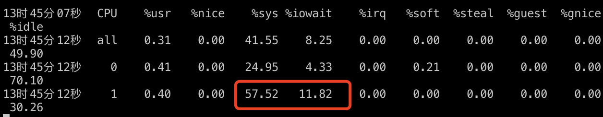
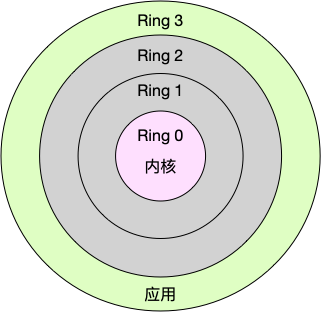

https://time.geekbang.org/column/article/68728
# 开篇
1. 把观察到的性能问题跟系统原理关联起来，特别是把系统从应用程序、库函数、系统调用、再到内核和硬件等不同的层级贯穿起来
2. CPU性能 磁盘IO性能 内存性能 网络性能

3. 思维导图

## 思考
1. 虽然系统的原理很重要，但在刚开始一定不要试图抓住所有的实现细节。
2. 高并发 => 吞吐 响应快 => 延时

## 环境准备
1. docker pull centos
2. docker run -it centos ./bin/bash
3. docker exec -it 7d8d017aa5dd /bin/bash

# CPU 性能
##  平均负载
1. 执行 top 命令或者 update 命令
```shell
uptime
11:53  up 51 mins, 2 users, load averages: 1.94 2.11 2.88
```
过去 1 分钟、5 分钟、15 分钟的平均负载（Load Average）
2. 概念
平均负载是指单位时间内，系统处于`可运行状态`和`不可中断状态`的平均进程数，也就是平均活跃进程数，它和 CPU 使用率并没有直接关系。
> 平均负载其实就是平均活跃进程数
CPU+IO 针对CPU和IO的耗性。
> 可运行状态的进程，是指正在使用 CPU 或者正在等待 CPU 的进程，也就是我们常用 ps 命令看到的，处于 R 状态（Running 或 Runnable）的进程
> 不可中断状态的进程则是正处于内核态关键流程中的进程，并且这些流程是不可打断的，比如最常见的是等待硬件设备的 I/O 响应，也就是我们在 ps 命令中看到的 D 状态（Uninterruptible Sleep，也称为 Disk Sleep）的进程。

3. 查询cpu 个数的命令
```shell
# 关于grep和wc的用法请查询它们的手册或者网络搜索
grep 'model name' /proc/cpuinfo | wc -l
6
# 或者 
lscpu
```
有了 CPU 个数，我们就可以判断出，当平均负载比 CPU 个数还大的时候，系统已经出现了过载。

4. 平均负载高出多少需要排查
当平均负载高于 CPU 数量 70% 的时候，你就应该分析排查负载高的问题了。一旦负载过高，就可能导致进程响应变慢，进而影响服务的正常功能。
5. 平均负载和CPU使用率的关系
a. 平均负载其实是包含 等在使用的CPU进程，还包含 正在等待的CPU进程和等待IO的进程
b. CPU使用率是单位时间内CPU繁忙时间的统计
所以 平均负载和 CPU的使用率并不是完全对应。

- CPU 密集型进程，使用大量 CPU 会导致平均负载升高，此时这两者是一致的；
- I/O 密集型进程，等待 I/O 也会导致平均负载升高，但 CPU 使用率不一定很高；
- 大量等待 CPU 的进程调度也会导致平均负载升高，此时的 CPU 使用率也会比较高。
总结来看： CPU 负载高，并不代表CPU使用率高，还有可能是等待IO线程导致。

# 平均负载实战
机器环境 2C4M
```shell
yum install -y stress
yum install -y sysstat
```
平均负载除了使用uptime，也可以使用top命令
stress 是Linux 系统压力测试工具，用异常进程模拟平均负载过高的场景。
sysstat 是性能工具，用来做数据监控。
我们的案例会用到这个包的两个命令 mpstat 和 pidstat。
- mpstat 是一个常用的多核 CPU 性能分析工具，用来实时查看每个 CPU 的性能指标，以及所有 CPU 的平均指标。
- pidstat 是一个常用的进程性能分析工具，用来实时查看进程的 CPU、内存、I/O 以及上下文切换等性能指标。

## 相关命令
cpu核数: lscpu、 grep 'model name' /proc/cpuinfo | wc -l
显示平均负载：uptime、top，显示的顺序是最近1分钟、5分钟、15分钟，从此可以看出平均负载的趋势
watch -d uptime: -d会高亮显示变化的区域
strees: 压测命令，--cpu cpu压测选项，-i io压测选项，-c 进程数压测选项，--timeout 执行时间
mpstat: 多核cpu性能分析工具，-P ALL监视所有cpu
pidstat: 进程性能分析工具，-u 显示cpu利用率

建议使用top命令查看负载以及 cpu使用情况。

## 场景1
CPU密集型进程
```shell
stress --cpu 1 --timeout 600 # 模拟一个cpu 100%的场景
```
开始之前的负载
```shell
[root@aliyun ~]# uptime
 13:22:06 up 9 min,  1 user,  load average: 0.01, 0.04, 0.04
```
打开另外一个终端
```shell
# -d 参数表示高亮显示变化的区域$ watch -d uptime
Every 2.0s: uptime                                      Sun Nov 21 13:26:48 2021

 13:26:48 up 13 min,  2 users,  load average: 0.90, 0.39, 0.18
```


再打开一个终端，查看CPU使用率。
```
# -P ALL 表示监控所有CPU，后面数字5表示间隔5秒后输出一组数据
[root@aliyun ~]# mpstat -P ALL 5
Linux 3.10.0-1062.1.2.el7.x86_64 (aliyun) 	2021年11月21日 	_x86_64_	(2 CPU)

13时28分27秒  CPU    %usr   %nice    %sys %iowait    %irq   %soft  %steal  %guest  %gnice   %idle
13时28分32秒  all   50.50    0.00    0.40    0.00    0.00    0.00    0.00    0.00    0.00   49.10
13时28分32秒    0  100.00    0.00    0.00    0.00    0.00    0.00    0.00    0.00    0.00    0.00
13时28分32秒    1    0.60    0.00    1.01    0.00    0.00    0.00    0.00    0.00    0.00   98.39
```

从终端二中可以看到，1 分钟的平均负载会慢慢增加到 1.00，而从终端三中还可以看到，正好有一个 CPU 的使用率为 100%，但它的 iowait 只有 0。这说明，平均负载的升高正是由于 CPU 使用率为 100% 。

到底是哪个进程导致了 CPU 使用率为 100% 呢？你可以使用 pidstat 来查询

```shell
# 间隔5秒后输出一组数据
[root@aliyun ~]# pidstat -u 5 1
Linux 3.10.0-1062.1.2.el7.x86_64 (aliyun) 	2021年11月21日 	_x86_64_	(2 CPU)

13时38分24秒   UID       PID    %usr %system  %guest    %CPU   CPU  Command
13时38分29秒   997      1186    0.20    0.00    0.00    0.20     1  mysqld
13时38分29秒     0      1236    0.40    1.00    0.00    1.40     1  AliYunDun
13时38分29秒     0      2096  100.00    0.00    0.00  100.00     0  stress

```
从这里可以明显看到，stress 进程的 CPU 使用率为 100%


## 场景二

首先还是运行 stress 命令，但这次模拟 I/O 压力，即不停地执行 sync：

```shell
stress -i 1 --timeout 600
```
然后另外一个终端
```shell
watch -d uptime
Every 2.0s: uptime                                                               Sun Nov 21 13:42:23 2021

 13:42:23 up 29 min,  4 users,  load average: 0.92, 0.72, 0.53
```
过去1分钟的负载在逐渐的变成1
然后使用另外的终端查看cpu的使用情况
```shell
mpstat -P ALL 5 1
```


从这里可以看到，1 分钟的平均负载会慢慢增加到 1.05，其中一个 CPU 的系统 CPU 使用率升高到了 57.52，而 iowait 高达 11.822%。这说明，平均负载的升高是由于 iowait 的升高。

那么到底是哪个进程，导致 iowait 这么高呢？我们还是用 pidstat 来查询：

```shell
[root@aliyun ~]# pidstat -u 5 1
Linux 3.10.0-1062.1.2.el7.x86_64 (aliyun) 	2021年11月21日 	_x86_64_	(2 CPU)

13时46分55秒   UID       PID    %usr %system  %guest    %CPU   CPU  Command
13时47分00秒     0        48    0.00    4.00    0.00    4.00     0  kworker/u4:1
13时47分00秒     0       318    0.00    1.60    0.00    1.60     1  kworker/1:1H
13时47分00秒     0       325    0.00    0.40    0.00    0.40     0  kworker/0:1H
13时47分00秒     0       930    0.00    0.20    0.00    0.20     1  aliyun-service
13时47分00秒     0      1236    0.60    1.00    0.00    1.60     0  AliYunDun
13时47分00秒     0      2123    0.20   80.40    0.00   80.60     1  stress  # 
13时47分00秒     0      2462    0.00    0.20    0.00    0.20     0  pidstat
```
可以发现，还是 stress 进程导致的。

## 大量进程的场景
当系统中运行进程超出 CPU 运行能力时，就会出现等待 CPU 的进程。

我们还是使用 stress，但这次模拟的是 8 个进程：
```shell
stress -c 8 --timeout 600
```
此时的loadaverage 已经很高了。
```shell
Every 2.0s: uptime                                                               Sun Nov 21 13:51:04 2021

 13:51:04 up 38 min,  4 users,  load average: 8.28, 3.13, 1.49
```
达到了 8.28平均负载

```shell
pidstat -u 5 1
13时52分18秒   UID       PID    %usr %system  %guest    %CPU   CPU  Command
13时52分23秒     0      1236    0.40    0.20    0.00    0.60     1  AliYunDun
13时52分23秒     0      2132    0.00    0.20    0.00    0.20     1  watch
13时52分23秒     0      2672   24.95    0.00    0.00   24.95     1  stress
13时52分23秒     0      2673   24.95    0.00    0.00   24.95     1  stress
13时52分23秒     0      2674   25.15    0.00    0.00   25.15     0  stress
13时52分23秒     0      2675   24.95    0.00    0.00   24.95     0  stress
13时52分23秒     0      2676   24.75    0.00    0.00   24.75     1  stress
13时52分23秒     0      2677   24.75    0.00    0.00   24.75     0  stress
13时52分23秒     0      2678   24.95    0.00    0.00   24.95     1  stress
13时52分23秒     0      2679   24.95    0.00    0.00   24.95     0  stress
```

可以看出，8 个进程在争抢 2 个 CPU，每个进程等待 CPU 的时间（也就是代码块中的 %wait 列）高达 75%。这些超出 CPU 计算能力的进程，最终导致 CPU 过载。

## 总结
平均负载提供了一个快速查看系统整体性能的手段，反映了整体的负载情况。但只看平均负载本身，我们并不能直接发现，到底是哪里出现了瓶颈。所以，在理解平均负载时，也要注意：
- 平均负载高有可能是 CPU 密集型进程导致的；
- 平均负载高并不一定代表 CPU 使用率高，还有可能是 I/O 更繁忙了；
- 当发现负载高的时候，你可以使用 mpstat、pidstat 等工具，辅助分析负载的来源


## 优秀评论
对与java应用，首先会通过top来查看占用CPU最对的进程，然后通过top -H -p pid 来查看占用CPU最多的线程，得到线程id转化成十六进制，然后通过jstack pid 导出当前线程栈信息，找到对应的线程栈信息，查看具体代码(是否有死循环、是否gc很频繁) ，如果没有找到问题，我们再看占用内存最多的进程，和我们启动时配置上设定的内存做比较，如果接近 那么说明内存资源紧张，然后再通过jstat -gcutil 1s、jmap -histo:live命令查看java中gc回收情况以及创建对象的个数 来分析出是我们内存配置(年轻代或年老代配置不合理、gc回收器配置不恰当)问题还是代码中存在内存溢出。


# 上下文切换

## 概念
多个进程竞争CPU会导致上下文切换，而上下文切换是有损耗的，CPU寄存器和程序计数器，cpu需要知道
从哪里开始。

`CPU 寄存器`，是 CPU 内置的容量小、但速度极快的内存。
而`程序计数器`，则是用来存储 CPU 正在执行的指令位置、或者即将执行的下一条指令位置。它们都是 CPU 在运行任何任务前，必须的依赖环境，因此也被叫做 CPU 上下文。

CPU 上下文切换，就是先把前一个任务的 CPU 上下文（也就是 CPU 寄存器和程序计数器）保存起来，然后加载新任务的上下文到这些寄存器和程序计数器，最后再跳转到程序计数器所指的新位置，运行新任务。而这些保存下来的上下文，会存储在系统内核中，并在任务重新调度执行时再次加载进来。这样就能保证任务原来的状态不受影响，让任务看起来还是连续运行。

根据任务的不同，CPU 的上下文切换就可以分为几个不同的场景，也就是进程上下文切换、线程上下文切换以及中断上下文切换

## 进程上下文切换
Linux 按照特权等级，把进程的运行空间分为内核空间和用户空间，分别对应着下图中， CPU 特权等级的 Ring 0 和 Ring 3。
- 内核空间（Ring 0）具有最高权限，可以直接访问所有资源；
- 用户空间（Ring 3）只能访问受限资源，不能直接访问内存等硬件设备，必须通过系统调用陷入到内核中，才能访问这些特权资源。


进程既可以在内核空间又可以在用户空间运行。
分别叫做进程内核态，进程用户态。

QA: 用户态到内核态切换

用户态指令存储到 cpu寄存器
-> 调用内核态到吗
-> 将内核态指令存储
-> 恢复用户态数据
-> 完成了两次的上下文切换。

总结来开：

用户态-> 内核态 -> 
内核态 -> 用户态

从用户态到内核态的转变，需要通过系统调用来完成。比如，当我们查看文件内容时，就需要多次系统调用来完成：首先调用 open() 打开文件，然后调用 read() 读取文件内容，并调用 write() 将内容写到标准输出，最后再调用 close() 关闭文件。那么，系统调用的过程有没有发生 CPU 上下文的切换呢？答案自然是肯定的。CPU 寄存器里原来用户态的指令位置，需要先保存起来。接着，为了执行内核态代码，CPU 寄存器需要更新为内核态指令的新位置。最后才是跳转到内核态运行内核任务。而系统调用结束后，CPU 寄存器需要恢复原来保存的用户态，然后再切换到用户空间，继续运行进程。所以，一次系统调用的过程，其实是发生了两次 CPU 上下文切换。

系统上下文切换虽然不涉及 进程的上下文切换，这种被称作特权模式切换，而不是上下文切换。

## 真正进程的上下文切换
1. 进程的上下文不仅包括了虚拟内存、栈、全局变量等用户空间的资源，还包括了内核堆栈、寄存器等内核空间的状态。因此，进程的上下文切换就比系统调用时多了一步：在保存当前进程的内核状态和 CPU 寄存器之前，需要先把该进程的虚拟内存、栈等保存下来；而加载了下一进程的内核态后，还需要刷新进程的虚拟内存和用户栈。

每次上下文切换都需要几十纳秒到数微秒的 CPU 时间。这个时间还是相当可观的，特别是在进程上下文切换次数较多的情况下，很容易导致 CPU 将大量时间耗费在寄存器、内核栈以及虚拟内存等资源的保存和恢复上，进而大大缩短了真正运行进程的时间。这也正是上一节中我们所讲的，导致平均负载升高的一个重要因素。

总结：上下文切换，是 内核空间 进程的切换，会恢复 寄存器，内核栈，虚拟内存等，如果花费在这上面的时间过多，就会占用实际的运行时间。

## 进程什么时候被运行
1. 进程被分配时间片耗尽，就会被挂起。
2. 资源不足的时候被挂起，等待资源充足。
3. sleep函数主动挂起。
4. 有更高优先级的进程需要运行

## 线程上下文切换
1. 线程是CPU调度的基本单位，而进程是 资源分配的基本单位。
2. 线程上下文切换可以分为同进程，和不同进程。
相同进程的，虚拟内存是共享的不需要切换，只需要切换线程私有的栈啥的即可。相比进程切换，成本要低很多。

## 中断上下文切换
1. 为了快速响应硬件的事件，中断处理会打断进程的正常调度和执行，转而调用中断处理程序，响应设备事件。而在打断其他进程时，就需要将进程当前的状态保存下来，这样在中断结束后，进程仍然可以从原来的状态恢复运行。

## 总结
- CPU 上下文切换，是保证 Linux 系统正常工作的核心功能之一，一般情况下不需要我们特别关注。
- 但过多的上下文切换，会把 CPU 时间消耗在寄存器、内核栈以及虚拟内存等数据的保存和恢复上，从而缩短进程真正运行的时间，导致系统的整体性能大幅下降。
## 优秀评论
进程切换我想到了很多年前在银行柜台办理业务的情形。
1：银行分配各个窗口给来办理业务的人
2：如果只有1个窗口开放（系统资源不足），大部分都得等
3：如果正在办理业务的突然说自己不办了（sleep）,那他就去旁边再想想（等）
4：如果突然来了个VIP客户，可以强行插队
5：如果突然断电了（中断），都得等。。

## 实战
```shell
[root@aliyun ~]# vmstat
procs -----------memory---------- ---swap-- -----io---- -system-- ------cpu-----
 r  b   swpd   free   buff  cache   si   so    bi    bo   in   cs us sy id wa st
 1  0      0 2771476  25988 501784    0    0    13     6 1095  427  9  2 88  0  0
```
- cs（context switch）是每秒上下文切换的次数。当前是 427次
- in（interrupt）则是每秒中断的次数。
- r（Running or Runnable）是就绪队列的长度，也就是正在运行和等待 CPU 的进程数。
- b（Blocked）则是处于不可中断睡眠状态的进程数。

查看每个进程上下文切换的情况
```shell
pidstat -w 5
```
```shell
[root@aliyun ~]# vmstat
procs -----------memory---------- ---swap-- -----io---- -system-- ------cpu-----
 r  b   swpd   free   buff  cache   si   so    bi    bo   in   cs us sy id wa st
 1  0      0 2771476  25988 501784    0    0    13     6 1095  427  9  2 88  0  0
[root@aliyun ~]# pidstat -w 5
Linux 3.10.0-1062.1.2.el7.x86_64 (aliyun) 	2021年11月21日 	_x86_64_	(2 CPU)

17时15分01秒   UID       PID   cswch/s nvcswch/s  Command
17时15分06秒     0         9     32.00      0.00  rcu_sched
17时15分06秒     0        11      0.20      0.00  watchdog/0
```
这个结果中有两列内容是我们的重点关注对象。一个是 cswch ，表示每秒自愿上下文切换（voluntary context switches）的次数，另一个则是 nvcswch ，表示每秒非自愿上下文切换（non voluntary context switches）的次数。

- 所谓自愿上下文切换，是指进程无法获取所需资源，导致的上下文切换。比如说， I/O、内存等系统资源不足时，就会发生自愿上下文切换。
- 而非自愿上下文切换，则是指进程由于时间片已到等原因，被系统强制调度，进而发生的上下文切换。比如说，大量进程都在争抢 CPU 时，就容易发生非自愿上下文切换。

## 实战上下文切换
开始前准备，先查看一下当前的状态。
```shell
[root@aliyun ~]# vmstat 1 1
procs -----------memory---------- ---swap-- -----io---- -system-- ------cpu-----
 r  b   swpd   free   buff  cache   si   so    bi    bo   in   cs us sy id wa st
 1  0      0 2311948  52056 806036    0    0     3     1   59   28  2  1 98  0  0
```
我们可以cs上下文切换28，in 中断59，r(正在运行的是1)，b 不可中断休眠状态是 0


