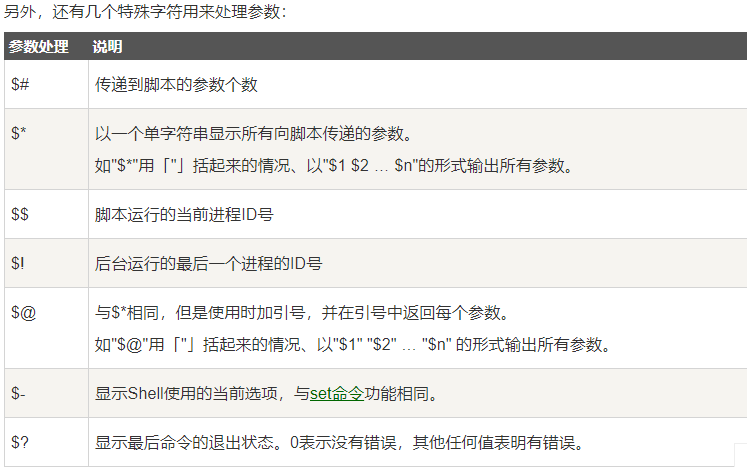

# shell

[shell菜鸟教程](https://www.runoob.com/linux/linux-shell.html)

本文为 shell 练习的一次整理。平时使用 shell写 启动 关闭脚本。在本文的最后可以整理一版 shell 相关的用法。

# shell 入门

vim test.sh

```bash
#!/bin/bash
echo "hello world"
```
#! 是一个约定的标记，它告诉系统这个脚本需要什么解释器来执行，即使用哪一种 Shell。

运行shell:
```bash
chmod +x ./test.sh  #使脚本具有执行权限
./test.sh  #执行脚本
```

直接写 test.sh，linux 系统会去 PATH 里寻找有没有叫 test.sh 的，而只有 /bin, /sbin, /usr/bin，/usr/sbin 等在 PATH 里，你的当前目录通常不在 PATH 里，所以写成 test.sh 是会找不到命令的，要用 ./test.sh 告诉系统说，就在当前目录找。

# Shell 变量

定义变量时，变量名不加美元符号。

```bash
your_name="runoob.com"
```

注意，变量名和等号之间不能有<font color='red'>空格</font>，这可能和你熟悉的所有编程语言都不一样。同时，变量名的命名须遵循如下规则：

- 命名只能使用英文字母，数字和下划线，首个字符不能以数字开头。
- 中间不能有空格，可以使用下划线（_）。
- 不能使用标点符号。
- 不能使用bash里的关键字（可用help命令查看保留关键字）。

显式地直接赋值，还可以用语句给变量赋值。
```bash
for file in `ls /etc`
或
for file in $(ls /etc)
```
以上语句将 /etc 下目录的文件名循环出来。

使用一个定义过的变量，只要在变量名前面加美元符号即可，如：

```bash
your_name="qinjx"
echo $your_name
echo ${your_name}
```

变量名外面的花括号是可选的，加不加都行，加花括号是为了帮助解释器识别变量的边界，比如下面这种情况：

```bash
for skill in Ada Coffe Action Java; do
    echo "I am good at ${skill}Script"
done
```

如果不给skill变量加花括号，写成echo "I am good at $skillScript"，解释器就会把$skillScript当成一个变量（其值为空），代码执行结果就不是我们期望的样子了。

推荐给所有变量加上花括号，这是个好的编程习惯。

已定义的变量，可以被重新定义，如：

```bash
your_name="tom"
echo $your_name
your_name="alibaba"
echo $your_name
```
这样写是合法的，但注意，第二次赋值的时候不能写$your_name="alibaba"，使用变量的时候才加美元符（$）。

## 只读变量

使用 readonly 命令可以将变量定义为只读变量，只读变量的值不能被改变。

下面的例子尝试更改只读变量，结果报错：

```bash
#!/bin/bash
myUrl="http://www.google.com"
readonly myUrl
myUrl="http://www.runoob.com"
```
## 删除变量

使用 unset 命令可以删除变量。语法：变量被删除后不能再次使用。unset 命令不能删除只读变量。

```bash
unset variable_name
```

## 变量类型

运行shell时，会同时存在三种变量：

- 1 局部变量 局部变量在脚本或命令中定义，仅在当前shell实例中有效，其他shell启动的程序不能访问局部变量。
- 2 环境变量 所有的程序，包括shell启动的程序，都能访问环境变量，有些程序需要环境变量来保证其正常运行。必要的时候shell脚本也可以定义环境变量。
- 3 shell变量 shell变量是由shell程序设置的特殊变量。shell变量中有一部分是环境变量，有一部分是局部变量，这些变量保证了shell的正常运行

# Shell 字符串

字符串是shell编程中最常用最有用的数据类型（除了数字和字符串，也没啥其它类型好用了），字符串可以用`单引号`，也可以用`双引号`，也可以不用引号。

<font color ='red'>单引号字符串的限制：</font>

单引号里的任何字符都会原样输出，单引号字符串中的变量是无效的；
单引号字串中不能出现单独一个的单引号（对单引号使用转义符后也不行），但可成对出现，作为字符串拼接使用。

## 双引号

```bash
your_name='runoob'
str="Hello, I know you are \"$your_name\"! \n"
echo -e $str
```
输出结果为：

```
Hello, I know you are "runoob"! 
```

双引号的<font color='red'>优点</font>：

- 双引号里可以有变量
- 双引号里可以出现转义字符

## 拼接字符串

```bash
your_name="runoob"
# 使用双引号拼接
greeting="hello, "$your_name" !"
greeting_1="hello, ${your_name} !"
echo $greeting  $greeting_1
```
## 获取字符串长度

```bash
string="abcd"
echo ${#string} #输出 4
```

## 提取子字符串

以下实例从字符串第 2 个字符开始截取 4 个字符：

```bash
string="runoob is a great site"
echo ${string:1:4} # 输出 unoo
```

## 查找子字符串
查找字符 i 或 o 的位置(哪个字母先出现就计算哪个)：
```bash
string="runoob is a great site"
echo `expr index "$string" io`  # 输出 4
```

注意： 以上脚本中 ` 是反引号，而不是单引号 '，不要看错了哦。

# Shell 数组

bash支持一维数组（不支持多维数组），并且没有限定数组的大小。

类似于 C 语言，数组元素的下标由 0 开始编号。获取数组中的元素要利用下标，下标可以是整数或算术表达式，其值应大于或等于 0。

## 定义数组

在 Shell 中，用括号来表示数组，数组元素用"空格"符号分割开。定义数组的一般形式为：

> 数组名=(值1 值2 ... 值n)

> array_name=(value0 value1 value2 value3)

## 读取数组

> ${数组名[下标]}

> valuen=${array_name[n]}

使用 @ 符号可以获取数组中的所有元素，例如：

> echo ${array_name[@]}

## 获取数组的长度

获取数组长度的方法与获取字符串长度的方法相同，例如：

```bash
# 取得数组元素的个数
length=${#array_name[@]}
# 或者
length=${#array_name[*]}
# 取得数组单个元素的长度
lengthn=${#array_name[n]}
```

# Shell 传递参数

我们可以在执行 Shell 脚本时，向脚本传递参数，脚本内获取参数的格式为：$n。n 代表一个数字，1 为执行脚本的第一个参数，2 为执行脚本的第二个参数，以此类推……

## 实例

以下实例我们向脚本传递三个参数，并分别输出，其中 `$0` 为执行的文件名：

```bash
#!/bin/bash
# author:菜鸟教程
# url:www.runoob.com

echo "Shell 传递参数实例！";
echo "执行的文件名：$0";
echo "第一个参数为：$1";
echo "第二个参数为：$2";
echo "第三个参数为：$3";
```

赋予权限，执行。
```bash
$ chmod +x test.sh 
$ ./test.sh 1 2 3
Shell 传递参数实例！
执行的文件名：./test.sh
第一个参数为：1
第二个参数为：2
第三个参数为：3

```


[表格地址](https://www.runoob.com/linux/linux-shell-passing-arguments.html)

# Shell 基本运算符

[更多详情](https://www.runoob.com/linux/linux-shell-basic-operators.html)

Shell 和其他编程语言一样，支持多种运算符，包括：

- 算数运算符
- 关系运算符
- 布尔运算符
- 字符串运算符
- 文件测试运算符

原生bash不支持简单的数学运算，但是可以通过其他命令来实现，例如 awk 和 expr，expr 最常用。

expr 是一款表达式计算工具，使用它能完成表达式的求值操作。

两个数相加(注意使用的是`反引号` ` 而不是单引号 ')：

```bash
#!/bin/bash

val=`expr 2 + 2`
echo "两数之和为 : $val" # 两数之和为 : 4
```
表达式和运算符之间`要有空格`，例如 2+2 是不对的，必须写成 2 + 2，这与我们熟悉的大多数编程语言不一样。
完整的表达式要被 ` ` 包含，注意这个字符不是常用的单引号，在 Esc 键下边。

# Shell 流程控制

## if 语句语法格式：

```bash
if condition
then
    command1 
    command2
    ...
    commandN 
fi
```
写成一行（适用于终端命令提示符）：

```bash
if [ $(ps -ef | grep -c "ssh") -gt 1 ]; then echo "true"; fi # -c统计行数
```

## if else

```bash
if condition
then
    command1 
    command2
    ...
    commandN
else
    command
fi
```

## if else-if else

```bash
if condition1
then
    command1
elif condition2 
then 
    command2
else
    commandN
fi
```

以下实例判断两个变量是否相等：

```bash
a=10
b=20
if [ $a == $b ]
then
   echo "a 等于 b"
elif [ $a -gt $b ]
then
   echo "a 大于 b"
elif [ $a -lt $b ]
then
   echo "a 小于 b"
else
   echo "没有符合的条件"
fi
# a 小于 b
```

# for 循环

[原文地址](https://www.runoob.com/linux/linux-shell-process-control.html)

for循环一般格式为：

```bash
for var in item1 item2 ... itemN
do
    command1
    command2
    ...
    commandN
done
```

当变量值在列表里，for循环即执行一次所有命令，使用变量名获取列表中的当前取值。命令可为任何有效的shell命令和语句。in列表可以包含替换、字符串和文件名。

in列表是可选的，如果不用它，for循环使用命令行的位置参数。

例如，顺序输出当前列表中的数字：

```bash
for loop in 1 2 3 4 5
do
    echo "The value is: $loop"
done
```

# while 语句

while循环用于不断执行一系列命令，也用于从输入文件中读取数据；命令通常为测试条件。其格式为：

```bash
while condition
do
    command
done
```

# Shell函数

linux shell 可以用户定义函数，然后在shell脚本中可以随便调用。

shell中函数的定义格式如下：

```bash
[ function ] funname [()]

{

    action;

    [return int;]

}
```