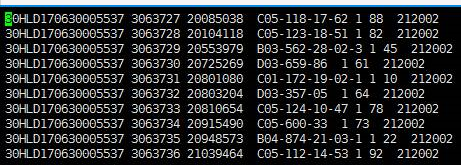
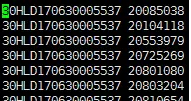
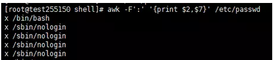
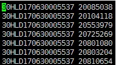

# awk 在日志分析中的使用

具体应用可以参考鸟哥的Linux私房菜 P364

<!-- TOC -->

- [awk 在日志分析中的使用](#awk-在日志分析中的使用)
    - [awk](#awk)
    - [awk的标准格式](#awk的标准格式)
    - [awk常用的内置变量](#awk常用的内置变量)
    - [格式化输出](#格式化输出)
    - [print函数](#print函数)
    - [特性](#特性)
    - [printf函数](#printf函数)
    - [修饰符](#修饰符)
    - [条件语句](#条件语句)
    - [实战演练](#实战演练)

<!-- /TOC -->

## awk

> awk是一个很好用的文本处理工具，相对于sed常用用作一整行的处理，awk则比较擅长将一行分成数个字段来处理。而在我们性能测试中，可以awk可以帮助我们造数，也可以帮助我们分析日志。
简单来说，awk就是用一个循环实现的。首先awk读取文本的一行（默认是从第一行开始，淡然也可以根据条件选择行），然后根据你给的条件来处理这行的某个字段；处理完成后，再读取下一行，然后再根据条件去处理字段，直到处理完成所有的行。

## awk的标准格式

awk '条件类型1{动作1} 条件类型2{动作2}.......'


## awk常用的内置变量

- NR(Row): 现在处理的是第几行数据
- NF(Filed): 每行一共的字段数 可以用来取倒数第一列，第二列。eg. awk 'print ${(NF-1),$NF} ' test1.txt

- $0: 代表一行数据
- $1: 代表第一个字段，依次类推
- RS(split): 输入行分隔符(默认为回车)
- ORS：输出分隔符
- FS： 字段分隔符
- F 指定多个字段分隔符并且支持正则表达式（比FS更强大一些）

## 格式化输出

## print函数

## 特性

1. 参数可以是变量、计算值、或字符串常量

2. 字符串必须用双引号括起来

3. 参数之间用逗号分隔（输出分隔符由变量OFS决定）

4. 输出可以被重定向

5. 输出和输入之间可以通过管道

## printf函数

特性

1. 返回给标准输出一个带有格式的字符串

2. 不会在行尾自动换行

3. 包含一个加引号的字符串 

## 修饰符

1. “-”        左对齐  

2. \#         八进制加0 十六进制加0x

3. \+         加上正负号+或-

4. 0         用0填充空白符

## 条件语句

```
格式：{if{(expression){

                   statement; statement;….

                   }

         else if(expression){

                   statement; statement;….

                   }

         else{ statement; statement;….

                   }

         }

可以使用条件，对字段进行处理
```

## 实战演练

eg1. 如下文本我只想要第一列和第三列然后重定向到test001.txt中


```bash
awk '{print $1,$3} example.txt > test.txt'
```


eg2. 如果字段的分隔符不是空格，那么我们需要先提前指定分隔符，使用-F或者FS，以passwd文件为例，每个字段是以冒号分隔的，我们想取出第二个字段，和第七个字段

```bash
awk -F':' '{print $2,$7}' /etc/passwd
```


eg3. 默认出输出字段分隔符是空格，如果想改变默认输出分隔符呢，比如改成|

文本test001，原来的内容


```bash
awk '{OFS="|"}{print $1,$2}' test.txt 
```


eg4. 默认输出行分隔符是回车，如果想把分隔符改成|呢，

文本test001，原来的内容，默认行分隔符为回车


参考文章： https://www.cnblogs.com/niuniu2018/p/8866873.html