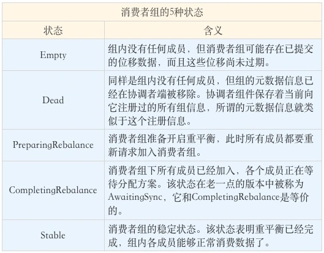
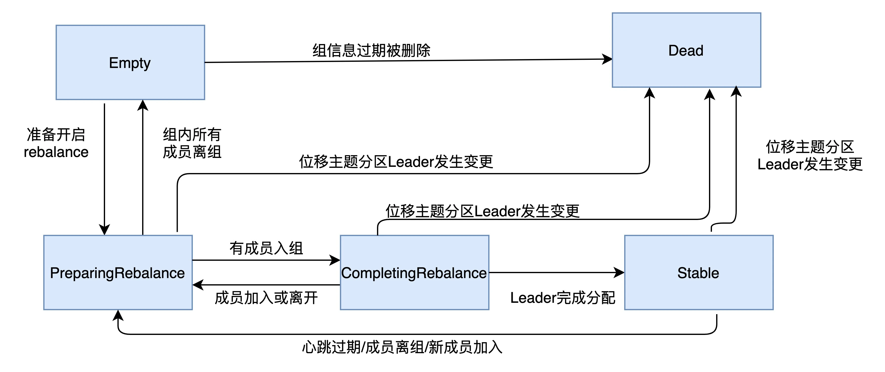

https://www.cnblogs.com/juniorMa/p/15137918.html?share_token=4ad2fef2-8ac5-4f8c-8149-baf788f72e55&tt_from=copy_link&utm_source=copy_link&utm_medium=toutiao_android&utm_campaign=client_share

https://time.geekbang.org/column/article/105112

https://time.geekbang.org/column/article/111226
## 重平衡触发条件
1. 该 group下consumer数量变化 -> 加入or 崩溃离开
2. topic 分区数发生变化
   订阅主题的分区数发生变更。Kafka 当前只能允许增加一个主题的分区数。当分区数增加时，就会触发订阅该主题的所有 Group 开启 Rebalance
3. 订阅topic 数量发生变化
    Consumer Group 可以使用正则表达式的方式订阅主题，比如 consumer.subscribe(Pattern.compile("t.*c")) 就表明该 Group 订阅所有以字母 t 开头、字母 c 结尾的主题。在 Consumer Group 的运行过程中，你新创建了一个满足这样条件的主题，那么该 Group 就会发生 Rebalance

在实际生产环境中，因命中第一个而引发的重平衡最常见。consumer group 中 consumer 实例依次启动也是第一种情况，
消费者每次重启的时候，必然会触发rebalance

## consumer group
1. 多个consumer 共享同一个 groupID ,gid
2. 组内所有的消费者协调在一起来消费订阅的topic的所有分区，每个分区只能由该group的某一个 consumer进行消费。
3. 理想情况下，consumer的数量应该等于 partion数量
4. 每个 consumer 消费的offset，可以以group 的维度进行记录。
    <partion,offset> 在之前的版本中保存在zk中，之后是保存在 kafka 集群中的。
    后来慢慢发现，zk并不适合频繁的写更新，而consumer group是一个非常频繁的写操作，这种吞吐量的写操作会拖慢zk集群的性能。所以 新版本的Kafka采用了将offset 放到了 broker

## 在rebalance stop
1. 在 ReBalance 中，所有的consumer实例都会停止消费，等待rebalance完成。

一个消费组(大概有300多个消费者)订阅了3个topic，如topic1 ,tipic2，topic3 ， 增加一个topic4，然后在这个消费组里面增加消费者来消费topic4的数据。
问题：是整个消费组发生重平衡吗？还是只是订阅topic4的消费者发生重平衡？
整体发生重平衡。

## 重平衡是怎么通知其他消费者实例的？
1. 靠消费者端的心跳线程（Heartbeat Thread）-> 协调者将消息封装到 心跳之中
2. heartbeat.interval.ms 控制rebalance通知的频率，越小，越早感知。

## relalance中的几种状态

状态机的流转

一个消费者组最开始是 Empty 状态，当重平衡过程开启后，它会被置于 PreparingRebalance 状态等待成员加入，之后变更到 CompletingRebalance 状态等待分配方案，最后流转到 Stable 状态完成重平衡。当有新成员加入或已有成员退出时，消费者组的状态从 Stable 直接跳到 PreparingRebalance 状态，此时，所有现存成员就必须重新申请加入组。当所有成员都退出组后，消费者组状态变更为 Empty。Kafka 定期自动删除过期位移的条件就是，组要处于 Empty 状态。因此，如果你的消费者组停掉了很长时间（超过 7 天），那么 Kafka 很可能就把该组的位移数据删除了。
https://time.geekbang.org/column/article/111226