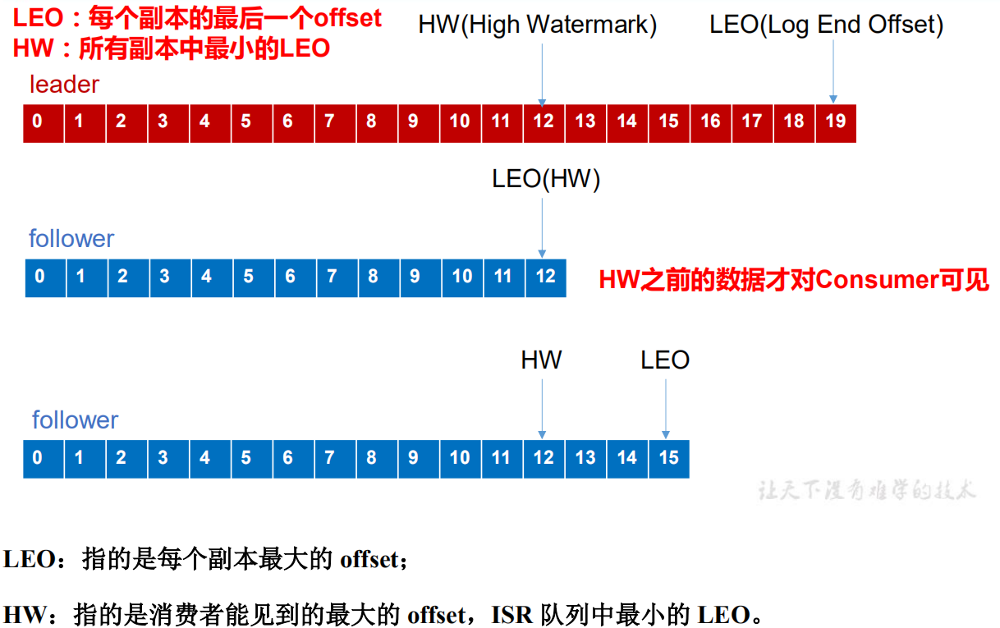

Kafka 是 LinkedIn(领英) 开发的，前期主要用于处理海量的日志。

官网： http://kafka.apache.org/intro

Bilibili: https://www.bilibili.com/video/av65544753?from=search&seid=17708076357179732776

## 思维导图
1. broker
    1. 存储数据
    2. topic 逻辑概念，分区物理概念
    3. 副本 备份 leader挂掉 ，isr 选出，同步时间进入 isr
    4. 分区 kafka负载能力，消费的并行度
    5. ack 数据丢失
    6. isr HW(消费者可见最大的offset)),LEO(LogEndOffset),消费一致性问题
2. producer
    1. 分区 规则，指定分区号优先按分区来，指定key按hash来,否则轮询
    2. ack 
        0,只发送，不管丢不丢，不等待
        1 learder 落盘
        -1 isr所有的副本+ leader成功 all ,isr只有一个，也可能丢失数据，一般重复数据问题
    3. 异步发送，回调函数，main,send线程
    4. 组件 拦截器 序列化器 分区器 

3. consumer
    1. 消费者组，消费者组内不同消费者不能消费同一个分区
    2. 分区分配策略问题

## 简介

Kafka 是一个分布式的流式平台。

- 发布订阅消息流，类似消息队列
- 可以容错的持久化方式
- 提供完整的流式处理类库，实时处理流失数据

重点突出： real-time 实时

## 应用场景

- 消息队列 ： 建立实时流数据管道，可靠的在系统和应用程序之间获取数据。
- 数据处理： 构建实时的数据处理程序来转换或处理数据流。

## APIS

- Producer API 允许 应用程序 向 Kafka 中发布 一个或 多个 topic 的消息
- Consumer API 允许 应用程序订阅一个或多个主题 然后处理这些流式数据
- Streams  API 允许 应用程序 作为 流的处理器，消费从一个或者多个主题输入流，生产一个或者多个主题的数据流，高效进行 输入流 到 输出流的转换。
- Connector API 允许 构建和运行可重用的生产者或消费者，将Kafka主题连接到现有的应用程序或数据系统。例如，到关系数据库的连接器可能捕获对表的每个更改。

Kafka 通信底层使用的 TCP, 官方提供多版本语言的 Client.

## topic

抽象核心概念 topic.主题是 发布者提供的一种类别区分。一个主题下面经常有多个订阅这。

对于每个 topic ，Kafka集群主要 使用向下面这种分区日志 。topic 的结构如下图：


通过上图可以看出，每个 分区 都是 不可变 有序的，数据会被持续的追加到这个结构体中。每一条在 分区中的数据会被分配一个叫作 `offset` 偏移量的序列号，可以唯一的标识在 分区中的位置。

Kafka 集群会`持久的保留所有的 数据记录`，不管这条记录有没有被消费。这个是可以配置 周期的。比如说，配置的周期是 2 天， 发布 消息 2天内可以被 消费者消费，超过 就会被 丢弃 掉来 释放空间。

 

注意 两位数字 是 整数。刚开始看错成 二进制。

在 消费者 上存储的唯一的元数据 是 `offset` 。每个消费者 的 offset 是`由消费者自己控制的`。消费者可以随意的去控制 这个 offset 。正常的就是线性的按照顺序增加。但是 它也可以随意的改变这个值或者 跳过某些 offset直接读取最新的记录。

消费者的创建比较随意，与 集群的耦合度比较低。你可以使用命令行工具 tail 任何 主题的内容。

## 分布式

日志的分区 分布在 Kafka 集群中的服务器上，每个服务器处理数据 和 共享分区的请求。为了容错，每个分区被复制到大量可配置的服务器上。 每个分区有个 Leader 和多个 Follower服务器。  Leader 处理分区所有的 读 和 写 请求，而 follower 被动的复制 leader的数据。如果 leader 挂掉，那么 就会在 Follower选举出新的leader。

## Geo_Replication

地理相关的复制。这个暂时不做翻译。

## Producers

生产者 发布与 主题相关的消息，它负责选择将哪些记录分配给主题中的哪个分区，这个可以通过某些算法 轮询的进行完成，便于负载均衡。

## Consumers

消费者使用 组名 `group name` 标记自己，每条消息传递到消费者手中，通过 消费者订阅的组名。（应该就是一种标识）。消费者的进程可以是个单独的进程，或者单独的集器。如果所有的消费者 具有相同的 组名 `have the same consumer group` 那么这个数据会高效在这些 消费者上面进行 负载均衡。

 

由上图可见，两个服务器组成了具有 4个 分区的（P0-P3），和两个 消费者组的集群。消费者组 A有两个实例，B具有4个实例。

Kafka 中实现消费的方式在 日志中划分分区，这样每个实例在任何时候都是 分区“公平共享” 的唯一消费者，这个保持组成成员的身份是由 Kafka协议动态处理的。如果有新的实例加入组，它们将从组的其他成员那里接管一些分区。如果一个实例 dead,它的分区将分配给其他的实例。

Kafka 只提供分区内记录的总顺序，而不提供主题中不同分区之间的总顺序。大于大部分应用程序来说，按照分区排序和按键分区数据能力已经足够了。如果需要记录总顺序，则可以使用 主题 只有一个分区来实现这一点，尽快这意味着，只有一个 consumer 进程。

## Guarantees 保证

kafka 提供以下保证：
1. 生产者发送到 特定 主题分区的消息将按照 发送的顺序追加。如果记录M1是由与记录M2相同的生产者发送的，并且M1是先发送的，那么M1的偏移量将比M2低，并出现在日志的前面。
2. 消费者 看到的就是 日志存储的 按照顺序的记录
3. 对于 N 台服务器，（单个主题的复制），允许 N-1 台服务器故障

## Kafka 作为 消息系统 与传统消息队列的对比

Kafka 的流式概念 与传统的消息队列有什么不同？

传统的消息传递有两种模式： 队列 模式 和 发布订阅模式。 在队列模式中，消费者消费者 从一台服务器中读取数据。在发布订阅模式中，消息被广播给所有的消费者。

Kafka中的消费者群体概念概括了这两个概念。与队列一样，消费者组允许您将处理划分到一组进程(消费者组的成员)上。与发布-订阅一样，Kafka允许您向多个消费者组广播消息。

Kafka模型的优点是每个主题都有这两种属性——它可以扩展处理，而且是多订阅者的——没有必要选择其中之一。

传统队列在服务器上按顺序保留记录，如果多个使用者从队列中消费，则服务器按存储记录的顺序分发记录。

然而，尽管服务器按顺序分发记录，但这些记录是异步传递给使用者的，因此它们可能在不同的使用者上不按顺序到达。这实际上意味着记录的顺序在并行使用时丢失。消息传递系统通常通过“独占消费者”的概念来解决这个问题，该概念只允许一个进程从队列中消费，


## Kafka as a Storage System

-- 暂停。 http://kafka.apache.org/intro

---

# Kafka

## 发布订阅模式

### 优缺点

基于 拉取 发布订阅模式。这样可以让 consumer 进行控制数据的获取的速度。但是 消费者

需要轮询的去 消息队列 去查询 是否有新消息。如果长时间没有消息，就会比较浪费资源，因为

内部维护着一个长轮询。


## Leader and Follower 

这两个概念是基于 分区而言的，而不是 Broker.不论是 生产者 还是消费者，都是去找相关的 
leader .follower 只是做备份使用的。

同一个组里面的不同消费者 不能去 消费 同一个分区的数据。并发度最好的情况是 ，消费者组中的

消费者数量 与 主题的 分区数量一致，多了无益，还浪费资源。

在消费者里面保存消费的位置信息，我消费到哪条消息了。这个信息可以保存在 zk里面。不同版本
之间有区别。0.9之前在 zk存储 的是 offset.0.9之后存储在kafka 中，在某个主题里面。这个存在 磁盘。默认存储
7天。

 

# Quickstart

链接地址： http://kafka.apache.org/quickstart 这里可配置快速启动。

需要启动一个 zk集群 ，因为在 kafka/config/server.properties 中有配置的默认的 zk的端口，索引暂时不需要修改zk的相关信息，只是需要直接启动就好。

## 部署流程
1. 解压 压缩包
```bash
tar -xzf kafka_2.12-2.4.0.tgz
cd kafka_2.12-2.4.0
```
2. 启动zk服务器
```bash
bin/zookeeper-server-start.sh config/zookeeper.properties
```
3. 启动Kafka服务器
```bash
bin/kafka-server-start.sh config/server.properties
```
4. 创建 topic
```bash
# 如果 topic 存在，则创建失败
# 指定一个分区 一个备份
bin/kafka-topics.sh --create --bootstrap-server localhost:9092 --replication-factor 1 --partitions 1 --topic test
```
5. 查看 topic list
```bash
[houzhenguo@aliyun kafka]$ ./bin/kafka-topics.sh --list --bootstrap-server localhost:9092
__consumer_offsets
houzhenguotopic
my-replicated-topic
test
```
6. 生产者发送消息
```bash
[houzhenguo@aliyun kafka]$ ./bin/kafka-console-producer.sh --broker-list localhost:9092 --topic test
>我在测试往topiczhu发送消息
>这是第二条消息
```
7. 消费者阻塞的消费消息
```bash
[houzhenguo@aliyun kafka]$ ./bin/kafka-console-consumer.sh --bootstrap-server localhost:9092 --topic test --from-beginning
this is a me
;
我在测试往topic发送消息
这是第二.消息
```
因为消费者是 pull 拉的形式 去获取 生产者的数据。

## broker集群相关
集群问题是启动多个 broker 实例，通过 后缀指定不同的 config  文件。
同时，修改 broker.id 全局不重复，唯一。

1. copy config文件
```bash
cp config/server.properties config/server-1.properties
cp config/server.properties config/server-2.properties
``` 
2. 修改 server.properties
 
 同时，指定不同的 data 的存储路径。

```properties
config/server-1.properties:
    broker.id=1                 # broker.id 全局唯一 
    listeners=PLAINTEXT://:9093 # 修改端口号，避免冲突
    log.dirs=/tmp/kafka-logs-1  # 指定数据存储路径，这里的log其实是真实数据的存储
 
config/server-2.properties:
    broker.id=2
    listeners=PLAINTEXT://:9094
    log.dirs=/tmp/kafka-logs-2
```
3. 启动集群的另外两个实例
```
[houzhenguo@aliyun kafka]$ ./bin/kafka-server-start.sh config/server-1.properties &
[houzhenguo@aliyun kafka]$ ./bin/kafka-server-start.sh config/server-2.properties &
```
这样就启动了 3个kafka实例
```
[houzhenguo@aliyun ~]$ jps
18560 Kafka
14979 Kafka
17284 ConsoleConsumer
18123 Kafka
1487 QuorumPeerMain
18991 Jps
[houzhenguo@aliyun ~]$ 

```
4. 创建一个 分区 3个备份的topic
```bash
[houzhenguo@aliyun kafka]$ ./bin/kafka-topics.sh --create --bootstrap-server localhost:9092 --replication-factor 3 --partitions 1 --topic replicated-topic-test

```
5. 查看每台 Broker 的信息
```bash
[houzhenguo@aliyun kafka]$ ./bin/kafka-topics.sh --describe --bootstrap-server localhost:9092 --topic replicated-topic-test
Topic: replicated-topic-test	PartitionCount: 1	ReplicationFactor: 3	Configs: segment.bytes=1073741824
	Topic: replicated-topic-test	Partition: 0	Leader: 2	Replicas: 2,1,0	Isr: 2,1,0
```
 输出的解释如下：

 第一行是 所有 分区的概要，下面的每一行是 关于这个 topic 每个分区的信息。

 - leader 节点 负责 该分区 所有的读写。（ follower只是备份的功能，不做读写）
 - replicas 时当前 备份信息
 - isr 相当于必须同步的一个 备份 列表（这个不是特别明白，可能要求这个列表中的全部同步完成才算成功，还有就是leader在这个列表中选出，因为优秀）

6. 向我们新创建的topic中发送数据
```bash
[houzhenguo@aliyun kafka]$ ./bin/kafka-console-producer.sh --broker-list localhost:9092 --topic replicated-topic-test
>replicated msg 1
>replicated msg 2
```
7. 消费我们刚才创建的消息
```bash
[houzhenguo@aliyun kafka]$ ./bin/kafka-console-consumer.sh --bootstrap-server localhost:9092 --from-beginning --topic replicated-topic-test
replicated msg 1
replicated msg 2
```
8. 测试 集群的健壮性
```
ps aux | grep server-2.properties # 找到 leader 的pid,kill掉
[houzhenguo@aliyun kafka]$ kill -9 18560

```
可以看到 leader 的新人选已经切换称为了 某个 followers ,node2(broker.id=2) 已经不在时 in-sync的集合数据。
```bash
[houzhenguo@aliyun kafka]$ ./bin/kafka-topics.sh --describe --bootstrap-server localhost:9092 --topic replicated-topic-test
Topic: replicated-topic-test	PartitionCount: 1	ReplicationFactor: 3	Configs: segment.bytes=1073741824
	Topic: replicated-topic-test	Partition: 0	Leader: 1	Replicas: 2,1,0	Isr: 1,0
[houzhenguo@aliyun kafka]$ 
```
但是 kafka 依旧可以对外提供服务
```bash
[2020-02-27 11:33:51,801] WARN [Consumer clientId=consumer-console-consumer-25541-1, groupId=console-consumer-25541] Connection to node 2 (aliyun/172.17.10.156:9094) could not be established. Broker may not be available. (org.apache.kafka.clients.NetworkClient)
^CProcessed a total of 2 messages
[houzhenguo@aliyun kafka]$ ./bin/kafka-console-consumer.sh --bootstrap-server localhost:9092 --from-beginning --topic replicated-topic-test
replicated msg 1
replicated msg 2
```
---

Kafka 中消息是以 topic 进行分类的，生产者生产消息，消费者消费消息，都是面向 topic
的。
topic 是逻辑上的概念，而 partition 是物理上的概念，每个 partition 对应于一个 log 文
件，该 log 文件中存储的就是 producer 生产的数据。Producer 生产的数据会被不断追加到该
log 文件末端，且每条数据都有自己的 offset。消费者组中的每个消费者，都会实时记录自己
消费到了哪个 offset，以便出错恢复时，从上次的位置继续消费

 

由于生产者生产的消息会不断追加到 log 文件末尾，为防止 log 文件过大导致数据定位
效率低下，Kafka 采取了`分片`和`索引`机制，将每个 partition 分为多个 segment。每个 segment
对应两个文件——“.index”文件和“.log”文件。这些文件位于一个文件夹下，该文件夹的命名
规则为：topic 名称+分区序号。例如，first 这个 topic 有三个分区，则其对应的文件夹为 first-
0,first-1,first-2。 1G一个片，可配置。

```
00000000000000000000.index
00000000000000000000.log
00000000000000170410.index // 这个数字是当前分片最小的偏移量。
00000000000000170410.log
00000000000000239430.index
00000000000000239430.log
```

 

根据消息的偏移量 可以 通过二分法快速 查找到  相应的index文件，根据 文件中的  消息偏移量

列表可以 在 log data 中快速找到 数据开始的位置 + 数据长度的大小。

## Kafka 分区策略
1. 方便集群的扩展
2. 方便 消费者的并发度

 

（1）指明 partition 的情况下，直接将指明的值直接作为 partiton 值；
（2）没有指明 partition 值但有 key 的情况下，将 key 的 hash 值与 topic 的 partition 
数进行取余得到 partition 值；
（3）既没有 partition 值又没有 key 值的情况下，第一次调用时随机生成一个整数（后
面每次调用在这个整数上自增），将这个值与 topic 可用的 partition 总数取余得到 partition 
值，也就是常说的 round-robin 算法

## Kafka 是如何保证数据不丢失的

为保证 producer 发送的数据，能可靠的发送到指定的 topic，topic 的每个 partition 收到
producer 发送的数据后，都需要向 producer 发送 ack（acknowledgement 确认收到），如果
producer 收到 ack，就会进行下一轮的发送，否则重新发送数据。

 

### 副本数据同步策略

半数以上完成同步，就发送 ack,优点延迟低，缺点，选举新leader时候，容忍n台节点故障，
需要 2n+1个副本

Kafka的同步方案：

全部完成同步，才发送ack。

后，设想以下情景：leader 收到数据，所有 follower 都开始同步数据，
但有一个 follower，因为某种故障，迟迟不能与 leader 进行同步，那 leader 就要一直等下去，
直到它完成同步，才能发送 ack。这个问题怎么解决呢？
Leader 维护了一个动态的 in-sync replica set (ISR)，意为和 leader 保持同步的 follower 集
合。当 ISR 中的 follower 完成数据的同步之后，leader 就会给 follower 发送 ack。如果 follower
长时间 未 向 leader 同 步 数 据 ， 则 该 follower 将 被 踢 出 ISR ， 该 时 间 阈 值 由

replica.lag.time.max.ms 参数设定。Leader 发生故障之后，就会从 ISR 中选举新的 leader。

ISR 加入条件： 

保留时间延迟，在 延迟时间内在 isr中，10s中

### ack应答机制

对于某些不太重要的数据，对数据的可靠性要求不是很高，能够容忍数据的少量丢失，
所以没必要等 ISR 中的 follower 全部接收成功。
所以 Kafka 为用户提供了三种可靠性级别，用户根据对可靠性和延迟的要求进行权衡，
选择以下的配置。
acks 参数配置：

acks： 
- 0：producer 不等待 broker 的 ack，这一操作提供了一个最低的延迟，broker 一接收到还
`没有写入磁盘就已经返回`，当 broker 故障时有可能`丢失数据`； 
- 1：producer 等待 broker 的 ack，partition 的 `leader 落盘成功后返回` ack，如果在 follower
同步成功之前 leader 故障，那么将会`丢失数据`；

- -1（all）：producer 等待 broker 的 ack，partition 的 leader 和 follower 全部落盘成功后才
返回 ack。但是如果在 follower 同步完成后，broker 发送 ack 之前，leader 发生故障，那么会
造成数据重复

 

（1）follower 故障
follower 发生故障后会被临时踢出 ISR，待该 follower 恢复后，follower 会读取本地磁盘
记录的上次的 HW，并将 log 文件高于 HW 的部分截取掉，从 HW 开始向 leader 进行同步。
等该 `follower 的 LEO 大于等于该 Partition 的 HW`，即 follower 追上 leader 之后，就可以重
新加入 ISR 了。
（2）leader 故障
leader 发生故障之后，会从 ISR 中选出一个新的 leader，之后，为保证多个副本之间的

数据一致性，其余的 follower 会先将各自的 log 文件高于 HW 的部分截掉，然后从新的 leader
同步数据。
注意：这只能保证副本之间的数据一致性，并不能保证数据不丢失或者不重复。

---

# API

## 生产者

1. pom.xml导入maven依赖
```xml
        <dependency>
            <groupId>org.apache.kafka</groupId>
            <artifactId>kafka-clients</artifactId>
            <version>0.11.0.0</version>
        </dependency>
        <!-- 因为log 的问题导入-->
        <dependency>
            <groupId>log4j</groupId>
            <artifactId>log4j</artifactId>
            <version>1.2.17</version>
        </dependency>
        <!-- https://mvnrepository.com/artifact/org.slf4j/slf4j-nop -->
        <dependency>
            <groupId>org.slf4j</groupId>
            <artifactId>slf4j-nop</artifactId>
            <version>1.7.25</version>
        </dependency>
```
2. 常见问题处理
https://blog.csdn.net/qq_45453266/article/details/104256722
并且控制台生产者监听 修改 localhost 为 内网ip
连不上 kafka 需要修改配置文件server.properties
```properties
host.name=172.17.10.156  #内网ip
advertised.host.name=xx.xxx.xxx.xx  #公网ip
advertised.port=9092
```
3. Producer 生产者部分
```java
package com.houzhenguo.producer;
import org.apache.kafka.clients.producer.*;
import java.util.Properties;
public class MyProducer {
    public static void main(String[] args) {
        //  建立链接相关的操作
        Properties props = new Properties();
        // 1.kafka集群，broker-list,这里使用 常量方式 bootstrap.servers多个用，分割
        props.put(ProducerConfig.BOOTSTRAP_SERVERS_CONFIG, "外网ip:9092");
        // 2. 设置 ack,"acks"
        props.put(ProducerConfig.ACKS_CONFIG, "all");
        // 3. 重试次数
        props.put("retries", 1);
        // 4. 批次大小 满16k就发送
        props.put("batch.size", 16384);
        // 5. 等待时间 ，等待 1ms也发送
        props.put("linger.ms", 1);
        // 6. RecordAccumulator 缓冲区大小
        props.put("buffer.memory", 33554432);
        // 7. 设置序列化器
        props.put("key.serializer",
                "org.apache.kafka.common.serialization.StringSerializer");
        props.put("value.serializer",
                "org.apache.kafka.common.serialization.StringSerializer");

        // 8. 构建生产者
        Producer<String, String> producer = new KafkaProducer<String, String>(props);
        // 9. 构造数据发送数据
        for (int i=0; i<10;i++) {
            producer.send(new ProducerRecord<String, String>("replicated-topic-test",
                    Integer.toString(i), Integer.toString(i)), new Callback() { // 回调函数
                public void onCompletion(RecordMetadata recordMetadata, Exception e) {
                    if (e == null) {
                        System.out.println("success");
                    }else {
                        e.printStackTrace();
                    }
                }
            });
        }
        // 10. 注意关闭，否则可能发送到 broker就关闭了
        producer.close();
        // 备注
        // ./bin/kafka-topics.sh --list --bootstrap-server localhost:9092 查看 topic
        // ./bin/kafka-topics.sh --describe --bootstrap-server localhost:9092 --topic replicated-topic-test
        // ./bin/kafka-console-consumer.sh --bootstrap-server localhost:9092 --from-beginning --topic replicated-topic-test
    }
}

```
4. 自定义分区器
默认分区器： `DefaultPartitioner` 可以参考这个写

```java
public class MyPartitioner implements Partioner {
    // 重写相应的方法
}
// 在 properties.put
prop.("partitioner.class","com.houzhenguo.partition.MyPartitionner"); // 全类名
```
5. 消费者
```java
package com.houzhenguo.consumer;

import org.apache.kafka.clients.consumer.ConsumerConfig;
import org.apache.kafka.clients.consumer.ConsumerRecord;
import org.apache.kafka.clients.consumer.ConsumerRecords;
import org.apache.kafka.clients.consumer.KafkaConsumer;
import java.util.Arrays;
import java.util.Properties;
public class MyConsumer {
    public static void main(String[] args) {
        // 1. 创建消费者配置信息
        Properties prop = new Properties();
        // 2. 给配置信息赋值 bootstrap.servers
        prop.put(ConsumerConfig.BOOTSTRAP_SERVERS_CONFIG, "外网ip:9092");
        // 3. 配置自动提交
        prop.put(ConsumerConfig.ENABLE_AUTO_COMMIT_CONFIG, true);
        // 4. 配置自动提交延迟 offset auto.commit.interval.ms
        prop.put(ConsumerConfig.AUTO_COMMIT_INTERVAL_MS_CONFIG, "1000");
        // 5. key,value 的反序列化
        prop.put(ConsumerConfig.KEY_DESERIALIZER_CLASS_CONFIG, "org.apache.kafka.common.serialization.StringDeserializer");
        prop.put(ConsumerConfig.VALUE_DESERIALIZER_CLASS_CONFIG, "org.apache.kafka.common.serialization.StringDeserializer");
        // 6. 消费者组
        prop.put(ConsumerConfig.GROUP_ID_CONFIG, "bigdata");
        // 6.1 新加配置 解决 偏移量 有可能因为删除不存在,从头开始，或者从最新的开始,默认 latest
        prop.put(ConsumerConfig.AUTO_OFFSET_RESET_CONFIG, "earliest");
        // 7. 创建消费者
        KafkaConsumer<String, String> consumer = new KafkaConsumer<String, String>(prop);
        // 8. 订阅主题
        consumer.subscribe(Arrays.asList("replicated-topic-test"));
        // 9. 获取数据
        while (true) {
            ConsumerRecords<String, String> consumerRecords = consumer.poll(100);
            // 10. 解析并打印 consumerRecords
            for (ConsumerRecord<String, String> record: consumerRecords) {
                System.out.println("key "+record.key()+"—"+record.value());
            }
        }
    }
}

```
6. 手动提交offset

> 虽然自动提交 offset 十分简介便利，但由于其是基于时间提交的，开发人员难以把握
offset 提交的时机。因此 Kafka 还提供了手动提交 offset 的 API。
手动提交 offset 的方法有两种：分别是 commitSync（同步提交）和 commitAsync（异步
提交）。两者的相同点是，都会将本次 poll 的一批数据最高的偏移量提交；不同点是，
commitSync 阻塞当前线程，一直到提交成功，并且会自动失败重试（由不可控因素导致，
也会出现提交失败）；而 commitAsync 则没有失败重试机制，故有可能提交失败。

```java
 // 关闭自动提交 offset
 props.put("enable.auto.commit", "false");

 //异步提交
            consumer.commitAsync(new OffsetCommitCallback(){
                public void onComplete(Map<TopicPartition,
                                        OffsetAndMetadata> offsets, Exception exception) {
                    if (exception != null) {
                        System.err.println("Commit failed for" +
                                offsets);
                    }
                }
            });
```