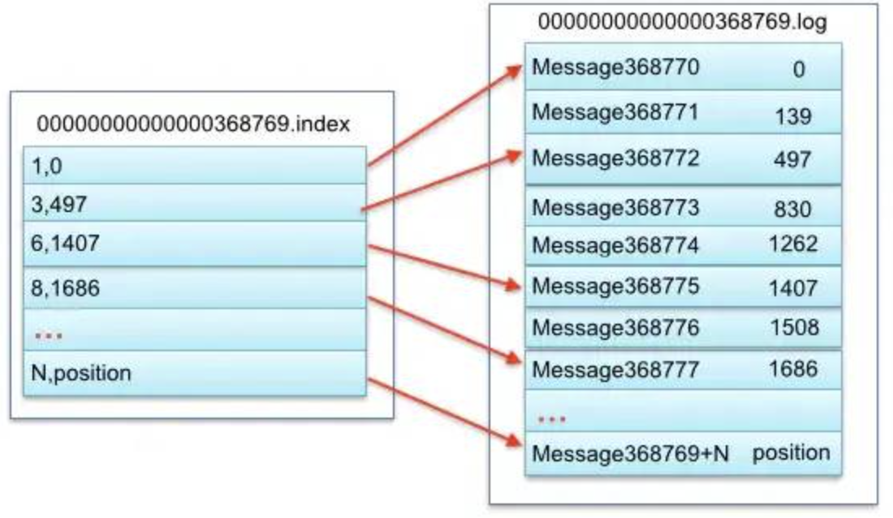
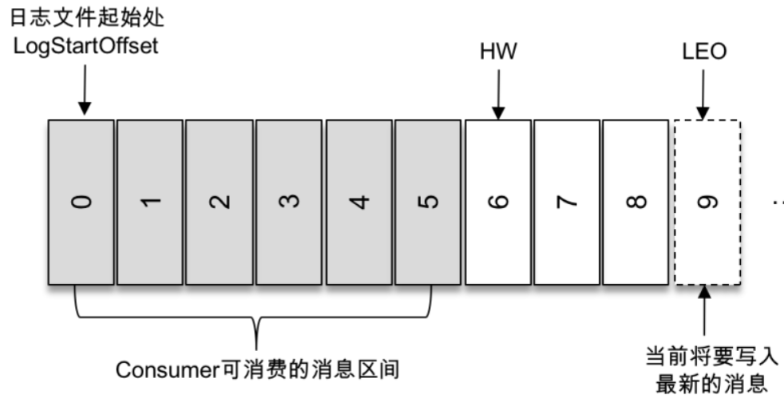
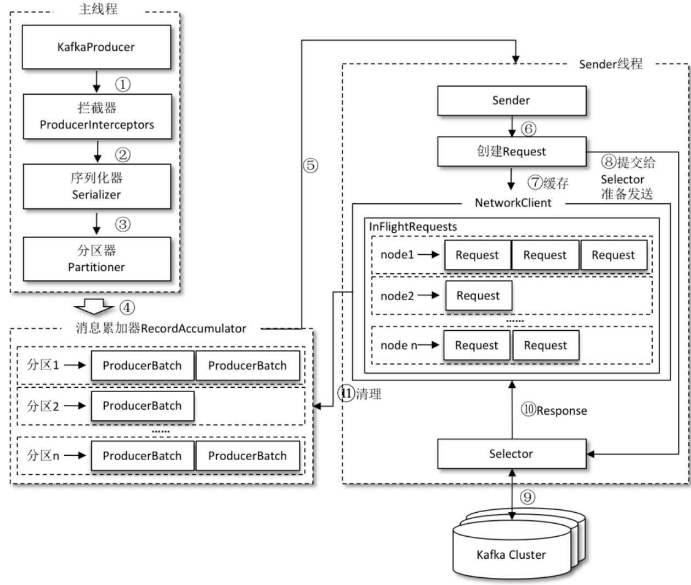

## 文章参考
1. https://mp.weixin.qq.com/s/9Y1Mv8qtCwcvkf6BJuI0Ug  【大数据技术与架构】2021年大数据面试进阶系列系统总结
2. https://mp.weixin.qq.com/s/sZaMFD0sy6cz2pMQpnbInA Kafka面试题系列(基础篇)

## 存储设计
1、segment
Kafka把Partition分成若干个`segment`，segment是Kafka的最小存储单元。在broker往分区里面写入数据时，如果达到segment上限，就关闭当前segment并打开一个新segment。没有关闭的segment叫做活跃片段，活跃片段永远不会被删除。（默认segment上限是`1GB`大小或者`存活一周`，所以如果配置了topic数据保存1天，但是5天了segment都没有1GB，则数据会存储5天。）
这样子设计相当于把整个partition这个『大文件』拆成了细碎小文件，避免了在一个大文件里面查找内容；而且要数据过期要删除的话可以直接删除整个文件，比删文件里面的内容更简单。

2、存储与查询
segment的真正存储会分成2份文件，一种是`.index`的索引文件，一种是`.log`的数据存储文件，成对出现。index保存offset的索引，log保存真正的数据内容。index文件的文件名是本文件的起始offset。

 

如上图，假设要查询offset=368775的数据,则命中了0000000000000368769这个index,查看到368775在这个index文件中位于第三位（368775 = 368769 + 6，刚好命中这个索引），对应到log文件的物理偏移量是1407。如果没有命中这个索引，则通过上个索引的文件偏移量再顺序查询。

3、索引设计
Kafka建立的这种索引也就是稀疏索引，即建立较少offset的索引用来较少内存使用。但是由于offset的索引建立得不完全，则查询命中可能消耗更多时间。

### 参考 
1. https://mp.weixin.qq.com/s/sAfQvEVCLvX3VRuiPEfevQ

## 基础知识点

### Kafka中的ISR、AR又代表什么？ISR的伸缩又指什么？

分区中的所有副本统称为 AR（Assigned Replicas）。所有与 leader 副本保持一定程度同步的副本（包括 leader 副本在内）组成ISR（In-Sync Replicas），`ISR` 集合是 AR 集合中的一个子集。

ISR的伸缩：
`leader` 副本负责维护和跟踪 ISR 集合中所有 follower 副本的滞后状态，当 follower 副本落后太多或失效时，leader 副本会把它从 ISR 集合中剔除。如果 OSR 集合中有 follower 副本“追上”了 leader 副本，那么 leader 副本会把它从 OSR 集合转移至 ISR 集合。默认情况下，当 leader 副本发生故障时，只有在 ISR 集合中的副本才有资格被选举为新的 leader，而在 OSR 集合中的副本则没有任何机会（不过这个原则也可以通过修改相应的参数配置来改变）。

replica.lag.time.max.ms ：这个参数的含义是 Follower 副本能够落后 Leader 副本的最长时间间隔，当前`默认值是 10 秒`。

unclean.leader.election.enable：是否允许 Unclean 领导者选举。开启 Unclean 领导者选举可能会造成数据丢失，但好处是，它使得分区 Leader 副本一直存在，不至于停止对外提供服务，因此提升了高可用性。

### Kafka中的HW、LEO、LSO、LW等分别代表什么？

HW 是 High Watermark 的缩写，俗称高水位，它标识了一个特定的消息偏移量（offset），消费者只能拉取到这个 offset 之前的消息。

LSO是LogStartOffset，一般情况下，日志文件的起始偏移量 logStartOffset 等于第一个日志分段的 baseOffset，但这并不是绝对的，logStartOffset 的值可以通过 DeleteRecordsRequest 请求(比如使用 KafkaAdminClient 的 deleteRecords()方法、使用 kafka-delete-records.sh 脚本、日志的清理和截断等操作进行修改。

 


如上图所示，它代表一个日志文件，这个日志文件中有9条消息，第一条消息的 offset（LogStartOffset）为0，最后一条消息的 offset 为8，offset 为9的消息用虚线框表示，代表下一条待写入的消息。日志文件的 HW 为6，表示消费者只能拉取到 offset 在0至5之间的消息，而 offset 为6的消息对消费者而言是不可见的。

LEO 是 Log End Offset 的缩写，它标识当前日志文件中下一条待写入消息的 offset，上图中 offset 为9的位置即为当前日志文件的 LEO，LEO 的大小相当于当前日志分区中最后一条消息的 offset 值加1。分区 ISR 集合中的每个副本都会维护自身的 LEO，而 ISR 集合中最小的 LEO 即为分区的 HW，对消费者而言只能消费 HW 之前的消息。

LW 是 Low Watermark 的缩写，俗称“低水位”，代表 AR 集合中最小的 logStartOffset 值。副本的拉取请求(FetchRequest，它有可能触发新建日志分段而旧的被清理，进而导致 logStartOffset 的增加)和删除消息请求(DeleteRecordRequest)都有可能促使 LW 的增长。

### Kafka中是怎么体现消息顺序性的？
可以通过分区策略体现消息顺序性。
分区策略有轮询策略、随机策略、按消息键保序策略。

按消息键保序策略：一旦消息被定义了 Key，那么你就可以保证同一个 Key 的所有消息都进入到相同的分区里面，由于每个分区下的消息处理都是有顺序的，故这个策略被称为按消息键保序策略.

### Kafka中的分区器、序列化器、拦截器是否了解？它们之间的处理顺序是什么？


- 序列化器：生产者需要用序列化器（Serializer）把对象转换成字节数组才能通过网络发送给 Kafka。而在对侧，消费者需要用反序列化器（Deserializer）把从 Kafka 中收到的字节数组转换成相应的对象。
- 分区器：分区器的作用就是为消息分配分区。如果消息 ProducerRecord 中没有指定 partition 字段，那么就需要依赖分区器，根据 key 这个字段来计算 partition 的值。
- Kafka 一共有两种拦截器：生产者拦截器和消费者拦截器。
生产者拦截器既可以用来在消息发送前做一些准备工作，比如按照某个规则过滤不符合要求的消息、修改消息的内容等，也可以用来在发送回调逻辑前做一些定制化的需求，比如统计类工作。

消费者拦截器主要在消费到消息或在提交消费位移时进行一些定制化的操作。
消息在通过 send() 方法发往 broker 的过程中，有可能需要经过拦截器（Interceptor）、序列化器（Serializer）和分区器（Partitioner）的一系列作用之后才能被真正地发往 broker。拦截器（下一章会详细介绍）一般不是必需的，而序列化器是必需的。消息经过序列化之后就需要确定它发往的分区，如果消息 ProducerRecord 中指定了 partition 字段，那么就不需要分区器的作用，因为 partition 代表的就是所要发往的分区号。

`处理顺序 ：拦截器->序列化器->分区器`

KafkaProducer 在将消息序列化和计算分区之前会调用生产者拦截器的 onSend() 方法来对消息进行相应的定制化操作。
然后生产者需要用序列化器（Serializer）把对象转换成字节数组才能通过网络发送给 Kafka。
最后可能会被发往分区器为消息分配分区。

### Kafka生产者客户端的整体结构是什么样子的？
 

整个生产者客户端由两个线程协调运行，这两个线程分别为主线程和 Sender 线程（发送线程）。
在主线程中由 KafkaProducer 创建消息，然后通过可能的拦截器、序列化器和分区器的作用之后缓存到消息累加器（RecordAccumulator，也称为消息收集器）中。
Sender 线程负责从 RecordAccumulator 中获取消息并将其发送到 Kafka 中。
RecordAccumulator 主要用来缓存消息以便 Sender 线程可以批量发送，进而减少网络传输的资源消耗以提升性能。

### Kafka生产者客户端中使用了几个线程来处理？分别是什么？
整个生产者客户端由两个线程协调运行，这两个线程分别为主线程和 Sender 线程（发送线程）。在主线程中由 KafkaProducer 创建消息，然后通过可能的拦截器、序列化器和分区器的作用之后缓存到消息累加器（RecordAccumulator，也称为消息收集器）中。Sender 线程负责从 RecordAccumulator 中获取消息并将其发送到 Kafka 中。

### offset的问题(之前印象模糊的地方)
在旧消费者客户端中，消费位移是存储在 ZooKeeper 中的。而在新消费者客户端中，消费位移存储在 `Kafka 内部的主题`__consumer_offsets 中。
当前消费者需要提交的消费位移是`offset+1`

### 有哪些情形会造成重复消费？

- Rebalance
一个consumer正在消费一个分区的一条消息，还没有消费完，发生了rebalance(加入了一个consumer)，从而导致这条消息没有消费成功，rebalance后，另一个consumer又把这条消息消费一遍。
- 消费者端手动提交
如果先消费消息，再更新offset位置，导致消息重复消费。
- 消费者端自动提交
设置offset为自动提交，关闭kafka时，如果在close之前，调用 consumer.unsubscribe() 则有可能部分offset没提交，下次重启会重复消费。
生产者端
生产者因为业务问题导致的宕机，在重启之后可能数据会重发

### 那些情景下会造成消息漏消费？

- 自动提交
设置offset为自动定时提交，当offset被自动定时提交时，数据还在内存中未处理，此时刚好把线程kill掉，那么offset已经提交，但是数据未处理，导致这部分内存中的数据丢失。
- 生产者发送消息
发送消息设置的是fire-and-forget（发后即忘），它只管往 Kafka 中发送消息而并不关心消息是否正确到达。不过在某些时候（比如发生不可重试异常时）会造成消息的丢失。这种发送方式的性能最高，可靠性也最差。
- 消费者端
先提交位移，但是消息还没消费完就宕机了，造成了消息没有被消费。自动位移提交同理
acks没有设置为all
如果在broker还没把消息同步到其他broker的时候宕机了，那么消息将会丢失

### topic的分区数可不可以增加？如果可以怎么增加？如果不可以，那又是为什么？
可以增加，使用 kafka-topics 脚本，结合 --alter 参数来增加某个主题的分区数，命令如下：

```shell
bin/kafka-topics.sh --bootstrap-server broker_host:port --alter --topic <topic_name> --partitions <新分区数>
```
当分区数增加时，就会触发订阅该主题的所有 Group 开启 `Rebalance`。
首先，Rebalance 过程对 Consumer Group 消费过程有极大的影响。在 Rebalance 过程中，所有 Consumer 实例都会停止消费，等待 Rebalance 完成。这是 Rebalance 为人诟病的一个方面。
其次，目前 Rebalance 的设计是所有 Consumer 实例共同参与，全部重新分配所有分区。其实更高效的做法是尽量减少分配方案的变动。
最后，Rebalance 实在是太慢了。

### topic的分区数可不可以减少？如果可以怎么减少？如果不可以，那又是为什么？

不支持，因为删除的分区中的消息不好处理。如果直接存储到现有分区的尾部，消息的时间戳就不会递增，如此对于 Spark、Flink 这类需要消息时间戳（事件时间）的组件将会受到影响；如果分散插入现有的分区，那么在消息量很大的时候，内部的数据复制会占用很大的资源，而且在复制期间，此主题的可用性又如何得到保障？与此同时，顺序性问题、事务性问题，以及分区和副本的状态机切换问题都是不得不面对的。


### 创建topic时如何选择合适的分区数？
在 Kafka 中，性能与分区数有着必然的关系，在设定分区数时一般也需要考虑`性能`的因素。对不同的硬件而言，其对应的性能也会不太一样。
可以使用Kafka 本身提供的用于生产者性能测试的 kafka-producer- perf-test.sh 和用于消费者性能测试的 kafka-consumer-perf-test.sh来进行测试。
增加合适的分区数可以在一定程度上`提升整体吞吐量`，但`超过对应的阈值之后吞吐量不升反降`。如果应用对吞吐量有一定程度上的要求，则建议在投入生产环境之前对同款硬件资源做一个完备的吞吐量`相关的测试`，以找到合适的分区数阈值区间。
分区数的多少还会影响系统的可用性。如果分区数非常多，如果集群中的某个 broker 节点宕机，那么就会有大量的分区需要同时进行 leader 角色切换，这个切换的过程会耗费一笔可观的时间，并且在这个时间窗口内这些分区也会变得不可用。
分区数越多也会让 Kafka 的正常启动和关闭的耗时变得越长，与此同时，主题的分区数越多不仅会增加日志清理的耗时，而且在被删除时也会耗费更多的时间。

### 参考
https://mp.weixin.qq.com/s/sZaMFD0sy6cz2pMQpnbInA


### Kafka目前有哪些内部topic，它们都有什么特征？各自的作用又是什么？
- __consumer_offsets：作用是保存 Kafka 消费者的位移信息
- __transaction_state：用来存储事务日志消息

### 优先副本是什么？它有什么特殊的作用？
所谓的优先副本是指在AR集合列表中的第一个副本。
理想情况下，优先副本就是该分区的leader 副本，所以也可以称之为 preferred leader。Kafka 要确保所有主题的优先副本在 Kafka 集群中均匀分布，这样就保证了所有分区的 leader 均衡分布。以此来促进集群的负载均衡，这一行为也可以称为“分区平衡”。


### Kafka有哪几处地方有分区分配的概念？简述大致的过程及原理
生产者的分区分配是指为每条消息指定其所要发往的分区。可以编写一个具体的类实现org.apache.kafka.clients.producer.Partitioner接口。

消费者中的分区分配是指为消费者指定其可以消费消息的分区。`Kafka 提供了消费者客户端参数 partition.assignment.strategy 来设置消费者与订阅主题之间的分区分配策略`。

分区副本的分配是指为集群制定创建主题时的分区副本分配方案，即在哪个 broker 中创建哪些分区的副本。kafka-topics.sh 脚本中提供了一个 replica-assignment 参数来手动指定分区副本的分配方案。

