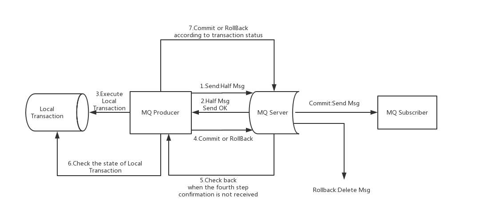

## 基本构成
1. nameserver
2. producer
3. consumer topic
4. broker
    message/tag

异步刷盘 -> ack

## 延迟队列
1. x个级别 支持高精度延迟

## 速度
1. pagecache 顺序读
2. NIO 内存映射 MappedByteBuffer
3. 数据写入 写到pageCache ,异步刷盘

(1) 同步刷盘：如上图所示，只有在消息真正持久化至磁盘后RocketMQ的Broker端才会真正返回给Producer端一个成功的ACK响应。同步刷盘对MQ消息可靠性来说是一种不错的保障，但是性能上会有较大影响，一般适用于金融业务应用该模式较多。

(2) 异步刷盘：能够充分利用OS的PageCache的优势，只要消息写入PageCache即可将成功的ACK返回给Producer端。消息刷盘采用后台异步线程提交的方式进行，降低了读写延迟，提高了MQ的性能和吞吐量。

## 事务

RocketMQ事务消息流程概要
上图说明了事务消息的大致方案，其中分为两个流程：正常事务消息的发送及提交、事务消息的补偿流程。

1.事务消息发送及提交：

(1) 发送消息（half消息）。

(2) 服务端响应消息写入结果。

(3) 根据发送结果执行本地事务（如果写入失败，此时half消息对业务不可见，本地逻辑不执行）。

(4) 根据本地事务状态执行Commit或者Rollback（Commit操作生成消息索引，消息对消费者可见）

2.补偿流程：

(1) 对没有Commit/Rollback的事务消息（pending状态的消息），从服务端发起一次“回查”

(2) Producer收到回查消息，检查回查消息对应的本地事务的状态

(3) 根据本地事务状态，重新Commit或者Rollback

其中，补偿阶段用于解决消息Commit或者Rollback发生超时或者失败的情况。

### 总结
1. halfmessage
2. halfmessage send ok
3. local transcation    
            -> success -> commit
            -> failer  -> rollback
    
    or mq check when not response -> checklocal -> commit or rollback

4. commit or rollback

## 时间轮

## 消息失败
1. 放在内存队列中重试
2. listenner 

## 分区存储结构
1. kafka partion  -> topic * partion 个文件
2. rocketmq queue -> commit log 维护容易，读两级

批量消费 挨个返回，offset 木桶一下

## 参考资料
1. https://github.com/apache/rocketmq/blob/master/docs/cn/design.md

