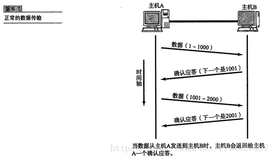
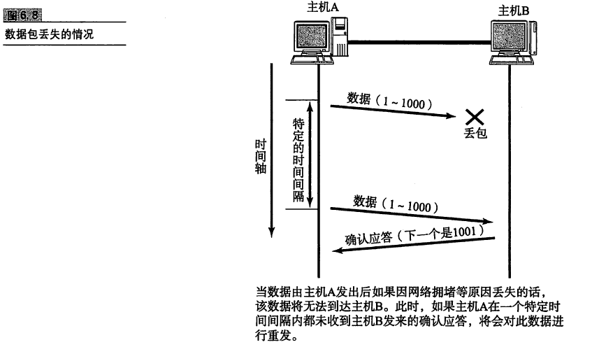
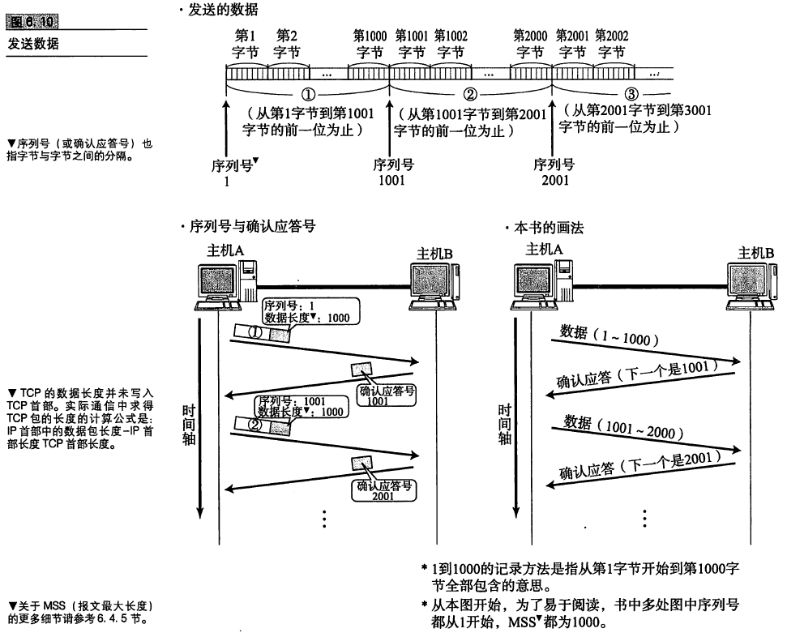
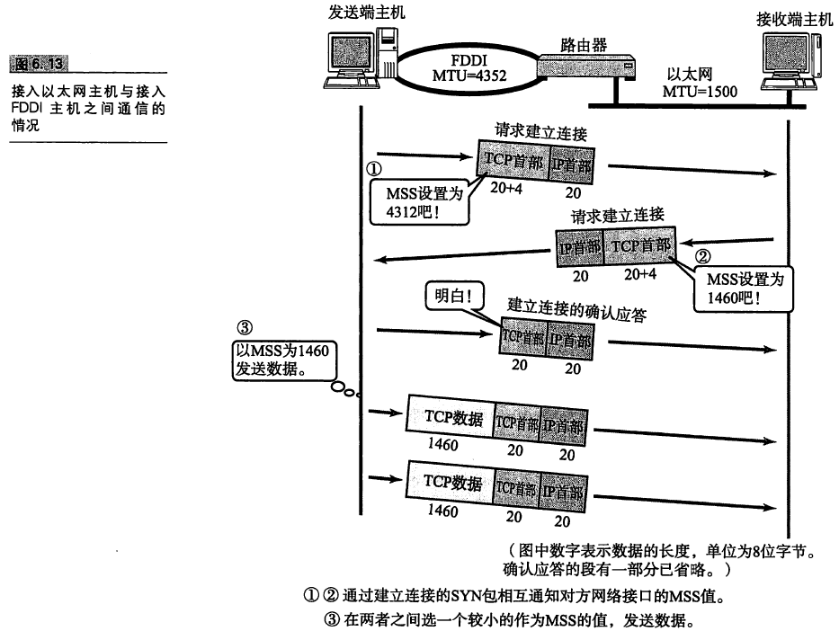
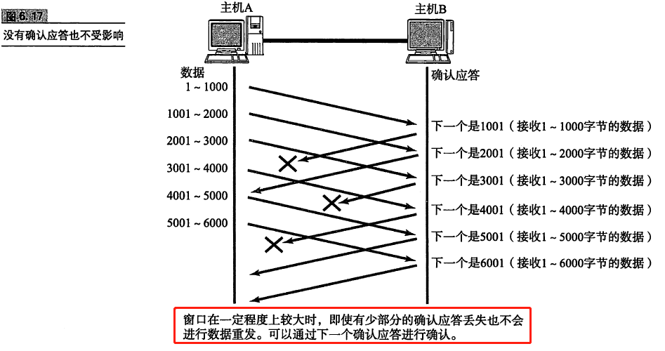
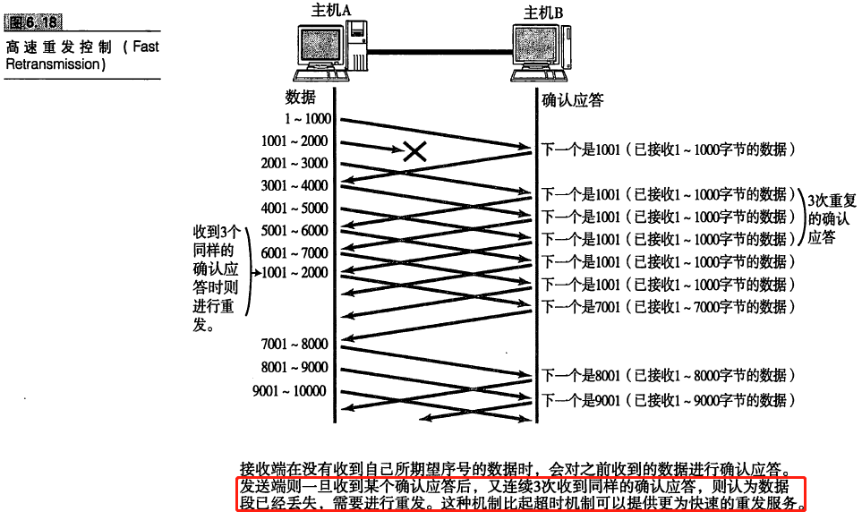
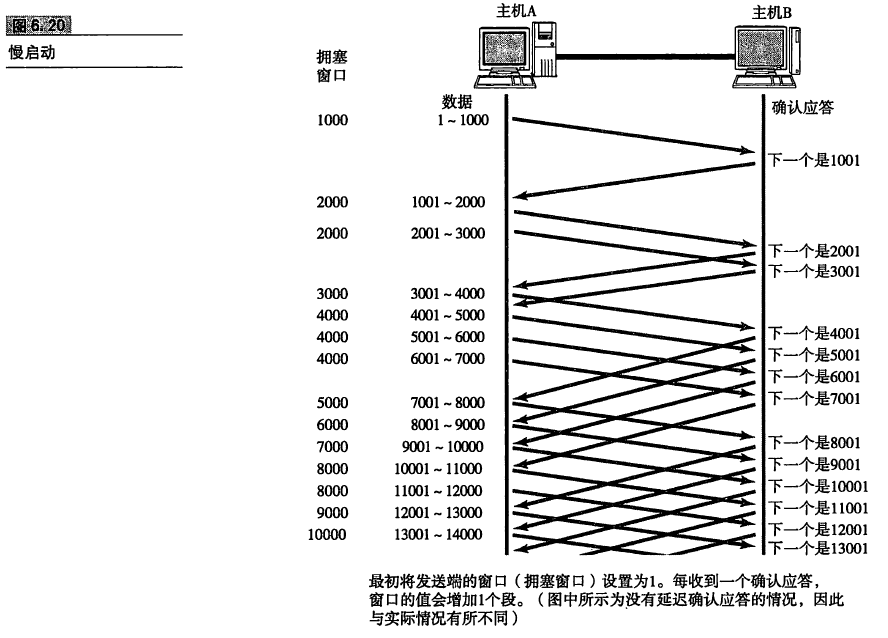
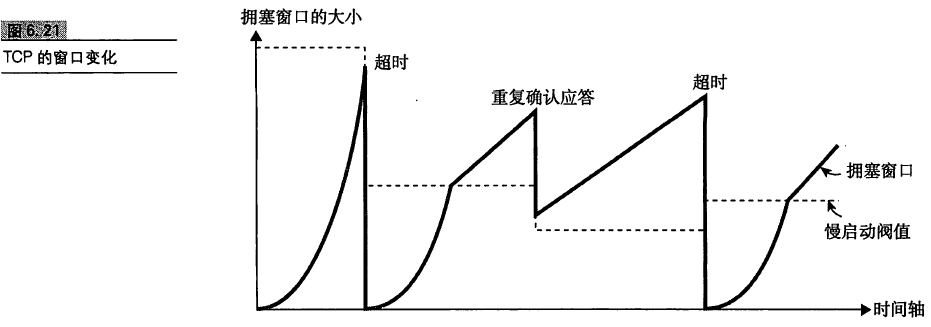

<!-- TOC -->

- [TCP可靠性传输](#tcp可靠性传输)
- [通过序列号与确认应答提高可靠性](#通过序列号与确认应答提高可靠性)
    - [1. 正常数据传输](#1-正常数据传输)
    - [2. 数据丢包的情况](#2-数据丢包的情况)
    - [3. 发送数据](#3-发送数据)
    - [4. 重发超时如何确定](#4-重发超时如何确定)
- [TCP连接管理](#tcp连接管理)
    - [1. TCP的三次握手](#1-tcp的三次握手)
    - [2. TCP的四次挥手](#2-tcp的四次挥手)
- [TCP以段为单位发送数据](#tcp以段为单位发送数据)
- [利用窗口控制提高速度](#利用窗口控制提高速度)
    - [1. 窗口控制与重发控制](#1-窗口控制与重发控制)
- [流量控制](#流量控制)
- [拥塞控制](#拥塞控制)

<!-- /TOC -->

# TCP可靠性传输

TCP（Transmission Control Protocol，传输控制协议）充分地实现了数据传输时各种控制功能，可以进行丢包时的重发控制，还可以对次序乱掉的分包进行顺序控制。TCP作为一种面向有连接的协议，只有在确认通信对端存在时才会发送数据。

TCP通过检验和、序列号、确认应答、重发控制、连接管理以及窗口控制等机制实现可靠性传输。

# 通过序列号与确认应答提高可靠性

在TCP中，当发送端的数据到达接收主机时，接收端主机会返回一个已接收到消息的通知，这个消息叫确认应答。通过序列号和确认应答号，TCP可以实现可靠传输。
## 1. 正常数据传输 

## 2. 数据丢包的情况

如果在发送到B的过程中丢包（A没有收到应答），则在特定时间内A会进行重新发送.

A未收到应答，有可能是在B发送应答到A的路上丢失，这个时候A也会进行重发，只是B收到相同的消息之后会进行丢失。也有可能是一些，其他的原因，导致ack数据延迟到达。

TCP为了对上层应用提供可靠的传输，必须放弃重复的包，通过序列号来处理应答，重发控制以及重复控制。

## 3. 发送数据

## 4. 重发超时如何确定

重发超时是在重发数据之前，等待确认应答到来的那个特定的时间间隔，如果过了这个时间仍没有收到ack，发送端进行数据重发。那么如何确定这个重发的具体时间呢？

最理想的是，找一个最小时间，它能够保证“在这段时间内确认应答一定能够返回”。然而这个时间随着网络环境的不同而发生变化。

为此，TCP在每次发包时候都会计算往返时间RTT(Round Trip Time) 以及其偏差。将整个往返时间与偏差相加，重发超时的时间就是比这个总和要稍微大一点的值。

# TCP连接管理

## 1. TCP的三次握手

## 2. TCP的四次挥手
具体可以参考 [TCP三次握手四次挥手](TCP三次握手四次挥手.md)

# TCP以段为单位发送数据

在建立TCP连接的同时，也可以确定发送数据包的单位，我们称为“最大消息长度”（MMS: Maximum Segment Size）最理想的情况是，最大消息长度正好是IP中不会被分片处理的最大长度。选择一个合适的长度。这个长度设置在tcp的首部。

# 利用窗口控制提高速度

TCP如果每次发送都要确认，包的晚饭时间越长通信性能越低。为了解决这个问题，TCP引入了窗口的概念。确认应答不再是以每个分段，而是以更大的单位进行确认。发送端的主机，在发送了一个段以后，不必要一直瞪大确认应答，而是继续发送。

**窗口大小**： 指的是无需等待确认应答而可以继续发送数据的最大值。

## 1. 窗口控制与重发控制

- 考虑数据到达B端但是ack在返回途中丢失的情况，这种不需要重发，可以依靠下一次（指的是别人的确认机制，而不是本次发送的确认机制）的确认机制。

- 考虑报文丢失的情况。在A-B发送的过程中丢失了。如果发生丢失，那么A端就会一直收到一个应答，同一个序号的映带将会不断的重复返回。这时候A端进行重发。

# 流量控制

有接收端告诉发送端，动态调整窗口的大小。避免接收端无法及时处理发生丢包的情况。

# 拥塞控制

有了TCP的窗口机制，收发主机不再以一个数据段为单位发送确认应答，也能够连续发送大量的数据包。然而在通信刚开始就发送大量数据，也可能会引发其他问题。TCP为了防止该问题的出现，在通信的开始使用一个 **慢启动**的算法，对发送的数据量进行控制。

文章参考： 《图解TCP/IP》 P210