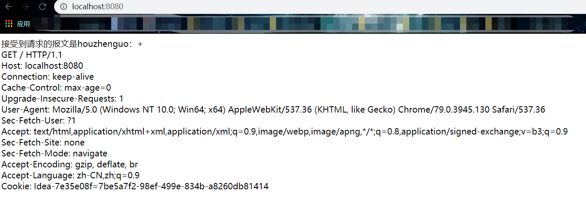

本文使用 NIO自定义实现 http协议

## NIO

NIO 三大组件 ，Buffer ,Selector,Channel 本文使用原生的Java进行实现，不使用 netty 或者mina 等底层的框架。

## http

http 是一种cs模式，client 发起一次 request 请求，携带 请求的地址，用户的状态，sessionid,cookie信息，
发送到服务器，服务器进行解析，给我们返回。
1. 无连接，服务器每次处理一个请求，服务器处理完客户端请求，并且收到客户端的答应之后，断开连接，节省传输时间。
2. 无状态，不负责记忆前面的信息。

## 代码实现

// server
```java
package com.houzhenguo;

import java.io.IOException;
import java.net.InetSocketAddress;
import java.nio.channels.SelectionKey;
import java.nio.channels.Selector;
import java.nio.channels.ServerSocketChannel;
import java.util.Iterator;
import java.util.concurrent.ArrayBlockingQueue;
import java.util.concurrent.ThreadFactory;
import java.util.concurrent.ThreadPoolExecutor;
import java.util.concurrent.TimeUnit;

public class Server {
    private static final int TIME_OUT_CODE = 0;
    public static ThreadPoolExecutor threadPool = null;
    static {
        threadPool =  new ThreadPoolExecutor(5, 10, 5000, TimeUnit.MILLISECONDS
                , new ArrayBlockingQueue<Runnable>(5)
                , new ThreadFactory() {
            public Thread newThread(Runnable r) {
                return new Thread(r, "http-thread");
            }
        });
    }
    public static void main(String[] args) throws IOException {
        ServerSocketChannel ssc = ServerSocketChannel.open(); // 监听TCP连接
        ssc.socket().bind(new InetSocketAddress(8080)); // bind 8080
        ssc.configureBlocking(false);// 设置 no blocking
        Selector selector = Selector.open(); // 创建选择器
        SelectionKey selectionKey =  ssc.register(selector, SelectionKey.OP_ACCEPT);// 注册监听

        while (true) {
            int select = selector.select(24444000); // 超时时间
            if (select == TIME_OUT_CODE) {
               // System.out.println("等待请求超时.....");
                continue;
            }
            System.out.println("开始处理请求.....");
            Iterator<SelectionKey> keyIter = selector.selectedKeys().iterator(); // 迭代器
            while (keyIter.hasNext()) {
                SelectionKey key = keyIter.next();
                threadPool.execute(new HttpHandler(key));
                keyIter.remove();
            }
        }
    }
}

```

// handler
```java
package com.houzhenguo;

import java.io.IOException;
import java.nio.ByteBuffer;
import java.nio.channels.SelectionKey;
import java.nio.channels.ServerSocketChannel;
import java.nio.channels.SocketChannel;
import java.nio.charset.Charset;

public class HttpHandler implements Runnable{
    private int bufferSize = 1024;
    private static final String CHARSET = "UTF-8";
    private SelectionKey key; // 注册号的通道
    public HttpHandler(SelectionKey key) {
        this.key = key;
    }
    public void handleAccept() throws IOException {
        SocketChannel socketChannel=((ServerSocketChannel)key.channel()).accept();
        if (socketChannel == null){
            return;
        }
        socketChannel.configureBlocking(false);
        socketChannel.register(key.selector(), SelectionKey.OP_READ, ByteBuffer.allocate(bufferSize));
        //buffer分配一个缓冲区 大小为1024
    }
    public void handleRead() {
        SocketChannel sc = (SocketChannel) key.channel(); // socket channel 是套接字的一个通道
        ByteBuffer buffer = (ByteBuffer) key.attachment(); // 从 socket channel 读取数据到 buffer中
        buffer.clear();

        try {
            if ((sc.read(buffer)) != -1) {
                buffer.flip();// 从 写模式切换到 读模式
                // 将此 charset 中的字节解码成 Unicode 字符
                String receive = Charset.forName("UTF-8").newDecoder().decode(buffer).toString();
                String[] reqMsg = receive.split("\r\n"); // 接收请求信息
                for (String message : reqMsg) {

                    if (message.length() == 0) {//如果是空行说明信息已经结束了

                        break;
                    }
                }
                //控制台打印
                String[] firsetLine = reqMsg[0].split(" ");

                System.out.println("----控制台输出：-------");

                System.out.println("Method:t"+firsetLine[0]);

                System.out.println("url是:\t"+firsetLine[1]);

                System.out.println("Httpversion是:\t"+firsetLine[2]);

                System.out.println("-----输出结束-------------");

                //返回客户端
                StringBuilder sendStr = new StringBuilder();

                sendStr.append("Http/1.1 200 Ok\r\n");

                sendStr.append("Content-Type:text/html;charset="+CHARSET+"\r\n");

                sendStr.append("\r\n");

                sendStr.append("<html><head><title>显示报文</title></head><body>");

                sendStr.append("接受到请求的报文是houzhenguo：+<br>");

                for (String s : reqMsg) {

                    sendStr.append(s+"<br/>");

                }
                sendStr.append("</body></html>");

                buffer=ByteBuffer.wrap(sendStr.toString().getBytes(CHARSET));

                sc.write(buffer);

                sc.close();
            }else {
                sc.close();
            }
        } catch (IOException e) {

           // e.printStackTrace();
        }
    }
    public void run() {
        try {
            if (key.isAcceptable()) {//接受

                handleAccept();

            }
            if (key.isReadable()) {//开始读

                handleRead();

            }

        } catch (Exception e) {

            e.printStackTrace();
        }
    }
}

```

显示如下：

