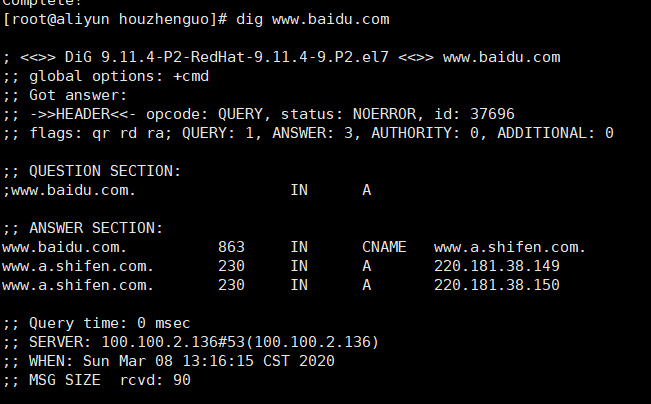

## netstat
1. netstat -nalp | grep 8080

    其中，n : 展示的是ip地址
         a : all 包含 tcp udp ,使用 t只显示 tcp
         l : listen
         p: programs

## telnet
 telnet ip port 不能使用 域名
 telnet www.baidu.com 22 不能使用 DNS解析问题

 ## nc

netcat 

安装参考连接 https://blog.csdn.net/qq_43688472/article/details/86499341

yum install -y nc

---

## dig

yum install bind-utils

## curl & wget
https://www.cnblogs.com/aftree/p/9293071.html

## 抓包相关

1. Charles
抓包神器，研究手机客户端与服务器数据交互的顶级神器。
2. Wireshark
也是抓包神器，随便抓个http请求的包吧，对于TCP 3次握手、4次挥手你会有更深入的理解。

## 题目

## 测试某个 端口是否开放
    1.  telnet ip port
    2. nc -v -n -z -w1 ip port

## 自定义类似 http 的协议

