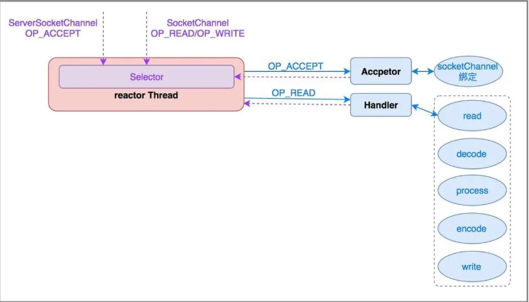
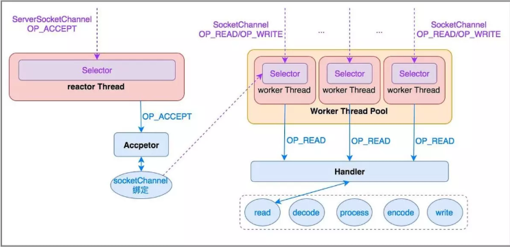
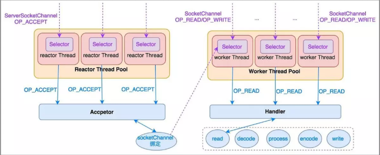

<!-- MarkdownTOC -->

- [IO流学习总结](#io流学习总结)
  - [一　Java IO，硬骨头也能变软](#一-java-io，硬骨头也能变软)
  - [二　java IO体系的学习总结](#二-java-io体系的学习总结)
  - [三　Java IO面试题](#三-java-io面试题)
- [NIO与AIO学习总结](#nio与aio学习总结)
  - [一 Java NIO 概览](#一-java-nio-概览)
  - [二 Java NIO 之 Buffer\(缓冲区\)](#二-java-nio-之-buffer缓冲区)
  - [三 Java NIO 之 Channel（通道）](#三-java-nio-之-channel（通道）)
  - [四 Java NIO之Selector（选择器）](#四-java-nio之selector（选择器）)
  - [五 Java NIO之拥抱Path和Files](#五-java-nio之拥抱path和files)
  - [六 NIO学习总结以及NIO新特性介绍](#六-nio学习总结以及nio新特性介绍)
  - [七 Java NIO AsynchronousFileChannel异步文件通](#七-java-nio-asynchronousfilechannel异步文件通)
  - [八 高并发Java（8）：NIO和AIO](#八-高并发java（8）：nio和aio)
- [推荐阅读](#推荐阅读)
  - [在 Java 7 中体会 NIO.2 异步执行的快乐](#在-java-7-中体会-nio2-异步执行的快乐)
  - [Java AIO总结与示例](#java-aio总结与示例)

<!-- /MarkdownTOC -->


## IO流学习总结

### [一　Java IO，硬骨头也能变软](https://mp.weixin.qq.com/s?__biz=MzU4NDQ4MzU5OA==&mid=2247483981&idx=1&sn=6e5c682d76972c8d2cf271a85dcf09e2&chksm=fd98542ccaefdd3a70428e9549bc33e8165836855edaa748928d16c1ebde9648579d3acaac10#rd)

**（1） 按操作方式分类结构图：**


**（2）按操作对象分类结构图**


### [二　java IO体系的学习总结](https://blog.csdn.net/nightcurtis/article/details/51324105) 
1. **IO流的分类：**
   - 按照流的流向分，可以分为输入流和输出流；
   - 按照操作单元划分，可以划分为字节流和字符流；
   - 按照流的角色划分为节点流和处理流。
2. **流的原理浅析:**

   java Io流共涉及40多个类，这些类看上去很杂乱，但实际上很有规则，而且彼此之间存在非常紧密的联系， Java Io流的40多个类都是从如下4个抽象类基类中派生出来的。

   - **InputStream/Reader**: 所有的输入流的基类，前者是字节输入流，后者是字符输入流。
   - **OutputStream/Writer**: 所有输出流的基类，前者是字节输出流，后者是字符输出流。
3. **常用的io流的用法** 

### [三　Java IO面试题](https://mp.weixin.qq.com/s?__biz=MzU4NDQ4MzU5OA==&mid=2247483985&idx=1&sn=38531c2cee7b87f125df7aef41637014&chksm=fd985430caefdd26b0506aa84fc26251877eccba24fac73169a4d6bd1eb5e3fbdf3c3b940261#rd)

## NIO与AIO学习总结


### [一 Java NIO 概览](https://mp.weixin.qq.com/s?__biz=MzU4NDQ4MzU5OA==&mid=2247483956&idx=1&sn=57692bc5b7c2c6dfb812489baadc29c9&chksm=fd985455caefdd4331d828d8e89b22f19b304aa87d6da73c5d8c66fcef16e4c0b448b1a6f791#rd)

1.  **NIO简介**:

    Java NIO 是 java 1.4, 之后新出的一套IO接口NIO中的N可以理解为Non-blocking，不单纯是New。

2.  **NIO的特性/NIO与IO区别:**
    -   1)IO是面向流的，NIO是面向缓冲区的；
    -   2)IO流是阻塞的，NIO流是不阻塞的;
    -   3)NIO有选择器，而IO没有。
3.  **读数据和写数据方式:**
    - 从通道进行数据读取 ：创建一个缓冲区，然后请求通道读取数据。

    - 从通道进行数据写入 ：创建一个缓冲区，填充数据，并要求通道写入数据。

4.  **NIO核心组件简单介绍**
    - **Channels**
    - **Buffers**
    - **Selectors**


### [二 Java NIO 之 Buffer(缓冲区)](https://mp.weixin.qq.com/s?__biz=MzU4NDQ4MzU5OA==&mid=2247483961&idx=1&sn=f67bef4c279e78043ff649b6b03fdcbc&chksm=fd985458caefdd4e3317ccbdb2d0a5a70a5024d3255eebf38183919ed9c25ade536017c0a6ba#rd)

1. **Buffer(缓冲区)介绍:**
   - Java NIO Buffers用于和NIO Channel交互。 我们从Channel中读取数据到buffers里，从Buffer把数据写入到Channels；
   - Buffer本质上就是一块内存区；
   - 一个Buffer有三个属性是必须掌握的，分别是：capacity容量、position位置、limit限制。
2. **Buffer的常见方法**
    - Buffer clear()
    - Buffer flip()
    - Buffer rewind()
    - Buffer position(int newPosition)
3. **Buffer的使用方式/方法介绍:**
    - 分配缓冲区（Allocating a Buffer）:
    ```java
    ByteBuffer buf = ByteBuffer.allocate(28);//以ByteBuffer为例子
    ```
    - 写入数据到缓冲区（Writing Data to a Buffer）
    
     **写数据到Buffer有两种方法：**
      
      1.从Channel中写数据到Buffer
      ```java
      int bytesRead = inChannel.read(buf); //read into buffer.
      ```
      2.通过put写数据：
      ```java
      buf.put(127);
      ```

4. **Buffer常用方法测试**
     
    说实话，NIO编程真的难，通过后面这个测试例子，你可能才能勉强理解前面说的Buffer方法的作用。


### [三 Java NIO 之 Channel（通道）](https://mp.weixin.qq.com/s?__biz=MzU4NDQ4MzU5OA==&mid=2247483966&idx=1&sn=d5cf18c69f5f9ec2aff149270422731f&chksm=fd98545fcaefdd49296e2c78000ce5da277435b90ba3c03b92b7cf54c6ccc71d61d13efbce63#rd)


1.  **Channel（通道）介绍**
     - 通常来说NIO中的所有IO都是从 Channel（通道） 开始的。 
     - NIO Channel通道和流的区别：
2. **FileChannel的使用**
3. **SocketChannel和ServerSocketChannel的使用**
4.  **️DatagramChannel的使用**
5.  **Scatter / Gather**
    - Scatter: 从一个Channel读取的信息分散到N个缓冲区中(Buufer).
    - Gather: 将N个Buffer里面内容按照顺序发送到一个Channel.
6. **通道之间的数据传输**
   - 在Java NIO中如果一个channel是FileChannel类型的，那么他可以直接把数据传输到另一个channel。
   - transferFrom() :transferFrom方法把数据从通道源传输到FileChannel
   - transferTo() :transferTo方法把FileChannel数据传输到另一个channel
   

### [四 Java NIO之Selector（选择器）](https://mp.weixin.qq.com/s?__biz=MzU4NDQ4MzU5OA==&mid=2247483970&idx=1&sn=d5e2b133313b1d0f32872d54fbdf0aa7&chksm=fd985423caefdd354b587e57ce6cf5f5a7bec48b9ab7554f39a8d13af47660cae793956e0f46#rd)


1. **Selector（选择器）介绍**
   - Selector 一般称 为选择器 ，当然你也可以翻译为 多路复用器 。它是Java NIO核心组件中的一个，用于检查一个或多个NIO Channel（通道）的状态是否处于可读、可写。如此可以实现单线程管理多个channels,也就是可以管理多个网络链接。
   - 使用Selector的好处在于： 使用更少的线程来就可以来处理通道了， 相比使用多个线程，避免了线程上下文切换带来的开销。
2. **Selector（选择器）的使用方法介绍**
   - Selector的创建
   ```java
   Selector selector = Selector.open();
   ```
   - 注册Channel到Selector(Channel必须是非阻塞的)
   ```java
   channel.configureBlocking(false);
   SelectionKey key = channel.register(selector, Selectionkey.OP_READ);
   ```
   -  SelectionKey介绍
   
      一个SelectionKey键表示了一个特定的通道对象和一个特定的选择器对象之间的注册关系。
   - 从Selector中选择channel(Selecting Channels via a Selector)
   
     选择器维护注册过的通道的集合，并且这种注册关系都被封装在SelectionKey当中.
   - 停止选择的方法
     
     wakeup()方法 和close()方法。
3.  **模板代码**

    有了模板代码我们在编写程序时，大多数时间都是在模板代码中添加相应的业务代码。
4. **客户端与服务端简单交互实例**


### [五 Java NIO之拥抱Path和Files](https://mp.weixin.qq.com/s?__biz=MzU4NDQ4MzU5OA==&mid=2247483976&idx=1&sn=2296c05fc1b840a64679e2ad7794c96d&chksm=fd985429caefdd3f48e2ee6fdd7b0f6fc419df90b3de46832b484d6d1ca4e74e7837689c8146&token=537240785&lang=zh_CN#rd)

**一 文件I/O基石：Path：**
- 创建一个Path
- File和Path之间的转换，File和URI之间的转换
- 获取Path的相关信息
- 移除Path中的冗余项

**二 拥抱Files类：**
-  Files.exists() 检测文件路径是否存在
-  Files.createFile() 创建文件
-  Files.createDirectories()和Files.createDirectory()创建文件夹
-  Files.delete()方法 可以删除一个文件或目录
-  Files.copy()方法可以吧一个文件从一个地址复制到另一个位置
-   获取文件属性
-   遍历一个文件夹
-   Files.walkFileTree()遍历整个目录

### [六 NIO学习总结以及NIO新特性介绍](https://blog.csdn.net/a953713428/article/details/64907250)

- **内存映射：**

这个功能主要是为了提高大文件的读写速度而设计的。内存映射文件(memory-mappedfile)能让你创建和修改那些大到无法读入内存的文件。有了内存映射文件，你就可以认为文件已经全部读进了内存，然后把它当成一个非常大的数组来访问了。将文件的一段区域映射到内存中，比传统的文件处理速度要快很多。内存映射文件它虽然最终也是要从磁盘读取数据，但是它并不需要将数据读取到OS内核缓冲区，而是直接将进程的用户私有地址空间中的一部分区域与文件对象建立起映射关系，就好像直接从内存中读、写文件一样，速度当然快了。

### [七 Java NIO AsynchronousFileChannel异步文件通](http://wiki.jikexueyuan.com/project/java-nio-zh/java-nio-asynchronousfilechannel.html)

Java7中新增了AsynchronousFileChannel作为nio的一部分。AsynchronousFileChannel使得数据可以进行异步读写。

### [八 高并发Java（8）：NIO和AIO](http://www.importnew.com/21341.html)


## 推荐阅读

### [在 Java 7 中体会 NIO.2 异步执行的快乐](https://www.ibm.com/developerworks/cn/java/j-lo-nio2/index.html)

### [Java AIO总结与示例](https://blog.csdn.net/x_i_y_u_e/article/details/52223406)
AIO是异步IO的缩写，虽然NIO在网络操作中，提供了非阻塞的方法，但是NIO的IO行为还是同步的。对于NIO来说，我们的业务线程是在IO操作准备好时，得到通知，接着就由这个线程自行进行IO操作，IO操作本身是同步的。


# NIO 线程模型

[文章来源](https://www.jianshu.com/p/deee985323ce)

所谓的Reactor模式，核心就是`事件驱动`，或者j叫回调的方式。这种方式就是，应用业务向一个中间人注册一个回调（event handler），当IO就绪后，就这个中间人产生一个事件，并通知此handler进行处理。

那么由谁来充当这个中间人呢？是由一个`不断等待和循环`的单独进程（线程）来做这件事，它接受所有handler的注册，并负责先操作系统查询IO是否就绪，在`就绪后就调用指定handler进行处理`，这个角色的名字就叫做Reactor。

回想一下 Linux网络IO模型 中提到的 IO复用，一个线程可以同时处理多个Connection，是不是正好契合Reactor的思想。所以，在java中可以使用NIO来实现Reactor模型。

## 单线程Reactor




- Reactor：负责响应事件，将事件分发给绑定了该事件的Handler处理；

- Handler：事件处理器，绑定了某类事件，负责执行对应事件的Task对事件进行处理；

- Acceptor：Handler的一种，绑定了connect事件。当客户端发起connect请求时，Reactor会将accept事件分发给Acceptor处理。

### 单线程缺点：

1. 一个连接里完整的网络处理过程一般分为accept、read、decode、process(compute)、encode、send这几步，如果在process这个过程中需要处理大量的耗时业务，比如连接DB或者进行耗时的计算等，整个线程都被阻塞，无法处理其他的链路

2. 单线程，不能充分利用多核处理器

3. 单线程处理I/O的效率确实非常高，没有线程切换，只是拼命的读、写、选择事件。但是如果有成千上万个链路，即使不停的处理，一个线程也无法支撑

4. 单线程，一旦线程意外进入死循环或者抛出未捕获的异常，整个系统就挂掉了

对于缺点1，通常的解决办法是将decode、process、encode扔到后台业务线程池中执行，避免阻塞reactor。但对于缺点2、3、4，单线程的reactor是无能为力的。

## 多线程的Reactor



- 有专门一个reactor线程用于监听服务端ServerSocketChannel，接收客户端的TCP连接请求；

- 网络IO的读/写操作等由一个worker reactor线程池负责，由线程池中的NIO线程负责监听SocketChannel事件，进行消息的读取、解码、编码和发送。

- 一个NIO线程可以同时处理N条链路，但是一个链路只注册在一个NIO线程上处理，防止发生并发操作问题。

注意，socketchannel、selector、thread三者的对应关系是：

socketchannel只能注册到一个selector上，但是一个selector可以被多个socketchannel注册；

selector与thread一般为一一对应。

## 主从多线程Reactor




在绝大多数场景下，Reactor多线程模型都可以满足性能需求；但是在极个别特殊场景中，一个NIO线程负责监听和处理所有的客户端连接可能会存在性能问题。比如，建立连接时需要进行复杂的验证和授权工作等。

服务端用于接收客户端连接的不再是个1个单独的reactor线程，而是一个boss reactor线程池；

服务端启用多个ServerSocketChannel监听不同端口时，每个ServerSocketChannel的监听工作可以由线程池中的一个NIO线程完成。


