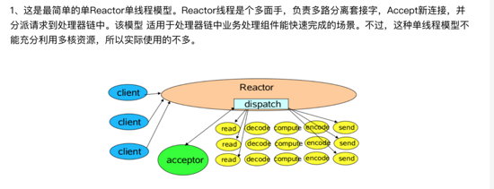
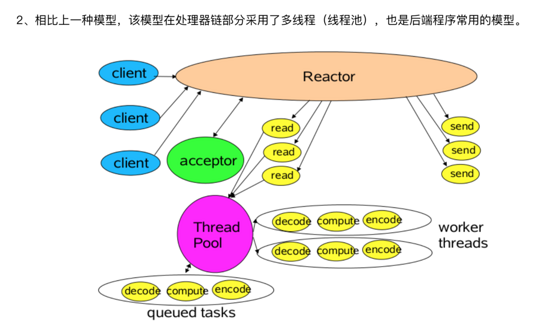
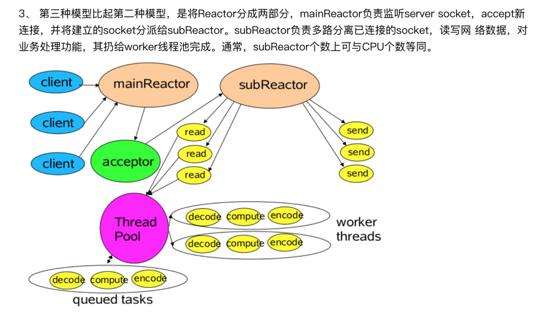
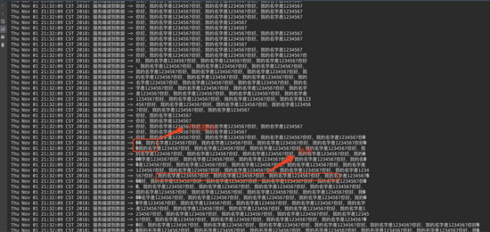
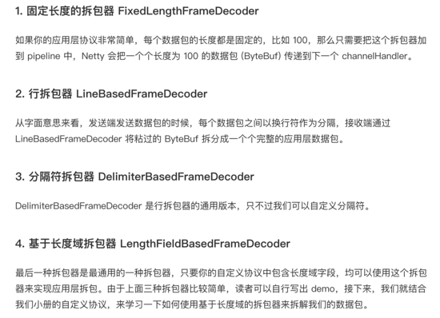
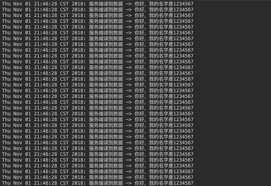
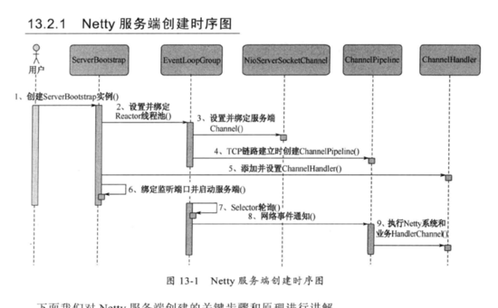
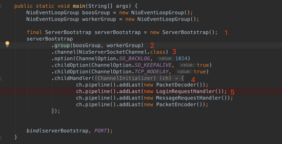
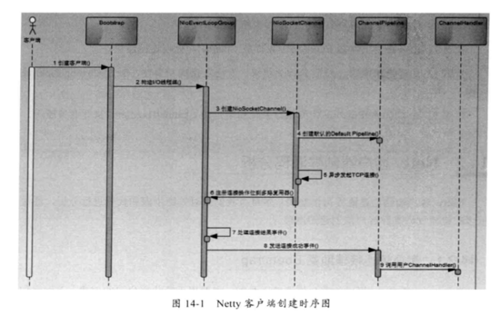
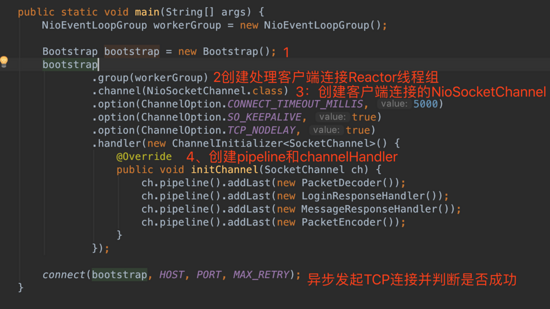

 

# Netty到底是什么

## 从HTTP说起

有了Netty，你可以实现自己的HTTP服务器，FTP服务器，UDP服务器，RPC服务器，WebSocket服务器，Redis的Proxy服务器，MySQL的Proxy服务器等等。

我们回顾一下传统的HTTP服务器的原理 

1、创建一个ServerSocket，监听并绑定一个端口

2、一系列客户端来请求这个端口

3、 服务器 使用Accept，获得一个来自客户端的Socket连接对象

4、启动一个新线程处理连接

4.1、读Socket，得到字节流

4.2、解码协议，得到Http请求对象

4.3、处理Http请求，得到一个结果，封装成一个HttpResponse对象

4.4、编码协议，将结果序列化字节流 写Socket，将字节流发给客户端

5、继续循环步骤3

HTTP服务器之所以称为HTTP服务器，是因为编码解码协议是HTTP协议，如果协议是 Redis 协议，那它就成了Redis服务器，如果协议是WebSocket，那它就成了WebSocket服务器，等等。 使用Netty你就可以定制编解码协议，实现自己的特定协议的服务器。

## NIO

上面是一个传统处理http的服务器，但是在高并发的环境下，线程数量会比较多，System load也会比较高，于是就有了NIO。

他并不是 Java 独有的概念，NIO代表的一个词汇叫着IO多路复用。它是由操作系统提供的系统调用，早期这个操作系统调用的名字是select，但是性能低下，后来渐渐演化成了 Linux 下的epoll和Mac里的kqueue。我们一般就说是epoll，因为没有人拿苹果电脑作为服务器使用对外提供服务。而Netty就是基于Java NIO技术封装的一套框架。为什么要封装，因为原生的Java NIO使用起来没那么方便，而且还有臭名昭著的bug，Netty把它封装之后，提供了一个易于操作的使用模式和接口，用户使用起来也就便捷多了。

说NIO之前先说一下BIO（Blocking IO）,如何理解这个Blocking呢？

1. 客户端监听（Listen）时，Accept是阻塞的，只有新连接来了，Accept才会返回，主线程才能继
2. 读写socket时，Read是阻塞的，只有请求消息来了，Read才能返回，子线程才能继续处理
3. 读写socket时，Write是阻塞的，只有客户端把消息收了，Write才能返回，子线程才能继续读取下一个请求

传统的BIO模式下，从头到尾的所有线程都是阻塞的，这些线程就干等着，占用系统的资源，什么事也不干。

那么NIO是怎么做到非阻塞的呢。它用的是事件机制。它可以用一个线程把Accept，读写操作，请求处理的逻辑全干了。如果什么事都没得做，它也不会死循环，它会将线程休眠起来，直到下一个事件来了再继续干活，这样的一个线程称之为NIO线程。用伪代码表示：

```
while true {
    events = takeEvents(fds)  // 获取事件，如果没有事件，线程就休眠
    for event in events {
        if event.isAcceptable {
            doAccept() // 新链接来了
        } elif event.isReadable {
            request = doRead() // 读消息
            if request.isComplete() {
                doProcess()
            }
        } elif event.isWriteable {
            doWrite()  // 写消息
        }
    }
}
```

## Reactor线程模型

- Reactor单线程模型

一个NIO线程+一个accept线程：



- Reactor多线程模型



- Reactor主从模型

主从Reactor多线程：多个acceptor的NIO线程池用于接受客户端的连接



Netty可以基于如上三种模型进行灵活的配置。

## 总结

Netty是建立在NIO基础之上，Netty在NIO之上又提供了更高层次的抽象。

在Netty里面，Accept连接可以使用单独的线程池去处理，读写操作又是另外的线程池来处理。

Accept连接和读写操作也可以使用同一个线程池来进行处理。而请求处理逻辑既可以使用单独的线程池进行处理，也可以跟放在读写线程一块处理。线程池中的每一个线程都是NIO线程。用户可以根据实际情况进行组装，构造出满足系统需求的高性能并发模型。

## 为什么选择Netty

如果不用netty，使用原生JDK的话，有如下问题：

1、API复杂

2、对多线程很熟悉：因为NIO涉及到Reactor模式

3、高可用的话：需要出路断连重连、半包读写、失败缓存等问题

4、JDK NIO的bug

而Netty来说，他的api简单、性能高而且社区活跃（dubbo、rocketmq等都使用了它）


## 什么是TCP 粘包/拆包

## 现象

先看如下代码，这个代码是使用netty在client端重复写100次数据给server端，ByteBuf是netty的一个字节容器，里面存放是的需要发送的数据

```java
public class FirstClientHandler extends ChannelInboundHandlerAdapter {    
    @Override    
    public void channelActive(ChannelHandlerContext ctx) {       
        for (int i = 0; i < 1000; i++) {            
            ByteBuf buffer = getByteBuf(ctx);            
            ctx.channel().writeAndFlush(buffer);        
        }    
    }    
    private ByteBuf getByteBuf(ChannelHandlerContext ctx) {        
        byte[] bytes = "你好，我的名字是1234567!".getBytes(Charset.forName("utf-8"));        
        ByteBuf buffer = ctx.alloc().buffer();        
        buffer.writeBytes(bytes);        
        return buffer;    
    }
}
```

从client端读取到的数据为：



从服务端的控制台输出可以看出，存在三种类型的输出

1. 一种是正常的字符串输出。
2. 一种是多个字符串“粘”在了一起，我们定义这种 ByteBuf 为粘包。
3. 一种是一个字符串被“拆”开，形成一个破碎的包，我们定义这种 ByteBuf 为半包。

## 透过现象分析原因

应用层面使用了Netty，但是对于操作系统来说，只认TCP协议，尽管我们的应用层是按照 ByteBuf 为 单位来发送数据，server按照Bytebuf读取，但是到了底层操作系统仍然是按照字节流发送数据，因此，数据到了服务端，也是按照字节流的方式读入，然后到了 Netty 应用层面，重新拼装成 ByteBuf，而这里的 ByteBuf 与客户端按顺序发送的 ByteBuf 可能是不对等的。因此，我们需要在客户端根据自定义协议来组装我们应用层的数据包，然后在服务端根据我们的应用层的协议来组装数据包，这个过程通常在服务端称为拆包，而在客户端称为粘包。

拆包和粘包是相对的，一端粘了包，另外一端就需要将粘过的包拆开，发送端将三个数据包粘成两个 TCP 数据包发送到接收端，接收端就需要根据应用协议将两个数据包重新组装成三个数据包。

## 如何解决

在没有 Netty 的情况下，用户如果自己需要拆包，基本原理就是不断从 TCP 缓冲区中读取数据，每次读取完都需要判断是否是一个完整的数据包 如果当前读取的数据不足以拼接成一个完整的业务数据包，那就保留该数据，继续从 TCP 缓冲区中读取，直到得到一个完整的数据包。 如果当前读到的数据加上已经读取的数据足够拼接成一个数据包，那就将已经读取的数据拼接上本次读取的数据，构成一个完整的业务数据包传递到业务逻辑，多余的数据仍然保留，以便和下次读到的数据尝试拼接。

而在Netty中，已经造好了许多类型的拆包器，我们直接用就好：




选好拆包器后，在代码中client段和server端将拆包器加入到chanelPipeline之中就好了:

如上实例中：

客户端：

```java
ch.pipeline().addLast(new FixedLengthFrameDecoder(31));
```
服务端：

```java
ch.pipeline().addLast(new FixedLengthFrameDecoder(31));
```



## Netty 的零拷贝

## 传统意义的拷贝

是在发送数据的时候，传统的实现方式是：

1. `File.read(bytes)`

2. `Socket.send(bytes)`

这种方式需要四次数据拷贝和四次上下文切换：

1. 数据从磁盘读取到内核的read buffer

2. 数据从内核缓冲区拷贝到用户缓冲区

3. 数据从用户缓冲区拷贝到内核的socket buffer

4. 数据从内核的socket buffer拷贝到网卡接口（硬件）的缓冲区

## 零拷贝的概念

明显上面的第二步和第三步是没有必要的，通过java的FileChannel.transferTo方法，可以避免上面两次多余的拷贝（当然这需要底层操作系统支持）

1. 调用transferTo,数据从文件由DMA引擎拷贝到内核read buffer

2. 接着DMA从内核read buffer将数据拷贝到网卡接口buffer

上面的两次操作都不需要CPU参与，所以就达到了零拷贝。

## Netty中的零拷贝

主要体现在三个方面：

- bytebuffer

Netty发送和接收消息主要使用bytebuffer，bytebuffer使用对外内存（DirectMemory）直接进行Socket读写。

原因：如果使用传统的堆内存进行Socket读写，JVM会将堆内存buffer拷贝一份到直接内存中然后再写入socket，多了一次缓冲区的内存拷贝。DirectMemory中可以直接通过DMA发送到网卡接口

- Composite Buffers

传统的ByteBuffer，如果需要将两个ByteBuffer中的数据组合到一起，我们需要首先创建一个size=size1+size2大小的新的数组，然后将两个数组中的数据拷贝到新的数组中。但是使用Netty提供的组合ByteBuf，就可以避免这样的操作，因为CompositeByteBuf并没有真正将多个Buffer组合起来，而是保存了它们的引用，从而避免了数据的拷贝，实现了零拷贝。

- 对于FileChannel.transferTo的使用

Netty中使用了FileChannel的transferTo方法，该方法依赖于操作系统实现零拷贝。

## Netty 内部执行流程

## 服务端：





1、创建ServerBootStrap实例

2、设置并绑定Reactor线程池：EventLoopGroup，EventLoop就是处理所有注册到本线程的Selector上面的Channel

3、设置并绑定服务端的channel

4、5、创建处理网络事件的ChannelPipeline和handler，网络时间以流的形式在其中流转，handler完成多数的功能定制：比如编解码 SSl安全认证

6、绑定并启动监听端口

7、当轮训到准备就绪的channel后，由Reactor线程：NioEventLoop执行pipline中的方法，最终调度并执行channelHandler 

## 客户端





原文链接 https://juejin.im/post/5bdaf8ea6fb9a0227b02275a

https://www.codercto.com/a/36104.html