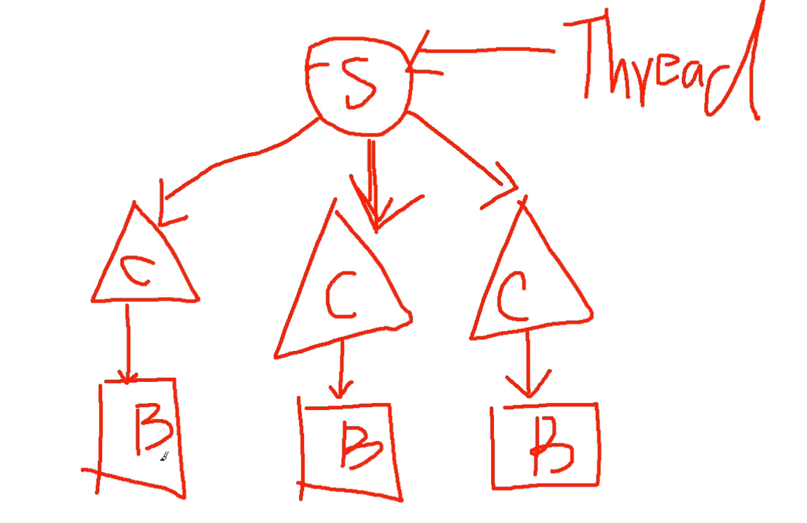
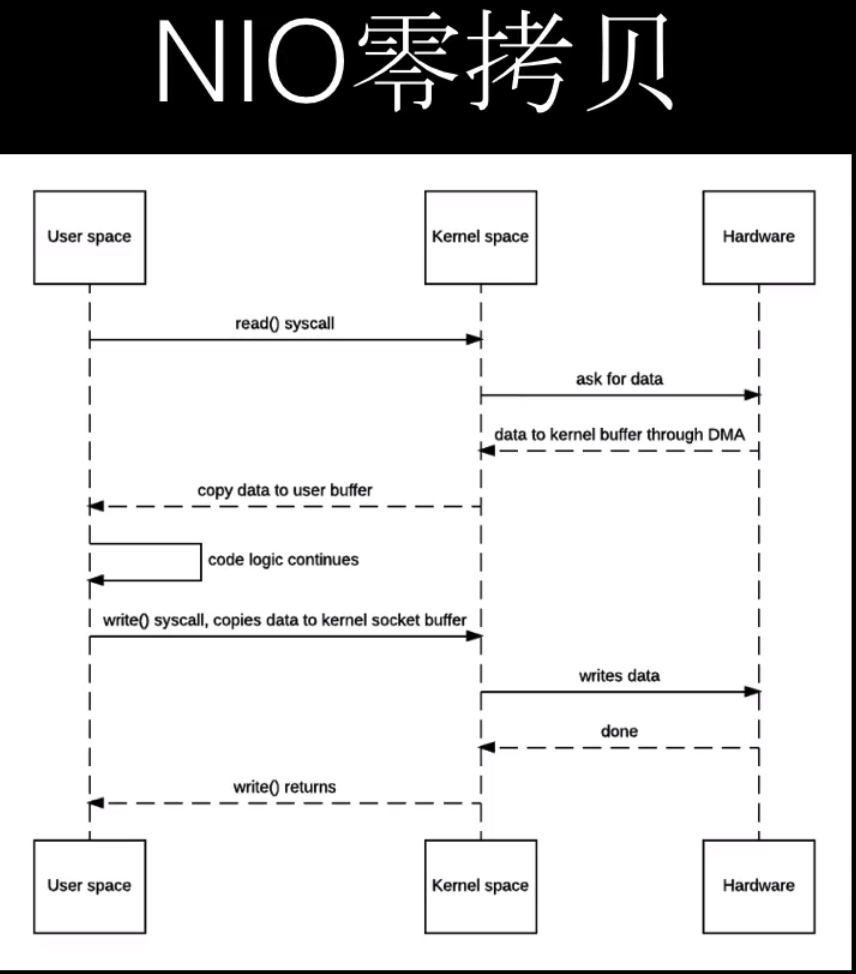
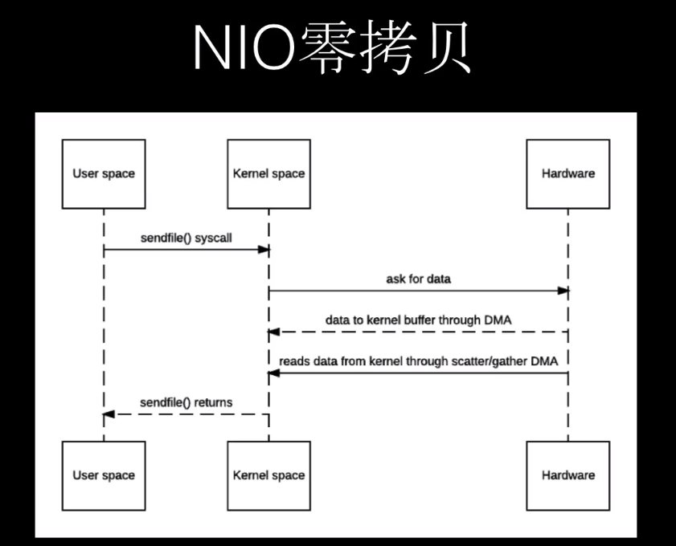
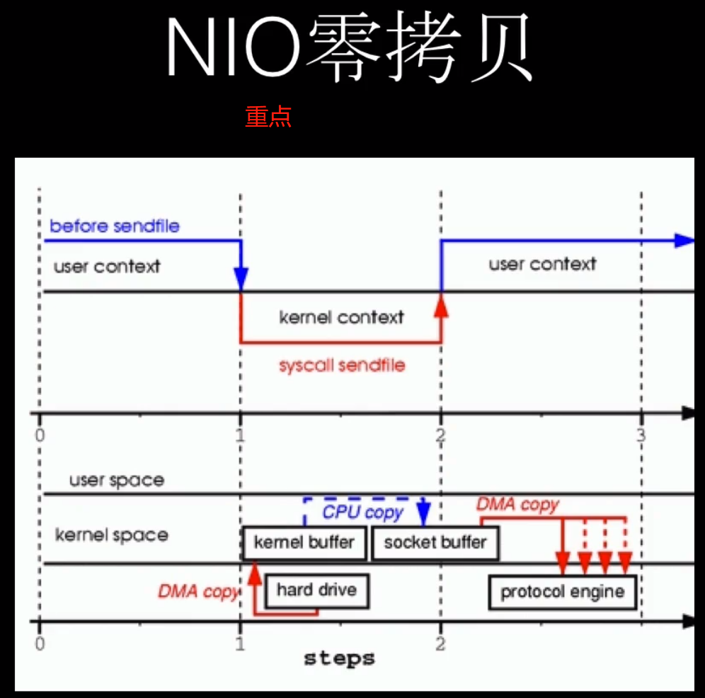

[B站netty链接](https://www.bilibili.com/video/av33707223/?p=2)

[网友的netty笔记Github](https://github.com/ganxinming/nettyTest.git)

[netty官方网站](https://netty.io/)

[netty in action](https://manning.com)

## 1. netty概述

参考：https://netty.io/

[Google Protocol Buffer](https://developers.google.com/protocol-buffers/) 是一款序列化的工具，可以实现跨语言 rpc的数据序列化以及反序列化工作。需要程序手动定义数据结构，通过工具生成对应的语言代码。

[Thrift](http://thrift.apache.org/) 它所完成的功能与google 的 protocol buffer的功能类似。

WebSocket 相比之前的HTTP1.0 ，是一种升级，可以实现长链接，通信的时候不需要重复建立链接。

[Gradle](https://gradle.org/install/) 下载，配置相应的环境变量，下载completely版本。


## Gradle 

gradle 与maven一样，都是一款包的管理工具，但是比maven更加轻量级。需要下载与自己的idea 匹配版本的Gradle，否则可能无法正常加载相关依赖。需要配置相关的环境变量，以及使用auto_import and 使用本地自己部署的gradle。注意，不同版本的gradle 对应的build.gradle的配置文件引入包的方式不同，可以参考给的junit的样子写。至于 包的地址，可以参考 https://search.maven.org

## Git

## Netty

netty 的三种应用场景：

netty可以作为RPC的框架 socket开发，

netty可以作为长连接 websocket的服务器

netty可以作为http服务器 例如 tomcat 不遵守servlet规范 请求路由需要自己处理

## curl 安装 
可以使用bash win 版本

## httpServer的搭建
- [01httpserver的创建.md](./code/01httpserver的创建.md)

curl -X POST "http://localhost:8899"


## netty学习方法

不要陷入到细节中，应该先学习应用。否则陷入蒙蔽中。

## WebSocket
 html5的规范，解决http的无状态问题。
 http: request -> response 建立连接 。 client -> request -> server handle -> response -> client -> 连接断掉 (http1.0)
 http 1.1 keepAlive ，建立连接。request -> response 在指定时间内，client还要请求server，不需要重新建立连接。 无法实现服务器的 push技术。 轮询技术早期

 poll 技术：1.无意义返回 2. header 的大小。

 html5 socket的长连接。client and server 平等。 不需要发送 header信息，节省带宽。双向数据通信。

## ProtocolBuff

1. RMI Remote method invocation, 只针对Java

client: 序列化字节码 

server： 反序列化

rpc 几乎都有 代码生成的过程。在client 称为 stub(庄) server:skeleton(骨架)

序列化与反序列化：也叫做 编码与解码。encode,decode.对象 <---> 字节

RPC: Remote Procedure Call 远程过程调用。与 RMI相比 跨语言。

（序列化的过程？）
1. 定义一个接口说明文件 ： 描述了对象（结构体），对象成员，接口方法的一系列信息。
```
message Person {
    required int32 id  =1;
    optional string name =2;
}
```
2. 通过 RPC框架所提供的编译器将接口说明文件编译成具体语言文件
3. 在客户端与服务器段分别引入 RPC编译器所生成的文件，即可像调用本地方法一样调用远程方法。

编码效率，压缩比例，解码效率，影响传输。这是影响 RPC的选择。

服务与服务之间的调用使用 RPC。

required 必须提供

optional 不是必须的。 后面的数字代表顺序。


## 使用 Git作为 版本控制系统 
Q: Client 和 Server 需要同一份生成出来的 Proto Buf 的Java 文件，为了避免手动拷贝，可以使用 git进行控制。

### 解决方案1（不是特别完美）

1. git submodule ： Git 仓库里面的仓库.

ServerProject : 已经在 Git版本之中了。这个工程用到了 Protocol Buf 。

Protobuf-Java: 独立的git的工程。通过 编译器生成的Java代码推送到这个仓库中。protoc

通过 submodule 将 Protobuf-Java 引入到 ServerProject 中。通过git命令.

ClientProject: 与 ServerProject 相似。

这种情况对于 分支情况不友好。
branch:
    develop
    test
    master

两个仓库，容易出现 分支错乱。

## Git subtree (推荐)

ServerProject

Protobuf-Java:(公用)

ClientProject

将公用的代码拉取到 ServerProject 中，仅仅是一个仓库，产生了合并，产生了一次提交。

# Thrift

[Thrift相关地址](http://thrift.apache.org/) 相比 protobuf,thrift支持更多的语言种类，可能安装会比较复杂。

# NIO

java.io
java.nio

java.io 中最为核心的概念是流（Stream）,面向流的编程，Java中，一个流要么是输入流，要么是输出流
java.nio selector,channel,buffer,面向 block 或 channel 的编程。buffer 就是一块内存空间，底层实现就是一块数组，可以实现读写（flip）
channel -> buffer->已经到达内存
buffer: limit position mark

除了数组之外，Buffer还提供了数据的结构化访问方式，并且可以追踪到系统的读写过程。

Java 中 7种原生类型都有对应的Buffer类型，IntBuffer,LongBuffer等。无BooleanBuffer

Channel 指的是可以向其写入数据或从中读取数据的对象，所有数据的读写都是通过Buffer进行的。
与Stream不同的是，Channel是双向的，Channle打开可以进行读取写入或者读写，所以更能反映出底层操作系统的真实情况。在Linux中，底层通道就是双向的。



## Buffer
position ： 下一个将要被读或者写的索引
limit :无法去 读写的 第一个索引

capacity:永远不会改变，就是数组的长度，而不是数量的大小allocate

0 <= mark <= position <= limit <= capacity

clear ,flip, rewind(重新读)

isReadOnly 只读buffer

方法链 chain

填充buffer数组前： limit = capcity 的位置，position是下一个可写的位置
-> flip方法调用
读取buffer数组前： limit是上次写的下一个位置（position）,position回归到0
 
 IntBuff -> Buffer allocate 调用完之后，数组的基本结构已经完成。

## Channel

1. 从 FileInputStream 获取到 FileChannel 对象
2. 创建 Buffer
3. 将数据从 Channel读取到 Buffer中

channel.read(buf)

## 类型化的put and get

putint/putchar

## 切片

slice 从 3-7index截取，修改哪一个buffer都会改到另外一个。share序列

Slince Buffer and origin Buffer share data

## ReadOnlyBuffer

传输给别人 ；put的时候直接抛出异常。

普通 Buffer.asReadOnlyBuffer转换。

## DirectByteBuffer
  
 allocateDirect：
 native method 堆外内存
 Buffer.address -> 这个成员变量引用到堆外内存分配内存的地址

 效率：

 heap bytebuff -> 操作系统 开辟一块内存区域，copy heap上的。IO操作的时候多了一次数据copy的过程，与设备进行交互。

 堆外数据 -> 操作系统直接交互。 zero copy

 操作系统为什么不直接访问 堆？ 假如发生gC->标记压缩-> 如果native操作可能错位了。copy过程中不会发生GC.由JVM保证。

 `address DirectByteBuffer`被GC掉之后，address引用的堆外内存就会被操作系统回收掉。。。free的过程[链接](https://www.bilibili.com/video/av33707223?p=38)


 allocate -> new byte[] 完成初始化 赋值相关操作。

 ## MappedByteBuffer

 内存映射文件，直接操作内存，由操作系统进行io 读写。

 ## Scattering 与 Gathering

 scattering : 将来自 channel的数据顺序 读到多个 buffer当中。

 自定义协议 ： header + body ;天然实现 分类

 # Selector

 event SelectKey 注册channel到 selector

## Zero Copy

四次 内核空间与 用户空间的切换

2次多余的 copy

Java’s NIO offers this through transferTo (doc).

user -> kernel -> call -
                        |
user<-kernel<-copy from hardware
|
| handle
-> copy -> kernel -> write data





## NIO实现 ZeroCOpy的重点



user context  -> sycall sendfile -> user context
[链接地址](https://www.bilibili.com/video/av33707223/?p=51&t=1934)
[medium_nio](https://medium.com/@xunnan.xu/its-all-about-buffers-zero-copy-mmap-and-java-nio-50f2a1bfc05c)
在这个过程中：

数据依然从磁盘copy到 内核缓冲区中，DMA copy

harddrive -> kernel buffer (重点来了)

socket buffer 做了改进，使用 fd(file desc)使用了 gather，对应的socketbuffer中
是保留的 df(kernel buffer 的内存地址，以及数据长度)

protocol engine: 从两个地方读取，一个是通过 socketbuff df确认数据位置，从
kernel buff 读取数据，这是真正意义上 zero copy

==============================================================
---
# 源码分析
基于： netty-all 4.1.15

# MyServer

## EventLoopGroup 

```java
EventLoopGroup bossGroup = new NioEventLoopGroup(1); // 1 代表线程的数量

// Defalut Thread Count : availableProcessors() * 2
// Runtime.getRunTime().getAvaibaleProcessors()

// intel 超线程 4核 *2  = 8核心
// work group
```
bossGroup 处理链接
workGroup 真正完成逻辑处理的

EventLoopGroup ： 事件循环组，底层就是一个死循环，检测输入输出的事件

ChannelFututer<> = register(Channel channel) // 注册 channel 到 eventgroup

NioEventLoopGroup:
完成变量的赋值，完成了一些准备工作。 一般程序设置线程池 为1 。如果没有提供线程数

就是超线程数 *2

ThreadFactory : 将线程的创建与 线程的执行 解耦，就是创建线程的，在Java8中是 函数式接口

Runnable command -> 命令模式 线程池的的execute(Runnable command)

ServerBootStrap(server)/ BootStrap(client) 就是定义，什么都没有做

bootstrap.group(bossGroup, workerGroup) -> acceptor handle serverchannel and channel

bossGroup -> 在 AbstractBootStrap 成员变量 group中
childGroup -> ServerBootStrap

volatile -> 编译器优化 -> 指令重排序

channel(NioServerSocketChannel.class) -> 将传入进来的class 赋值给了

ReflectiveChannelFactory 的成员变量，将通过反射的方式创建对象。

当调用 bind() 创建 channel实例

ChannelFactory -> 设置为 AbstractBootStrap 的成员变量

NioServerSocketChannel： selector accept new connection

childHandler -> workgroup使用 -> 赋值给 Server

赋值部分总结：
    boss -> abstractbootstrap
    work -> serverbootstrap
    channelbootstrap -> abstractbootstrap

serverbootstrap.bind(8899) -> create a new channel and bind it

AbstractBootStrap -> doBind()

但凡出现 future 就是异步的

Future: get-> 阻塞 cancle(中断) isDone 

netty.Future -> addListener 观察者模式 -> Future完成 -> 回调 listener

亮点： netty 解决了 future.get什么时候调用（因为调用会阻塞）添加listener
isSuccess 而不是 isDone

ChannelFuture -> 一个异步的channel io 操作；netty中所有的IO操作都是异步的，你在调用
完方法之后会立即返回，会return ChannelFuture实例

不要使用 ChannelFuture中的await方法


