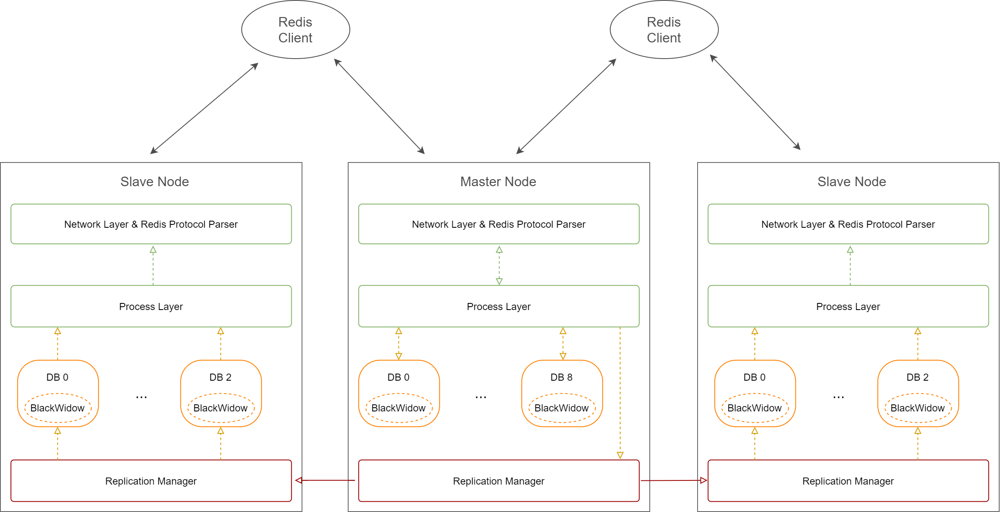
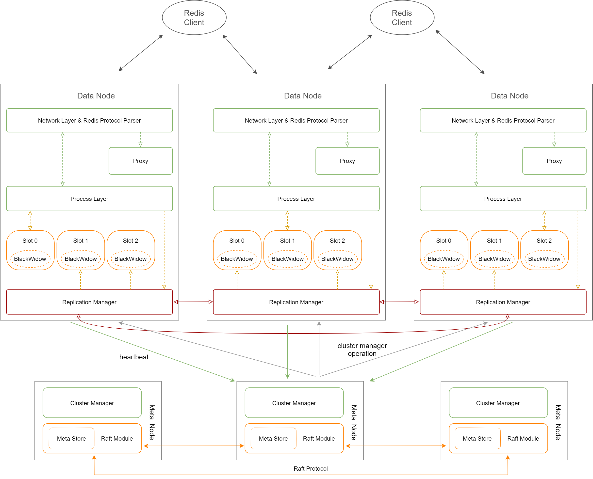
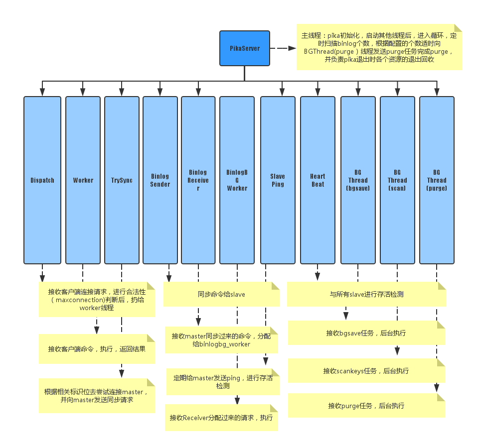
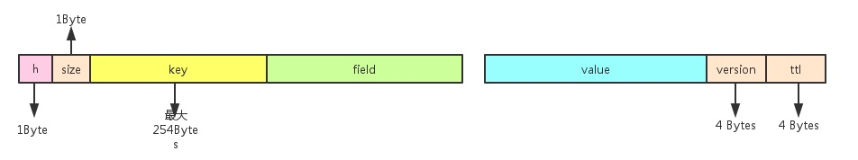
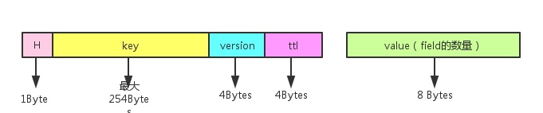
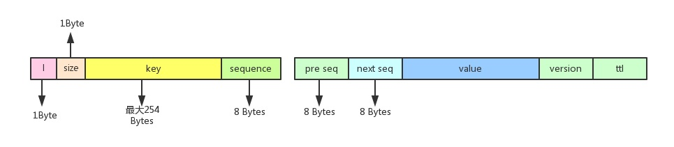

https://docs.google.com/presentation/d/1AoZW58G6gneoCcQd30BGobrUhB03RxqQQz7jB6NqKik/edit#slide=id.ga91661afbd_11_22

## github地址 

https://scottzzq.gitbooks.io/pika/content/

https://github.com/OpenAtomFoundation/pika/wiki
https://zhuanlan.zhihu.com/p/90891875
https://github.com/Qihoo360/pika
https://www.cnblogs.com/sigma0-/p/12828226.html?ivk_sa=1024320u

https://time.geekbang.org/column/article/298205

https://github.com/baotiao/pink

https://blog.csdn.net/qq_39081511/article/details/80363910

1. [Pika传火计划之线程模型](https://whoiami.github.io/PIKA_THREAD_MODEL)
2. [Pika传火计划之读写流程](https://whoiami.github.io/PIKA_DATA_PATH)
3. [Pika传火计划之主从同步](https://whoiami.github.io/PIKA_SYNC)

## 什么是pika

Pika是DBA和基础架构组联合开发的类Redis 存储系统，所以完全支持Redis协议，用户不需要修改任何代码，就可以将服务迁移至Pika。Pika是一个可持久化的大容量Redis存储服务，兼容string、hash、list、zset、set的绝大接口兼容详情，解决Redis由于存储数据量巨大而导致内存不够用的容量瓶颈，并且可以像Redis一样，通过slaveof命令进行主从备份，支持全同步和部分同步。同时DBA团队还提供了迁移工具， 所以用户不会感知这个迁移的过程，迁移是平滑的。

## redis vs pika

Pika相对于Redis，最大的不同就是Pika是持久化存储，数据存在磁盘上，而Redis是内存存储，由此不同也给Pika带来了相对于Redis的优势和劣势

优势：
容量大：Pika没有Redis的内存限制, 最大使用空间等于磁盘空间的大小
加载db速度快：Pika在写入的时候, 数据是落盘的, 所以即使节点挂了, 不需要rdb或者oplog，Pika重启不用加载所有数据到内存就能恢复之前的数据, 不需要进行回放数据操作。

备份速度快：Pika备份的速度大致等同于cp的速度（拷贝数据文件后还有一个快照的恢复过程，会花费一些时间），这样在对于百G大库的备份是快捷的，更快的备份速度更好的解决了主从的全同步问题。
redis 在主库挂掉以后, 从库升级为新的主库. 那么切换主库以后, 所有的从库都需要跟新主做一次全同步, 全量同步一次大容量的redis, 代价非常大.

劣势：
由于Pika是基于内存和文件来存放数据, 所以性能肯定比Redis低一些, 但是我们一般使用SSD盘来存放数据, 尽可能跟上Redis的性能。

总结： 价格便宜，数据量大，不影响太多性能的情况下可以考虑。

## 场景
从以上的对比可以看出, 如果你的业务场景的数据比较大，Redis 很难支撑， 比如大于50G，或者你的数据很重要，不允许断电丢失，那么使用Pika 就可以解决你的问题。 而在实际使用中，Pika的性能大约是Redis的50%。
## 特点

1. 容量大，支持百G数据量的存储
2. 兼容Redis，不用修改代码即可平滑从Redis迁移到Pika
3. 支持主从(slaveof)
4. 完善的运维命令

## 架构
Pika 一款开源的高性能持久化的NoSQL产品，兼容Redis协议，数据持久化存储到RocksDB存储引擎，具有两种运行模式： 经典模式（Classic） & 分布式模式（Sharding）。

- 经典模式（Classic）： 即1主N从同步模式，1个主实例存储所有的数据，N个从实例完全镜像同步主实例的数据，每个实例支持多个DBs。DB默认从0开始，Pika的配置项databases可以设置最大DB数量。DB在Pika上的物理存在形式是一个文件目录。
- 分布式模式（Sharding）： Sharding模式下，将用户存储的数据集合称为Table，每个Table切分成多个分片，每个分片称为Slot，对于某一个KEY的数据由哈希算法计算决定属于哪个Slot。将所有Slots及其副本按照一定策略分散到所有的Pika实例中，每个Pika实例有一部分主Slot和一部分从Slot。在Sharding模式下，分主从的是Slot而不再是Pika实例。Slot在Pika上的物理存在形式是一个文件目录。

Pika可以通过配置文件中的instance-mode配置项，设置为classic和sharding，来选择运行经典模式（Classic）还是分布式模式（Sharding）的Pika。

### 1. 经典模式

### 2. 分布式模式

## rocket db
1. RocksDB是一种可以存储任意二进制kv数据的嵌入式存储。RocksDB按顺序组织所有数据，他们的通用操作是Get(key), Put(key), Delete(Key)以及NewIterator().
2. 

## 线程模型
pika使用的是多线程模型，使用多个工作线程来进行读写操作，由底层blackwidow引擎来保证线程安全，线程分为12种：

- PikaServer：主线程
- DispatchThread：监听1个端口，接收用户连接请求
- WorkerThread：存在多个(用户配置)，每个线程里有若干个用户客户端的连接，负责接收用户命令，然后将命令封装成一个Task扔到ThreadPool执行，任务执行完毕之后由该线程将reply返回给用户
- ThreadPool：线程池中的线程数量由用户配置，执行WorkerThread调度过来的Task, Task的内容主要是写DB和写Binlog
- PikaAuxiliaryThread：辅助线程，处理同步过程中状态机状态的切换，主从之间心跳的发送以及超时检查
- PikaReplClient：本质上是一个Epoll线程(与其他Pika实例的PikaReplServer进行通信)加上一个由若干线程组成的线程数组(异步的处理写Binlog以及写DB的任务)
- PikaReplServer：本质上是一个Epoll线程(与其他Pika实例的PikaReplClient进行通信)加上一个由若干线程组成的线程池(处理同步的请求以及根据从库返回的Ack更新Binlog滑窗)
- MonitorThread：执行了Monitor命令的客户端会被分配在这个线程上，这个线程将目前Pika正在处理的命令返回给挂在这个线程上的客户端
- KeyScanThread：在这个线程中执行info keyspace 1触发的统计Key数量的任务
- BgSaveThread：对指定的DB进行Dump操作，以及全同步的时候发送Dump数据到从库（对一个DB执行全同步是先后向Thread中扔了BgSave以及DBSync两个任务从而保证顺序)
- PurgeThread：用于清理过期的Binlog文件
- PubSubThread：用于支持PubSub相关功能

---- 
https://www.cnblogs.com/sigma0-/p/12828226.html

1. PikaDisPatchThread -> pink.DispathThread -> epoll -> accept -> HandleNewConn
-> 分发给IO工作线程workerThread 来处理，-> 每个workThread 有一个queue -> 封装成为一个item push进去
-> pipe管道通知
2. DispatchThread start的时候回起workerThread线程，
   -> 收到notify管道通知，一次性读取多个字节内容，-> 1个字节就是一个通知，在循环里面处理这些请求。
   -> 取出我们push的pinkitem -> 创建新的pinkconn,加入到 conns_中，

监听线程是用来监听新的连接，连接来了会交由WorkerThread处理，已建立连接的请求会由WorkerThread封装成Task交给线程池ThreadPool处理，ThreadPool处理完了后，还是由WorkerThread来回复。WorkerThread就是做接收消息，回复消息的，而ThreadPool只是处理消息，不涉及接收和回复的IO操作。

1，新的客户端连接接入到DispatchThread，DispatchThread accept 并生成fd，传递到worker thread。
2，worker thread 调用ClientConnFactory 的NewPinkConn 生成PikaClientConn，从此维护此PikaClientConn的读写行为。
3，worker thread调用GetRequest读取客户端请求放入redis_parser 进行解析，redis_parser 调用PikaClientConn::AsynProcessRedisCmds实现。将此cmd 放入thread pool queue。
4，thread pool thread 处理cmd，调用PikaClientConn::WriteResp将处理结果写入PikaClientConn的resp 结构，调用PikaClientConn::NotifyEpoll 通知worker thread 可以返回客户端。
5，worker thread 接收kNotiEpollout事件，打开这个conn fd 的EPOLLOUT ，下一个epoll_wait 周期检测到这个conn可写，调用WriteResp将resp的内容返回给客户端。

---

## 存储引擎
pika的存储引擎是基于Rocksdb实现的. 封装了String，Hash, List, ZSet, Set等数据结构
我们知道redis是需要支持多数据结构的, 而rocksdb只是一个kv的接口, 那么我们如何实现的呢?

比如对于Hash数据结构:

对于每一个Hash存储，它包括hash键（key），hash键下的域名（field）和存储的值 （value）.

nemo的存储方式是将key和field组合成为一个新的key，将这个新生成的key与所要存储的value组成最终落盘的kv键值对。同时，对于每一个hash键，nemo还为它添加了一个存储元信息的落盘kv，它保存的是对应hash键下的所有域值对的个数。

每个hash键、field、value到落盘kv的映射转换

每个hash键的元信息的落盘kv的存储格式

比如对于List 数据结构:

顾名思义，每个List结构的底层存储也是采用链表结构来完成的。对于每个List键，它的每个元素都落盘为一个kv键值对，作为一个链表的一个节点，称为元素节点。和hash一样，每个List键也拥有自己的元信息。

每个元素节点对应的落盘kv存储格式

每个元信息的落盘kv的存储格式

其他的数据结构实现的方式也类似, 通过将数据结构拆分为一个个独立的KV, 存储到rocksdb 里面去. 从而实现多数据结构的结构

### 数据结构
1. kv
`kv`数据结构不需要做额外的封装，只需要调用rocksdb提供的接口。

## binlog
1. pika的主从同步是使用Binlog来完成的.
binlog 本质是顺序写文件, 通过Index + offset 进行同步点检查.

解决了同步缓冲区太小的问题

支持全同步 + 增量同步

master执行完一条写命令就将命令追加到Binlog中，ReplicaSender将这条命令从Binlog中读出来发送给slave，slave的ReplicaReceiver收到该命令，执行，并追加到自己的Binlog中.

当发生网络闪断或slave挂掉重启时, slave仅需要将自己当前的Binlog Index + offset 发送给master，master找到后从该偏移量开始同步后续命令

为了防止读文件中写错一个字节则导致整个文件不可用，所以pika采用了类似leveldb log的格式来进行存储，具体如下：

## 关于数据删除 
多数据结构key的快速删除
以Hash为例，redis一个Hash key可能包含百万或者千万的field，对于Hash key的删除，redis首先从db dict中删除掉这个key，然后立刻返回，该key对应的hash空间采用惰性的方式来慢慢回收，而我们知道，pika的是将Hash结构转换成一个个KV来存储的，删除一个Hash Key就等于要删除其对应的千万field，此时用户的一个del操作等价于引擎千万次的del操作，当初做的时候我们有如下考量：

Solution 1：阻塞删除，这也是目前其他类似Pika项目的主要解决方案，直到把Hash key对应的所有field key全部删除才返回给用户
    
    优点：易实现
    缺点：阻塞处理，影响服务

Solution 2：删除meta key之后立刻返回，其他的field key后台起线程慢慢删除
    
    优点：速度快
    缺点：使用场景受限，如果用户删除某个Hash key之后又立刻插入这个key，则此时还未删除的field key会被无当做新key的一部分，出错
上述两种方案皆不可行，我们最终在rocksdb上做了改动，使它支持多数据结构版本的概念

最终解决方案：

Hash Key的元信息增加版本，表示当前key的有效版本；

操作：

    Put：查询元信息，获得key的最新版本，后缀到val；
    Get：查询元信息，获得key的最新版本，过滤低版本的数据；
    Del：key的元信息版本号+1即可；
    Iterator： 迭代时，查询key的版本，过滤旧版本数据；
    Compact：数据的实际删除是在Compact过程中，根据版本信息过滤；
通过对rocksdb的修改，pika实现了对多数据结构key的秒删功能，并且将真正的删除操作交给了compact来减少显示调用引擎del造成的多次操作（插入del record及compact）

## 思考
1. 我们之后在做类似的操作的时候，可以加入version 的概念，清除旧版本，每次获取都去读取新的版本。bg thread 进行删除。

## partion迁移
1. 不会做单个key 的迁移，是对整个partion的迁移，所以的partion迁移是异步操作。
2. 开始迁移 -> 标记partion 在migrating迁移中（来源 + 目标都会标记）
3. 迁移过程中，收到写请求，直接发到 新节点
             收到读请求，先去新节点读取，新节点不存在-> 读取旧节点
4. 如果遇到 read/modity/write 节点，我们先做迁移，再去处理数据。

1. 支援 attr 近一个多月
2. 11 月底 SPU

## FAQ
https://github.com/OpenAtomFoundation/pika/wiki/FAQ

## 线程
1. DispatchThread 
    a. 初始化若干个 workerThread
    b. accept 新的事件
    c. HandleNewConn 处理新的连接
    -> 交给WorkerThread -> 封装成pinkitem push到notify_queue_
    -> 通知 WorkerThread 进行处理
    -> workerthread 解析完redis 命令之后提交给(封装成task) threadpoll 处理
    ->  

