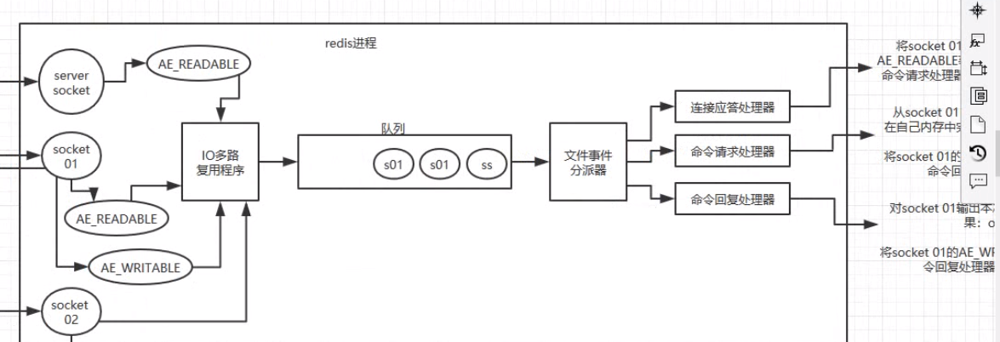

# 缓存 Redis

[Redis](https://www.bilibili.com/video/av49561181/?p=31)
## 为什么使用缓存
1. 高性能

 10分钟之内查询同一个数据，DB每个人耗时 800ms,使用缓存。从缓存中获取数据 消耗 10ms
2. 高并发

高峰期每秒4000个请求，3000个走缓存，1000个走数据库，缓存走内存，数据库
并发请求不要超过 2000/s

## Redis 单线程模型
1. 为什么单线程还支持高并发

    - IO多路复用
    - 纯内存的操作
    - 避免了上下文切换

File Event Handler, 采用 IO多路复用机制同时监听多个 socket， 根据 socket 上的事件来选择对应的事件处理器来处理这个事件。 如果监听到 accept,read,write,close等操作，就会产生相应的文件事件，就会调用之前关联好的事件处理器来处理这个事件。



## Redis与Memeched区别
1. 丰富数据类型  --- string
2. 集群模式 ---- 不支持集群

## Redis 数据类型

比较基础的问题。

- string
- hash 缓存简单的对象
- list 好友列表，lrange 分页查询
- set 去重数据 交并差集
- zset 排行榜 zadd borad 85 zhangsan

## Redis 过期策略

缓存是基于内存的，内存是有限制的。

定期删除，惰性删除

过期时间 1小时

随机抽取key检查删除，后面在获取key的时候，检查一下过期，惰性删除。

内存淘汰机制： 内存满了，移除最近最少使用的

定期删除 -> 惰性删除 -> 内存淘汰机制 最近很少使用的

LRU 代码实现

## Redis 高并发 高可用 哨兵原理

如果 Redis支撑 10万+ 的QPS, 读写分离
单机 redis 能够承载 QPS 是上万。缓存一般 用来处理读并发。

一主多从，主 负责写，并将数据同步复制到其他 slave节点，从节点复杂读。

可以水平扩容。
5000QPS 高峰期
主从架构 -> 读写分离 -> 支撑 10万+ QPS的架构

master 节点必须使用持久化机制。

高可用： 哨兵机制。（待完善）

## 持久化

持久化 + 定期备份云存储 

AOF + RDB 优缺点

## Redis 集群模式原理

redis cluster 集群模式

## 缓存雪崩 缓存穿透

缓存宕机 -> 全部请求落在数据库 -> 数据库奔溃

key 大部分失效 -> 双重过期时间 -> 预加载

首先 保证 Redis集群的高可用性。

限流 : 每秒 限制 2000个请求,这样数据库不会死。

降级: 
hystrix

缓存穿透 -> 缓存与数据都没有数据 -> 默认值

## 数据一致性问题

不要求 强一致性，最好不要做这个方案。

如果要求，则需要串行化，会导致吞吐量降低。

## Redis 并发竞争问题 以及 解决方案

分布式锁：

zookeeper 与 redis

[address](https://www.bilibili.com/video/av49561181?t=415&p=62)


# 底层数据结构

## String

SDS: `simple dynamic string`
```c
struct sds
{
    int free; // 用来保存剩余的长度
    int len; // 用来保存已经使用的长度
    char[];
}
```

相比 C 语言原生的优点：


1. 保留了 length 不用遍历 
2. 避免了 缓存溢出，自动扩容
3. 空间预分配，惰性释放
4. 二进制一些特殊编码的问题

### 字符串对象

set 222;

encoding 格式 以及 ptr 属性值。

str -> encoding : raw . -> sds

long double 也是作为 字符串保存的。


## 链表

c语言中没有链表。

```c
typedef struct listNode 
{
    struct listNode *pre;
    struct listNode *next;
    void   * value;
}listNode
```
双向链表，带 length,与其他语言中的链表并无区别。

tail ,head. 

列表，订阅查询，客户端信息都是使用这个数据结构。

## 字典

hash的底层实现。

```c
typedef struct dictht {
    // 哈希表数组
    dictEntry **table;
    // 哈希表大小
    unsigned long size;
    // 哈希表大小掩码，用于计算索引值，= size -1
    unsigned long sizemask;
    // 该哈希表已经有节点的数量
    unsigned long used;
}dictht;
```

index = hash & (length -1)

字典的扩容，加载因子，寻址，冲突解决办法与 hashmap 类似

## 跳跃表

zset,集群节点。

平均 O(logN) 时间复杂度可以与 平衡树 媲美。牺牲空间换时间。

具体可以参考 跳跃表的文章。

跳跃表是分层的，随机分层。所谓的层，其实就是维护了一个数组。

### skiplist and avl

1. skiplist 简单
2. 不涉及树的变动
3. 查找起来简单，范围查找。next节点不是太死板固定。


## 集合

set 底层使用的是数组，这一块还挺麻烦的，没有仔细看。具体的可以参考 Redis设计与实现这本书。


