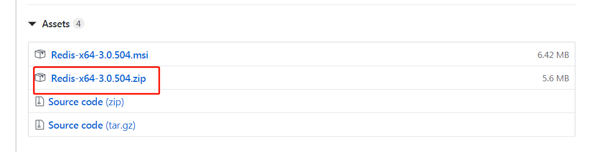
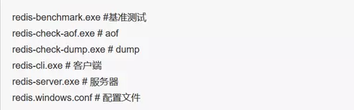
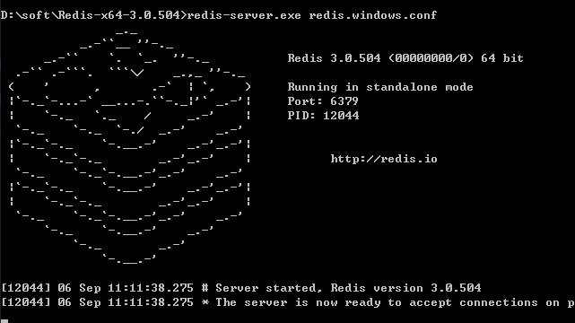
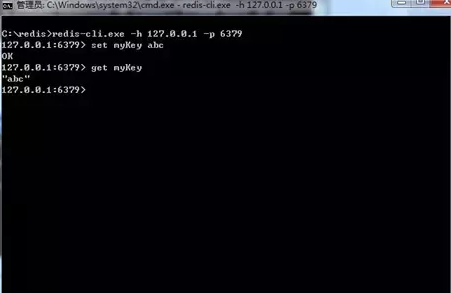

## Redis

Redis命令参考网址：http://doc.redisfans.com/

### Redis 简介

- Redis 是完全开源免费的，遵守BSD协议，是一个高性能的key-value数据库。
- Redis 与其他 key - value 缓存产品有以下三个特点：
    - Redis支持数据的持久化，可以将内存中的数据保存在磁盘中，重启的时候可以再次加载进行使用。
    - Redis不仅仅支持简单的key-value类型的数据，同时还提供list，set，zset，hash等数据结构的存储。
    - Redis支持数据的备份，即master-slave模式的数据备份。

### Redis安装

1. Window 下安装

64位下载地址：https://github.com/MSOpenTech/redis/releases。
32位下载地址：http://vdisk.weibo.com/s/dbUhxKrgqodB
（如果使用32位，请采用单机模式）
Redis 支持 32 位和 64 位。这个需要根据你系统平台的实际情况选择，这里我们下载 Redis-x64-xxx.zip压缩包到 C 盘，解压后，将文件夹重新命名为 redis。

下载解压，在解压后的目录下有以下这些文件

打开一个 cmd 窗口 使用cd命令切换目录到 C:\redis 运行 redis-server.exe redis.windows.conf 。
如果想方便的话，可以把 redis 的路径加到系统的环境变量里，这样就省得再输路径了，后面的那个 redis.windows.conf 可以省略，如果省略，会启用默认的。输入之后，会显示如下界面：

这时候另启一个cmd窗口，原来的不要关闭，不然就无法访问服务端了。
切换到redis目录下运行 redis-cli.exe -h <ip> -p <端口(默认6379)>
例如：redis-cli.exe -h 127.0.0.1 -p 6379。
设置键值对 set myKey abc
取出键值对 get myKey

