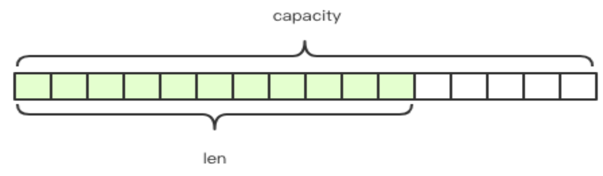
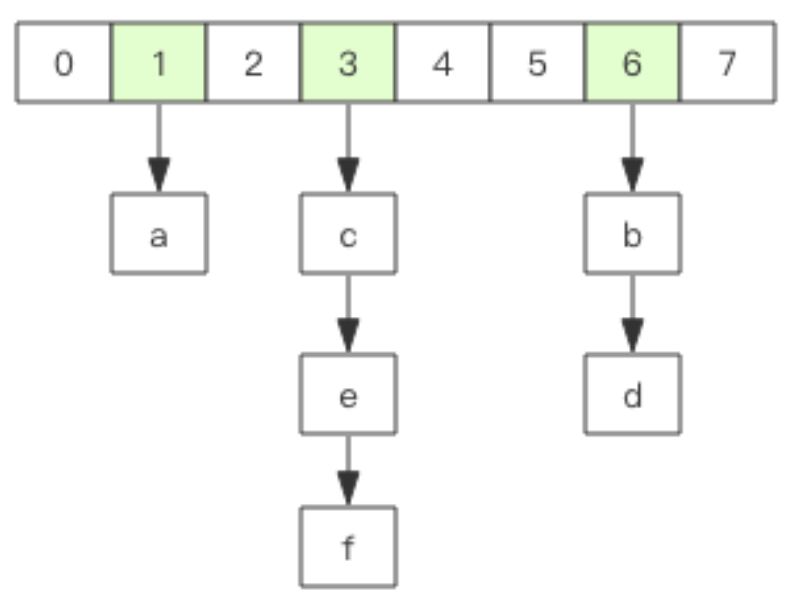
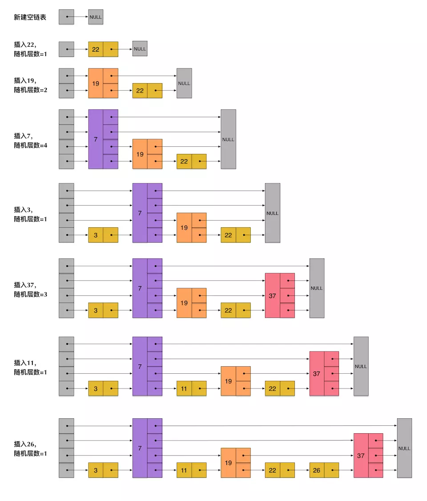
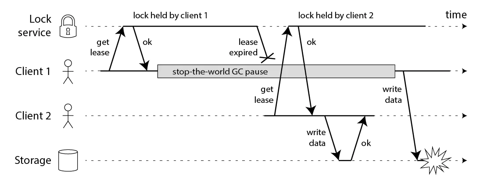
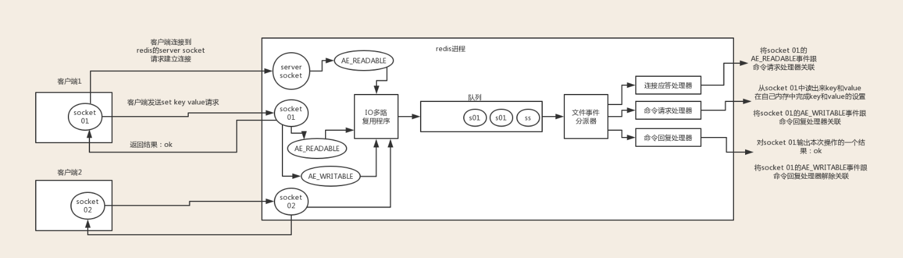
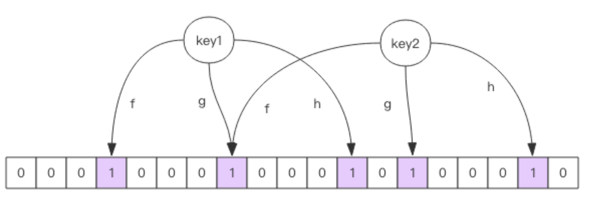

# redis
 redis 整理于 20210518
## 开头
 redis 属于我们日常工作常用的，非常熟悉的一块缓存中间件。主要提供 缓存，分布式锁，mq,bloomfiter等功能。本文我梳理一下redis的相关知识点，主要了解一下redis基本数据结构和常用的一些功能。
## redis可以做什么
1. 记录帖子的点赞数、评论数和点击数 (hash)。
2. 记录用户的帖子 ID 列表 (排序)，便于快速显示用户的帖子列表 (zset)。
3. 记录帖子的点赞用户 ID 列表，评论 ID 列表，用于显示和去重计数 (zset)。
4. 缓存近期热帖内容 (帖子内容空间占用比较大)，减少数据库压力 (hash)。
5. 分布式锁/缓存/阻塞队列
6. 排行榜系统
## 基础数据结构
常用的5种基础数据结构。
### string
1. string 字符串的应用非常普遍，也是redis中最简单的数据结构。比如我们存储的用户信息，可以在应用程序中 toJson序列化之后 进行存储，同样，取出数据的时候进行一次反序列化的过程。string底层是使用 SDS(Simple Dynamic String) 动态扩容的字符串构成的。

 

Redis 的字符串是动态字符串，是可以修改的字符串，内部结构实现上类似于 Java 的 ArrayList，采用预分配冗余空间的方式来减少内存的频繁分配，如图中所示，内部为当前字 符串实际分配的空间 capacity 一般要高于实际字符串长度 len。当字符串长度小于 1M 时， 扩容都是加倍现有的空间，如果超过 1M，扩容时一次只会多扩 1M 的空间。需要注意的是 字符串最大长度为 512M。 相比c 原生的获取len的时候不用遍历，不用处理结束符的问题。

```c
struct SDS<T> {
    T capacity; // 数组容量  预分配+懒回收 避免频繁的回收数据和分配空间
    T len; // 数组长度
    byte[] content; // 数组内容
}
```

键值对
```
    > set name codehole OK
    > get name "codehole"
    > exists name
    (integer) 1
    > del name
    (integer) 1
    > get name
    (nil)
```
批量键值对
可以批量对多个字符串进行读写，节省网络耗时开销，后面我们会讲到的pipline也是类似的操作，节省网络的开销。
```
    > set name1 codehole
    OK
    > set name2 holycoder
    OK
    > mget name1 name2 name3 # 返回一个列表 
    1) "codehole"
    2) "holycoder"
    3) (nil)
    > mset name1 boy name2 girl name3 unknown 
    > mget name1 name2 name3
    1) "boy"
    2) "girl"
    3) "unknown"
```

计数操作：
```
set age 30
incr age   -> 31
incrby age 5 -> 36  自增或者 自增某个值，类似Java中的AtomicInteger
```
### list 列表
列表可以用来做什么，我们可以用来存储某个垂类的用户list。这个可以类比 Java中的linkedlist，注意是链表，不是数组，不支持 randomAccess,遍历 O(n) 的时间复杂度,不多底层也有优化，在数据量比较少的时候使用ziplist(压缩列表)。比如用户的关注列表，粉丝列表，消息列表等功能都可以用Redis的 list 结构来实现。
1. 常见的命令：
    rpush (进队),llen(获取队列长度)，rpop
2. 快速列表 todo
在列表元素较少的情况下会使用一块连续的内存存储，这个结构是 ziplist，也即是 压缩列表。它将所有的元素紧挨着一起存储，分配的是一块`连续的内存`。当数据量比较多的 时候才会改成 quicklist（可配置）。
因为普通的链表需要的附加指针空间太大，会比较浪费空间，而且 会加重内存的碎片化。比如这个列表里存的只是 int 类型的数据，结构上还需要两个额外的指针 `prev` 和 `next`。 
3. Redis 的列表结构常用来做异步队列使用。
    blpop/brpop 为啥要用他们呢，因为你用其他的他会 抛出异常。
    `空闲连接的问题`。
如果线程一直阻塞在哪里，Redis 的客户端连接就成了闲置连接，闲置过久，服务器一般
会主动断开连接，减少闲置资源占用。这个时候 blpop/brpop 会抛出异常来。

### hash 字典
hash 结构也可以用来存储用户信息，不同于字符串一次性需要全部序列化整个对象， hash 可以对用户结构中的每个字段单独存储。这样当我们需要获取用户信息时可以进行部分 获取。而以整个字符串的形式去保存用户信息的话就只能一次性全部读取，这样就会比较浪 费网络流量。hash 也有缺点，hash 结构的存储消耗要高于单个字符串，到底该使用 hash 还是字符 串，需要根据实际情况再三权衡。
Redis 的字典相当于 Java 语言里面的 HashMap。内部实现结构上同 Java 的 HashMap 也是一致的，同样的数组 + 链表二维结构。第一维 hash 的数组位置碰撞 时，就会将碰撞的元素使用链表串接起来。
 

不同的是，Redis 的字典的值只能是字符串，另外它们 rehash 的方式不一样，因为 Java 的 HashMap 在字典很大时，rehash 是个耗时的操作，需要一次性全部 rehash。Redis 为了高性能，不能堵塞服务，所以采用了渐进式 rehash 策略。

> 渐进式 rehash 会在 rehash 的同时，保留新旧两个 hash 结构，`查询时会同时查询两个 hash 结构`，然后在后续的定时任务中以及 hash 的子指令中，循序渐进地将旧 hash 的内容 一点点迁移到新的 hash 结构中。


### set (集合)
Redis 的集合相当于 Java 语言里面的 HashSet，它内部的键值对是无序的唯一的。它的 内部实现相当于一个特殊的字典，字典中所有的 value 都是一个值 NULL。 set 结构可以用来 存储活动发送奖品的用户 ID，因为有去重功能，可以保证同一个用户不会中奖两次。

### zset (有序列表)
zset 可能是 Redis 提供的最为特色的数据结构。它类似于 Java 的 SortedSet 和 HashMap 的结合体，一方面它是一个 set，保证了内部 value 的唯一性，另一方面它可以给每个 value 赋予一个 score，代表这个 value 的排序权 重。它的内部实现用的是一种叫着「跳跃列表」的数据结构。zset 还可以用来存储视频photo，value 值是photoId，score 是他的发布时间，我们 可以对发布时间进行排序，还可以做到范围获取。

// todo 代码


#### 跳表skiplist


一般查找问题的解法分为两个大类：一个是基于各种平衡树，一个是基于哈希表，但skiplist却比较特殊。

从上面skiplist的创建和插入过程可以看出，每一个节点的层数（level）是随机出来的，而且新插入一个节点不会影响其它节点的层数。因此，插入操作只需要修改插入节点前后的指针，而不需要对很多节点都进行调整。

- skiplist和各种平衡树（如AVL、红黑树等）的元素是有序排列的，而哈希表不是有序的。因此，在哈希表上只能做单个key的查找，不适宜做范围查找。所谓范围查找，指的是查找那些大小在指定的两个值之间的所有节点。

- 在做范围查找的时候，平衡树比skiplist操作要复杂。在平衡树上，我们找到指定范围的小值之后，还需要以中序遍历的顺序继续寻找其它不超过大值的节点。如果不对平衡树进行一定的改造，这里的中序遍历并不容易实现。而在skiplist上进行范围查找就非常简单，只需要在找到小值之后，对第1层链表进行若干步的遍历就可以实现。

- 平衡树的插入和删除操作可能引发子树的调整，逻辑复杂，而skiplist的插入和删除只需要修改相邻节点的指针，操作简单又快速。

- 从内存占用上来说，skiplist比平衡树更灵活一些。一般来说，平衡树每个节点包含2个指针（分别指向左右子树），而skiplist每个节点包含的指针数目平均为1/(1-p)，具体取决于参数p的大小。如果像Redis里的实现一样，取p=1/4，那么平均每个节点包含1.33个指针，比平衡树更有优势。

- 查找单个key，skiplist和平衡树的时间复杂度都为O(log n)，大体相当；而哈希表在保持较低的哈希值冲突概率的前提下，查找时间复杂度接近O(1)，性能更高一些。所以我们平常使用的各种Map或dictionary结构，大都是基于哈希表实现的。

- 从算法实现难度上来比较，skiplist比平衡树要简单得多。

## 分布式锁
我们了解的可以用来做分布式锁比如，zk 的临时节点，redis redlock。我们系统中有哪些应用呢。比如renz系统的 审核锁单机制，底层使用的其实就是redis 分布式锁。分布式锁早期有很多问题，不过随着版本的迭代，逐渐的进行了完善。
问题举例 ： 1. 死锁问题 -> 可以设置过期时间
           2. 锁超时问题/并发请求的问题

 

client1获取了锁并且设置了锁的超时时间，但是client1之后出现了STW，这个STW时间比较长，导致分布式锁进行了释放，client2获取到了锁，这个时候client1恢复了锁，那么就会出现client1，2同时获取到锁，这个时候分布式锁不安全问题就出现了。
时钟发生跳跃:对于Redis服务器如果其时间发生了向跳跃，那么肯定会影响我们锁的过期时间，那么我们的锁过期时间就不是我们预期的了，也会出现client1和client2获取到同一把锁，那么也会出现不安全，这个对于Mysql也会出现。但是ZK由于没有设置过期时间，那么发生跳跃也不会受影响。
长时间的网络I/O:这个问题和我们的GC的STW很像，也就是我们这个获取了锁之后我们进行网络调用，其调用时间由可能比我们锁的过期时间都还长，那么也会出现不安全的问题，这个Mysql也会有，ZK也不会出现这个问题


Redis 的分布式锁不能解决超时问题，如果在加锁和释放锁之间的逻辑执行的太长，以至 于超出了锁的超时限制，就会出现问题。因为这时候锁过期了，第二个线程重新持有了这把锁， 但是紧接着第一个线程执行完了业务逻辑，就把锁给释放了，第三个线程就会在第二个线程逻 辑执行完之间拿到了锁。

set 指令的 value 参数设置为一个随机数，释放锁时先匹配 随机数是否一致，然后再删除 key。但是匹配 value 和删除 key 不是一个原子操作，Redis 也 没有提供类似于 delifequals 这样的指令，这就需要使用 Lua 脚本来处理了，因为 Lua 脚本可 以保证连续多个指令的原子性执行。

## scan
有时候需要从 Redis 实例成千上万的 key 中找出特定 前缀的 key 列表来手动处理数据，可能是修改它的值，也可能是删除 key。这里就有一个问题，如何从海量的 key 中找出满足特定前缀的 key 列表来?
Redis 提供了一个简单暴力的指令 keys 用来列出所有满足特定正则字符串规则的 key。
这个指令使用非常简单，提供一个简单的正则字符串即可，但是有很明显的两个缺点。 1、没有 offset、limit 参数，一次性吐出所有满足条件的 key，万一实例中有几百 w 个
key 满足条件，可能就崩掉了。keys 算法是遍历算法，复杂度是 O(n)，如果实例中有千万级以上的 key，这个指令就会导致 Redis 服务卡顿，所有读写 Redis 的其它的指令都会被延后甚至会超时报错

Redis 为了解决这个问题，它在 2.8 版本中加入了大海捞针的指令——scan。scan 相比 keys 具备有以下特点:
1、复杂度虽然也是 O(n)，但是它是通过游标分步进行的，不会阻塞线程;
2、提供 limit 参数，可以控制每次返回结果的最大条数，limit 只是一个 hint，返回的 结果可多可少;
3、同 keys 一样，它也提供模式匹配功能; 
4、服务器不需要为游标保存状态，游标的唯一状态就是 scan 返回给客户端的游标整数; 
5、返回的结果可能会有重复，需要客户端去重复，这点非常重要; 
6、遍历的过程中如果有数据修改，改动后的数据能不能遍历到是不确定的; 
7、单次返回的结果是空的并不意味着遍历结束，而要看返回的游标值是否为零;


## IO线程模型
IO 的多路复用模型是 redis快的一个重要的原因。
 
redis 内部使用文件事件处理器 `file event handler`，这个文件事件处理器是单线程的，所以 redis 才叫做单线程的模型。它采用 IO 多路复用机制同时监听多个 socket，根据 socket 上的事件来选择对应的事件处理器进行处理。

文件事件处理器的结构包含 4 个部分：

- 多个 socket
- IO 多路复用程序
- 文件事件分派器
- 事件处理器（连接应答处理器、命令请求处理器、命令回复处理器）

多个 socket 可能会并发产生不同的操作，每个操作对应不同的文件事件，但是 IO 多路复用程序会监听多个 socket，会将 socket 产生的事件放入队列中排队，事件分派器每次从队列中取出一个事件，把该事件交给对应的事件处理器进行处理。

1、客户端socket01请求redis的server scoket建立连接，此时server socket生成AE_READABLE事件，IO多路复用程序监听到server socket产生的事件，并将该事件压入队列。
文件事件分派器从队列中拉取事件交给连接应答处理器，处理器同时生成一个与客户端通信的socket01,并将该scoket01的AE_READABLE事件与命令请求处理器关联

2、此时客户端scoket01发送一个set key value的请求，redis的scoket01接收到AE_READABLE事件，IO多路复用程序监听到事件，将事件压入队列，文件分派器取到事件，由于scoket01已经
和命令请求处理器关联，所以命令请求处理器开始set key value,完毕后会将redis的scoket01的AE_WAITABLE事件关联到命令回复处理器

3、如果此时客户端准备好接收返回结果了，向redis中的socket01发起询问请求，那么 redis 中的 socket01 会产生一个 AE_WRITABLE 事件，同样压入队列中，事件分派器找到相关联的命令回复处理器，由命令回复处理器对 socket01 输入本次操作的一个结果，比如 ok，之后解除 socket01 的 AE_WRITABLE 事件与命令回复处理器的关联。

这样便完成了redis的一次通信。

## 持久化
Redis 的数据全部在内存里，如果突然宕机，数据就会全部丢失，因此必须有一种机制 来保证 Redis 的数据不会因为故障而丢失，这种机制就是 Redis 的持久化机制。
Redis 的持久化机制有两种，第一种是快照，第二种是 AOF 日志。快照是一次全量备 份，AOF 日志是连续的增量备份。快照是内存数据的二进制序列化形式，在存储上非常紧凑，而 AOF 日志记录的是内存数据修改的指令记录文本。AOF 日志在长期的运行过程中会 变的无比庞大，数据库重启时需要加载 AOF 日志进行指令重放，这个时间就会无比漫长。 所以需要定期进行 AOF 重写，给 AOF 日志进行瘦身。

### rdb
redis 在持久化时会调用 glibc 的函数 fork 产生一个子进程，快照持久化完全交给子进 程来处理，父进程继续处理客户端请求。子进程刚刚产生时，它和父进程共享内存里面的代 码段和数据段。这时你可以将父子进程想像成一个连体婴儿，共享身体。子进程做数据持久化，它不会修改现有的内存数据结构，它只是对数据结构进行遍历读 取，然后序列化写到磁盘中。但是父进程不一样，它必须持续服务客户端请求，然后对内存 数据结构进行不间断的修改。
这个时候就会使用操作系统的 COW 机制来进行数据段页面的分离。数据段是由很多操 作系统的页面组合而成，当父进程对其中一个页面的数据进行修改时，会将被共享的页面复 制一份分离出来，然后对这个复制的页面进行修改。这时子进程相应的页面是没有变化的， 还是进程产生时那一瞬间的数据。

```
save 900 1              #在900秒(15分钟)之后，如果至少有1个key发生变化，Redis就会自动触发BGSAVE命令创建快照。

save 300 10            #在300秒(5分钟)之后，如果至少有10个key发生变化，Redis就会自动触发BGSAVE命令创建快照。

save 60 10000        #在60秒(1分钟)之后，如果至少有10000个key发生变化，Redis就会自动触发BGSAVE命令创建快照。
```
### AOF

```
appendfsync always     #每次有数据修改发生时都会写入AOF文件,这样会严重降低Redis的速度
appendfsync everysec  #每秒钟同步一次，显示地将多个写命令同步到硬盘
appendfsync no      #让操作系统决定何时进行同步
```
混合持久化


## 主从同步
集群哨兵模式。
Redis 同步支持主从同步和从从同步，从从同步功能是 Redis 后续版本增加的功能，为 了减轻主库的同步负担。

### 增量同步
Redis 同步的是指令流，主节点会将那些对自己的状态产生修改性影响的指令记录在本 地的内存 buffer 中，然后异步将 buffer 中的指令同步到从节点，从节点一边执行同步的指 令流来达到和主节点一样的状态，一遍向主节点反馈自己同步到哪里了 (偏移量)。
因为内存的 buffer 是有限的，所以 Redis 主库不能将所有的指令都记录在内存 buffer 中。Redis 的复制内存 buffer 是一个定长的环形数组，如果数组内容满了，就会从头开始覆 盖前面的内容。
### 快照同步

### 无盘复制

## 过期策略
### 过期的 key 集合
redis 会将每个设置了过期时间的 key 放入到一个独立的字典中，以后会定时遍历这个 字典来删除到期的 key。除了定时遍历之外，它还会使用惰性策略来删除过期的 key，所谓 惰性策略就是在客户端访问这个 key 的时候，redis 对 key 的过期时间进行检查，如果过期 了就立即删除。定时删除是集中处理，惰性删除是零散处理。

### 从库的过期策略
从库不会进行过期扫描，从库对过期的处理是被动的。主库在 key 到期时，会在 AOF 文件里增加一条 del 指令，同步到所有的从库，从库通过执行这条 del 指令来删除过期的 key。

LRU算法。


## 其他
1. hyperLogLog 可以统计网站的UV,底层实现 -> 
2. bloomFilter 补充链接/考虑guava /爬虫/页面推荐
3. GeoHash
4. 限流操作 -> zset的score
5. 缓存雪崩/缓存穿透/缓存一致性
6. bitset位图
 


## 参考
1. Redis 深度历险：核心原理和应用实践 钱文品
2. 分布式锁https://juejin.cn/post/6844903688088059912
3. redis为什么使用跳表而不是平衡树 https://juejin.cn/post/6844903446475177998