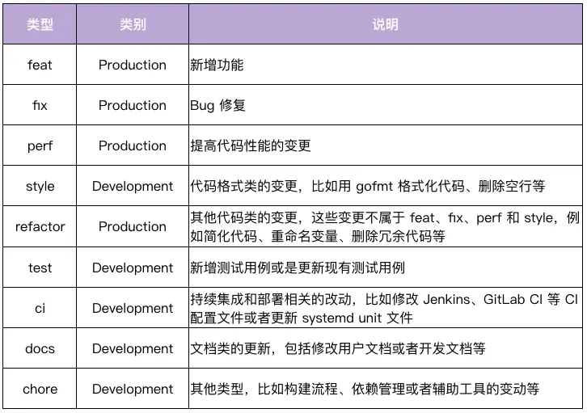
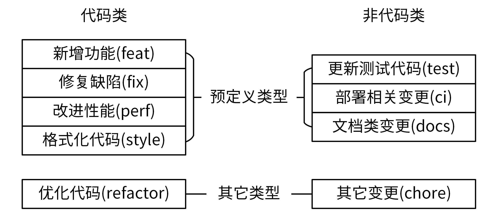
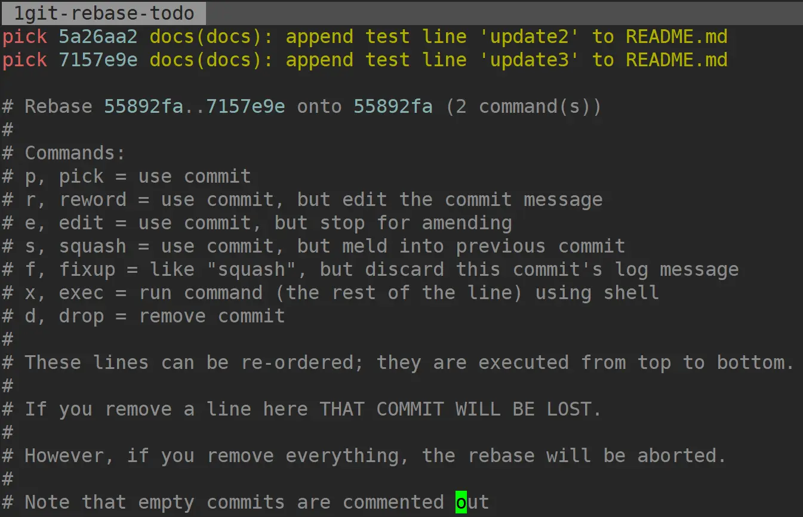

https://time.geekbang.org/column/article/380989

如果我们变更了应用代码，比如某个 Go 函数代码，那这次修改属于代码类。在代码类中，有 4 种具有明确变更意图的类型：feat、fix、perf 和 style；如果我们的代码变更不属于这 4 类，那就全都归为 refactor 类，也就是优化代码.

如果我们变更了非应用代码，例如更改了文档，那它属于非代码类。在非代码类中，有 3 种具有明确变更意图的类型：test、ci、docs；如果我们的非代码变更不属于这 3 类，那就全部归入到 chore 类。

## 合并提交
1. 我们通常会通过 git rebase -i 使用 git rebase 命令，-i 参数表示交互（interactive），该命令会进入到一个交互界面中，其实就是 Vim 编辑器。在该界面中，我们可以对里面的 commit 做一些操作，交互界面如图所示

这个交互界面会首先列出给定之前（不包括，越下面越新）的所有 commit，每个 commit 前面有一个操作命令，默认是 pick。我们可以选择不同的 commit，并修改 commit 前面的命令，来对该 commit 执行不同的变更操作。

