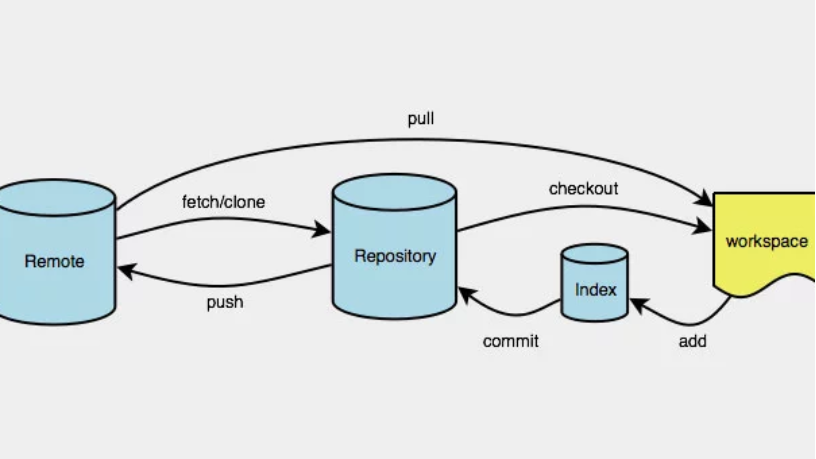
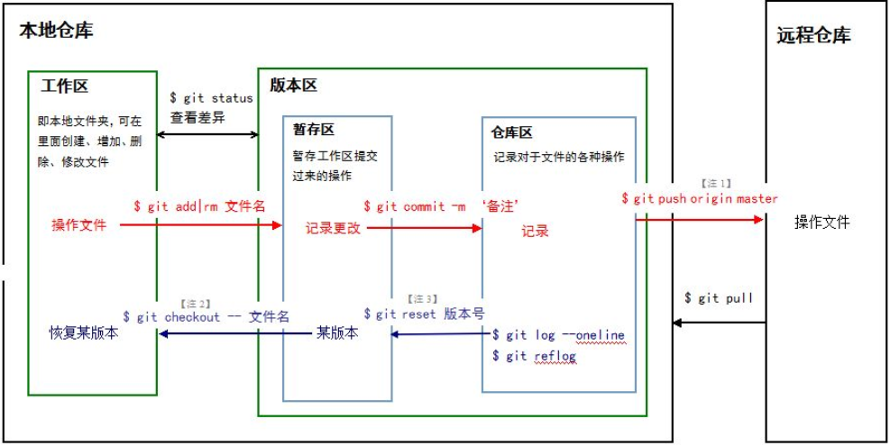
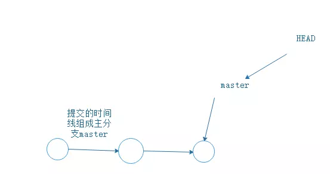
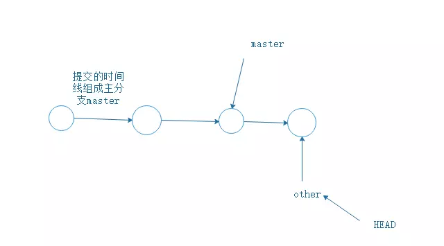
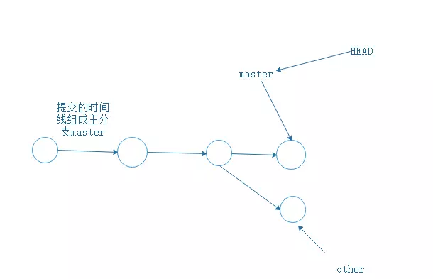
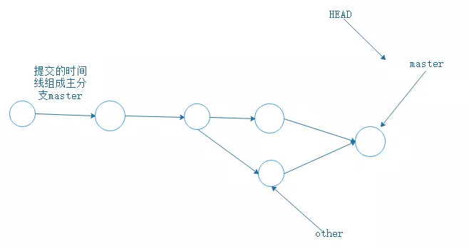
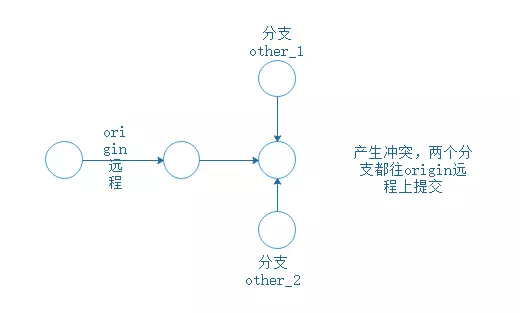

# Git

> 本文为对Git 命令的一次总结实战。掌握常用的命令，而不是使用图形化的工具，对于Linux下处理各种git问题非常有必要。





回滚
```bash
git reset --hard 02197356d1e9dfa2f150dfc03b36a24354eb9096 #，自行替换后面的id
输入git push -f -u origin master，将此commit推送到远程master分支
```


```bash
git checkout branch01 # → （创建）本地 分支 branch01

git push # → 推送当前分支到远端仓库

```

------------遵循小批量提交原则------------
```bash
git status   # → 查看当前分支工作区、暂存区的工作状态

git diff   # → diff文件的修改（⚠️很重要很重要很重要） 比较工作区与 Stage区的差异

git commit .   # → 提交本次修改

```
------------以上三步使用最频繁-----------

```bash
git fetch --all   # → 拉取所有远端的最新代码 (用不到.git下)
git fetch --p # → 更新分支
git merge origin/develop   # → 如果是多人协作，merge同事的修改到当前分支（先人后己原则）=====>
```
---

👉 HEAD：当前commit引用

```bash
git version   # → git版本
git branch   # → 查看本地所有的分支
git branch -r # → 查看所有远程的分支
git branch -a # → 查看所有远程分支和本地分支
git branch -d <branchname> # → 删除本地branchname分
git checkout branch01 # 切换分支(假如本地有这个分支) 没有分支 需要加 -b 。创建分支+ 切换

git checkout -b <branchname> # → 等同于执行上两步，即创建新的分支并切换到该分支

git checkout -- xx/xx # → 回滚单个文件 相当于 revert

git pull origin master:master # → 将远程origin主机的master分支合并到当前master分支,冒号后面的部分表示当前本地所在的分支

git push origin -d <branchname>   # → 删除远程branchname分支

git commit ./xx   # → 等同于git add ./xx + git commit（建议使用👍）（走add + commit就行）

git stash # → 把当前的工作隐藏起来 等以后恢复现场后继续工作（有应急任务的时候处理）

git stash pop # → 恢复工作现场（恢复隐藏的文件，同时删除stash列表中对应的内容）

git merge --abort  # → 终止本次merge，并回到merge前的状态（👍）

git pull origin master  # → 从远程获取最新版本并merge到本地等同于

git log xx  # → 查看xx文件的commit记录

git pull --rebase #=======================================>

```

## 版本的回溯与前进

提交一个文件，有时候我们会提交很多次，在提交历史中，这样就产生了不同的版本。每次提交，Git会把他们串成一条时间线。如何回溯到我们提交的上一个版本，用`git reset --hard + 版本号`即可。 版本号可以用`git log`来查看，每一次的版本都会产生不一样的版本号。回溯之后，git log查看一下发现离我们最近的那个版本已经不见了。但是我还想要前进到最近的版本应该如何？只要`git reset --hard + 版本号`就行。退一步来讲，虽然我们可以通过git reset --hard + 版本号,靠记住版本号来可以在不同的版本之间来回穿梭。但是,有时候把版本号弄丢了怎么办？`git reflog`帮你记录了每一次的命令，这样就可以找到版本号了，这样你又可以通过`git reset`来版本穿梭了。
。

通过 git pull 又可以恢复到当前最新的版本。


## 撤销

- 场景1：在工作区时，你修改了一个东西，你想撤销修改，git checkout -- file。廖雪峰老师指出撤销修改就回到和版本库一模一样的状态，即用版本库里的版本替换工作区的版本。
- 场景2：你修改了一个内容，并且已经git add到暂存区了。想撤销怎么办？回溯版本，git reset --hard + 版本号,再git checkout -- file,替换工作区的版本。
- 场景3：你修改了一个内容，并且已经git commit到了master。跟场景2一样，版本回溯，再进行撤销。

## 删除

- 如果你git add一个文件到暂存区，然后在工作区又把文件删除了，Git会知道你删除了文件。如果你要把版本库里的文件删除，git rm 并且git commit -m "xxx".
- 如果你误删了工作区的文件，怎么办？使用撤销命令，git checkout --<file>就可以。这再次证明了撤销命令其实就是用版本库里的版本替换工作区的版本，无论工作区是修改还是删除，都可以“一键还原”

## 分支

## 创建与合并分支



在没有其他分支插进来时，只有一个master主分支。每次你`git push -u origin master` 提交就是增加一条时间轴，master也会跟着移动。



理论分析完，看一下命令怎么写。

- 创建分支`other`,切换到`other`分支。

```bash
git branch other
git checkout other
```
- 查看当前所有分支
```bash
git branch
```
```
* other
  master
```
当前的分支会有一个*

- 用other提交

```bash
git add ./xxx/
git commit -m "xxx"
```

- `other`分支完成，切换回`master`

```bash
git checkout master
```
- 此时，master分支上并没有`other`的文件，因为分支还没有合并。

- 合并分支

```bash
git merge other
```
- 合并完成之后，就可以在master分支上查看到文件了。
- 删除other分支。
```bash
git branch -d other
```

## 解决合并分支问题



假如有这样一种情况，分支`other`已经`commit`了，但是此时指针指回`maste`r时，并且`master`没有合并，而是`git add / commit` 提交了。这样，就产生了冲突，主分支`master`文件内容与`other`分支的内容不一样。合并不起来！所以，

- 修改文件的内容，让其保持一致。
- `git add git commit` 提交。
- 分支合并了。



- `git log --graph` 查看分支合并图

- `git branch -d other` 删除分支，任务结束。


## 分支管理策略

- `git merge --no-ff other` 禁用`Fast forward`模式，因为使用`Fast forward`模式，删除分支后，`分支历史信息会丢失`


## BUG分支


> 工作中每个bug都可以通过一个新的临时分支来修复，修复后，合并分支，然后将临时分支删除。但如果你手上有分支在工作中，你的上级要你改另外的分支的BUG。你要把现在正在工作的分支保存下来，`git stash`,把当前工作现场“存储”起来，等以后恢复后继续工作。当你解决BUG后，git checkout other回到自己的分支。用`git stash list`查看你刚刚“存放”起来的工作去哪里了。此时你要恢复工作：

- `git stash apply`恢复却不删除`stash`内容，`git stash drop`删除stash内容。
- `git stash pop`恢复的同时把stash内容也删了.
- 此时，用`git stash list`查看，看不到任何`stash `内容。

**总结：修复bug时，我们会通过创建新的bug分支进行修复，然后合并，最后删除；当手头工作没有完成时，先把工作现场git stash一下，然后去修复bug，修复后，再git stash pop，回到工作现场**


## 删除分支

- `git branch -d + 分支`有可能会删除失败，因为Git会保护没有被合并的分支。
- `git branch -D + 分支` 强行删除，丢弃没被合并的分支。

## 多人协作

- `git remote `查看远程库的信息，会显示`origin`，远程仓库默认名称为origin
- `git remote -v`显示更详细的信息
- `git push -u origin master`推送`master`分支到`origin`远程仓库。
- `git push -u origin other` 推送`other`到`origin`远程仓库。

## 抓取分支



产生上图的冲突时，

- `git pull `把最新的提交从远程仓库中抓取下来，在本地合并，`解决冲突`。在进行`git pull`

- 如果`git pull` 也失败了，还要指定分支之间的链接，这一步Git会提醒你怎么做。然后再`git pull`。

多人协作的工作模式通常是这样的：

- 首先，可以试图用`git push origin <branch-name>`推送自己的修改；
- 如果推送失败，则因为远程分支比你的本地更新，需要先用`git pull`试图合并；
- 如果`git pull`提示`no tracking information`，则说明本地分支和远程分支的链接关系没有创建，用命令`git branch --set-upstream-to <branch-name> origin/<branch-name>`。


## Rebase

- `git rebase` 把分叉的提交历史“整理”成一条直线，看上去更直观.缺点是本地的分叉提交已经被修改过了。
- 最后在进行`git push -u origin master`
- `rebase`的目的是使得我们在查看历史提交的变化时更容易，因为分叉的提交需要三方对比。


# 常用Git命令总结

- `git config --global user.name "你的名字" `让你全部的`Git`仓库绑定你的名字
- `git config --global user.email "你的邮箱" `让你全部的`Git`仓库绑定你的邮箱
- `git init` 初始化你的仓库
- `git add .` 把工作区的文件全部提交到暂存区
- `git add ./<file>/ `把工作区的`<file>`文件提交到暂存区
- `git commit -m "xxx" `把暂存区的所有文件提交到仓库区，暂存区空空荡荡
- `git remote add origin https://github.com/name/name_cangku.git `把本地仓库与远程仓库连接起来
- `git push -u origin master `把仓库区的主分支master提交到远程仓库里
- `git push -u origin <其他分支> `把其他分支提交到远程仓库
- `git status`查看当前仓库的状态
- `git diff` 查看文件修改的具体内容
- `git log` 显示从最近到最远的提交历史
- `git clone + 仓库地址下载克隆文件`
- `git reset --hard + 版本号 `回溯版本，版本号在`commit`的时候与`master`跟随在一起
- `git reflog` 显示命令历史
- `git checkout -- <file>` 撤销命令，用版本库里的文件替换掉工作区的文件。我觉得就像是Git世界的ctrl + z
- `git rm` 删除版本库的文件
- `git branch` 查看当前所有分支
- `git branch <分支名字> `创建分支
- `git checkout <分支名字> `切换到分支
- `git merge <分支名字>` 合并分支
- `git branch -d <分支名字>` 删除分支,有可能会删除失败，因为`Git`会保护没有被合并的分支
- `git branch -D + <分支名字> `强行删除，丢弃没被合并的分支
- `git log --graph` 查看分支合并图
- `git merge --no-ff <分支名字> `合并分支的时候禁用`Fast forward`模式,因为这个模式会丢失分支历史信息
- `git stash `当有其他任务插进来时，把当前工作现场“存储”起来,以后恢复后继续工作
- `git stash list `查看你刚刚“存放”起来的工作去哪里了
- `git stash apply` 恢复却不删除`stash`内容
- `git stash drop` 删除`stash`内容
- `git stash pop` 恢复的同时把`stash`内容也删了
- `git remote` 查看远程库的信息，会显示origin，远程仓库默认名称为origin
- `git remote -v `显示更详细的信息
- `git pull `把最新的提交从远程仓库中抓取下来，在本地合并,和git push相反
- `git rebase `把分叉的提交历史“整理”成一条直线，看上去更直观
- `git tag `查看所有标签，可以知道历史版本的tag
- `git tag <name> `打标签，默认为HEAD。比如git tag v1.0
- `git tag <tagName> <版本号> `把版本号打上标签，版本号就是commit时，跟在旁边的一串字母数字
- `git show <tagName>` 查看标签信息
- `git tag -a <tagName> -m "<说明>" `创建带说明的标签。 -a指定标签名，-m指定说明文字
- `git tag -d <tagName> `删除标签
- `git push origin <tagname>` 推送某个标签到远程
- `git push origin --tags `一次性推送全部尚未推送到远程的本地标签
- `git push origin :refs/tags/<tagname> `删除远程标签`<tagname>`
- `git config --global color.ui true 让Git`显示颜色，会让命令输出看起来更醒目
- `git add -f <file> `强制提交已忽略的的文件
- `git check-ignore -v <file> `检查为什么Git会忽略该文件


copyright houzhenguo 

[Git 笔记 - 程序员都要掌握的 Git](https://juejin.im/post/5d157bf3f265da1bcc1954e6)

[Git 常用操作总结](https://juejin.im/post/5a2cdfe26fb9a0452936b07f)